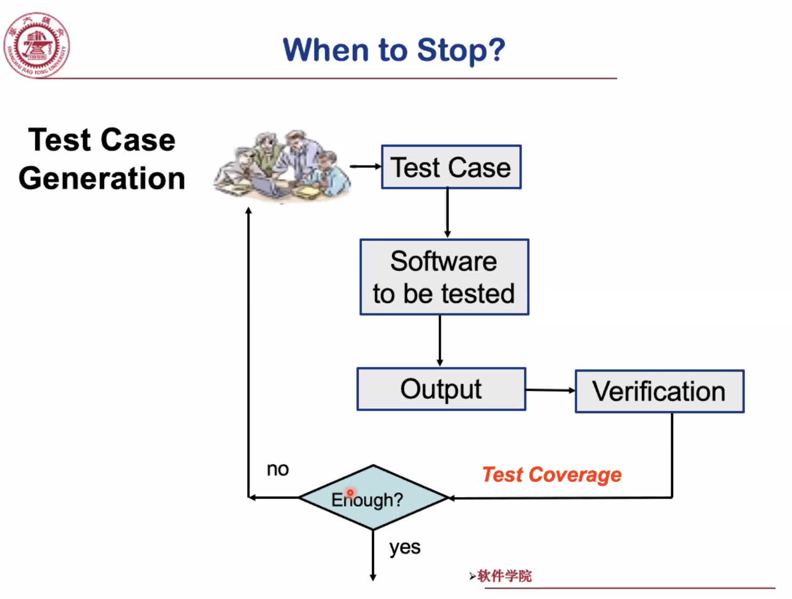
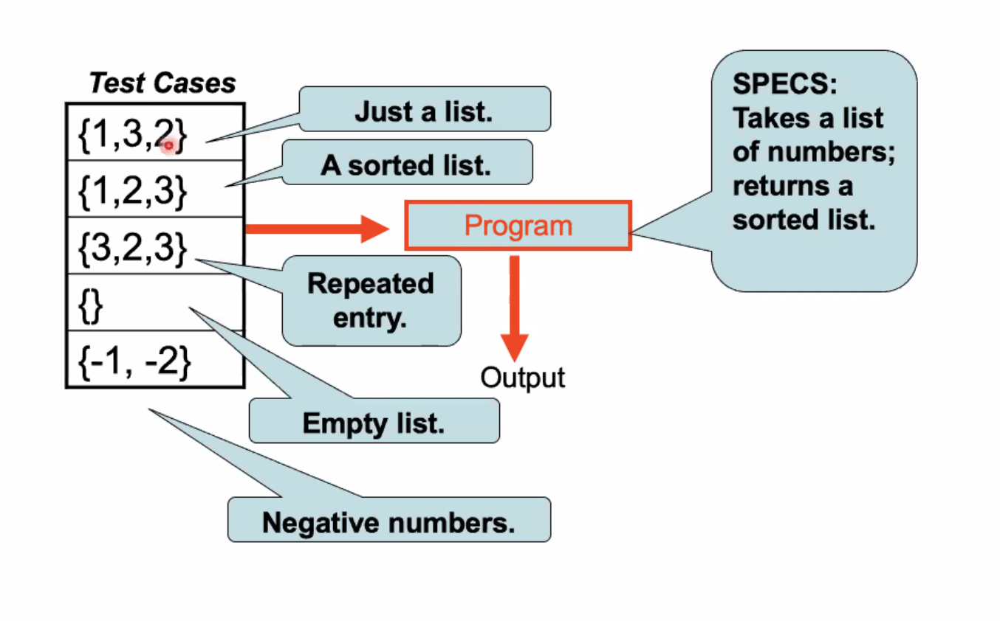

# March 2, 2020

## SE-213

软件测试——正式的「开学第一课」。

安排在早八也非常亲切合理。

瞬间就有了开学的感觉不是。

### Lecture 1

> Introduction of software testing

#### Importance

> 软件测试的重要性…

现在基于所有的电子产品都建立在软件之上。

软件是由程序员编写的。

程序员常常犯错。

---

犯的错误的严重後果包括但不限于：摔宇宙探测器、误击民航客机、动车追尾、医疗事故、外卖延迟配送等等。

据（不知名的）调查研究，每年有三兆美元的损失是由 Bugs 带来的。Bugs 拉低了全球 $4.7\%$ 的 GDP 增长。

---

经验丰富的程序员通常能做到在 1000 sloc 中只犯 5 个错。

相比之下，Windows XP 的代码量是 45 Million sloc。Windows 8 就到了 25 Gillion ~ 30 Gillion sloc 了。

#### Goal

我们的目标…当然是得到尽可能高可用的软件产品了。

为了达到这个目的，软件测试必不可少。

注意，有时候我们关注的点并不仅在于 Correctness。

有些程序还对 Performance、Availability 等等也有强力的要求。

#### Concepts & Glossary

> 「概念」和「术语」

##### Test Cases

「软件测试」的本质…只不过是找到程序的一些输入，检查他们对应的输出是否合理。

> 你发现了吧？一个合理的测试用例必须包含两部分：输入和输出。
>
> 如果只有输入没有输出，那么就无法同实际输出进行比较，从而就无法言明正确与否。

相比之下，侦错（Debugging）是通过分析程序源代码来找出错误原因并修正之的过程。

##### Testing

「测试」的过程则是针对每个测试用例，都把输入喂给程序，并将输出和预期输出进行比较。

如果所有的实际输出和预期输出都一致，只能说明针对这个测试用例覆盖的范围，这个程序正确。

并不能说明这个程序就没有错误了。

##### Coverage

可以将测试用例覆盖的范围量化为「覆盖率」（Coverage）的量。覆盖率越高，说明被测试的情况越多、覆盖面越广，程序隐藏问题的可能越低。

---

例如，一个排序程序的测试用例应当至少包含这些情况：

#### Good Practice

##### Good Testing

好的测试应该具有较高的概率找出「尚未被发现」的错误。

并且，找出错误应以尽可能少的时间和工作量耗费为宜。

## SE-340

> 人机界面与交互，所谓 HCI

