# March 3, 2020

## SE-315

Operating System…

和 ICS、Compilers、CSE 齐名的。Hardcore。

### Definition

#### Examples

怎么定义「操作系统」呢？

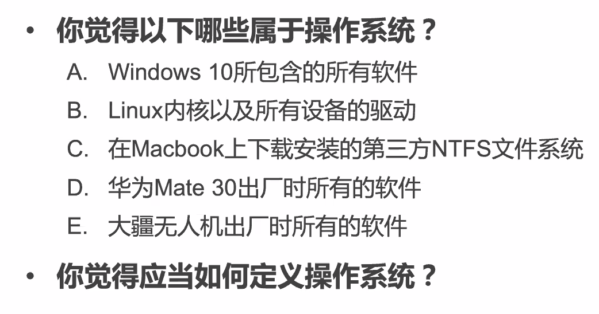

实际上这些都可以狭义广义地被归类为一种「操作系统」。

结论是，OS 是个很难给出准确定义的东西，而且可以不断深化其内涵并扩展其外延。

甚至因为 OS 定义的争端，引起了 Religion War。

#### Definition

一定要给个定义的话，操作系统是在硬件和应用之间的一层高级别软件。

OS 是怎么实现的呢？最初应用直接在硬件上裸实现；後来，应用共性的功能越来越多，这种共性就被沉淀为 OS。

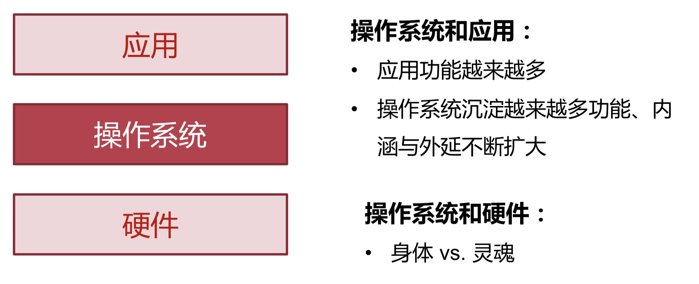

如果从功能来给出定义的话，计算机百科全书这么说：

> 操作系统是管理硬件资源、控制程序运行、改善人机界面 和为应用软件提供支持的一种系统软件。

### Hello, World

#### Easy Programming

一个简单的 Hello World C 程序是这么写的：

```c
#include <stdio.h>
int main() {
    printf("hello, world\n");
    return 0;
}
```

写出 `.c` 之后，可以在十秒钟之内把它便已成二进制文件，并将其在 Shell 中运行。

甚至，通过 `./hello.1 & ./hello.1`，我们可以同时运行两个程序实例。

#### With the Help of OS

但是，在此之间，OS 到底帮我们做了些什么？

* `hello.1` 这个文件是被储存在哪里的？

> 文件系统

* `hello.1` 是怎么被加载到内存中、被 CPU 中运行的？

> 文件系统、内存访问

* `hello.1` 是怎么做到输出文字到屏幕上的？

> I/O 服务

* `多个 hello.1` 是如何在单个 CPU 中运行的？

> 多工

### Features

#### Services

抽象一下，OS 为应用提供的服务包括但不限于：

* 计算资源的抽象
  * CPU
  * 内存
  * I/O
* 线程之间的同步
  * 允许程序自行实现线程同步原语
  * 也提供了高效的 `pthread_` 家族的函数
* 进程间的通信
  * 允许程序通过网络进行进程间的通信
  * 也提供了高效的本地通信机制

#### Restrictions

同时，OS 也对程序的执行进行了限制。

* 生命周期的管理

> OS 有权加载、迁移、挂起、恢复、销毁任何用户态应用。

* 计算资源的分配

> 用户态程序无权直接访问 CPU、内存和 I/O 设备，而必须通过 OS 提供的 API 来间接访问。

* 安全和隔离

> 应用程序内部存在隔离；访问控制机制保证。
>
> 应用程序之间也存在隔离；一个程序对另一个程序的内存空间不是完全透明的。

#### Conflicts

服务的目标是：单个应用运行效率最大化。

管理的目标是：系统资源整体利用率最大化。

这两者是存在冲突的。类似于局部最优并不能带来全局的最优。

> 流出指令贴瓦片感悟

### System Call

应用于操作系统如何才能交互呢？

#### C-like

鉴于经典的 Unix-like 系统设计者也是 C 的设计者，操作系统的结构都是通过 C-style 的函数调用完成的。

比如，我们最简单的 `printf`，实际上是 C Standard Library 里的一个函数；这个函数借助了 `write` 函数进行打印；`write` 函数则是系统调用 `sys_write` 的包装。

#### Trap

在应用程序里还是相当正常的 `call printf`。

然而，`printf` 的实现，也就是 C 标准库里的实现要采用的调用则是会陷入 Trap 中的 `syscall` 特殊指令。

`syscall` 的参数也采用类似的方式传递；只不过第一个参数是 `syscall` 的 Trap ID。

> 不同平台有着不同的陷入指令。ARM 中是 `svc`，x86 中是 `sysenter`，RISC-V 中是 `ecall`。

之所以说它是 Trap，因为这些「系统调用」不是在用户态内存空间里，而是在内核态内存空间里。这个操作会把 CPU 带到内核态之中。

在内核态中的操作就很简单了：直接按照 Trap 表做普通调用即可。不过此时已经在内核态了。

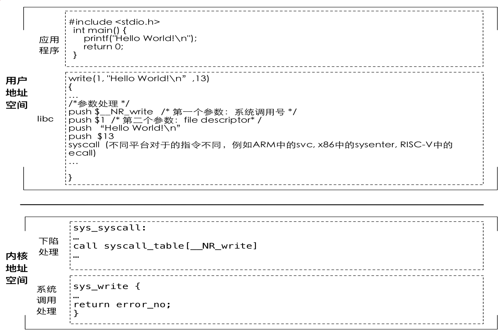

> 在写 OS 的时候，我们需要做到：
>
> 把复杂留给自己，把简单留给用户。

## SE-341

游戏设计与开发。

冒天下之大不韪，我用了 Unity for Mac 和 Visual Studio for Mac 来作为开发环境。

> 不知道会不会被打死

### Definition

> 游戏引论

主要讲下面三个部分：

* 游戏历史
* 游戏类型
* 游戏引擎

#### 训诂学

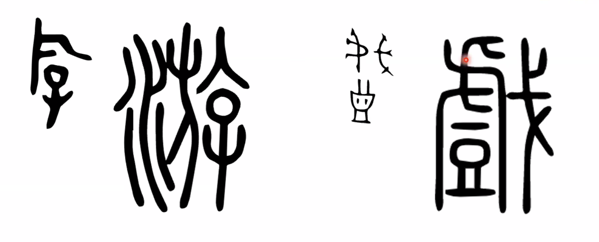


#### English Version

Game: explanation

- a form of **play** or **sport**, especially a competitive one played according to rules and decided by *skill, strength, or luck*
- a physical or mental competition conducted according to rules with a participants in direct opposition to each other

### Feature

* 规则性
* 目的性
* 竞争性
* 娱乐性
* 交互性

玩家需要运用综合能力来赢得游戏：

* 策略
* 速度
* 力量
* 技巧
* 经验
* 运气（…）


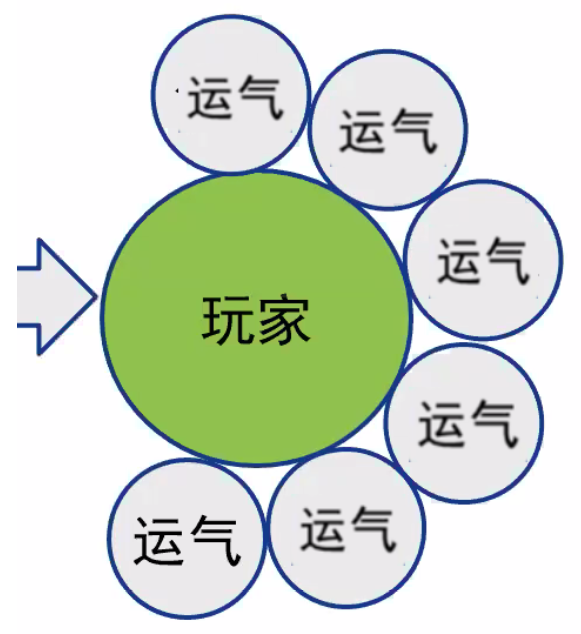

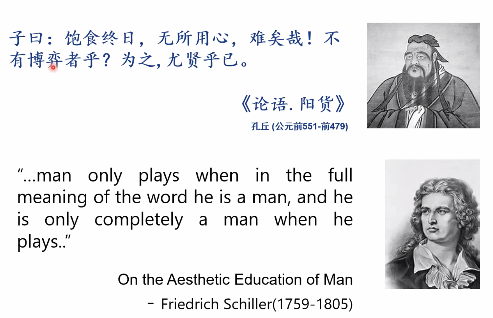

### History

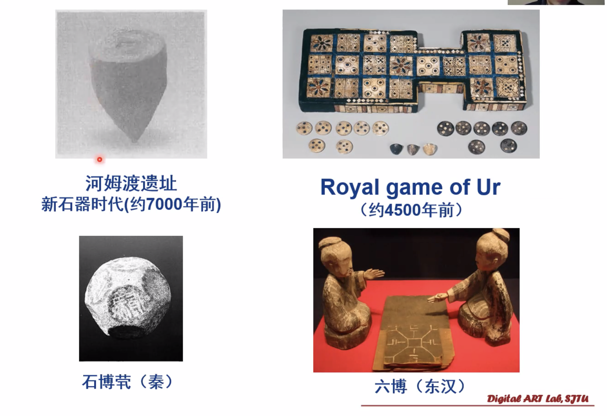

游戏有悠久的历史了。

在计算机出现之前，桌上游戏、物理游戏已经非常多了。

但是，计算机出现之後，游戏产生了一个特别的分支，所谓「Video Game」，即电子游戏。

不光如此，还出现了专门用于玩游戏的特殊计算设备——他们被称为 Console（游戏主机）。

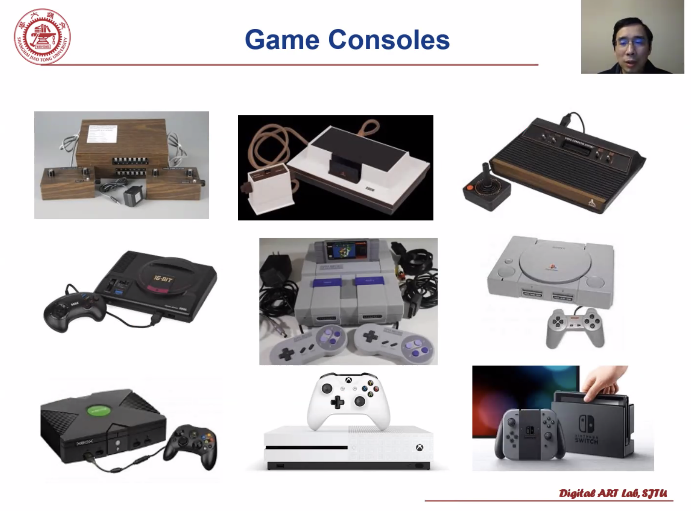

> Switch 真好看啊

### Homework


### Genres

游戏流派。

#### Dynamic

针对广阔现实世界主题模拟的一种技术上的妥协——每个类型的游戏只模拟一个较小的主题。

然而游戏的类型总不是一成不变的。

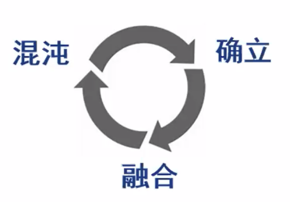

总会在这三个状态之间循环。

#### Current Genres

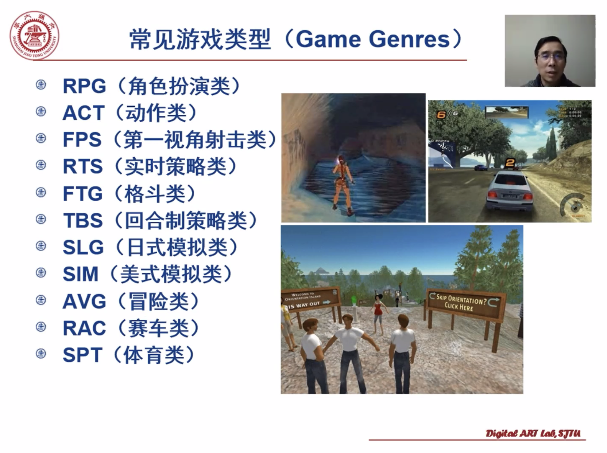

#### RPG

Role Playing Game；角色扮演类游戏

最受欢迎（？）的一类。

再现并模拟角色的整个人生。

* 艺术性
* 故事性
* 交互性

大部分的 RPG 剧情流程都是固定线路的。即使有些游戏具有多分枝，但是这些都是被预先设计好的。

#### ACT

Action Game；动作类游戏

主要侧重于手眼协调和条件反射。

有的 ACT 还有解谜元素的融合。

一般 ACT 游戏采用第三视角。

#### FPS

First Person Shooting，第一视角射击类

特点：第一视角、3D、杀 NPC。

三要素：关卡（Level）、任务（Mission）、NPC（Non-Player Character）。

开创人：John Carmack。

FPS 的鼻祖就是「Doom」系列。

#### FTG

Fighting Game，格斗类游戏

在一个狭小的场景里，通过复杂的按键序列来控制双方角色进行一对一的打斗。

关注点不在场景内的其他物体，只在打斗的对手身上。

《街霸》、《格斗之王》、《铁拳》等等都属于这一类。

#### RTS

Real-Time Strategy，实时策略类

这里的策略强调的不是快速的反应和操作，而是指政治、战争等策略。而敌我双方也会因此实时地产生反应。

RTS 的三部曲：采集、生产、进攻。

RTS 的两个要素：资源管理、战争策略。

《Command & Conquer》，《帝国时代》、《Dune 2》等等。

代表作就是《Warcraft》系列了。

#### TBS

Turn-based Strategy，回合制策略类

像是下棋类的游戏。早期技术限制，无法实现实时对抗，因此妥协采用回合制的方式来实现。

节奏超慢，有一半时间在等待。

#### SLG

Simulation Game，日式模拟类

《三国志》系列、《心跳回忆》。

共同特征：具有复杂的数字式管理。

#### SIM

Simulation Game，美式模拟类

《模拟城市》、《模拟人生》、《黑与白》

共同特征：玩家处于造物主、领导者的地位。

对数字式管理依赖更少，交互性更强。

#### AVG

Adventure Game，冒险类

三大要素：Story、Exploration、和 Puzzle-Solving。故事、冒险和解谜。

注重故事的流畅性和悬念。

《Myst》2003，神秘岛

### Unity

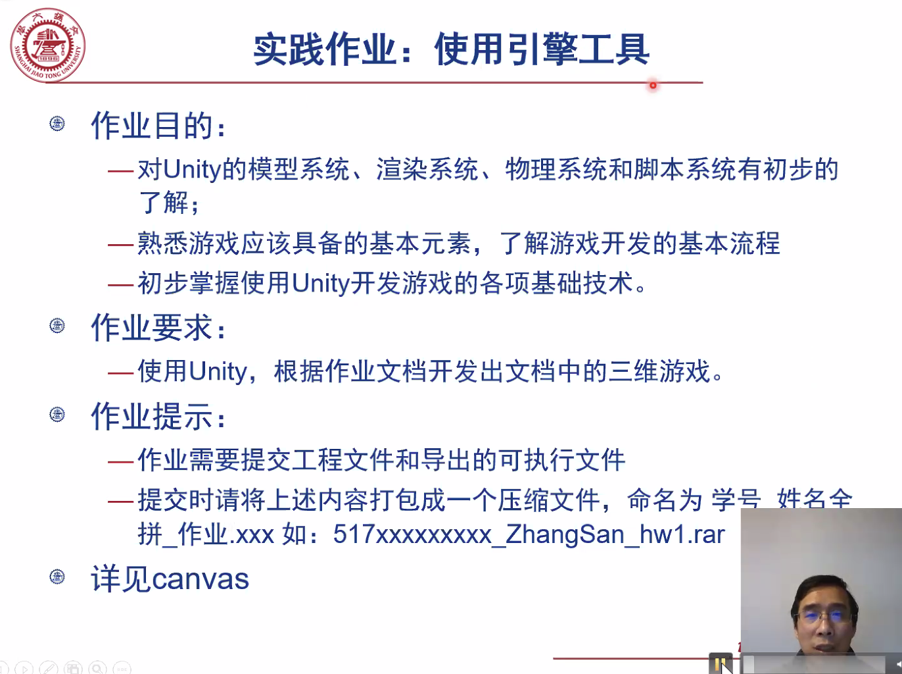

