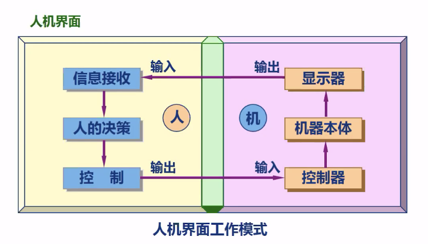

# March 4, 2020

## SE-340

> HCI 大法

### Intro

#### Vocabulary

何为 HCI？

HCI。可以作 Human & Computer Interface 解，也可以作 Human & Computer Interactions 解。

作为 Interface（人机界面）讲的时候，他指的是人与计算机之间传递、交换信息的媒介和对话接口，是计算机系统的一个部分。

而作为 Interactions（人机交互）讲的时候，指的是

人与计算机两者之间通信的方式和实现技术。

因此，这门叫做「人机界面与交互」的课程，英文名实际上是 HCI 和 HCI 的双关。

或许叫做 HCII 更为合适。

#### Courses

这门课程（指 HCI），是一门研究人类所使用的交互式计算机系统的设计、实施、评估及相关主要现象的学科。

#### Associations

> Top 10

##### CHI

> ACM Conference on Human Factors in Computing Systems

* https://dl.acm.org/conference/chi

##### UIST

> ACM Symposium on User Interface Software and Technology

* https://dl.acm.org/conference/uist

##### MobileHCI

> ACM MobileHCI is focused on the mobile technologies and human interactions

* https://dl.acm.org/doi/proceedings/10.1145/2371574

##### CSCW

> Computer Supported Cooperative Work

* https://dl.acm.org/conference/cscw

##### IUI

> International Conference on Intelligent User Interfaces

* https://dl.acm.org/conference/iui

##### TEI

> International Conference on Tangible, Embedded, and Embodied Interaction

* https://dl.acm.org/conference/tei

##### HRI

> ACM/IEEE International Conference on Human-Robot Interaction

* https://dl.acm.org/conference/hri/proceedings

##### TVX

> ACM International Conference on Interactive Experiences for TV and Online Video

* https://tvx.acm.org/sc/

##### CHIPLAY

> The Annual Symposium on Computer-Human Interaction in Play

* https://chiplay.acm.org

##### IDC

> Interaction Design and Children

* http://idc.acm.org

#### Definition

##### 广义的

属于 Human-Machine System 的一个子集。

何为 System？一个系统是相互作用、相互依赖的若干组成部分结合成的，具有特定功能的有机整体。

由人、机器、和环境三部分共同组成。

##### 狭义的

特指「人-计算机系统」的人机界面。

#### Structure

许多东西都可以被用做人机交互的输入；除了常见的键鼠、图像语音，还有体温、眼神、脉搏等等非主流的信息。

这些东西都可以作为人机交互的输入。

#### Aims

##### Key Points

Butler Lampson (1992) 提出计算机的三作用：

* 模拟（模拟真实物理世界）
* 通信（作为中介帮助人们通信）
* 互动（与人交流）

而人机界面就是决定计算机如何服务于人类的关键部件。

##### Service

服务：在**恰当的时机**、以**恰当的方式**满足人类的**需要**。

注意三个 `<b>`：时机、方式、和需要都是动态变化的。

也就是计算机在提供服务的时候，不能采用静态的标准；而应当结合当前的场景决定。

##### Targets

HCI 核心价值观 `SeeeU`：

* Safely
* Effectively
* Efficiently
* Enjoyably
* Usability

