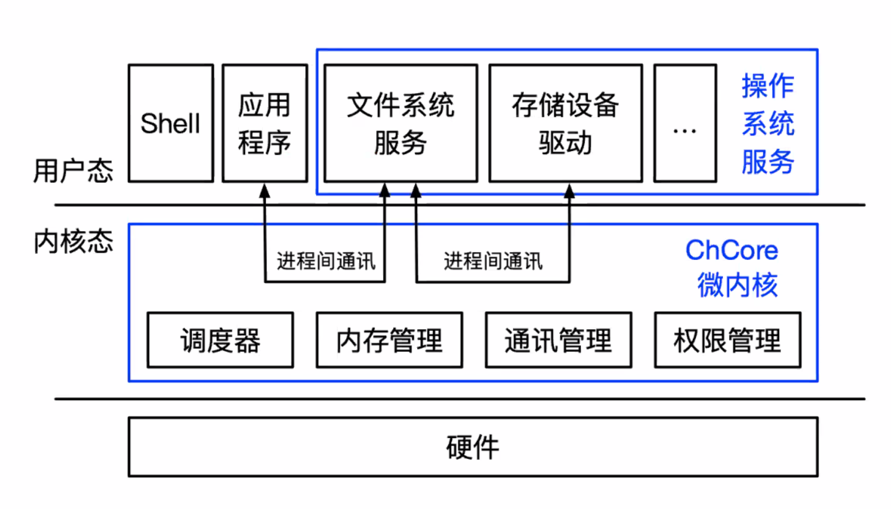
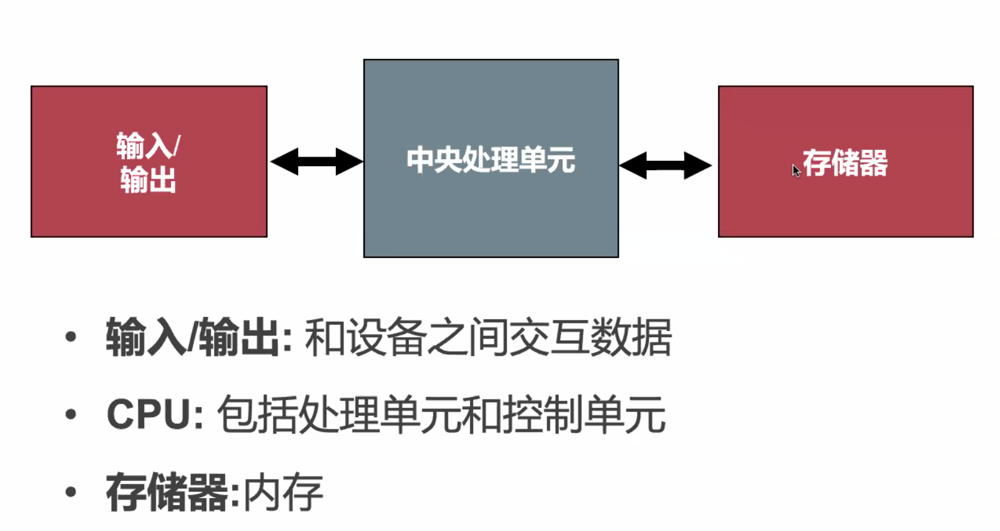
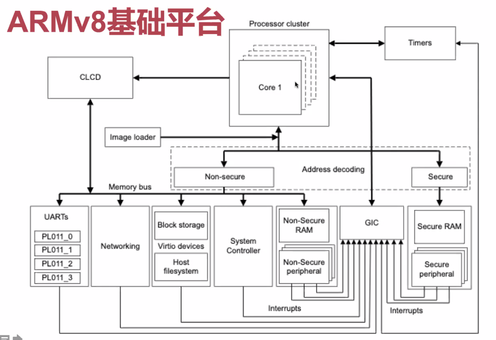
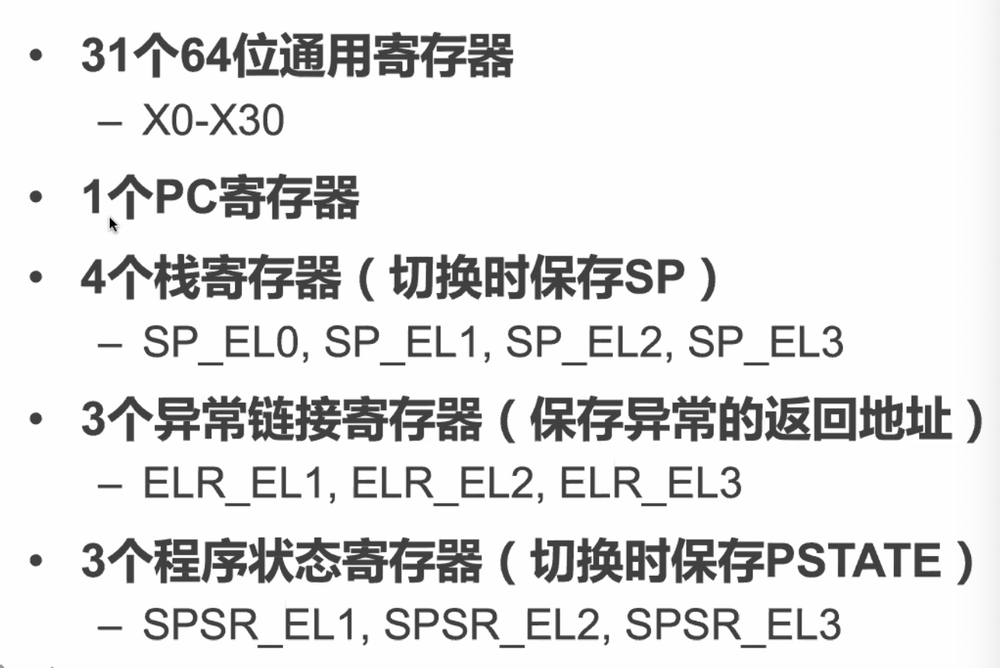
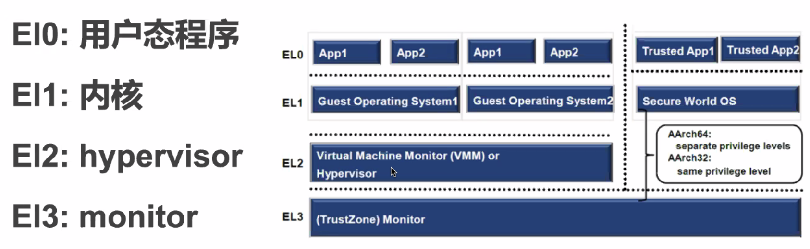
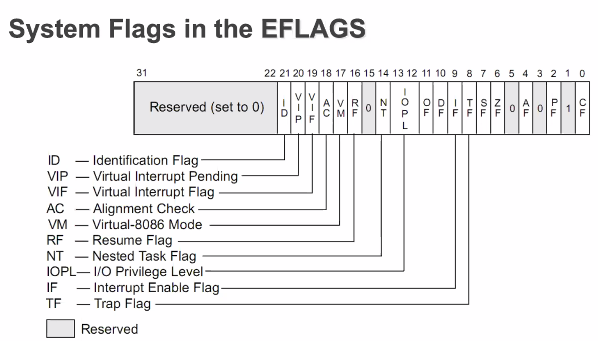
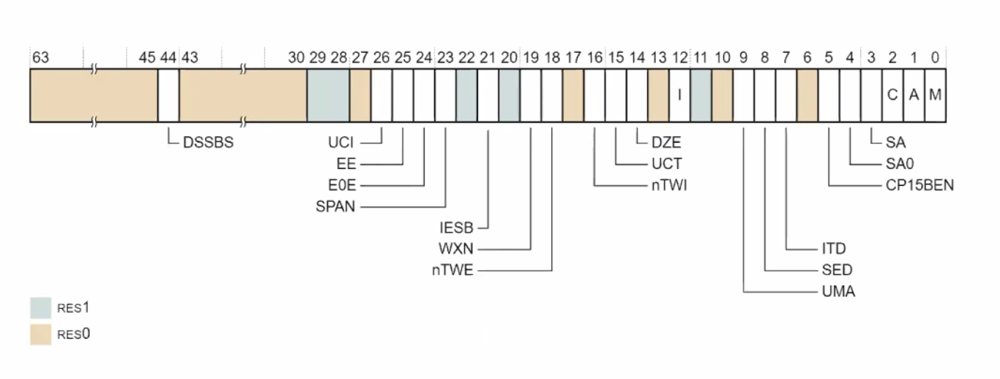

# March 5, 2020

## SE-315

> OS! OS!

今天的主要内容是 ARM64 的硬件结构和提供的接口。

另外，内容会结合我们这门课用到的教学用操作系统 ChCore。

### Goes to Hardware

PC 的体系结构？

最早的 Turing 机是基于打孔纸带的一般机器。

而目前的机器基本都基于冯·诺伊曼架构。

#### von Neumann's

##### Architecture

CPU 负责解析指令；而内存负责存储指令和数据。

注意内存并不关心存储在其中的是指令还是数据。

##### Disadvantages

* CPU 和内存交互引发「内存墙」问题
* 数据指令不区分，安全漏洞
* 缺乏并行支持

#### ARM Architecture

ARM 是一套开源的、可自定义的一套硬件架构。

ARM 也在不断更新演进。

本次课程里我们会使用 ARM64 作为硬件基础。

##### v8

目前的 ARMv8 基础平台示意图是这样的。

##### Aarch64

实际上 ARM64 的正式名称叫做 Aarch64。

Aarch64 是支持 A64 和 A32 两种指令集混跑的。这也是为了保证向下兼容性。

相对的 Aarch32 就只支持 32 位和 16 位指令集。

##### ISA

Aarch64 跟 ICS 里学到的计算机结构非常类似。

用的是 RISC 指令集（精简版的）。

也有 PC 寄存器，指向的是当前正在执行的那条指令。也可以被 `B`、`BL`、`BX`、`BLX` 四条跳转指令修改。

##### Secrets

在实现 CISC 的时候，大家也嫌麻烦，所以内部也是转换成了一套类似于 RISC 的基础指令集再进行实现的。

> （笑）

##### Instructions

RISC 的指令是定长的——每一条指令占用二进制位的长度都一致。

然而 CISC 的指令是不定长的。

#### Registers

##### List

众所周知，RISC 的寄存器一般比 CISC 多得多。

基本上，只要能用加寄存器解决的事儿，ARM 都选择直接加个寄存器得了。

|            | **RISC (Aarch64)** | **CISC (x86-64)**  |
| :--------: | :----------------: | :----------------: |
|  指令长度  |        定长        |        变长        |
|  寻址模式  |    寻址方式单一    |    多种寻址方式    |
|  内存操作  |  `load`、`store`   |       `mov`        |
|    实现    |        微码        | 增加通用寄存器数量 |
| 指令复杂度 |        简单        |        复杂        |
| 汇编复杂度 |        复杂        |        简单        |
|  中断响应  |         快         |         慢         |
|    功耗    |         低         |         高         |
| 处理器结构 |        简单        |        复杂        |

##### Privileges

ARM 有四层特权等级。

El0 用于跑用户态代码。El1 是跑内核代码的。

在这门课里面，我们主要接触到 El0 和 El1 就好了。

##### System Flag Register

系统状态寄存器——用一个非常特别的寄存器来保存当前系统的一些状态。

##### System Control Register

顺带一提，ARM 是支持大小端（Big-Endian & Little-Endian）切换的。

通过操作 System Control 寄存器里面的特定位就可以调整特定的系统设置啦。