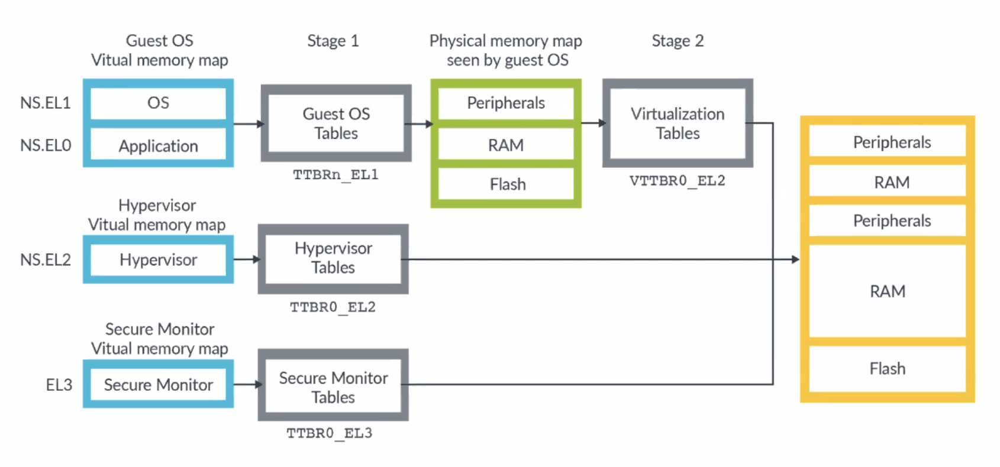
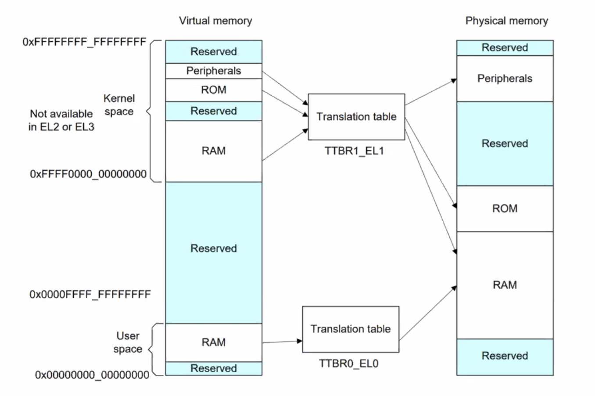

# March 5, 2020

## SE-315

> OS! OS!


今天的主要内容是 ARM64 的硬件结构和提供的接口。

另外，内容会结合我们这门课用到的教学用操作系统 ChCore。


### Goes to Hardware

PC 的体系结构？

最早的 Turing 机是基于打孔纸带的一般机器。

而目前的机器基本都基于冯·诺伊曼架构。

#### von Neumann's

##### Architecture


CPU 负责解析指令；而内存负责存储指令和数据。

注意内存并不关心存储在其中的是指令还是数据。

##### Disadvantages

* CPU 和内存交互引发「内存墙」问题
* 数据指令不区分，安全漏洞
* 缺乏并行支持

#### ARM Architecture

ARM 是一套开源的、可自定义的一套硬件架构。

ARM 也在不断更新演进。

本次课程里我们会使用 ARM64 作为硬件基础。

##### v8


目前的 ARMv8 基础平台示意图是这样的。

##### Aarch64

实际上 ARM64 的正式名称叫做 Aarch64。

Aarch64 是支持 A64 和 A32 两种指令集混跑的。这也是为了保证向下兼容性。

相对的 Aarch32 就只支持 32 位和 16 位指令集。

##### ISA

Aarch64 跟 ICS 里学到的计算机结构非常类似。

用的是 RISC 指令集（精简版的）。

也有 PC 寄存器，指向的是当前正在执行的那条指令。也可以被 `B`、`BL`、`BX`、`BLX` 四条跳转指令修改。

##### Secrets

在实现 CISC 的时候，大家也嫌麻烦，所以内部也是转换成了一套类似于 RISC 的基础指令集再进行实现的。

> （笑）

##### Instructions

RISC 的指令是定长的——每一条指令占用二进制位的长度都一致。

然而 CISC 的指令是不定长的。

#### Registers

##### List


众所周知，RISC 的寄存器一般比 CISC 多得多。

基本上，只要能用加寄存器解决的事儿，ARM 都选择直接加个寄存器得了。

|            | **RISC (Aarch64)** | **CISC (x86-64)**  |
| :--------: | :----------------: | :----------------: |
|  指令长度  |        定长        |        变长        |
|  寻址模式  |    寻址方式单一    |    多种寻址方式    |
|  内存操作  |  `load`、`store`   |       `mov`        |
|    实现    |        微码        | 增加通用寄存器数量 |
| 指令复杂度 |        简单        |        复杂        |
| 汇编复杂度 |        复杂        |        简单        |
|  中断响应  |         快         |         慢         |
|    功耗    |         低         |         高         |
| 处理器结构 |        简单        |        复杂        |

##### Privileges


ARM 有四层特权等级。

El0 用于跑用户态代码。El1 是跑内核代码的。

在这门课里面，我们主要接触到 El0 和 El1 就好了。

> ARM 的特权等级是数字越小，等级越低。而 x86-64 的 Ring 是数字越小，等级越高。别混了。

##### System Flag Register


系统状态寄存器——用一个非常特别的寄存器来保存当前系统的一些状态。

##### System Control Register


顺带一提，ARM 是支持大小端（Big-Endian & Little-Endian）切换的。

通过操作 System Control 寄存器里面的特定位就可以调整特定的系统设置啦。

#### Memory

##### Addressing



在 ARM 里，要翻译内存地址就需要经过这些步骤。

注意，ARM 是拥有多个 TTBR 的。也就是有多个完全独立的 VM => PM 的翻译单元；分管不同的内存空间。

这样的设计可以使得 OS 的 Kernel Mode 和 User Mode 更加泾渭分明。

##### Memory Space



#### I/O

ARM 架构下，应该怎么进行输入和输出呢？

事实上，I/O 架构是被映射到内存空间中的一些特殊地址段内的。通过使用操作内存的 LDR 和 STR 指令就可以操作 I/O 设备了。这种策略被称为 MMIO。

##### MMIO

Memory-mapped IO。这种策略通过将设备映射到连续的物理内存中，借此实现 I/O 操作。

优点是可以简单复用之前的指令；然而缺点是其行为跟普通内存并不完全一致，容易产生混淆和误解。

##### PIO

Port IO。这种策略允许 I/O 使用完全独立的地址空间，并且设计专门的指令来操作 I/O 设备。

### Let's Boot it up!

#### Power up

第一步当然是给设备通电。

通电之後执行的第一条指令是？

Raspberry 3 会初始化 GPU，并且自动从 SD 卡中加载 OS。

而 Hikey970 则会通过 BootLoader 链和 UEFI 进行 OS 加载。

#### Bootloader

Bootloader 和 kernel 被放置在同一个 ELF 文件中。

Bootloader 在 `.init` 区段；链接器确定其入口。

Kernel 在 `.text` 区段。

Bootloader 只会启用主 CPU，而其他从 CPU 则会在稍后被加载。

```assembly
BEGIN_FUNC(_start)
	mrs x8, mpidr_el1
	mov x9, #0xc1000000
	bic x8, x8, x9
	cbz x8, primary
```

* 切换 EL 层级

* 准备函数 Stack

> 设置 Stack Pointer 寄存器

* 设置异常向量

> 为了 Debug

* 初始化 UART

> 根据 UART 协议进行内存空间的初始化。
>
> 这时候也会映射 IO 的内存空间。

* 初始化页表，开启 MMU

#### Kernel

以上事情做完之后，终于跳转到了 Kernel 的 Main 函数里了。

这里面的代码都是 C 写的了。

#### Dirty x86-64

x86-64 为了向前兼容，在内核启动的时候还要做一些向下兼容的工作。

每个 x86-64 CPU 都具有三种不同的模式：

* 实模式（16 位的）
* 保护模式（32 位的）
* IA32E（64 位的）

在启动过程中，会首先使用实模式来进行系统初始化。

这个模式下面只能使用 64 KiB 内存；因此需要进行内存的拷贝和页表指针的重定向。

在这些步骤完成之後，才会进入内核。

### Simulator

写 OS 的过程中，要每次调试都在实体机上进行，这不合适。

所以，我们这门课提供了 ARM 模拟器来简化开发、侦错的整个过程。

Windows、Linux、POSIX 全平台支持喔！

### Coming Next...

下次课会讲到中断、异常和系统调用。

## SE-315 Lab

第一个 Lab 就发布了！

此 Lab 的负责 TA 是沈斯杰。

### Environments

我们主要利用

* 用 Docker 进行代码构建

> 主要是为了简化大家的环境配置

* QEMU 作为模拟器
* GDB 作为调试工具
* 编辑器建议使用 vim + `universal-ctags` 或者 Visual Studio Code

除此之外，还有一些非常常见的工具程式，包括：

* Tmux
* Cmake
* Makefile

### Version Control System

这次 Lab 也是迭代式的，也就是前几次挖的坑可能会留到最后，把自己坑到坑里。

同时，采用 Git 来进行管理。

### Documented

每次 Lab 都需要写文档；文档里需要回答要求的问题，设计思路和遇到的困难。也可以给这个 Lab 提建议。

### Requirements

* 读 ARM 和 ChCore 的文档
* 写一个 `kprintf`
* 写一个 Stack Backtracking 函数

> 上节课老师说：「这次的 Lab 只需要打印点东西，很简单的」
>
> 还真的是打印东西…但是一点儿都不简单啊！

### Deadline

> `2020-03-25 23:59`