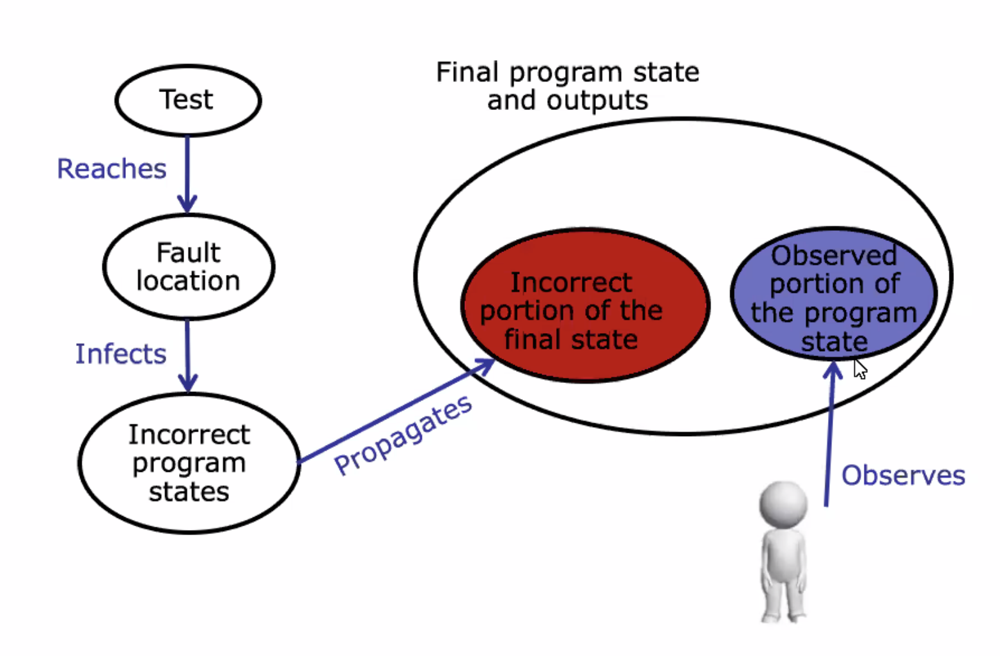
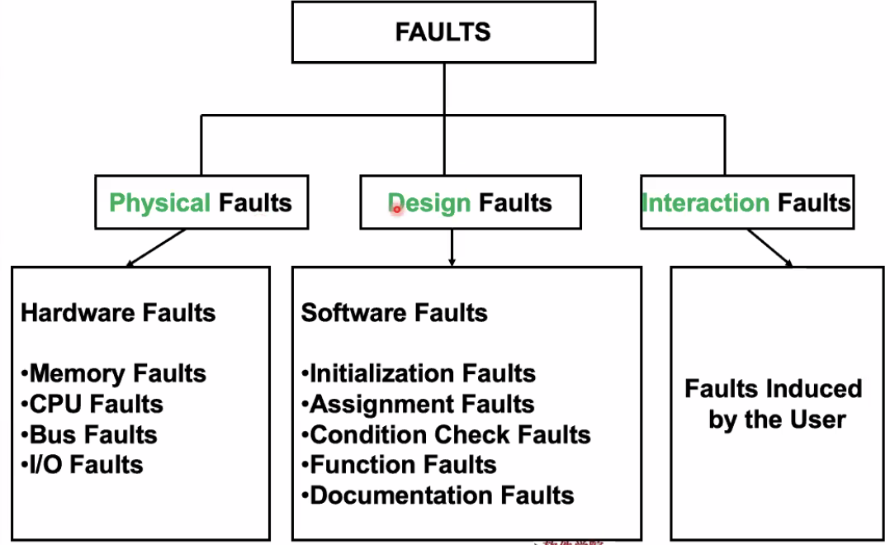
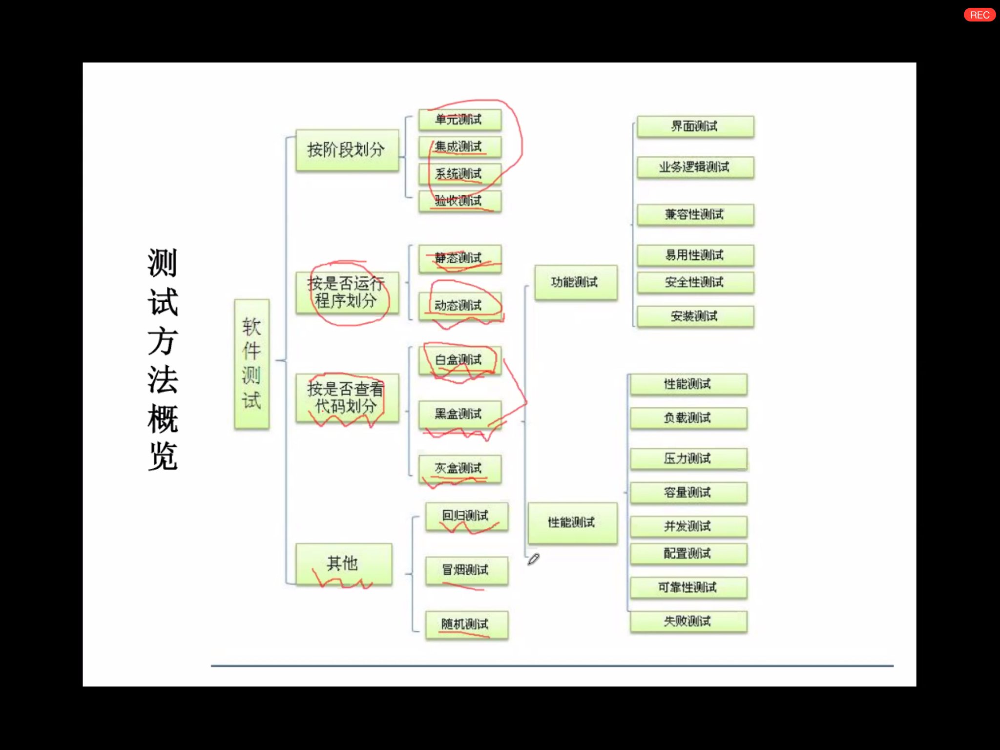

# March 9, 2020

## SE-213

> 》软件测试。

### Review

* 软件测试的重要性
* 软件测试是无尽的

### RIPR Model

#### Description

Bug 是如何发现的？



我们跑一个 Test Case，使得程式码执行（Reach）到一个 Fault Location 处，导致（Infect）了错误的程序状态，这种错误传导（Propagate）产生了错误的结果。

测试员观察（Observe）最终的结果，以发现 Bug。

这就是挖 Bug 的过程。

#### Example: RIPR

```java
public static int numZero(int[] arr) {
    // Effects: if arr is null throw NullPointerException
    // else return the number of occurences of 0 in arr
    int count = 0;
    for (int i = 1; i < arr.length; i++) {
        if (arr[i] == 0) {
            count++;
        }
    }
    return count;
}
```

还是就上次的例子来说。

* 我们的测试用例需要经过一个 Faulty 的程序段。

* 除此之外，还需要此时程序的状态不正常。

> 经过 Faulty 的程序段不一定都会产生异常状态的。

* 不传导产生灾难性影响。也就是我们仍然希望他能输出一个结果。

> 例如，上面的例子里，输入 `[]` 空数组，程序会直接抛出异常，就没有输出结果了。
>
> 这不是我们想要的。

### Concepts

这里有百家争鸣，百花齐放。

#### Myers'

* 早做测试、持续测试；
* 不要让开发者自己测试自己的程序；
* 测试用例 = 输入数据 + **预期结果**；
* 测试用例应该同时包括「合法的、合乎预期的输入」和「不合法的、意外的输入」；
* 测试程序：「应该做什么」、「不应该做什么」；
* 经验规律：发现软件错误的概率和未发现错误的数量正相关；
* 每一个测试用例都要反复（Roundly）进行；
* 软件测试是「最没有创新性」（？）的工作。

#### Independents'

Software test should be execute by the group which is independent from development group.

> 把软件测试外包给第三方独立公司来做。

#### Completive's

完整性

* 按照**测试的计划**，完成所有测试用例；

> 不是把所有可能的测试用例都进行一遍，这不可能。

* 用带状态的测试用例生成方法；
* 保证一定的覆盖率（Coverage）；
* 至少应该覆盖到一个未发现的错误。

### Steps

1. 拟（Design）测试计划大纲
2. 生成（Generate）测试用例
3. 搭建（Establish）测试环境
4. 执行（Execute）测试用例
5. 评估（Evaluate）测试结果
6. Go back to Step 2
7. 完成测试文档（八股文）
   1. 测试计划
   2. 测试解释
   3. 测试报告

### Dev & Testing


可以看到，开发（Development）和测试（Testing）是高度对称的结构。

### Fault Taxonomies



错误可以被大致分为三类：

* 物理错误（这些很罕见）
  * 内存、CPU 犯错
  * 总线、I/O 设备犯错
* 设计错误（最常见）
  * 初始值错误
  * 赋值错误
  * 条件检查错误
  * 函数错误
  * 文档错误
* 交互错误
  * 用户理解错误

### Fundamental Theory + Methods

> 这节课，主要讲一下基础的原理和方法。



#### Walk Through

这是一种相对标准的测试方法。

包括一些「走查」测试组；检查程序代码的逻辑；生成测试用例；并将测试用例数据放入程序代码，和期望结果对比。

##### Crew Members

* SQA
* 软件实现代表
* 未来走向代表
* 客户代表（需求方）

大约 4～6 人成组。

##### Jobs

测试小组只负责检查错误、形成报告。不负责修正软件。分开管理。

#### Inspection

查验法比走查法更正经一些。

##### Crew Members

* Moderator
* Recorder
* 未来走向代表
* 软件实现代表

##### SOP

* Overview：模块化编程人员首先需要提供软件的大致构造报告；
* Preparation：查验员需要了解软件详细的实现和逻辑关系；
* Inspection：进行完全的「走查」过程，形成错误报告；
* Rework：独立的负责委员会解决程式码中的问题，并且形成报告。
* Follow-up：Moderator 负责确认是否发现的所有问题都被解决了，并形成 Spreadsheet。

#### Usage

假如在软件开发初期，某个模块出现大量错误，建议直接重构，而不要进行修改。

假如多个模块同时出现同类错误，需要一并检查其他未被检查的模块。

假如 $5\%$ 的材料出现了问题，那么整个小组都得被重新审查。

### Black-box Test

黑盒测试是在拿不到源代码实现的情况下做的有限制的测试。

我们能做的只有 Input，拿到 Output。那么，怎么设计测试用例就成了问题。

注意，不论测试什么软件，穷竭所有可能的测试用例都是不可能的。请放弃。

## SE-340

> 》HCI

### Review

* HCI 目标
* 人的需求

### Knowledge Fields

* 认知心理学
* 人机工程学
* 计算机
* AI
* 硬件技术
* 社会学、人类学
* 艺术设计

#### 认知心理学

最最典型的认知心理学交互设计实例，就是 Tony Buzan 的 Mind Map（思维导图）。

> 这种导图和人类神经元和记忆的原理有类似之处，符合人的认知直觉。

#### 人机工程学

>  Ergonomics

总归，研究的对象就是「人」和「机」。

* 关于「人」，生理学、人体测量学、心理学、医学等等都是考虑范畴。

* 同时，也会研究人、机器、环境之间的合理关系。
* 保证安全、健康、舒适
  * 因为和人有关，所以这些很重要。

例如，VR 来辅助进行病人的康复训练，就是人机工程学的典型例子。

#### 计算机语言学

这里的「语言」不（全）是指编程语言，而是指充当人机之间交流的广义语言。

早期的命令语言、菜单语言、甚至是比较抽象的交互设计语言都属于这门学科研究的范畴。

#### 计算机图形学

CG…肖老师的课。回去看 SE-344。

#### 数字图像处理

* 图像内容识别
* 图像**语义**理解
* 内容检索
  * Google 识图
  * WAIT: What Anime Is It?
* 图像预处理
* 特征提取
* （梦回 CV）
* …

快速、实时的数字图像处理，也可以称为数字视频处理。

#### 计算机视觉

>  SE-342

比我们在 CV 中学到的更高级的东西，更具有实用性的一些东西：

* 单目视觉
* 多目视觉
* 三维重建
* 对象识别、定位、跟踪
* 姿态识别
* 手势识别

#### 数字音频处理

* 音频去噪
* 音频识别
* 语音识别
* 说话人识别
* TTS 音频合成

#### AR 技术

* 多通道人机交互
* 时空同步
  * 虚拟的时空和真实的时空对接同步。
* 移动交互
  * 即，人的运动也可以作为计算机的输入并实时给出反应。

> 基本上把所有时下热门的领域都踩了一遍…

### 人工智能

人工智能的特殊能力主要在非逻辑性、非理性的方面，例如：

* 推理
* 模糊逻辑
* 专家系统（？）
* 机器学习
* 情感计算
* 自然语言理解
* 人工生命
* 智能决策


## 043-ES

人文学院最新热门课程：计算机哲学

### Combinations

> 弗洛伊德的人格构成论

* 本我（Id）：位于潜意识中的本能、冲动、欲望。
* 自我（Ego）：介于本我和外部世界之间。人格的心理面。
  * 令个体意识到其能力
  * 对本我加以约束、抑制
* 超我（Superego）：人格的社会面。是道德化的自我。
  * 指导自我
  * 限制本我

### PC's Id

假设我们想要给计算机以人格，且按照弗洛伊德的人格构成论来开发。

那么，我们应该给计算机那些本我意识？

会不会有什么 Bug？

怎么保证相对合理且稳定？

> 这是个什么锤子问题

### Question

* 数字信号处理和计算机视觉的差别在哪里？
  * 简单说，CV 是从图像中分析、提取出信息，得到的结果不再是图像。
  * 而 DIP 是对已有的图像进行变换、分析、重构，得到的仍是图像。
* ~~「讨论 3：计算机的本我意识」这题是谁出的？~~
* ~~为什么要在课下的午饭时间安排作业？~~
* 何谓专家系统？
  * 专家系统是一个[智能计算机](https://baike.baidu.com/item/智能计算机/2286367)程序系统，其内部含有大量的某个领域专家水平的知识与经验，能够利用人类专家的知识和解决问题的方法来处理该领域问题。也就是说，专家系统是一个具有大量的专门知识与经验的程序系统，它应用[人工智能技术](https://baike.baidu.com/item/人工智能技术/1832047)和计算机技术，根据某领域一个或多个专家提供的知识和经验，进行推理和判断，模拟人类专家的决策过程，以便解决那些需要人类专家处理的复杂问题。
  * 简单说，就是模拟真实世界专家的决策过程：把一堆知识一股脑丢到脑子里，然后就开始解决实际问题。

