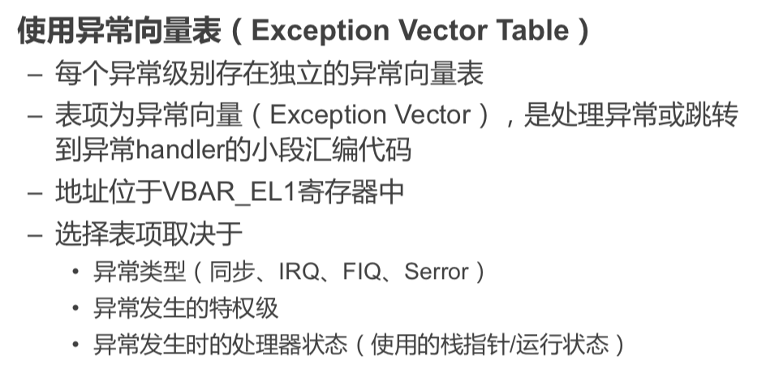

# March 10, 2020

## SE-215

> oh my OS

今天的主题是：中断、异常、与系统调用。

### Review

上节课我们讲过的是底层硬件（以 ARMv8 为例）如何和操作系统交互。

同时，还了解了 ARM 的四个特权级别。

以及，这个课程需要用到的教学系统 ChCore。

### Question

看到上节课的冯诺伊曼模型，我们不禁要问：OS 如何同外设进行交互？

例如，最简单的，用户是如何获得键盘输入的？

#### Approaches

OS 获取键盘输入的可能方法有：

* 轮询：OS 不断去读某个缓冲区中的值
* 中断：当控制器接收到输入时，打断 CPU 的正常执行，OS 对此进行处理

#### Usage

在「获取键盘输入」这一特殊场景中，用「中断」更好。

因为（相对于计算机处理速度来说），人类敲键盘的速度是极慢、而且不规律的。用轮询会大量浪费 CPU 时间。

而对于其他高速数据输入交换等设备，如网络包、显示器等，是用轮询的效率会更高。

### Inputting

为了给应用屏蔽硬件细节、管理硬件，应用一般不会直接操作设备的。

也就是，应用不会直接问键盘要输入，而是通过 OS 提供的 API，如 `getchar`、`getline` 等函数来实现。

但是，也有运行在用户态的驱动程序，他们是可以直接跟硬件交互的。

### Concepts

#### Category

* Interrupt
  * 外部硬件设备产生的信号
  * 产生原因和当前执行的指令无关，而是来自于外围设备
  * 异步，Interrupt 可以打入任何指令之间
* Exception
  * 软件的程序执行而产生的事件
  * 我们认为 System Call 是 Exception 的一类
  * 同步，和当前执行或试图执行的指令是相关的

#### Terminology: Aarch64

Aarch64 里，用「异步异常」和「同步异常」来分别称呼 x86-64 中的「中断」和「异常」。

#### Interrupts

> 也就是 Aarch64 里的「异步异常」。

##### Reset

> 重置

* 最高级别的异常
* 用来执行代码初始化 CPU 核心
* 由系统首次通电、控制软件或看门狗触发

##### Interrupt

* CPU 外部的信号触发，打断当前指令执行
* 由计时器、键盘等外设触发

#### Exception

> 也就是 Aarch64 里的「同步异常」

##### Abort

中止异常。

* 失败的指令获取
* 访问不可访问的地址
* 试图除以零

##### Exception Generating Instructions

SVC

HVC

SMC

#### Terminology: x86-64

##### Interrupts

由设备产生、异步产生。

中断分为两种：一种是可以屏蔽的（如键盘输入，网络事件都可以忽略），屏蔽掉之後就不会打断 CPU 的执行；一种是不可屏蔽的（如内存校验错误等致命错误）。

##### Exceptions

由软件产生、同步产生。

异常也分为两种，可以恢复的和无法恢复的。可以恢复的异常在 Handle 完之后会回到 Invoke 之前的指令接着执行。无法恢复的就直接挂了。

* Fault
  * 错误
  * 如缺页异常（可以恢复）、段错误（无法恢复）
* Trap
  * 陷阱
* Abort
  * 中止

### Controller

#### Questions

* 不同中断的优先级怎么确定？
* 不同优先级的中断能否抢占？
* 同种中断能否嵌套？（中断能否中断自己的 Handler？）
* 中断到底交给谁处理？
* 中断如何同软件协同？

#### Aarch64 Interrupts

* IRQ
  * Interrupt Request
  * 普通中断，优先级低、处理慢
* FIQ
  * Fast Interrupt Request
  * 一次只能有一个 FIQ
  * 快速中断，优先级高、处理快
  * 为可信任的中断源预留
* SError
  * System Error
  * 用于原因难定位、难处理的异常
  * 一般由异步中止（Abort）引发
  * 一般没法 Handle

#### Jobs

目前的 GIC（General Interrupt Controller）可以接受各种类型的中断、并可以管理所有中断，在决定优先级、路由之後把中断分发给不同的核心。

#### Limitations

中断处理中，不可以做太多事情，否则会阻塞程序正常运行。

那么，有什么办法解决这个问题呢？

* Batching
  * 先不着急做，堆到一块儿做
* Delay
  * 延迟一段时间再做

#### Linux Solution

Linux 的中断处理理念：

* 在中断处理中尽量少做事
* 推迟非关键性行为
* 先报平安，其他事推迟进行

### Misc

#### No Context

中断处理 Handler 不绑定到进程上下文。

或者说，你不能预知在 Invoke Handler 的时候，当前正在跑的指令是谁的。所以没有有意义的上下文。

#### No Sleep

中断处理 Handler 不能睡眠、也不能调用可能会睡眠的任务。因为一旦进入睡眠状态，就无法再有谁来把它唤醒。

#### No Data Swap

不能和用户地址空间交换数据。

> 最主要的原因是，如果读写内存可能会触发 Page Fault。在中断处理中引发异常会非常麻烦。

#### Todo List

##### Entering

* 保存处理器状态，方便稍后恢复

* 准备好高特权等级执行环境

* 选择合适的异常处理代码执行

* 保证用户态和内核态的隔离

##### Handling

* 获得关于异常的信息，如系统调用参数、错误原因等

##### Returning

* 恢复处理器状态
* 返回低特权级
* 继续正常执行流

### Aarch64 Handling

#### Information Saving

#### Entering EL1

#### Finding Handler

#### Exception Returning

### x86-64 Handling

#### Entering

* 硬件会将上下文信息和错误码存储在内核栈上

#### Handling

* 不分级

* 异常向量表中存handler的地址

#### Returning

* 恢复程序上下文

* 从内核态返回用户态 – 继续执行用户程序

### ChCore's

### System Call

Linux 里很多系统函数都跟系统调用挂钩。

这些功能显然已经超越了正常用户代码的权限。必须有个什么办法告诉 Kernel，让他来帮忙做这个事情。

#### Programmers' Perspective

C 程序员只是调用了库函数。

而库函数则是分平台用汇编实现的。

这些汇编直接深入 OS Kernel。

#### Hardware's Perspective

在硬件看来，只不过是一句特殊指令。

跟普通函数调用差不多；只不过默认第一个参数是 System Call ID。

#### Tracing

Linux 里，可以通过 `ptrace()` 来追踪 Linux 中的系统调用情况。

在命令行中，可以通过 `strace` 可以追踪系统调用。还可以通过 `ltrace` 来追踪库函数的调用。

#### Integrity Check

很多系统调用都涉及到指针。但这一点就会带来问题。

指针作为 System Call 参数时，如果不加检测，很容易导致 Kernel Crash（如果传递一个非法指针）或者越权访问内存地址。要知道 System Call 是在高特权级别下执行的！

#### Linux's Pointer Check

### Performances

* 系统调用性能开销太大
  * 硬件解：引入新的系统调用指令
  * 软件解：尽量少用

