# March 16, 2020

## SE-213

来测试我们的软件…

### Review

上节课我们讲到的主要是测试的各种类型；还画了一张图。

### White Box

但是实际上，我们最常用的测试方法还是「白盒测试」。也就是，在知道程序内在流程的情况下，尽量去覆盖更多的逻辑分支和代码的测试方法。

#### Coverage

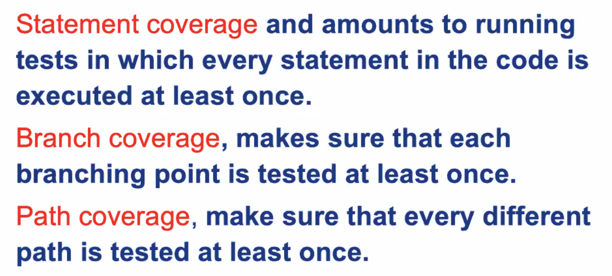

语句覆盖率（单条语句）

分支覆盖率（简单的 If/Switch 等选择语句）

路径覆盖率（更高的逻辑层面）

注意留意到 Branch Coverage 和 Path Coverage 的些微区别。

Branch Coverage 强调，只要每个分支点的两条路径都被经过了，那就可以。

而 Path Coverage 强调的是每一种整体的路径走向都必须被覆盖到。

通常来说，Path Coverage 所需的测试用例数不会少于 Branch Coverage 所需的用例数。


### Formal Verification

形式化验证：要用数学的方法，证明出这个系统的无误性。

这种方法相比软件测试方法来说，要求更高更难做，但同时也能保证我们的软件更强壮。

一般来说，对正确性要求极高的软件都会用这种方法。而一般的无害的 App，用软件测试就可以了。

可以这么说：软件测试是为了找出软件哪里有错；而形式化验证就是为了证明软件哪都没错。

这种证明法在这门 2 学分的课里不会细说。

### Def-use Test

定义−使用测试法。这是由数据流驱动的一种测试。


### Mutation Test

变异测试：故意把代码搞乱，然后看我们的测试用例能不能找出这个 Bug。

> 感觉是对「测试用例」的测试

### Regression Test

回归测试。软件测试也是一个迭代的过程。

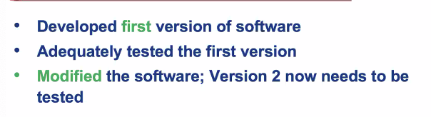

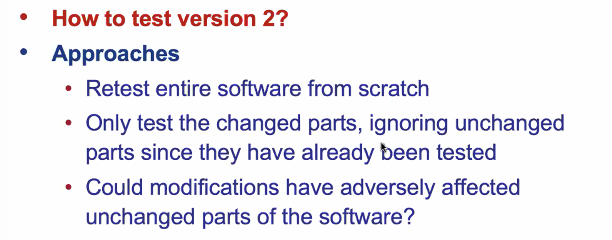

### Fault Statistics & Reliability Checks

故障统计：通常来说，软件的 Bug 个数和模块的复杂度正相关的。

假如我们发现一个很复杂的模块里面，被发现的 Bug 居然很少，那么可以合理推定这个模块里一定有很多未被发现的 Bug。

如何大概估计每个测试用例所覆盖的 Bug 个数呢？简单：采用标识重捕法。在各个模块中人为地加入一些 Bug，观察哪些测试用例会因此而失败，就能大概估计 Bug 个数。

### Clean-room

净室法：IBM 推出的软件质量保证方法。

### Summary

软件测试大体可以分为两类：执行式的和非执行式的。

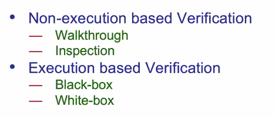

除此之外，还有其他「不太属于传统验证」的方法可以提高软件质量：

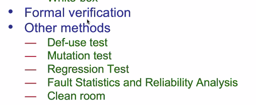

### Math Prerequisites

> 软件测试所需的数学基础

在离散数学里面基本上都学过了。

#### Set Theory

集合论…就是离散数学里面讲到的那一点，完全够用了。

#### Relations

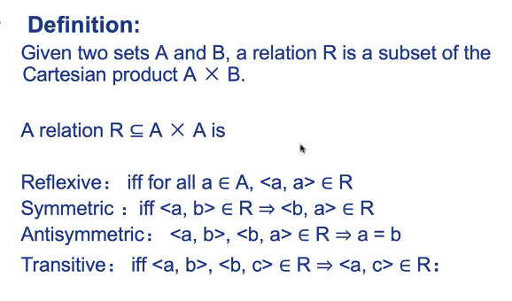

#### Probability Theory

概率论的问题。

#### Graph Theory

图论相关的知识还是要用到很多的。

还是去看看离散数学。有用的。

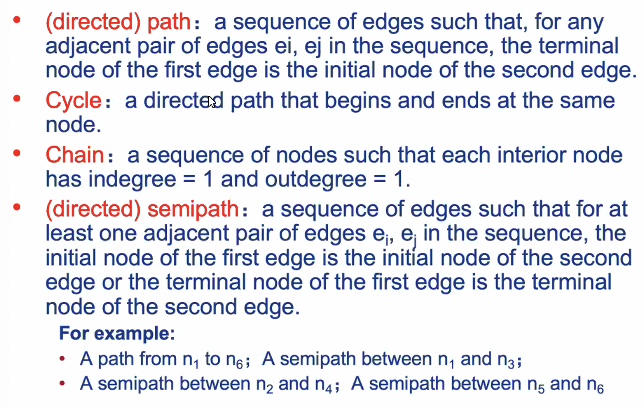

回忆一下这些专有名词。

##### (Directed) Path

路径。

##### Cycle

成环的路径。

##### Chain

一条 Path，其上每一个节点的入度和出度都是 1。一点分叉都没有，可不是 Chain 吗。

##### Semipath

半路径在之前没学过，有必要再讲一讲。

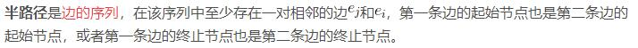

简单说，半路径就是作为有向图不算路径，作为无向图算路径。

## SE-340

> 不明就里 HCI

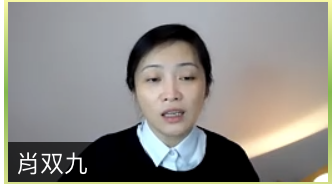

### Gossiping

#### Quiz

##### Q:

请写出 8 种课程中提及的具体的产业界关注的人机交互技术的名称。

PS：不能是VR/AR/人工智能/智能机器人这种综合技术领域。

##### A:

0. 图像内容识别
1. 图像**语义**理解
2. 自然语言理解
3. 语音转文字（Speech to Text）
4. 体感、手势交互
5. 拟人式计算机
6. 人工智能决策
7. 声纹（说话人）识别
8. 重建三维空间

#### Notes

* 笔记不可以抄 PPT 的提纲
* 笔记里要有提问和回答
* 交笔记之前记得把其他内容删掉


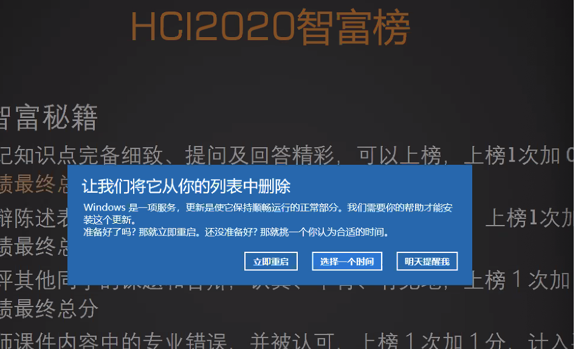

> 建议立即重启

#### 变法

1. 上课时间不会讲正事
2. 但是还是要签到签退
3. 下课时间得去听我的录播
4. 当天给我提交笔记

这么搞下去都快搞成虚拟排课了

> 上课不要听了
>
> ​							——肖双九，2020.3.16 11:18 A.M.

### Paradigm

Paradigm 本来是数据库（Database）的专有名词。

> 又是想念 JBoss 的一天

现在，已经成为了一个宽泛的哲学概念。

> 出现了，计算机哲学

#### Definition

广义地说，Paradigm 是一个领域中主流的行事套路。

那么，HCI 的 Paradigm 就是在人机交互领域里，大家都或多或少地遵循的「套路」。

#### History

> 首先扯一些历史上的大发现，给 HCI 贴贴金

##### Turing

Alan Turing 是计算机理论的奠基人。根据他的断言，计算机的能力会逐渐地接近人类。

##### Neumann

John Von Neumann 的 EDVAC 方案奠定了 Von Neumann 式计算机的基础。

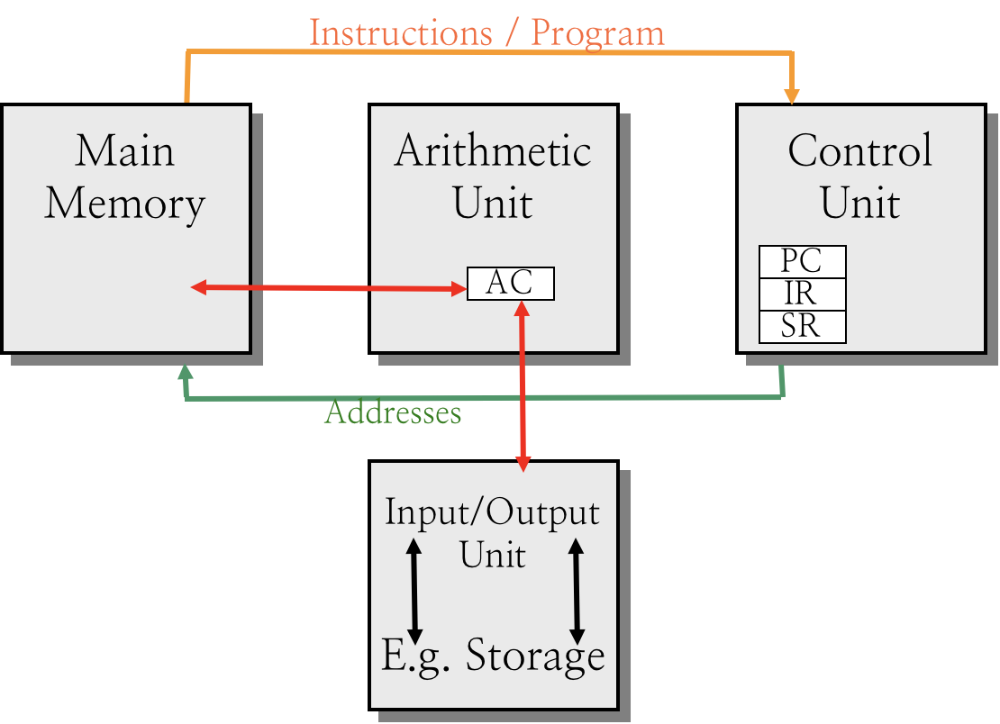

这套架构时至今日还是没有过时；可以认为这是一个经典的 Paragidm。

##### Licklider

J.R. Licklider 是心理学家改行做计算机科学的。

> 大胆怀疑 xsj 是人文学院派来的卧底

1960 年发表的「人机共生」论文，被认为奠定了人机交互论的基础。

##### Sutherland

Ivan Sutherland，人机交互大师！

提出了「交互式图形学」的概念和发展的必然。

也就是说，图形不应该作为计算机产生的结果，而应该被应用到简化人机之间的交互上！

也就是，我们目前感觉非常自然的「图形交互界面」。

> 那个时代的科技实在是让人感动…
>
> 直接在屏幕上绘图，基于 CRT 屏幕发光原理的绘图「光笔」，在当时都是相当科幻的技术。

Sutherland 还在 1968 年做出了头盔显示器 Head Mounted Display！

> HoloLens 的太爷爷

##### Emgelbart

Douglas Emgelbart，鼠标的发明人。

原名 X-Y Position Indicator。

他还发明了…

* 共享屏幕的远程会议
* 电脑交互输入设备
* 多媒体
* Window
* WPS（Word Processing Software，不是某国产软件）

> 「把计算机作为人类智慧的放大器」

这是 Emgelbart 的名言。

> 这句话包含了一个假定：
>
> 计算机的智慧来源于人类的智慧，而且必须基于人类的智慧。
>
> 或许现在已经不是这样了。
>
> 或许，**人类**可以创造出**独立于人类存在的**智慧？

##### Alan Kay

在 Xerox PARC 制造了最早的 GUI 系统：Alto

> 被 Apple 和 Microsoft 抄得裤子都不剩

还发明了语法特别的面向对象语言 SmallTalk

> 也被 Apple 的 Objective-C「借鉴」了不少

他在 1968 年提出的 Dynabook：

* 大小像 A4 纸
* 显示器 DPI 比报纸还清晰

> 然而，现在报纸的印刷技术也提高了不少…

* 有声音输入功能
* 操作简便
* 可以联网

很高兴…这已经成为现实了。

如果前人的未来展望没有成为现实，那就太悲哀了。

```
「亲爱的后代，今天是苏联建国 100 周年的特别的日子呢。热烈祝福这伟大而光荣的纪念日。我们的时代是很有趣的，想必你们的时代也很有趣吧。我们现在还在建设共产主义，你们应该已经生活在共产主义中了吧。漂亮地开发了我们的美丽的蓝色行星，开拓月球、在火星着陆，不断地向着宇宙进发，太空船是不是已经冲出了银河系了呢，是不是已经和其他行星的文明的代表们进行了对科学和文化的合作的交涉了呢。」
```

##### IBM!

1981 年发布了世界上第一台 PC。

后来，大量的计算机仿照其架构制造出了「IBM 兼容机」，最终终结了百花齐放、百家争鸣的计算机乱局。

由唐纳德·埃斯特里奇领导的小组开发。

> 遗憾的是，4 年後他就死于一场飞机失事。

##### Apple's

Lisa 和 Macintosh，两台 Apple GUI 界面的试水作。Steve Jobs 都进去掺和过。

Lisa 因为内存太小卖的不行，Macintosh 大获成功，而且这个名字成为了后续 Apple PC 的经典产品线名称。

##### Ben Shneiderman

基于 WIMP 的早期 GUI 出现之後，问题还比较多。主要是容错率低，任何操作失误都会直接带来影响。

因此，B.S. 大佬提出了「Direct Manipulation」的概念：直接操作。

* 对象可见
  * 每个对象都有自己在图形上的表示
* 渐进动作
  * 动作有过程，期间可以反悔
* 快速反馈
  * 一旦进行了操作，马上展示出结果
* 操作可逆
  * You can always Undo and Redo
* 使用动作替代语言
  * 例如，让用户把文件拖到垃圾桶里就属于动作提示；
  * 而点击写着「删除文件」的按钮就属于语言提示。
* 对动作进行句法修正
  * 用户可能会（很有可能会！）给出不合逻辑的动作。
  * 系统应该能检测到，并且进行修正或提示。
* WYSIWYG
  * What You See Is What You Get——所见即所得。
  * 所见即所得的 WPS 和网页设计器大受欢迎。

##### Donald A. Norman

* 认知心理学家
* 认知科学的开拓者
* 发展了 HCI 应用科学

他的理念是：以人为中心的设计。

只是达到了功能的设计不是好设计。除此之外，还要考虑到

* 可用性
* 易用性
* 对用户（人）的情感影响

他的书《Emotional Design: Why We Love (Or Hate) Everyday Things》提出了情感化设计的概念。

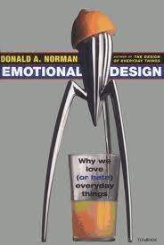

##### Ted Nelson

他提出了名为 Hypertext、Hypermedia 的概念。

超文本（Hypertext）将信息看作是一系列互联互通的节点，而不是线性的数据流。

> 著名的 HTTP，就是 HyperText Transfer Protocol 的简称。

至于 Hypermedia（超媒体），我实在没看出来「超」在哪里。大概只是假借 Hypertext 的大名头而已。

指的就是图形、音频、视频、文本和超链接等互联网信息。

##### Mark Weiser

Mark Weiser 于 1988 年曰：21 世纪的计算模式应该是普适计算。

> 如今 21 世纪已经过去 20% 了；关于新世纪的断言，有的成真了，有的没人提了。

普适计算的关键点是：

* 计算无处不在。
* 计算资源丰富。
* 通信能力强大。

那么根据上面三条，无处不在、无限资源、随意通信的计算机可以在需要的**任何时间、任何地点**为人提供信息和服务。

> Chicago ctOS 既视感

最重要的是，大音希声，大象无形；这么强大的系统不能太张扬。

安静而强大的系统才会惹人喜爱。是所谓 Calm Technology。

### Video Display Units

这是 HCI 的第一个 Paradigm。

* 可以被显示、被操作的数据，才是有意义的数据。

这一范式最早起源于 Sketchpad，交互式绘图设备。自此以后，流行直到现在。

### Personal Computing

这是 HCI 的第二个 Paradigm。

* 面向个人的计算。

人机交互，最终面向的是普通的、数不清的人。对他们来说，易于使用、理解才是最重要的。

自从第一台个人计算机（PC）发布以来，所有面向消费市场的设备都追随者这一范式。

> 否则，消费市场不会买账的。

### WIMP

这是 HCI 的第三个 Paradigm。

WIMP，也就是所谓的 Windows、Icons、Menus、Pointers。

基本在 Alto 中就已经全部出现了；可以将它们统称为图形用户界面 GUI。

相较于 CLI 来说，基于 WIMP 的 GUI 最大优点就是可以并行进行操作。

* Window 可以同时展现多个任务；
* Icon 可以直观区分多个窗口；
* Menu 可以以折叠的方式展示复杂功能；
* Pointer 可以在多个任务之间直观切换。

反观传统的基于文本的交互：

* 一次只有一个活跃终端，难以切换
* 每个程序都长得差不多，只能通过名字区分
* 复杂功能要靠特殊文字序列调出，得死记硬背
* 输入全靠键盘，只有非常简单的一维光标

难怪 WIMP 流行了几十年。

### Multimodal User Interface

这是 HCI 的第四 Paradigm。

计算机已经不再仅仅是「计算之机」了；他开始剑走偏锋，关心和人类的交流渠道。

所谓的 Modal，就是和人类交流的通道方式方法而已。

目前比较常见的 Modal 有：

* 视觉
* 听觉
* 触觉

把它们结合起来，就得到了多模态融合（Multimodal）的 UI。

### Hyptertext

第五范式：超文本。

也就是，非线性的浏览结构。

不需要按照一定的现行规则来和计算机交互；可以在计算机提供的任何状态之间自由切换。

### Natural HCI

另一个范式：自然人机交互技术。

人们觉得，敲键盘、触摸屏幕、移动鼠标、按按钮，这些操作还是不够直观。

在 1990s 就开始研究人机自然交互（HCNI）了。到此处为止，就已经开始进入到现代 HCI 的内容了。

### Awful Online Education

或许…高估了线上教学的能力。

### Q&A

* 计算机和人之间的触觉交互在哪里有体现？（Paradigm.MUI）
  * 事实上还是比较多的；最早的具有震动功能的手机、Apple iPhone 6s 引入的 Taptic Engine、以及 MacBook Pro 上的 Force Touch 触控板，都采用了细微触觉来给人类以生动的触觉反馈。
  * 有时候，触觉甚至是相当有用的交互选项。例如，在可穿戴设备上应用震动触觉提醒，可以实现安静的提醒功能，而不会打扰其他人。
* 怎么理解「把计算机作为人类智慧的放大器」？（Paradigm.History.Emgelbart）
  * 放大器，Amplifier。把输入的信号进行简单放大之後进行输出的元器件。
  * 用这种形式来比喻计算机，因为在那个年代人们并不觉得计算机智慧如何如何。
  * 最早的计算机，连同其上的软件，都是人类穷竭毕生所学，一个一个电路搭出来的。
  * 当时的人们看计算机，只是觉得他进行操作比人类稳定、可靠、快速一些而已，并不觉得他真的有智慧。
  * 但是现在，随着人工智能、深度学习概念的提出，计算机所能实现的神经网络已经相当复杂了；
  * 无论是制造、设计芯片的人，还是深度学习模型的开发者，都无法理解这个庞大的神经网络。
  * 这时候，把计算机称为人类智慧的放大器就不太合适了。
  * 我们可以换个说法，「把计算机作为人类智慧的中继器」。