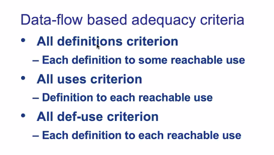

# March 16, 2020

## SE-213

来测试我们的软件…

### Review

上节课我们讲到的主要是测试的各种类型；还画了一张图。

### White Box

但是实际上，我们最常用的测试方法还是「白盒测试」。也就是，在知道程序内在流程的情况下，尽量去覆盖更多的逻辑分支和代码的测试方法。

#### Coverage

语句覆盖率（单条语句）

分支覆盖率（简单的 If/Switch 等选择语句）

路径覆盖率（更高的逻辑层面）

注意留意到 Branch Coverage 和 Path Coverage 的些微区别。

Branch Coverage 强调，只要每个分支点的两条路径都被经过了，那就可以。

而 Path Coverage 强调的是每一种整体的路径走向都必须被覆盖到。

通常来说，Path Coverage 所需的测试用例数不会少于 Branch Coverage 所需的用例数。

### Formal Verification

形式化验证：要用数学的方法，证明出这个系统的无误性。

这种方法相比软件测试方法来说，要求更高更难做，但同时也能保证我们的软件更强壮。

一般来说，对正确性要求极高的软件都会用这种方法。而一般的无害的 App，用软件测试就可以了。

可以这么说：软件测试是为了找出软件哪里有错；而形式化验证就是为了证明软件哪都没错。

这种证明法在这门 2 学分的课里不会细说。

### Def-use Test

定义−使用测试法。这是由数据流驱动的一种测试。

### Mutation Test

变异测试：故意把代码搞乱，然后看我们的测试用例能不能找出这个 Bug。

> 感觉是对「测试用例」的测试

### Regression Test

回归测试。软件测试也是一个迭代的过程。

### Fault Statistics & Reliability Checks

故障统计：通常来说，软件的 Bug 个数和模块的复杂度正相关的。

假如我们发现一个很复杂的模块里面，被发现的 Bug 居然很少，那么可以合理推定这个模块里一定有很多未被发现的 Bug。

如何大概估计每个测试用例所覆盖的 Bug 个数呢？简单：采用标识重捕法。在各个模块中人为地加入一些 Bug，观察哪些测试用例会因此而失败，就能大概估计 Bug 个数。

### Clean-room

净室法：IBM 推出的软件质量保证方法。

### Summary

软件测试大体可以分为两类：执行式的和非执行式的。

除此之外，还有其他「不太属于传统验证」的方法可以提高软件质量：

### Math Prerequisites

> 软件测试所需的数学基础

在离散数学里面基本上都学过了。

#### Set Theory

集合论…就是离散数学里面讲到的那一点，完全够用了。

#### Relations

#### Probability Theory

概率论的问题。

#### Graph Theory

图论相关的知识还是要用到很多的。

还是去看看离散数学。有用的。

回忆一下这些专有名词。

##### (Directed) Path

路径。

##### Cycle

成环的路径。

##### Chain

一条 Path，其上每一个节点的入度和出度都是 1。

##### Semipath

半路径在之前没学过，有必要再讲一讲。

简单说，半路径就是作为有向图不算路径，作为无向图算路径。