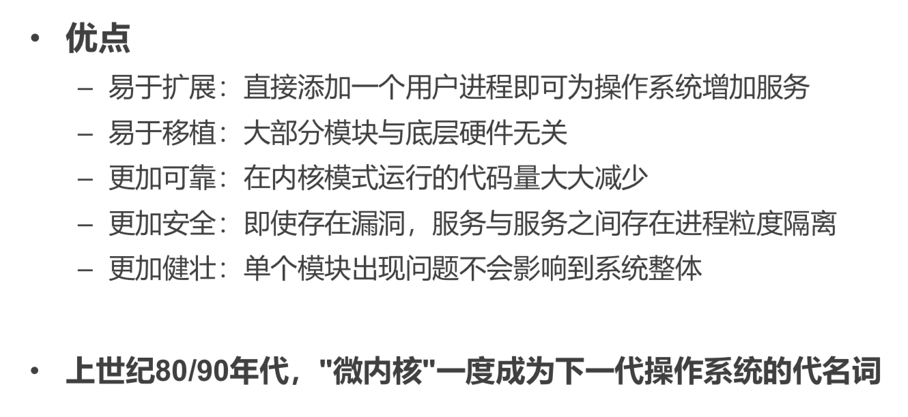

# March 17, 2020

## SE-315

> My Damned Dearest OS...

> 今天 Xia YB 主讲。

主要内容是 OS 的 Architecture。

### How System Fails

#### The *Vasa*

瓦萨号，被需求毁掉的船。

#### IBM's *Workspace*

IBM 推出的 Workspace OS，花了 20 世纪 90 年代的 20 亿美刀。

然而目标过于宏伟，系统太复杂导致项目爆炸。

> 后来 IBM 一股脑滚向了 Linux（逃

#### Idea

这告诉我们什么呢？

### Complexity

我们怎么才能降低 OS 的复杂性呢？

#### Principle

策略与机制分离。

##### Definition

* Policy（策略）：要做什么。动态概念
* Mechanism（机制）：怎么做。静态概念。

##### Example

### Architecture

> 开局丢张图先

#### Monolithic-Kernel

Monolithic：整块大石头一样的东西。

我们平时用的大多数 Linux、Unix 都是宏内核。

##### Layer Separation

整个系统被简单分为两层：内核和应用。

* Kernel 跑在特权级，集中控制所有计算资源
* Application 跑在非特权级，受内核管理，使用内核提供的服务

##### Features

可以看到，内核中包含的东西太太太多了…

* File System
* Memory Management
* Device Driver
* Process Scheduling
* IPC
* ……

##### Practically Successful

宏内核有现实的优点。巨大、统一的社区和生态，针对不同场景优化了 30 年。

> （都拜 Linux 所赐）

##### Security Issues

内核模块过多，每个模块都运行在特权阶级中，模块之间没有隔离；这就带来了安全性和可靠性问题。

##### Great Complexity

因为内核极其复杂，因此无法提供实时性支持。

目前还不能确定 Linux 能否支持 RT（确定性时延）。

同时，Linux 的代码量已经超过了 2000 0000 行，过于庞大，难以维护改进。

##### Inflexible

因为内核太大太复杂，很难对这种内核进行裁剪、定制来适应不同场景。

##### Insecure

业界共识：目前的 Linux 是通不过汽车安全完整性认证（ASIL-D）的。

单点错误就会导致整个系统出错。

现在还有几百个 CVE。

#### Micro-Kernel

顾名思义，这种内核更微小。

##### Principle

原则：最小化内核功能。

###### Definition

将大部分操作系统的功能转移到用户态，把它们称为「服务」（Server）。

然后，在用户模块之间，用消息传递机制进行通信。

> 注意，这里专门说明了。IPC 是很慢的。

###### Example

比如，在微内核创建一个文件时，发生了这些事情：

##### Intuition

其实微内核的思想也早早就出现了。

然而在那个硬件拖后腿的年代，这种用效率换简单性的设计很难成为现实。

> 直到 Rick Rashid 做出 Mach。

##### Mach

###### History

###### Features

* 任务和线程管理

  * 任务：资源分配的基本单位
  * 线程：执行的基本单位

* 进程间通信（IPC）

  * 通过端口（Port）进行通信

* 内存对象管理

  * 虚拟内存

  > 内存页表还是不能交给用户态程序

* 系统调用重定向

  * 允许用户态程式码处理系统调用

  > Fuse 做的事情就是截获文件系统相关的 System Call，然后自己从中作梗。

  * 支持对系统调用的功能扩展
    * 如二进制翻译、跟踪、调试等

* 设备支持

  * 通过 IPC 实现，即通过 Port 来连接设备
  * 支持同步设备、异步设备

* 用户态的多进程

* 分布式支持

  * 透明地将任务、资源映射到 Cluster Nodes

> 这个内核自由度很高。

###### Cooperation

用户态和内核态并非井水不犯河水。

* Mach 允许用户态代码自己实现 Paging。
  * 也就是说，应用可以自己管理自己的虚拟内存
* Mach 支持 Redirection（重定向）功能
  * 允许发生中断/异常时，直接执行用户的二进制
  * 不需要对内核进行修改就可以实现这种功能

##### Jochen Liedtke

在 Mach 作为第一个微内核 OS 出现之後，性能相比 UNIX 差很多。

在重写 IPC 部分代码之後，更慢了（逃

这时候，Jochen Liedtke 就出现了！

##### Gernot Heiser

写出了 seL4：被形式化证明过的微内核！

当然，为了实现形式化验证还是舍弃了很多的。

##### QNX

*Quick Unix*

它采用的微内核 Neutrino（微中子）1980 年发布，后来几经转手，最後被黑莓买了。

它满足实时性的要求（Linux 不行），所以广泛用于交通、能源、医疗、航天航空领域。

Boeing 公司的飞控就用了 QNX。

主要实现了一个 Software Bus（软件总线），其他所有软件都在这根总线上和 Neutrino 交互。

##### MINIX

由 Andrew Tanenbaum 教授开发的。

被用在了 Intel 芯片上…

##### Pros & Cons

#### Composite Kernel

宏内核和微内核的组合——取巧的做法。

##### Windows NT

##### macOS

### Weirdos

还有一些离经叛道的内核设计方式。

#### Exokernel

「外…外核？」

##### Principle

内核不应该提供什么硬件抽象。只有每个应用才知道怎样的抽象才最适合自己。

主要观点是，将「管理」与「保护」分离。

外核的功能只包括下面三种：

* 追踪计算资源的拥有权（安全绑定）
* 保证资源的保护（显式回收）
* 回收对资源的访问权（终止协议）

##### LibOS

##### Secure Binding

安全绑定。

##### Resource Recycle

##### Protocol Termination

##### Performance

比较之下，采用外核的设计理念可以大大提升性能。

#### Unikernel

单内核？

这种理念的提出主要是因为现在容器化、虚拟化的大潮。

在每一层都包含一个重复的内核态和用户态完全没必要。我们让每个虚拟化的容器都只使用内核态，每个内核态里只跑一个应用，加上 LibOS，就能低开销地实现不同实例之间的隔离。

#### Multi-Kernel

多内核/复内核。

##### Idea

这种理念的提出主要是因为现在的计算机里面，核心实在是太多了。

不光是 CPU 的核心越来越多，保证 Cache 一致性越来越难，导致效率降低；

而且，其他外部设备什么的也都来插一脚，他们每一个都有自己的核心。而如果采用 PCIe 来让他们通信的话，效率过低。

##### Design

### Summary

> 还是 DOS 应用跑得爽啊（逃

