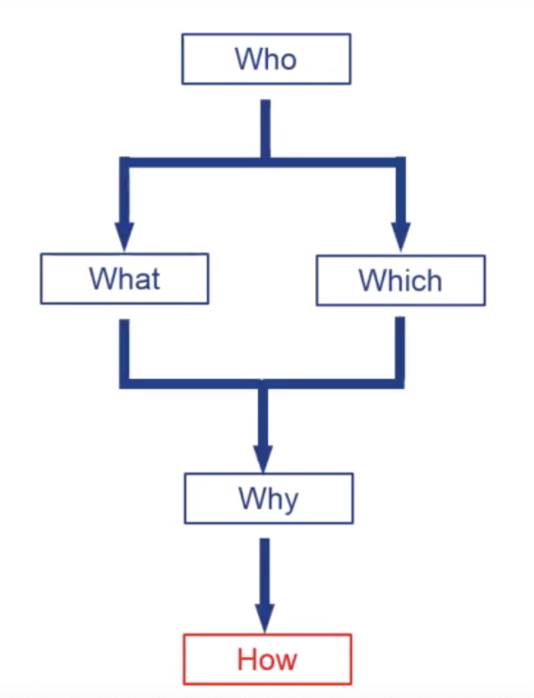
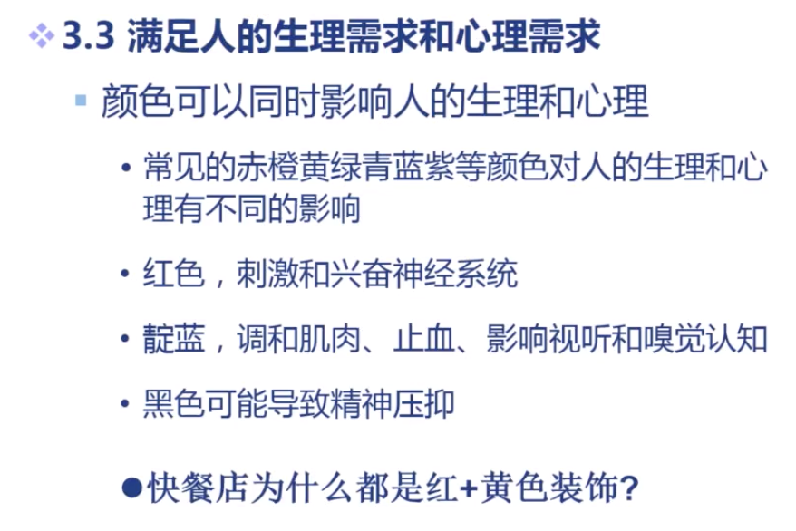

# March 18, 2020

## SE-340

> 人机交互与技术

### Outline

* 人群的生理和心理特点
  * 我们的 System 是交给**人群**使用的
  * 必须先了解人类的共性
* 针对人群的 HCI 设计
  * 再针对人群的特点，进行 HCI 设计

### Basic Features

> 人的基本特性

可以分为两大类：

* 自然属性
  * 人作为生物而具有的特征
  * 在 DNA 序列中被定义
  * 决定人的生理基本需求
* 社会属性
  * 人作为社会存在物而具有的特性
  * 通过後天认知学习形成
  * 群体的社会属性呈现出共性

#### Natural Features

求生存。主要是求取适宜的环境、食物和安全。

有局限。人的体能和感知能力不足，经常犯错。

保健康。追求心理和生理的有益

有情绪。人有七情六欲。

求知欲。了解世界的真相。

懒惰。追求体力、脑力的节省。

享受（贪婪）。追求各种感官的高度满足。

智慧。能分析各种因果关联、逻辑关系。

#### Social Features

情感智慧。行为、习惯、意志力、品质。

情感关系。对他人之间的关联和情感。

学识素养。知识、思想、审美、原则。

职业生活。行为和活动改变世界。

地位身份。对他人和社会的影响力。

信息交流。与世界、和其他人的交流。

### Build Interactions

怎么构建合理的「人−机」关系呢？

#### Roadmap

一定要按照这张图的流程来思考。

* Who?
  * 这个系统是为谁服务的？
* What?
  * 这个系统提供什么服务？
* Which?
  * 通过哪种方式来提供服务？
* Why?
  * 为何他需要这种服务？
* How?
  * 最後，才是怎么实现系统。

#### Principles

这里，有一些设计原则。

##### Targets

首先要考虑这个系统的目标人群。是普通人群（不特定人群），还是特定人群？

如果是不特定人群的话，系统设计就应该尽可能满足大多数人共性的需要。

##### Low Barriers

面向普通人群的交互，方式不可以太复杂。

否则，过高的门槛就会无形中对用户进行筛选。

##### Meet Human Needs

无论如何，交互应该至少满足一些人类的共性的自然需求或是社会需求。

不满足任何人类需求的交互设计是反人类的。

##### Find Specific Features

对于那些面向特殊人群的交互设计，重要的是找出目标群体区别于其他群体的「特性」。

##### Consider Static & Dynamic

HCI 设计不能仅仅考虑人体的静态需求，还要考虑人在「动态状态」下的需求。

例如，路上刷手机的人、图书馆看书的人、卧床病人…

在把他们作为交互对象考虑的时候，我们的设计方式或许就不太适宜了。

##### Consider Physical & Mental

要同时考虑人的生理需求和心理需求。

生理上，可以说交互的显式、控制都不可以超过人的生理承受能力。

> 不仅仅是做到「不让人身心受伤」就足够了；还应该尽可能让用户感受到舒适、安全、不易出错。

心理上，产品的色彩、质地、比例等等都会跟人的心理产生影响。

##### Available Channels

人与计算机的交互方式不能够超过人的能力，也不能超过计算机的能力。

例如，人机之间的交流只能限于人的五感之内，比如「视听触嗅味」。

但是，要想让计算机能「听懂」这些感官，我们必须有将其数字化的部件。

> 有一些看起来很诡异的交互方式，其实都是可行的。
>
> 比如，计算机嗅觉目前也可以实现了。

### Next

人的认知与心理

### Questions

Q: 在小组的讨论中，我们产生了疑问：中小学生的攀比心、表现欲到底应该归类到自然属性中还是归类到社会属性中？

A: 经过组内三人投票得出结论，两人认为应该归类到自然属性中。

我对两种属性分类的理解是：那些直接由基因表现出来的行为应该被归类到自然属性中；
而在人类社会中生存，逐渐形成的应该被归类到社会属性中。

然而，表现欲这件事情不仅人类独有，动物也有。被隔离与人类社会、在狼群中长大的「狼孩」也会自然地产生求胜欲、表现欲，这说明基因中本身就有关于表现欲的内容；然而出生就被隔离于任何社会形态的人类不会产生这种欲望，这说明参与社会也是表现欲产生的必要条件。

因此，可以认为求胜心、表现欲既在基因中存在（是个体生存的重要条件），也会在社会生活中逐渐被特化表现为攀比心。
