# March 19, 2020

## SE-315

### Lab 1 Docs Notes

首先，咱们读一读 Lab 1 要求的两篇参考文献。

#### A1: Overview of the Arm® Architecture

> 第一部分：ARM® 架构总览

首先，咱们要学的 ARM® 架构是 v8 版本的。

##### Bits

是一个 64 位元的指令集，但也保留了向下兼容 32 位元指令的部分。

通过类似于「模式切换」的方式实现的向下兼容。

###### AArch32

AArch32 模式下，代码寻址能力、寄存器存取能力都被限定在 32 位；而且，只能使用 A32 和 T32 指令集。

###### AArch64

AArch64 模式下，能够访问全 64 位的通用寄存器。只能使用 A64 指令集。

> 请留意：A32 和 T32 指令集是在 32 位宽模式下工作设计的；而 A64 指令集是在 64 位宽模式下工作设计的。
>
> 然而，A64 指令集里的指令的长度也只有 32 位，而非 64 位。

###### Model Switching

一个符合 ARMv8 标准的 CPU 应该支持 AArch32 和 AArch64 两种指令集，但并不支持同时执行两种指令集的代码。

两种状态的切换需要由异常引发。

##### Advanced SIMD

翻译一下，Advanced SIMD = Advanced "Single Instruction Multiple Data"。也就是所谓的「高级『單指令流多資料流』技术」。

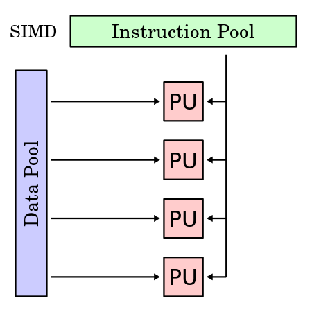

处理器执行单条指令，对一组内存地址（或者称为资料向量）执行相同的操作，从而执行空间并行的技术。

ARMv8 支持 64 位元和 128 位元混合 aSIMD 技术。

> 这门课里应该不会需要…用到这么高深的技术吧。

##### Floating-point Hardware

ARMv8 有支援 IEEE 754 浮点数的硬件。

> 废话，谁没有啊？

###### VFPv4


###### AArch32

在 AArch32 模式（向下兼容模式）下，浮点运算指令基本和 VFPv4 类似。

对 AArch32 没什么兴趣。

###### AArch64

AArch 64 模式下的浮点运算指令也是基于 VFPv4 的，但是做了一些魔改：

* 「浮点数寄存器」和「128 位 SIMD 寄存器」的数量都翻倍，从 16 直接到了 32。
* 单精度浮点数寄存器现在是双精度浮点数寄存器的一部分。`Dx[31:0]`（取出双精度浮点数寄存器的低 32 位）就可以得到 `Sx`（单精度浮点数寄存器）。
* 浮点运算单元现在完全由硬件实现。不再提供软件浮点运算接口。
* 不兼容早于 VFPv4 的浮点架构。
* VFP 向量模式被抛弃。改用更先进的 SIMD 来实现空间并行计算。
* 加了一些新指令，包括：
  * 半精度浮点数和双精度浮点数的直接转换；
  * 组合的 load & store 指令对，不再需要复合指令。
  * 混合的「+×」和「−×」。
  * 为了兼容 IEEE Std. 754-2008 for FPA 所加的。

#### A3: Overview of AArch64 state

这门课主要还是着眼于 AArch64，而非向下兼容性质的 AArch32。

##### Registers

RISC 别的没啥好，寄存器是真的多。

下面是 AArch64 模式下可以用的一些寄存器：

### OS Course 5 Notes

今天的主题是：内存管理（Memory Management）。

#### Physical Memory

所谓的「物理内存」。

按照 von Neumann 提出的架构，内存中保存着 OS 和所有 App 的指令代码和数据。

#### Memory Hierarchy History

##### Legacy OS Generation

最早的 OS 基本没有可移植性，一种 PC 搭配一种 OS。

这种早期计算机基本也没有什么多工功能，直接把一整块内存对半开对半分。

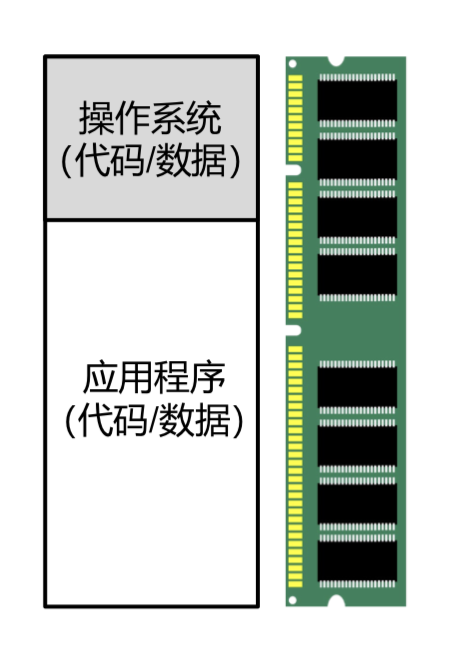

##### Multi-Dev Generation

后来，计算机又贵、需求又大，自然就出现了「多人合用计算机」的问题。

这时候，自然就出现了「分时复用」CPU 资源、内存资源的需求。

但是，假如我们仍然按照上面的简单划分方法，把物理内存多分几块、同时使用的话，就毫无安全性、隔离型可言；任何一个用户程序都可能改写其他任何用户的内存。

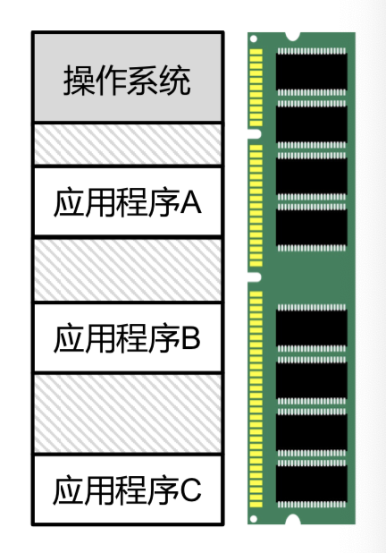

##### IBM's Memory Protection

IBM 360 中提出了一个名叫「Protection Key」的内存隔离机制。

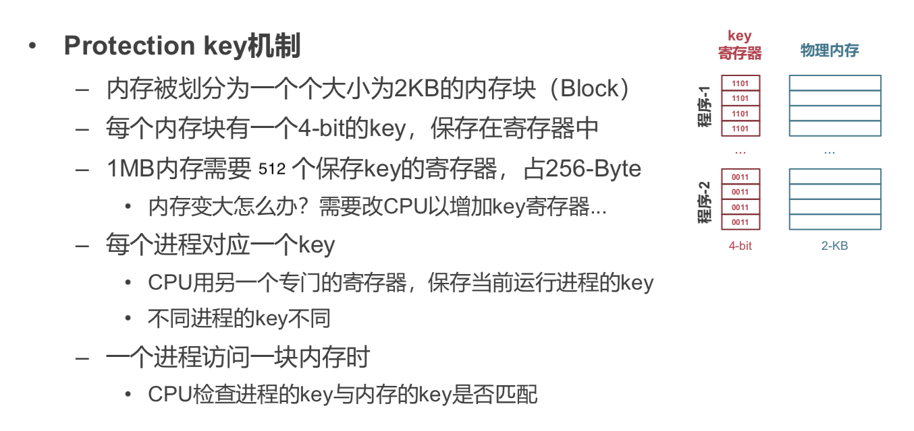

简单说，就是每个内存的寻址都需要携带一个对应有权限进程的 PID 才能访问一定的物理内存位置。

##### Memory Isolation

IBM 提出的 Memory Protection 应该是解决了「安全性」的问题（虽然实现得比较 Dirty）。然而，这还是没有解决隔离型的问题。

在那个年代，每个应用还是采用绝对的物理地址进行访存，这就导致应用被加载到不同位置会带来不同的行为。

而且，一个应用可以根据自身的物理内存地址来猜测其他应用的加载位置。

> 人类在认识到这件事的时候，应该会本能地感觉到恶心和反感。

##### Memory Virtualization

> "*All problems in computer science can be solved by another level of indirection*." 
>
> **David Wheeler**

> 除非问题本身就是 indirect layer 过多

于是，我们希望可以提供一套隔离的「新地址」，让每个 App 都有一套和其他应用独立的虚拟空间；而由 CPU（的一个小组件）负责处理每个 App 虚拟内存空间到物理内存空间的映射；或者说，负责将每个应用的虚拟内存地址翻译成物理内存地址。

#### Virtual Memory

终于，在这个抽象上，每个应用程序拥有独立的虚拟地址空间。

##### Jobs

* CPU支持虚拟内存功能，新增了虚拟地址空间。

* 操作系统负责配置并使能（Enable）虚拟内存机制。

* 在使能（Enable）之后，所有应用、包括 OS 均使用虚拟地址，无法直接访问物理地址。

##### Effects

在启用了虚拟内存抽象之後，每个应用程序拥有独立的虚拟地址空间。

* 应用程序认为自己独占整个内存；

* 应用程序不再看到物理地址；

* 应用加载时不用再为地址增加一个偏移量。

##### Translating Process

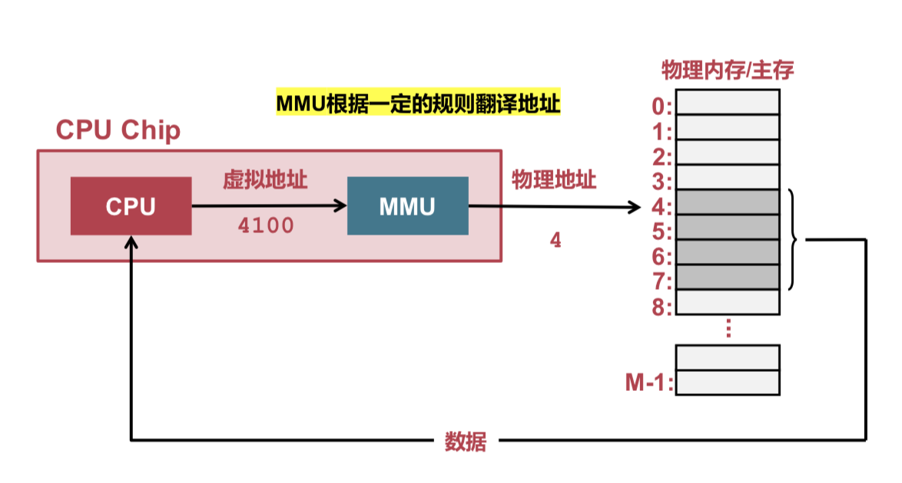

翻译是相当复杂、需要多方合作的一件事情…

###### Memory Fragment

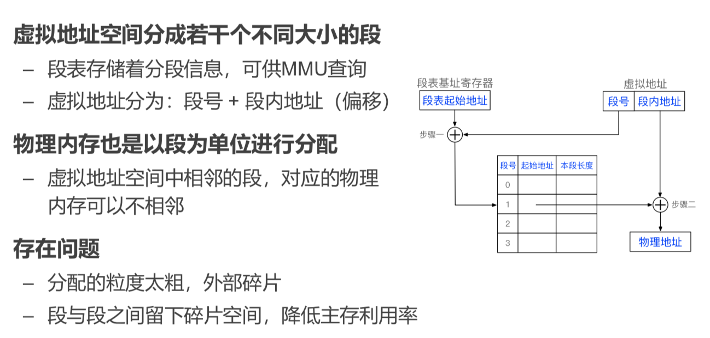

这是一个早期指令长度不足的历史遗留问题…

并不是很干净的一个解决方案：给每个程序分别提供一个段落起始 Offset，每个访存都会加上这个 Offset。

另外，为了防止越界访问别人的段，段表中也会包含本段的长度，以便进行越界检查。

看起来，这种机制既简单，又很好地解决了安全性和隔离型的问题。

###### Memory Page

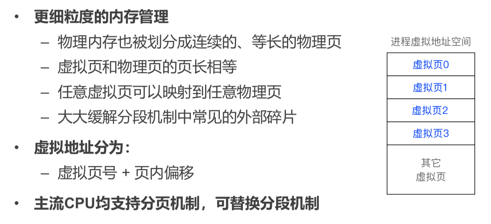

「段」式解决方案是粒度太粗、且每段内存必须连续。

那么，我们可以把粒度切得更细，并且让每个虚拟页都任意映射到任何物理页上；内存碎片就大大降低了。

#### Page Table

##### Responsibility

为了实现 Memory Page 式的内存翻译…实际上我们要做的所有事情，仅仅是把虚拟页映射到物理页。

##### Optimization

粗看起来，要存储一个从「有 $2^m$ 张虚拟页表的虚拟内存空间」到「有 $2^n$ 张物理页表的物理内存空间」之间的映射关系，就需要 $m + n$ 比特。好像很浪费啊！

所以，我们选择把从第 $0$ 到第 $2^m - 1$  张虚拟页表对应的物理页号依次排下来，把索引当作是虚拟页表号，就只需要 $n$ 比特来存储一个映射关系。

##### Optimization #2

看起来好像很美好。但是假如你稍微算一算就 CPU 的寻址能力，这样存储的页表的规模会非常爆炸。

例如，64 位 CPU 所能访问的地址空间是 $2^{64}$ 字节，假如每个页大小分为 4K、物理页的个数是 $2^{32}$ 个，那么一共就需要 $33554432$ GiB 的内存，只是为了存放一个进程的页表。

这显然是不可能的。其中大部分虚拟内存页都永远不会被程序用到。这么存纯属脑子进水了。

这就是我们为什么需要用多级页表；用很自然的办法，稍微多花了几次寻址就消除了大量的无效 Entry。

为了方便，大多数正常的计算机架构都会把虚拟页表和物理页表的大小设定为一致。

这也是为了保证「页」是虚拟地址翻译过程中最小的粒度。再往下细分粒度，得不偿失。

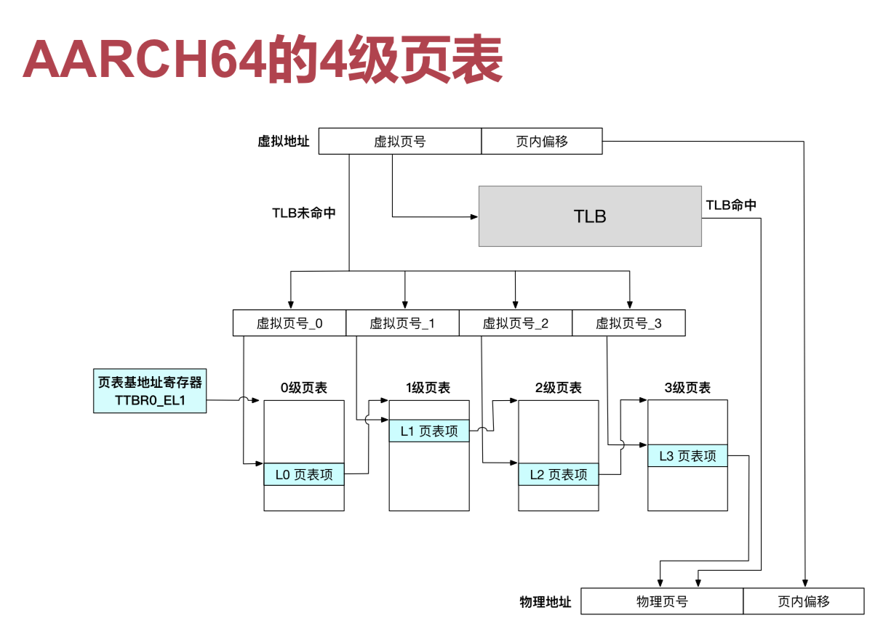

记住几件事：对于 AArch64 典型的四级页表而言，在寻址的时候主要做这么几件事：

* 把拿到的虚拟地址 `VM` 分成两部分，一部分是虚拟页号（长度是 $\log_2{M_s} - \log_2{P_s}$），一部分是页内偏移（长度是 $\log_2{P_s}$）。
  * $M_s$ 是虚拟内存空间的总字节数。
  * $P_s$ 是每张（虚拟）页表的字节数。
* 把虚拟页号丢到 TLB（地址翻译缓存）里面去看是否能命中并得到一个物理页号。
  * 假如命中，那么直接把物理页号和页内偏移组合在一起，得到结果。
  * 假如不命中…接着往下看。
* 从 `TTBR0_EL1` 寄存器里拿到当前进程页表的基地址；应该能在这个地址的地方找到第 0 级页表。
* 把虚拟页号部分平均分成四份，从高地址位到低地址位依次标记为「0 级虚拟页号」、「1 级～」、「2 级～」、「3 级～」。
* 拿出「0 级虚拟页号」在 0 级页表中找出对应项，得到的内存地址就是 1 级页表的内存地址；依次这么处理，最终应该能在 3 级页表中找到「3 级虚拟页号」对应的结果：这个结果就是「物理页号」。
* 把得到的物理页号和页内偏移组合在一起，得到结果。

> 注意，上面这些过程完全是在硬件层面实现的；因此里面的中间过程内存地址都是物理地址。

##### AArch64 Style

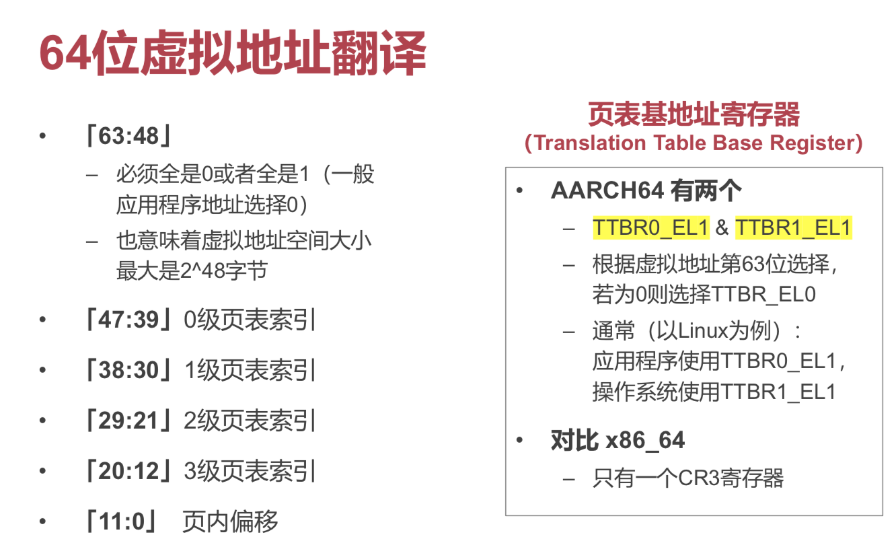

#### Enabling Page Table

要使能页表，OS 需要做一些事情。

CPU 在上电之後，默认进入的是物理寻址模式；此时运行的寻址指令，都会直接被当作物理地址，而不经过 VA => PA 的翻译。

然后，OS 代码通过一些手段使能页表，这才进入到虚拟寻址模式。

##### AArch64

在 `SCTLR_EL1`（System Control Reigster, EL1）的第 0 位置 1，就可以在 EL0 和 EL1 权限级使能页表。

##### x86_64

CR4，将第 31 位置为 1，就能使能页表。

#### AArch64's Page Table

##### Manifests

对于 AArch64 的页表而言，你需要知道：

* 每级页表由若干个离散的页表页。
  * 每个页表页都占用一个物理页。
* 第 0 级（顶层）页表有且仅有一个页表页。
  * 因为所有 VMA 的翻译都始于 `TTBR0_EL1` 寄存器里保存的顶级页表。
* 每个页表页中有 512 个页表项。
  * 因为每个页表项占用 8 个字节；
  * 而每个页的大小是 4096 字节。

##### Memory Table Entry

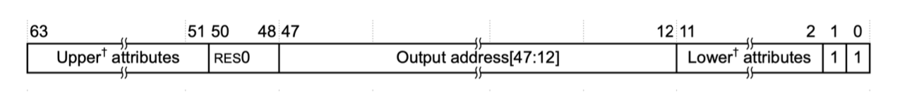

每个占用 8 字节的页表项就长这样。

除了上面提到的、必要的「Output Address」，还有一些用来做安全性检查的位元（统称为 Lower Attribtues）。

###### R/W Permission Bytes

第 7 位～第 6 位，也就是 `AP[2:1]` 这两位，按照下面的规则来记录高特权等级和 EL0 权限等级下的读写权限：

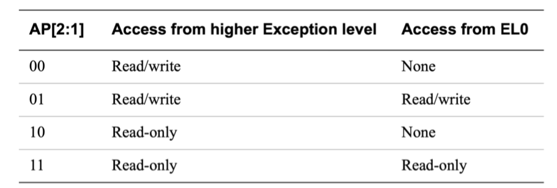

> 还记得吗？上节课讲到的；
>
> EL0 是 AArch64 里最低的特权等级；数字越小，特权级越低。
>
> 和 x86_64 刚好相反，那里面数字越低，特权级越高。

> 注意到，这里不光对低特权级别（EL0 级）的访问进行了限制，还有对高特权等级的限制。这必要吗？
>
> 实际上，这也是一种保护；如果 Kernel 能够随意执行任何用户态的代码，这反而可能导致 Kernel 内的 Bug 导致权限泄露，执行任意代码。
>
> 所以，对于 Kernel 权限的限制也是一种保护。

###### Access Flag Byte

第 10 位，设定为 0 代表这一项不可访问，一旦访问就产生异常。

> 当然 Kernel 来访问肯定不会产生问题。
>
> 这一段一般用来存放 Kernel 代码。

一般用于软件追踪内存访问过程。

###### Shareability Field Bytes

第 9 位、第 8 位，用于 Kernel 内部和 Kernel 和 Device 之间设备的共享。

###### Attribute Index Bytes

第 4 位到第 2 位，表示内存类型；

* Normal 类型
  * 也就是正常的主内存。
* Device 类型
  * 这部分不映射到物理内存，而是映射到 I/O 设备的。

##### Cache Lockdown

这是 ARM 里特有的一个特性。

简单说，可以通过一些手段（配置 Cache Lockdown Register）让某些 Cache Line 永远不被 Evict，始终驻留在 CPU 内部。

这不是一个强制的、统一的标准；各家 ARM 兼容 CPU 可以任意实现此特性，也可以不实现。

好处都有啥？

 * 提高性能
   	* 可保证访问部分重要数据永远 Cache Hit
   	* 弥补硬件不够完美的 Cache 替换策略

* 提高安全性
  * 限制部分数据永远不离开 CPU
  * 若数据量大于 Cache 容量，可加密后离开CPU，而把密钥放在 Cache 里

> 主要原因是，面对物理攻击，内存比 CPU 更脆弱。
>
> 嗅探物理内存是简单的；然而要嗅探 CPU 缓存、寄存器就非常困难。

#### Imperfectness

本质上，多级页表就是一个时间换空间的策略。

利用 App 访问内存的大量空洞，减小了页表占用的无用空间，但是增加了访存次数。

##### TLB: Translation Lookaside Buffer

还记得上面（地址翻译过程）中所用到的 TLB 吗？

根据 Locality，一个程序在短时间内访问的内存地址有很大概率落在几张页表内。

那么，假若我们能够对每一组【虚拟页号 − 物理页号】都做缓存，就能大大减少地址翻译的耗时。

##### Page Fault Handling

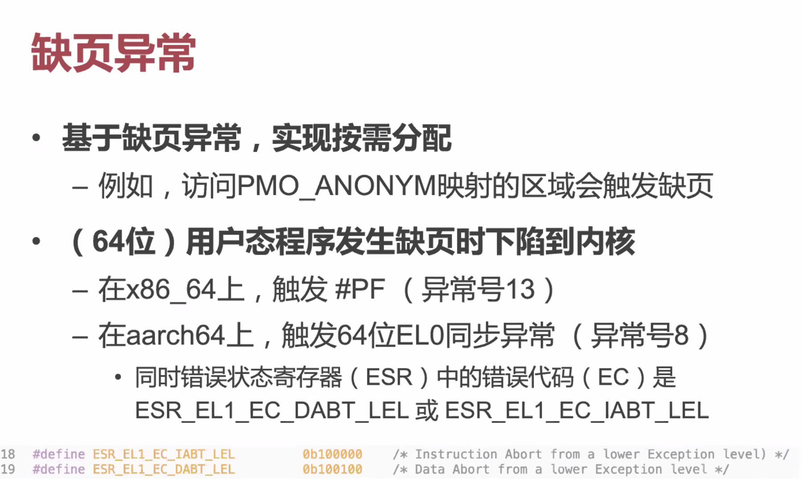

上面的翻译过程中，有可能会出现翻译出错，找不到一个虚拟内存地址对应的物理内存地址的情况。

这时候，会触发一个 EL0 同步异常，下陷到 Kenrel 就行处理。

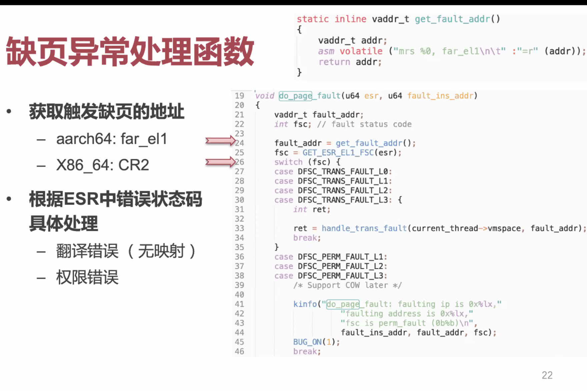

处理方式分两种：

* 假如用户内存是无辜的，的确这是个合法缺页，就去调用 handler 把这个页补回来；
* 假如用户的确是瞎 Call 了一个不合理的内存地址，那么就直接把用户程序干掉，就好了。

### Lab 2 Assignment

Lab 2 要做的事情就是「虚拟内存管理」。

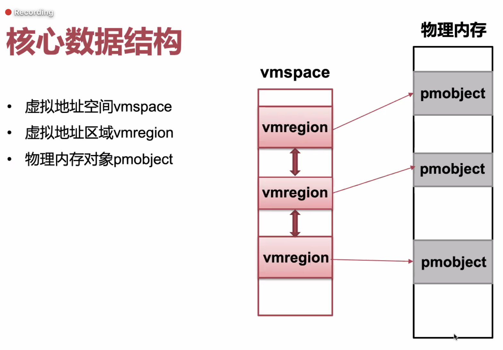

三个数据结构：

* 虚拟地址空间（vmspace）
* 虚拟地址区域（vmregion）
* 物理内存对象（pmobject）

#### `vmspace`

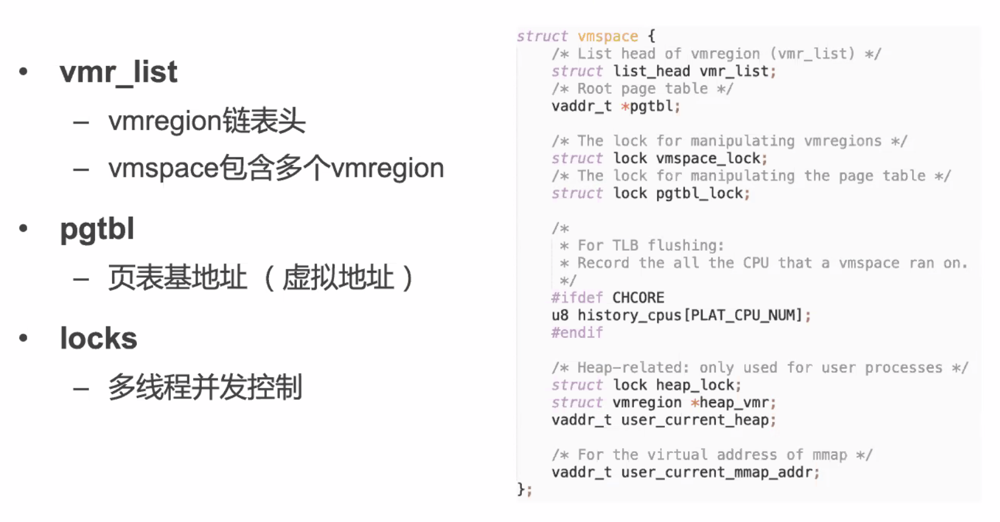

```c
struct vmspace {
    /* List head of vmregion */
    struct list_head var_list;
    
    /* Root page table */
    vaddr_t *pgtbl;
    
    /* The lock for manipulating vmregions */
    struct lock vmspace_lock;
    
    /* The lock for manipulating the page table*/
    struct lock pgtbl_lock;
    
    /*
     * For TLB flushing:
     * Record all the CPU that a vmspace runs on
     */
    #ifdef CHCORE
    u8 history_cpus[PLAT_CPU_NUM];
    #endif
    
    /* Heap-related: only used for user processes */
    struct lock heap_lock;
    struct vmregion* heap_var;
    vaddr_t user_current_heap;
    
    /* For the virtual address of mmap */
    vaddr_t user_current_mmap_addr;
}
```


#### `vmregion`

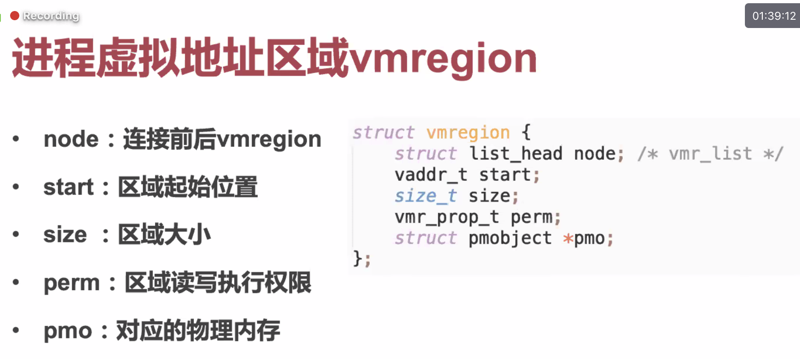

```c
struct vmregion {
    struct list_head node; /* vmr_list */
    vaddr_t start;
    size_t size;
    vmr_prop_t perm;
    struct pmobject *pmo;
}
```

#### `pmobject`


#### Process

要创建一个进程，我们需要做这些事情：

* 创建虚拟地址空间 `vmspace`
* 创建主线程
  * 分配 stack 空间
  * 初始化对应的 vmregion 和 pmobject

