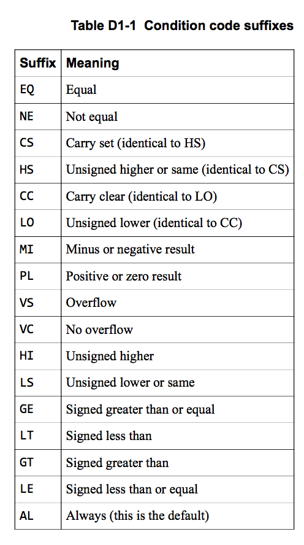
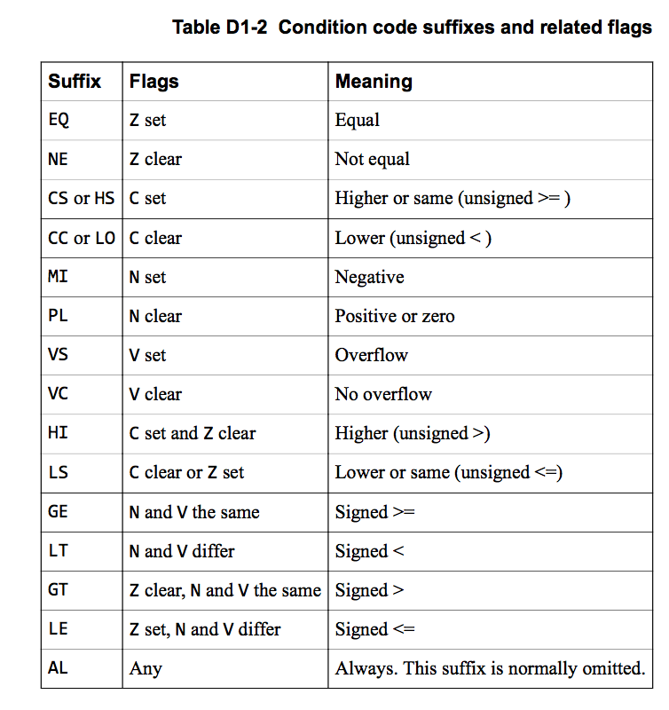

# March 19, 2020

## SE-315

### Lab 1 Docs Notes

首先，咱们读一读 Lab 1 要求的两篇参考文献。

#### A1: Overview of the Arm® Architecture

> 第一部分：ARM® 架构总览

首先，咱们要学的 ARM® 架构是 v8 版本的。

##### Bits

是一个 64 位元的指令集，但也保留了向下兼容 32 位元指令的部分。

通过类似于「模式切换」的方式实现的向下兼容。

###### AArch32

AArch32 模式下，代码寻址能力、寄存器存取能力都被限定在 32 位；而且，只能使用 A32 和 T32 指令集。

###### AArch64

AArch64 模式下，能够访问全 64 位的通用寄存器。只能使用 A64 指令集。

> 请留意：A32 和 T32 指令集是在 32 位宽模式下工作设计的；而 A64 指令集是在 64 位宽模式下工作设计的。
>
> 然而，A64 指令集里的指令的长度也只有 32 位，而非 64 位。

###### Model Switching

一个符合 ARMv8 标准的 CPU 应该支持 AArch32 和 AArch64 两种指令集，但并不支持同时执行两种指令集的代码。

两种状态的切换需要由异常引发。

##### Advanced SIMD

翻译一下，Advanced SIMD = Advanced "Single Instruction Multiple Data"。也就是所谓的「高级『單指令流多資料流』技术」。


处理器执行单条指令，对一组内存地址（或者称为资料向量）执行相同的操作，从而执行空间并行的技术。

ARMv8 支持 64 位元和 128 位元混合 aSIMD 技术。

> 这门课里应该不会需要…用到这么高深的技术吧。

##### Floating-point Hardware

ARMv8 有支援 IEEE 754 浮点数的硬件。

> 废话，谁没有啊？

###### AArch32

在 AArch32 模式（向下兼容模式）下，浮点运算指令基本和 VFPv4 类似。

对 AArch32 没什么兴趣。

###### AArch64

AArch 64 模式下的浮点运算指令也是基于 VFPv4 的，但是做了一些魔改：

* 「浮点数寄存器」和「128 位 SIMD 寄存器」的数量都翻倍，从 16 直接到了 32。
* 单精度浮点数寄存器现在是双精度浮点数寄存器的一部分。`Dx[31:0]`（取出双精度浮点数寄存器的低 32 位）就可以得到 `Sx`（单精度浮点数寄存器）。
* 浮点运算单元现在完全由硬件实现。不再提供软件浮点运算接口。
* 不兼容早于 VFPv4 的浮点架构。
* VFP 向量模式被抛弃。改用更先进的 SIMD 来实现空间并行计算。
* 加了一些新指令，包括：
  * 半精度浮点数和双精度浮点数的直接转换；
  * 组合的 load & store 指令对，不再需要复合指令。
  * 混合的「+×」和「−×」。
  * 为了兼容 IEEE Std. 754-2008 for FPA 所加的。

#### A3: Overview of AArch64 state

这门课主要还是着眼于 AArch64，而非向下兼容性质的 AArch32。

##### Registers

RISC 别的没啥好，寄存器是真的多。

下面是 AArch64 模式下可以用的一些寄存器：

*   通用寄存器
	*   General Purpose Registers
	*   31 个
	*   64 位
	*   名为 `X0`～`X30`
	*   可以用 `W0` ~ `W30` 访问低 32 位
*   栈指针寄存器
	*   SP: Stack Pointer Registers
	*   4 个
	*   64 位
	*   名为 `SP_EL0`、`SP_EL1`、`SP_EL2`、`SP_EL3`

*   异常链接寄存器
	*   ELR: Exception Link Registers
	*   3 个
	*   64 位
	*   名为 `ELR_EL1`、`ELR_EL2`、`ELR_EL3`
*   程序状态寄存器
	*   SPSR: Saved Program Status Registers
	*   3 个
	*   32 位
	*   名为 `SPSR_EL1`、`SPSR_EL2`、`SPSR_EL3`
*   程序计数器
	*   PC: Program Counter Register
	*   64 位
	*   1 个

注意到除了程序状态寄存器是 32 位以外，其他所有的寄存器都是 64 位。

> 主要原因是，程序状态寄存器不是用来保存「指针」，或者说「内存地址」的；而是作为一个「ON/OFF」组的东西存在；每一位作为一个开关使用。
>
> 因此，其位宽比较窄就很自然了。

##### Instructions

*   大部分整数操作指令都可以被应用在 32 位和 64 位寄存器上。

*   通用寄存器的用法：用 `X0` ～ `X30` 来访问全 64 位的通用寄存器；用 `W0` ～ `W30` 来访问低 32 位的通用寄存器。
*   物理上没有 `X31`（或者 `W31`）。但是你可以访问它们。
	*   可能指向 Stack Pointer Register（和 SPR 一样）
	*   也可能是 Zero Register（单纯是 0）

##### Exception Levels

异常等级。ARMv8 下的特权等级分为四级，也是用首字母简写命名的 `EL0` 到 `EL3`。

> 这和 x86_64 下的 Ring 特权等级类似。
>
> 只不过 Ring 是数字越小权限越高；EL 是数字越小权限越低。

###### EL0

最低的特权等级；用来跑一般 Applications。

###### EL1

OS 内核和相关的特权函数所在的特权等级。

###### EL2

Hypervisor（超监督）所在的特权等级。

###### EL3

安全检测模块所在的特权等级；最高级。

###### Notices

*   在特权等级之间切换的时候，允许进行 AArch32 和 AArch64 模式之间的切换。

*   只能通过异常诱发特权等级的切换。
*   在计算机刚通电的时候，默认进去最高特权等级。

##### Link Registers

上面提到了，我们有三个~~林克寄存器~~）Link Register。名叫 `ELR1`、`ELR2`、`ELR3` 的。

> 很奇怪地，为什么这个寄存器是从 1 开始数数的，而不是像其他寄存器从 0 开始？

在 AArch64 模式下，Link Register 保存着当发生了一次子程序调用之后，应该返回到的内存地址。

假如你用栈来存储返回地址，那么这些寄存器你可以当作通用寄存器使。

在异常被调用之后，会将 `ELR_EL1`、`ELR_EL2`、`ELR_EL3` 分别对应 `EL1`、`EL2`、`EL3` 三个异常级别的返回地址。

一个异常发生的时候，会在即将跳转到的异常处理函数所在的异常等级对应的 ELR 记录下返回值的地址。

> 例如，一个异常请求从 `EL0` 切换到 `EL1` 的话，返回地址就会被放到 `ELR_EL1`。
>
> 因为没有跑在 `EL0` 等级的异常处理函数（最低特权等级怎么搞……），所以也就没有 `ELR_EL0` 寄存器。

假如触发了一个在本特权等级运行的异常，那么必须先把原来的 `ELR_ELx` 保存起来；因为这一层的 ELR 寄存器会被改写。

##### Stack Pointer Register

在 AArch64 模式下，内存地址应该是 64 位的。

因此，SPR 也是 64 位的。

> SPR 有特殊的语义——不应该把它当作通用寄存器用。

因为 SPR 特殊的语义（栈指针的内存地址），所以 SPR 的用法受到了限制。只能用在这三种方法里：

* 作为 LOAD / STORE 的内存基地址
* 作为算术运算的 SRC / DST
* 在逻辑指令之中

注意，`EL0` ～ `EL3` 都有自己的栈寄存器。

为了保证特权等级之间的隔离型，这样做是最理想的。

##### Special Register Names

> AArch64 模式下，预先定义的、特别的寄存器名称


除了上面提到过的 `X?`（`W?`）系列通用寄存器以外，还有下面一些特别的寄存器：

* XZR：无论何时读这个寄存器，都会得到一个 64 位上下文下的 0。（不能往这个寄存器里写。）
* WZR：32 位版本的 XZR。
* SP：栈指针寄存器。会根据当前特权等级自动对应到 `SP_EL?` 里去。
* WSP：32 位版本的 SP。
* LR：链接寄存器。

##### Predeclared Extension Register Names

AArch64 模式下提供的 SIMD 相关的寄存器名称。

我想这门课里头不会用到 SIMD 这么高端的知识了。


##### Program Counter

回想一下，几乎任何 ISA 都有一个 PC 寄存器，指示着当前正在执行指令的内存位置。

AArch64 模式下，PC 保存着的就是当前正在执行的指令的内存地址。

每执行一条指令，PC 会自动递增 4 个字节。因为 AArch64 是定长指令集，所有指令长度都是 32 位（4 个字节）。

这不是一个通用寄存器，只能用这些手段来读：

* 会计算 PC-Relative 的指令
* PC-Relative 的内存寻址
* PC-Relative 的 Label 跳转
* 跳转指令和链接指令

只能通过这些手段来改变 PC：

* 跳转指令（有条件的／无条件的）
* 异常引发指令和异常返回指令

> 也就是让程序的执行流改变的意思。

##### Conditional Execution

所谓「条件执行」，就是指在 Condition Flags 满足的情况下，执行特定的操作的指令。

AArch64 模式下，NZCV 寄存器的 `[31:28]` 位保存着上次算术运算之后更新的状态。

* N: Is Negative?
	* 上次算术运算的结果是负的吗？
* Z: Is Zero?
	* 上次算术运算的结果是 0 吗？
* C: Is Carry?
	* 上次算术运算，发生了进位吗？
* V: Is Overflow?
	* 上次算术运算，发生了溢出吗？

AArch64 下，条件执行语句已经被弱化了；唯一一条保留下来的就是条件跳转 Conditional Branch（`B.cond`）。

##### Saved Program Status Registers

程序执行的状态…保存在 SPSR 里，而不是在传统的 CPSR（Current Program Status Register）里了。

由于 SPSR 的特殊性（用每一个 Bit 来表示状态的切换），其位宽只有 32 位。

> 或许以后版本需要更多状态位的时候，会把它扩充成 64 位吧。

保存在 SPSR 里的目的是，在引发了某一更高特权等级（记为 `x`）的异常时，将当前异常等级的程序状态保存在 `SPSR_EL'x'` 寄存器里。

和 Link Register 的方式类似，因为不会有 EL0 等级的异常处理程序（当然了），所以也就没有 `SPSR_EL0`。

SPSR 里面的东西主要包括：

* N, Z, C, and V flags.
* D, A, I, and F interrupt disable bits.
* The register width.
* The execution mode.
* The IL and SS bits.

##### Summary

大概就这样。


#### D: A64 Instruction Set Reference

终于…可以看到指令集的内容了。

##### Conditional Execution

上面提到了，在 AArch64 模式下，只有一条真正算得上「条件执行」的语句，那就是必不可少的「条件跳转」。

语法是 `B.cond`。其中 `cond` 是为真时进行跳转的条件，例如 `B.EQ` 代表在 `EQUAL` 时进行跳转。

还有一些固定以 `ZERO` 标识位为条件进行跳转的语句，有四条：

* CBNZ
* CBZ
* TBNZ
* TBZ

###### B.cond


`imm19` (也就是下面的 label）是一个 19 位有符号偏移地址，代表要跳转的位置相对于当前语句位置（PC）的偏移量。

`cond` 决定跳转与否的条件。

###### CBNZ


`Rt` 编码的是某一个通用寄存器。假如这一个寄存器的值不是 0（对应 `NZ`），就执行跳转。

`imm19` 跟上面的一样。

CBZ 就是条件判断反了一下而已。

###### TBNZ


上面的 `CB` 系列指令是通过判断特定寄存器的值是否为 0 来实现条件跳转的。

而 `TB` 系列则是通过判断特定寄存器的特定位是否为 0 来实现跳转的。

因此你可以看到，除了 5 位的 `Rt` 用来编码寄存器以外，还有 6 位用来指定那个寄存器中的某一位（$2^6 = 64$，因此 6 位就足够了）。

这六位是 `b5` 和 `b40` 组合起来得到的。

因此，表示 PC offset 的 `imm14` 就缩水到了 14 位。

TBZ 就不说了。

##### Condition Flags

NZCV 四枚状态位。

###### Description

* N - Negative
  * 假如上次运算的结果是负数，就把这位设定为 1；否则设定为 0。
* Z - Zero
  * 假如上次运算的结果是零，就把这位设定为 1；否则设定为 0。
* C - Carry
  * 假如上次加法运算发生了进位，或者上次减法运算发生了借位，就把这位设定为 1；否则设定为 0。
  * 假如进行了左移位操作，那么将被移出数字的最高位的值赋予给 C。
  * 假如没有进行加减法操作或左移位操作，那么 C 不会被改变。
* V - Overflow
  * 假如上次运算发生了溢出，就把这位设定为 1；否则设定为 0。

###### Updates Conditional Flags

怎么更新这四个状态位呢？

当然，进行算术运算是会自动更新 NZCV 寄存器的。但是，需要加上一个 `S` 后缀才能更新。否则，一般的算术运算语句是不会更新状态位的。

特别留意到，`CMN`、`CMP` 作为比较语句时，也会更新状态位。

既然他们本来就是保存在寄存器里的，那么使用内置的 `MRS` 和 `MSR` 指令就能把他们 Copy 到通用寄存器里了。

```assembly
MRS  x1, NZCV          ; copy N, Z, C, and V flags into general-purpose x1
MOV  x2, #0x30000000
BIC  x1,x1,x2          ; clears the C and V flags (bits 29,28)
ORR  x1,x1,#0xC0000000 ; sets the N and Z flags (bits 31,30)
MSR  NZCV, x1          ; copy x1 back into NZCV register to update the condition flags
```

###### Condition Suffixes

可以作为 `.cond` 的后缀，有这些：



实际上这些后缀都是由 4 个位组合决定的。



```assembly
ADD     r0, r1, r2  ; r0 = r1 + r2, don't update flags
ADDS    r0, r1, r2  ; r0 = r1 + r2, and update flags
ADDSCS  r0, r1, r2  ; If C flag set then r0 = r1 + r2,
                    ; and update flags
CMP r0, r1          ; update flags based on r0-r1.
```

所有语句都可以带一个后缀，包括那些会更新状态的语句。

> 这种时候，他会先读取条件状态，决定要不要执行语句；假如要，再去更新条件状态。

相当于一个语法糖而已；手写一个单语句跳转，效果也是一样的。

##### Registers

###### Literal Names

首先，31 个通用寄存器可以直接用 `X?`（`?` 是 0 到 30 之间的整数）访问；也可以用 `W?` 访问其低 32 位版本。

* 通过 `SP` 访问到当前特权等级下的 Stack Pointer Register。`WSP` 可以得到低 32 位。

* 通过 `XZR` 访问 Zero Register；始终是 0 的寄存器。`WZR` 可以得到 32 位版本的全 0。

* 永远无法读写 `PC`。会在某些 PC-relative offset 指令里面被自动读取。会在跳转的时候自动更新。会在当前指令完成之后自动递增 4（4 个字节，也就是 32 位。）

###### Arithmetics

* ADC: Add With Carry

C 是状态位。

> 好像，不太有用的样子啊…

```assembly
ADC Wd, Wn, Wm
ADC Xd, Xn, Xm

; Rd = Rn + Rm + C
```

* ADCS: Add With Carry, by the way, set condition flags

> 注意，一般的指令都不能更新 Condition Flags，除非是带有 `S` 后缀的才行。

> 换句话说，带有 `S` 后缀的指令比起不带 `S` 的基本就是多一个 Set Condition Flags 的功能。

* ADD (extension register)

```assembly
ADD Wd|WSP, Wn|WSP, Wm{, extend {#amount}}  ; 32-bit version
ADD Xd|SP, Xn|SP, Rm{, extend {#amount}}    ; 64-bit version

; Rd = Rn + LSL(extend(Rm), amount)
```

基本类似于上面的 ADC，只不过这里可以把 Stack Pointer 作为 src/dst 放进来。

也可以携带 `S` 后缀来置标识位。

* ADD (immediate)

```assembly
ADD Wd|WSP, Wn|WSP, #imm{, shift}   ; 32-bit version
ADD Xd|SP, Xn|SP, #imm{, shift}     ; 64-bit version

; Rd = Rn + shift(imm), where R is either W or X.
```

一个寄存器数加一个立即数，也可以将立即数逻辑左移。挺正常的。

将 #imm 设为 0，就可以实现 MOV（简单移动指令）了。

也可以携带 `S` 后缀来置标识位。

* ADD (shifted register)

```assembly
ADD Wd, Wn, Wm{, shift #amount } ; 32-bit version
ADD Xd, Xn, Xm{, shift #amount } ; 64-bit version

; Rd = Rn + shift(Rm, amount), where R is either W or X.
```

把 Xm 进行移位之后，和 Xn 加起来，放到 Xd 里去。

`shift` 可以在 `LSL`（默认）、`LSR`、`ASR` 三种之间选择。

`LSL`：逻辑左移；`LSR`：逻辑右移；`ASR`：算数右移。

amount 是需要进行移位的位数。

32 位模式下可以取 0 ~ 31；64 位模式下可以取 0 ~ 63。

也可以携带 `S` 后缀来置标识位。

###### Addressing

* ADR

构造一个 PC-relative 的地址。

```assembly
ADR Xd, Label
```

把 Label 对应的内存地址运算成相对当前 PC 的偏移量的形式，并且将其存放在通用寄存器 `Xd` 里。

简单吧？

不过注意，因为这里定位的粒度是「字节」，因此 Label 所在的范围只能在前后 1 MiB 里。

* ADRP

上面的 `ADR` 因为寻址粒度是字节级别，因此范围受限。

如果我们以普通的页表大小（4 KiB）作为最小寻址粒度，那么我们就可以寻址前后 4 GiB 的内存空间了。

用法一样：

```assembly
ADRP Xd, Label
```

注意，内存地址的最后 12 位都是 0（因为最细粒度是 2^12 B = 4096 B = 4 KiB 嘛。），所以也就没必要写了。

###### Bit Operations

* AND (immediate)

```assembly
AND Wd|WSP, Wn, #imm  ; 32-bit version
AND Xd|SP, Xn, #imm   ; 64-bit version

Rd = Rn AND imm
```

没啥好说的。

也可以携带 `S` 后缀来置标识位。

* AND (shifted register)

```assembly
AND Wd, Wn, Wm{, shift #amount}   ; 32-bit version
AND Xd, Xn, Xm{, shift #amount}   ; 64-bit version

; Rd = Rn AND shift(Rm, amount)
```

{, shift #amount} 跟之前的用法一致。

也可以携带 `S` 后缀来置标识位。

* ASR (register)

Arithmetic Shift Right：算术右移指令。

```assembly
ASR Wd, Wn, Wm  ; 32-bit version
ASR Xd, Xn, Xm  ; 64-bit version

; Rd = ASR(Rn, Rm)
```

将 Rn 的数字算术右移 Rm 位，然后把结果存入 Rd。

* ASR (immediate)

```assembly
ASR Wd, Wn, #shift  ; 32-bit version
ASR Xd, Xn, #shift  ; 64-bit version

; Rd = ASR(Rn, shift)
```

把 Rn 的数字算术右移 `shift` 位，然后把结果存入 Rd。

* CINC

Conditional Increment。条件递增。

```assembly
CINC Wd, Wn, cond ;  32-bit version
CINC Xd, Xn, cond ;  64-bit version

; Rd = if cond then Rn+1 else Rn
```

条件满足的时候，将 Rn + 1 放入 Rd。不满足的时候，直接把 Rn 移动到 Rd。

* CINV

Conditional Invert。条件取反。

```assembly
CINV Wd, Wn, cond ; 32-bit version
CINV Xd, Xn, cond ; 64-bit version

; Rd = if cond then NOT(Rn) else Rn
```

条件满足的时候，将 ~Rn 放入 Rd。不满足的时候，直接把 Rn 移动到 Rd。

###### Branch Switching

* B.cond

按照条件成立与否，选择性地跳转到 Label 对应的分支。

```assembly
B.cond Label
```

Label 也就是一个 PC-relative 的偏移量。

注意，这种跳转不是 Subroutine Call，不会引起栈帧的变化。

* B

无条件跳转到 Label 位置。

```assembly
B Label
```

* BR

```assembly
BR Xn
```

类似 `B`，只不过 PC-relative offset 是从通用寄存器 `Xn` 里读出来的。

* BL

Boys Love（不是

Branch with Link。

```assembly
BL Label
```

无条件地跳转到 Label，与此同时将 X30 寄存器设定为 PC + 4（也就是如果不发生跳转，在执行完这条语句之后本该继续执行的下一条语句内存位置）。

这就是用来实现 Subroutine Call 的了。

* BLR

Branch with Link to Register。

```assembly
BLR Xn
```

和 BL 类似，只不过 PC-relative Offset 是放在通用寄存器 `Xn` 里头的。

###### Comparison

* CBNZ

Compare and Branch on Non-Zero。

> ARM 是真的好喜欢首字母缩写啊……看着头大

```assembly
CBNZ Wt, Label  ; 32-bit version
CBNZ Xt, Label  ; 32-bit version
```

首先，判断 Wt 的值是否不是 0；假如不是 0（NZ），就跳转到 Label 去。如果是 0，那就不进行任何动作。

* CBZ

跟 CBNZ 类似，只不过是 0 才跳转，不是 0 不跳转。

* CCMN (immediate)

```assembly
CCMN Wn, #imm, #nzcv, cond  ; 32-bit version
CCMN Xn, #imm, #nzcv, cond  ; 64-bit version

; flags = if cond then compare(Rn, #-imm) else #nzcv
```

假如 cond 满足，就比较 Rn 和 `-imm`（负 imm！），并写入 flags；否则，写入提供的 `#nzcv` 给 flags。

* CCMN (register)

```assembly
CCMN Wn, Wm, #nzcv, cond ; 32-bit version
CCMN Xn, Xm, #nzcv, cond ; 64-bit version

; flags = if cond then compare(Rn, -Rm) else #nzcv
```

和 `CCMN (immediate)` 一个意思。只不过比较的两个数都来自寄存器。

* CCMP (immediate)

Conditional Compare (immediate)。

注意 CCMN 在做比较的时候，会把第二个比较数取相反数。诡异。

而 CCMP 就很正常了。

```assembly
CCMP Wn, #imm, #nzcv, cond  ; 32-bit version
CCMP Xn, #imm, #nzcv, cond  ; 64-bit version

; flags = if cond then compare(Rn, #imm) else #nzcv
```

* CCMP (register)

去看 `CCMN (register)`。

### OS Course 5 Notes

今天的主题是：内存管理（Memory Management）。

#### Physical Memory

所谓的「物理内存」。

按照 von Neumann 提出的架构，内存中保存着 OS 和所有 App 的指令代码和数据。

#### Memory Hierarchy History

##### Legacy OS Generation

最早的 OS 基本没有可移植性，一种 PC 搭配一种 OS。

这种早期计算机基本也没有什么多工功能，直接把一整块内存对半开对半分。


##### Multi-Dev Generation

后来，计算机又贵、需求又大，自然就出现了「多人合用计算机」的问题。

这时候，自然就出现了「分时复用」CPU 资源、内存资源的需求。

但是，假如我们仍然按照上面的简单划分方法，把物理内存多分几块、同时使用的话，就毫无安全性、隔离型可言；任何一个用户程序都可能改写其他任何用户的内存。


##### IBM's Memory Protection

IBM 360 中提出了一个名叫「Protection Key」的内存隔离机制。


简单说，就是每个内存的寻址都需要携带一个对应有权限进程的 PID 才能访问一定的物理内存位置。

##### Memory Isolation

IBM 提出的 Memory Protection 应该是解决了「安全性」的问题（虽然实现得比较 Dirty）。然而，这还是没有解决隔离型的问题。

在那个年代，每个应用还是采用绝对的物理地址进行访存，这就导致应用被加载到不同位置会带来不同的行为。

而且，一个应用可以根据自身的物理内存地址来猜测其他应用的加载位置。

> 人类在认识到这件事的时候，应该会本能地感觉到恶心和反感。

##### Memory Virtualization

> "*All problems in computer science can be solved by another level of indirection*." 
>
> **David Wheeler**

> 除非问题本身就是 indirect layer 过多

于是，我们希望可以提供一套隔离的「新地址」，让每个 App 都有一套和其他应用独立的虚拟空间；而由 CPU（的一个小组件）负责处理每个 App 虚拟内存空间到物理内存空间的映射；或者说，负责将每个应用的虚拟内存地址翻译成物理内存地址。

#### Virtual Memory

终于，在这个抽象上，每个应用程序拥有独立的虚拟地址空间。

##### Jobs

* CPU支持虚拟内存功能，新增了虚拟地址空间。

* 操作系统负责配置并使能（Enable）虚拟内存机制。

* 在使能（Enable）之后，所有应用、包括 OS 均使用虚拟地址，无法直接访问物理地址。

##### Effects

在启用了虚拟内存抽象之後，每个应用程序拥有独立的虚拟地址空间。

* 应用程序认为自己独占整个内存；

* 应用程序不再看到物理地址；

* 应用加载时不用再为地址增加一个偏移量。

##### Translating Process


翻译是相当复杂、需要多方合作的一件事情…

###### Memory Fragment


这是一个早期指令长度不足的历史遗留问题…

并不是很干净的一个解决方案：给每个程序分别提供一个段落起始 Offset，每个访存都会加上这个 Offset。

另外，为了防止越界访问别人的段，段表中也会包含本段的长度，以便进行越界检查。

看起来，这种机制既简单，又很好地解决了安全性和隔离型的问题。

###### Memory Page


「段」式解决方案是粒度太粗、且每段内存必须连续。

那么，我们可以把粒度切得更细，并且让每个虚拟页都任意映射到任何物理页上；内存碎片就大大降低了。

#### Page Table

##### Responsibility

为了实现 Memory Page 式的内存翻译…实际上我们要做的所有事情，仅仅是把虚拟页映射到物理页。

##### Optimization

粗看起来，要存储一个从「有 $2^m$ 张虚拟页表的虚拟内存空间」到「有 $2^n$ 张物理页表的物理内存空间」之间的映射关系，就需要 $m + n$ 比特。好像很浪费啊！

所以，我们选择把从第 $0$ 到第 $2^m - 1$  张虚拟页表对应的物理页号依次排下来，把索引当作是虚拟页表号，就只需要 $n$ 比特来存储一个映射关系。

##### Optimization #2

看起来好像很美好。但是假如你稍微算一算就 CPU 的寻址能力，这样存储的页表的规模会非常爆炸。

例如，64 位 CPU 所能访问的地址空间是 $2^{64}$ 字节，假如每个页大小分为 4K、物理页的个数是 $2^{32}$ 个，那么一共就需要 $33554432$ GiB 的内存，只是为了存放一个进程的页表。

这显然是不可能的。其中大部分虚拟内存页都永远不会被程序用到。这么存纯属脑子进水了。

这就是我们为什么需要用多级页表；用很自然的办法，稍微多花了几次寻址就消除了大量的无效 Entry。

为了方便，大多数正常的计算机架构都会把虚拟页表和物理页表的大小设定为一致。

这也是为了保证「页」是虚拟地址翻译过程中最小的粒度。再往下细分粒度，得不偿失。


记住几件事：对于 AArch64 典型的四级页表而言，在寻址的时候主要做这么几件事：

* 把拿到的虚拟地址 `VM` 分成两部分，一部分是虚拟页号（长度是 $\log_2{M_s} - \log_2{P_s}$），一部分是页内偏移（长度是 $\log_2{P_s}$）。
  * $M_s$ 是虚拟内存空间的总字节数。
  * $P_s$ 是每张（虚拟）页表的字节数。
* 把虚拟页号丢到 TLB（地址翻译缓存）里面去看是否能命中并得到一个物理页号。
  * 假如命中，那么直接把物理页号和页内偏移组合在一起，得到结果。
  * 假如不命中…接着往下看。
* 从 `TTBR0_EL1` 寄存器里拿到当前进程页表的基地址；应该能在这个地址的地方找到第 0 级页表。
* 把虚拟页号部分平均分成四份，从高地址位到低地址位依次标记为「0 级虚拟页号」、「1 级～」、「2 级～」、「3 级～」。
* 拿出「0 级虚拟页号」在 0 级页表中找出对应项，得到的内存地址就是 1 级页表的内存地址；依次这么处理，最终应该能在 3 级页表中找到「3 级虚拟页号」对应的结果：这个结果就是「物理页号」。
* 把得到的物理页号和页内偏移组合在一起，得到结果。

> 注意，上面这些过程完全是在硬件层面实现的；因此里面的中间过程内存地址都是物理地址。

##### AArch64 Style


#### Enabling Page Table

要使能页表，OS 需要做一些事情。

CPU 在上电之後，默认进入的是物理寻址模式；此时运行的寻址指令，都会直接被当作物理地址，而不经过 VA => PA 的翻译。

然后，OS 代码通过一些手段使能页表，这才进入到虚拟寻址模式。

##### AArch64

在 `SCTLR_EL1`（System Control Reigster, EL1）的第 0 位置 1，就可以在 EL0 和 EL1 权限级使能页表。

##### x86_64

CR4，将第 31 位置为 1，就能使能页表。

#### AArch64's Page Table

##### Manifests

对于 AArch64 的页表而言，你需要知道：

* 每级页表由若干个离散的页表页。
  * 每个页表页都占用一个物理页。
* 第 0 级（顶层）页表有且仅有一个页表页。
  * 因为所有 VMA 的翻译都始于 `TTBR0_EL1` 寄存器里保存的顶级页表。
* 每个页表页中有 512 个页表项。
  * 因为每个页表项占用 8 个字节；
  * 而每个页的大小是 4096 字节。

##### Memory Table Entry


每个占用 8 字节的页表项就长这样。

除了上面提到的、必要的「Output Address」，还有一些用来做安全性检查的位元（统称为 Lower Attribtues）。

###### R/W Permission Bytes

第 7 位～第 6 位，也就是 `AP[2:1]` 这两位，按照下面的规则来记录高特权等级和 EL0 权限等级下的读写权限：


> 还记得吗？上节课讲到的；
>
> EL0 是 AArch64 里最低的特权等级；数字越小，特权级越低。
>
> 和 x86_64 刚好相反，那里面数字越低，特权级越高。

> 注意到，这里不光对低特权级别（EL0 级）的访问进行了限制，还有对高特权等级的限制。这必要吗？
>
> 实际上，这也是一种保护；如果 Kernel 能够随意执行任何用户态的代码，这反而可能导致 Kernel 内的 Bug 导致权限泄露，执行任意代码。
>
> 所以，对于 Kernel 权限的限制也是一种保护。

###### Access Flag Byte

第 10 位，设定为 0 代表这一项不可访问，一旦访问就产生异常。

> 当然 Kernel 来访问肯定不会产生问题。
>
> 这一段一般用来存放 Kernel 代码。

一般用于软件追踪内存访问过程。

###### Shareability Field Bytes

第 9 位、第 8 位，用于 Kernel 内部和 Kernel 和 Device 之间设备的共享。

###### Attribute Index Bytes

第 4 位到第 2 位，表示内存类型；

* Normal 类型
  * 也就是正常的主内存。
* Device 类型
  * 这部分不映射到物理内存，而是映射到 I/O 设备的。

##### Cache Lockdown

这是 ARM 里特有的一个特性。

简单说，可以通过一些手段（配置 Cache Lockdown Register）让某些 Cache Line 永远不被 Evict，始终驻留在 CPU 内部。

这不是一个强制的、统一的标准；各家 ARM 兼容 CPU 可以任意实现此特性，也可以不实现。

好处都有啥？

 * 提高性能
   	* 可保证访问部分重要数据永远 Cache Hit
   	* 弥补硬件不够完美的 Cache 替换策略

* 提高安全性
  * 限制部分数据永远不离开 CPU
  * 若数据量大于 Cache 容量，可加密后离开CPU，而把密钥放在 Cache 里

> 主要原因是，面对物理攻击，内存比 CPU 更脆弱。
>
> 嗅探物理内存是简单的；然而要嗅探 CPU 缓存、寄存器就非常困难。

#### Imperfectness

本质上，多级页表就是一个时间换空间的策略。

利用 App 访问内存的大量空洞，减小了页表占用的无用空间，但是增加了访存次数。

##### TLB: Translation Lookaside Buffer

还记得上面（地址翻译过程）中所用到的 TLB 吗？

根据 Locality，一个程序在短时间内访问的内存地址有很大概率落在几张页表内。

那么，假若我们能够对每一组【虚拟页号 − 物理页号】都做缓存，就能大大减少地址翻译的耗时。

##### Page Fault Handling


上面的翻译过程中，有可能会出现翻译出错，找不到一个虚拟内存地址对应的物理内存地址的情况。

这时候，会触发一个 EL0 同步异常，下陷到 Kenrel 就行处理。


处理方式分两种：

* 假如用户内存是无辜的，的确这是个合法缺页，就去调用 handler 把这个页补回来；
* 假如用户的确是瞎 Call 了一个不合理的内存地址，那么就直接把用户程序干掉，就好了。

### Lab 2 Assignment

Lab 2 要做的事情就是「虚拟内存管理」。


三个数据结构：

* 虚拟地址空间（vmspace）
* 虚拟地址区域（vmregion）
* 物理内存对象（pmobject）

#### `vmspace`


```c
struct vmspace {
    /* List head of vmregion */
    struct list_head var_list;
    
    /* Root page table */
    vaddr_t *pgtbl;
    
    /* The lock for manipulating vmregions */
    struct lock vmspace_lock;
    
    /* The lock for manipulating the page table*/
    struct lock pgtbl_lock;
    
    /*
     * For TLB flushing:
     * Record all the CPU that a vmspace runs on
     */
    #ifdef CHCORE
    u8 history_cpus[PLAT_CPU_NUM];
    #endif
    
    /* Heap-related: only used for user processes */
    struct lock heap_lock;
    struct vmregion* heap_var;
    vaddr_t user_current_heap;
    
    /* For the virtual address of mmap */
    vaddr_t user_current_mmap_addr;
}
```


#### `vmregion`


```c
struct vmregion {
    struct list_head node; /* vmr_list */
    vaddr_t start;
    size_t size;
    vmr_prop_t perm;
    struct pmobject *pmo;
}
```

#### `pmobject`


#### Process

要创建一个进程，我们需要做这些事情：

* 创建虚拟地址空间 `vmspace`
* 创建主线程
  * 分配 stack 空间
  * 初始化对应的 vmregion 和 pmobject

