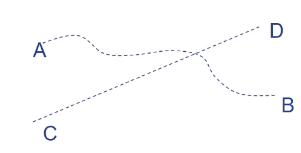

March 23, 2020

## SE-213

> SOFTWARE_TESTING.NOTES

### Outline

#### Review

上节课讲的是软件测试的数学基础。主要用于测试用例的分析。

注意，关于图论部分的知识一定要掌握。后面做白盒测试的时候会用到。

#### Today

今天的主要内容是 Functional Test。

不，这个不是函数测试。是「功能性测试 」的。

内容主要包括

* 边界值测试
* 等价类测试
* 决策表测试
* 测试的效率

### Functional Test

> 功能测试——黑盒测试的一种。

#### Boundaries Testing

首先，定义区域才能先定义边界。

那么，我们对每个边界上的最小值、略高于最小值、正常值、略低于最大值、最大值都进行一个测试。

> 单缺陷假设：大部分的软件失效都是由一处缺陷、一个错误引发的，而不是由多重错误共同作用的结果。

#### Robustness Testing

健壮性测试：程序抵御无效测试的能力。

除了上面的边界值，还需要加入两个无效输入：「略小于最小值」和「略大于最大值」。

#### Worst Cases Testing

最坏情况测试：拒绝单缺陷假设，考虑全部边界输入的组合。

把各个变量输入的笛卡尔积作为输入提供进来。

这样的话，$N$ 个变量大概可以形成 $5^N$ 个测试用例。

#### Random Testing

为了避免人为因素的偏差，干脆由计算机随机生成测试输入，避免了人为的测试偏见。

保证每一类输出至少有一个。

#### Equivalence Partition Testing

等价类测试。

把我们的测试区域划分成互不相交的一组子集，然后在其中每个类独立进行测试。

只要所有子集的并集是全集，那就没问题。

##### Weak

弱一般等价类（单缺陷假设）

##### Strong

强一般等价类（多缺陷假设）

## SE-340

> ...and here's our HCI.

### Outline

* 人的生理和心理特性。

	这是 HCI 设计过程中必须符合的。否则这就不是给人用的。

* 人的认知过程

	* 意义
	* 信息处理过程
	* 信息量计算
	* 感觉的信息处理
	* 中枢的信息处理
	* 认知
	* 记忆

* 人的认知模式

	* 格式塔心理学
	* 错觉
	* 记忆对认知的干扰

* HCI 设计

	* 如何设计出符合人心理的 HCI？

### Human Cognition Process

这部分是认知心理学主要关注的内容。

#### Contents

##### How

* 人如何感知世界的信息
* 信息如何表征、并转化为知识
* 信息如何存储
* 知识怎样指导人的注意力和行为
* 语言的组织
* 情绪的产生

##### Why

* 指导 HCI 设计
* 便于认知识别
* 便于记忆、防止出错、提高效率

#### Human System

人，说到底，就是一个有限容量的信息处理系统。

##### Process

信息处理系统的过程如下：

* 刺激从外界传递
* 由感觉系统感觉
* 由转能系统转换
* 产生感觉、感知
* 存储并成为记忆

另外，感觉检测、感知存储和先前的记忆会共同作用，决定人的《反应》。

##### Reaction

衡量一个人的反应力，可以从三个方面着手：

* 感知速度
* 认知正确率
* 记忆形成

##### Biological

上面的系统描述是很粗糙的简化模型。

生物学上的系统结构是这样的：

认知过程从左到右按照箭头顺序被处理。

###### Environment

物理环境是人所生存的环境，也是认知过程的源泉、感官刺激的来源。

###### Cognitive Subsystem

感觉子系统。主要功能是接受外部环境的刺激，并且将其转化为低级神经信号。

###### Info-Processing Subsystem

信息处理子系统。在收到感觉子系统发来的神经信号之后，会对其进行识别理解，并采取相应决策。

是整个认知过程的核心子系统。

###### Reaction Subsystem

反应子系统。会根据信息处理子系统的决策，从而产生反馈。调控人体多个输出系统，包括手脚、姿势、语言等系统。

###### Storage Subsystem

贮存子系统负责记忆相关功能。由信息处理子系统读写，并调控感觉和反应子系统。

#### Info Amount

信息量的计算。

> 这又开始聊信息论了吗…

##### Definition

客观世界的所有事物通过物质载体所发出的一切可传递与感知的知识内容。

##### Units

1 个「比特」（bit），就是可以用于区分 1 个「真与假」的信息单位。

8 个比特（8 bits）组成 1 个字节（1 Byte）。

这是两种很常用的衡量信息量的单位。

##### Calculation

###### Single Info Amount

某个信号源含有 $n$ 种状态。第 $i$ 种状态出现的概率是 $p_i$。那么第 $i$ 种信息的信息量就是
$$
H_i = \log_2{\dfrac 1 {p_i}} = - \log_2{p_i}
$$

> 单位是比特。
>
> 留意到，$p_i$ 显然是小于等于 $1$ 大于 $0$ 的，因此 $-\log_2{p_i}$ 一定是非负的。
>
> 也就是，信息量一定是非负的。

###### Average Info Amount

那么，这个信号源不同状态下的平均信息量就是
$$
H = - \sum_{i = 1}^{n}p_i \log _2 {p_i}
$$

> 单位是比特。

例如，对于一个 $n = 2$ 的信号源（二元信号源）来说，出现状态 I 的概率是 $P$，显然出现状态 II 的概率就是 $1 - P$。

根据上面的公式，该信号源的信息量是
$$
H = -P \times \log_2P - (1 - P) \times \log_2{(1-P)}
$$
假如两种状态的出现概率相等，也就是 $P = \dfrac 1 2$ 的话，代入公式可以求出
$$
H = - \log _ 2 {\dfrac 1 2} = 1
$$
也就是 $1$ 比特。

> 容易证明，在 $P = 1 - P$ 时，$H$ 最大。

###### Generalization

根据上面关于二元信号源的讨论，我们可以很容易得出 $n$ 元信号源的状况。

对于一个 $n$ 元信号源、且信号 $i$（$i \in \Z \and i \in [1, n]$） 出现概率为 $P_i$（$P_i \in [0, 1]$）。那么所有信号的平均信息量为
$$
H = \dfrac {-n P_1 \log _ 2 {P_1} - n P_2 \log _ 2 {P_2} - \dots - n P_n \log _2 {P_n}} n
$$
上下约去 $n$ 可得
$$
H = - \sum _{i = 1} ^n P_i \log_2{P_i}
$$
由于 $\sum _{i = 1} ^ n P_i = 1$，因此由几何均值不等式可知，在 $P_i = \dfrac 1 n$ 对所有 $i$ 恒成立的情况下，$H$ 最大。

最大值就是 $H_{\max} = \sum _{i = 1} ^ n \times \dfrac {\log_2n} n = \log_2n$。

#### Response Latency

人和计算机在处理信息的时候…都是有延迟的。

而且众所周知，人的延迟比计算机还大。

##### Human's Latency

* 采样延迟时间
	* 例如，人眼视觉暂留时间大约在 $0.1$ 秒到 $0.4$ 秒之间。
	*  在这段时间内出现的新视觉变化会延迟产生刺激。
	* 实际分析中基本是常数。
* 信息传输时间
	* 在人体内的神经信号都以生物电的形式传输。
	* 因此，这里的传输延迟是相当低的。
	* 根据互联网数据，神经信号的传播速度大约在 $100$ 米/秒和 $150$ 米/秒之间。
	* 实际分析中基本是常数。
* 信息解码时间
	* 在神经信号传入神经中枢子系统之后，中枢需要一定时间来解码信息。
	* 这一时间和传入信息的种类和信息量正相关。不是一个常数。

将采样延迟时间记为 $S_t$、信息传输时间记为 $T_t$、信息解码时间记为 $D_t$、传入的信息量记为 $A_i$，那么总反应时间可以写成
$$
R_t = S_t + T_t + D_t = S_t + T_t + k \times A_i
$$
由于 $S_t$、$T_t$ 均为常数，所以反应时间可以写成
$$
R_t = b + k \times A_i
$$
可以看出，人对信息的反应时间和传入的信息量 $A_i$ 构成一次函数关系。

##### Sampling Frequency

采样延迟时间。人的输入设备，也就是所谓的「五感」，获得输入的方式和计算机中的「轮询机制」类似：以一定的频率向神经中枢发出刺激。

显然，发射「刺激」的频率越高，也就是「采样频率」越高，采样周期就越短；对于突发刺激的响应就越快。

实际的采样频率和人的专注力和环境的噪音干扰有关。

人体各种感官的采样频率差异很大。上面提到的「视觉」的采样频率不低于 $5$ Hz；而人体皮肤的温度感觉器的采样频率有时会低于 $1$ Hz。

##### Information Transporting

定义 $C = \dfrac H T$ 为信息的平均传输速率。

其中 $H$ 是传输的信息量，而 $T$ 为信息传输的时间。

##### Information Decoding

人的信息解码速度和信息类型、信息量、个人的熟练度、以及先验记忆存在与否都是有关系的。

#### Central Information Processing

人的大脑皮层能力实际上很有限，仅仅包括：

* 识别
* 决策
* 记忆
* 情绪

然而，记忆这一项能做到的事情就已经十分丰富了。

##### Template Matching Theory

可以把「记忆」理解成 Template Matching。

从生活经验中提炼出模板，将其储存在记忆里，然后就能够借此来快速解决未知的问题了。

> 这种学说的问题是，无法解释人类能解决如此多的问题，而这些问题不足以放在记忆里。

##### Recognize Feature Theory

* 刺激是一些基本特征的结合体
* 特征可被分解、组合
* 将对象的基本特征和记忆相匹配，从而进行识别

将经验抽象为「特征」的组合，就可以用较少的记忆容量来保存刺激了。

#### Memories

记忆，记忆…

##### Immediate Memory

瞬时记忆，或者称为感觉记忆、感觉登记。

持续时间极短，存储时间一般在 $0.25$ 秒到 $2$ 秒之间。

##### Short-Time Memory

短时记忆，或者称为操作记忆。

持续时间不超过 $1$ 分钟。

##### Long-Time Memory

长时记忆，或者称为记忆曲线。

这是可以长时间保存的记忆。

> 梦回中学

#### Cognition Modal

人的认知模式。我们这里采用格式塔（Gestalt）心理学说。

##### 5 Principles

* 接近性原则
	* 
* 相似性原则
	* 
* 连续性原则
	* 
* 完整和闭合型原则
	* 
* 对称性原则
	* 

> 灵魂绘图

##### Illusion

也就是…错觉。

人对客观事物不正确的直觉（False Negative 和 False Positive 都算）。

引发原因很多，包括：

* 环境光照不适宜
* 对象及环境颜色干扰
* 对象自身部分相互作用
* 透视效果错觉
* 心理状态不稳定

有一些人类共有的视错觉效果，被提炼出来命了名：

> Muller's Illusion

> Fick's Illusion

> ……小学生科学书既视感

##### Memory Interruption

记忆对于认知是有干扰的；并不总是对「认知」起正向作用。

例如，对于「汉字」根深蒂固的记忆就影响了色彩的辨认。

这种现象称为「先学干扰」——先学习的事物阻碍了后学事物的学习。

### Design Principles

在我们了解了那么多人类认知心理的知识之后，我们就能够以此为支点，提出「HCI」设计的准则了。

#### Principles

##### Recognizable

一定要便于人快速地、正确地识别。

##### Memory-Friendly

便于学习、记忆。

##### Fault Tolerance

避免用户犯错、并且宽宥用户的犯错。

#### Visual Design

#### Memory Design

> That's it.

### Q&A

* Q: 为何对于一个信号源来说，在其所有可能出现状态的几率相等的时候，其最终的平均信号量最大？

* A: 首先从数学角度分析。几率为 $P_i$ 状态的出现，包含着 $P_i \times \log_2{\dfrac 1 {P_i}}$ 的信息量。那么，所有状态的信息量和应该是

* $$
	H = \dfrac {-n P_1 \log _ 2 {P_1} - n P_2 \log _ 2 {P_2} - \dots - n P_n \log _2 {P_n}} n
	$$

	也就是 $H = - \sum _{i = 1} ^n P_i \log_2{P_i}$。根据均值不等式，在 $P_i$ 全等的情况下，$H$ 最大。这是数学上的表述。

	从信息论的角度来说，出现概率越高的状态，所揭示的信息越少。反过来，出现概率恒定为 $1$ 的信号虽然总是发生，但是毫无信息量。

	出现概率很低的信号一旦发生，就会带来很大的信息量，也就是 $\log_2{\dfrac 1 {P_i}}$ 很大。然而碍于因数 $P_i$ 很小，也就是几乎不会发生，因此平均信息量也很低。

	所以，只有在「出现概率」和「出现之后带来的信息量」都适中时，才有最高的平均信息量。

	这就是上面的情况了。

	

	