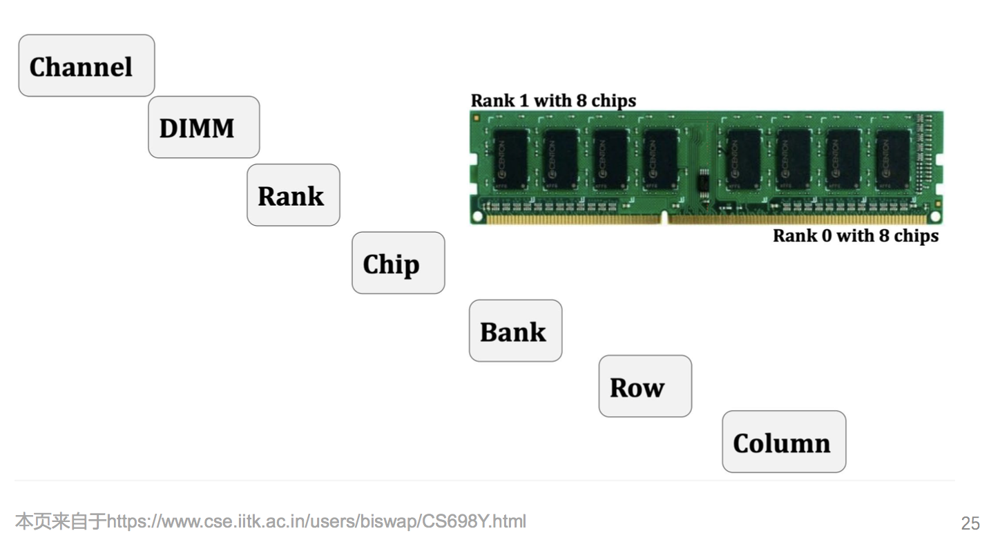

# March 24, 2020

## SE-315

> OH-MY-OS

### Review

上节课我们讲到的是 Virtual Memory 抽象、VMA => PMA 的转换、以及 TLB 这个旁路加速器。

TLB 是我们这节课要讲的重点。

### TLB

#### TLB Flush

##### Why?

刷新？因为每个进程，包括内核都有自己独立的地址映射。

因此一旦要切换进程、或者在用户态和内核态之间切换，页表就会被全部刷新。TLB 这个缓存也必须刷新。

##### ARM vs. AMD64

AArch64 里，为了解决内核态和应用态切换频繁刷新 TLB，干脆把内核态和用户态的页表基地址分开，分别放在 `TTBR0_EL1` 和 `TTBR1_EL1` 里。

这样，进行系统调用的时候就不用切换页表了。自动按照特权等级分调不同的页表。

反观 x86_64，只有唯一一个页表基地址寄存器 `CR3`，无法支持双页表；因此，将内核映射到应用页表的高地址部分，以免每次都要进行系统调用都得换页表；那就太亏了。

##### Instructions

怎么刷新 TLB 呢？

```assembly
TLBI VMALLEL1IS
; 清空全部 TLB

TLBI ASIDE1IS
; 清空指定 ASID 相关的

TLBI VAE1IS
; 清空指定的虚拟地址
```

> 不详细介绍了。

#### Reduce Cost

降低 TLB 刷新的开销…有什么办法吗？

* 为不同的页表打 Tag
	* 给 TLB 缓存的 Entry 加上区分各个页表的 Tag，这样切换页表就不需要 Flush TLB 也不会产生混淆了。
* `x86_64` 提出的 PCID
	* PCID 存储 `CR3` 的低 12 位
	* 一共可以有 $2^{12} = 4096$ 个 PCID
	* 作为每个进程页表的独立 ID，基本足够了

* KPTI，Kernel Page Table Isolation。
	* 即内核和应用不共享页表。这项仓促上马的功能是为了应对 Meltdown 攻击。
	* 在应用了 KPTI 之后，内核态应用态切换的时候就不得不刷新全部 TLB；大大影响性能。
	* 好在，如果我们有 PCID 来区分不同进程，我们就可以选择性地刷掉 Entry，不会太影响性能。
* AArch64 提出的 ASID
	* 跟 PCID 类似，也是为了区分进程（或者说区分页表）提出的概念。
	* OS 给每个进程分配 8 位或 16 位的 ASID，将其填写在 `TTBR0_EL1` 的高位
	* 可以通过调整 `TCR_EL1[36]` 的值来切换 8 位 ASID  和 16 位 ASID。

#### Go Multi-Processor

##### Hardware Implementation

注意到，CPU 的每个核都是有自己的 TLB 的。

使用了 ASID（或者说，PCID）之后，切换页表可以不刷新 TLB 了。

但是，修改页表映射之后，还是需要刷新 TLB。

##### Questions

刷新这个问题就出来了：

* 需要刷新其他核的 TLB 吗？
* 怎么知道需要刷新哪些核？
* 怎么刷新其他核？

Think:

* 刷新还是要刷新的。
* 但是，只需要刷新那些「含有当前 ASID 的 Cache Entry」就好了。
* 假如机器上没有任何一个进程跨 CPU 核心运行，那就完全不需要刷新其他核。

##### Implementation

怎么实现这个刷新？

`x86_64` 下，发送 `IPI` 中断可以迫使其刷新 TLB；

AArch64 下，直接在当前核上跑指令 `TLBI ASIDE1IS ` 就能直接刷掉其他核心的 TLB。

#### Implementation

##### Hierarchy, Again

虽说我们上面提到的 TLB 看起来简单而又明了（就一个简单的 Cache 而已），但实际上 TLB 的设计现在多采用分级结构。


主要原因是为了降低最常用页的访问时延。

因为页表映射这项工作不仅是具有 Locality，而且具有十分集中的 Locality。

一般的程序究其一生也不过访问几张页表而已。如果用一个很扁的 Cache Line，访问时延就会很大很大。这是不可接受的。

##### nG-Bits

TLB 的第三级…才是我们的页表映射 Entry。


 `nG` 位可以决定其是否是对所有进程有效的。

### Over-commit

物理内存的超售、按需分配。

#### Example

比如，很多同学在搞科学计算的时候，可能会写出这种代码：

```
malloc(1000000000);

/* 10 0000 0000 Bytes
 * is approximately
 * 10 GiB */
```

但是有可能他完全用不完这么大块的内存；又甚至根本没有这么多物理内存可用。

#### Over-commit

OS 内核的内存管理器有个叫做「超售」的机制，主要是为了应对下面两种情况：

* 一个应用程序申请预先分配足够大的（虚拟）内存
* 实际上其中大部分的虚拟页最终都不会用到

#### Implementation

因此，我们在该同学请求 10 GiB 内存的时候，只去分配其在虚拟空间中的内存段，却不着急生成对应页表将其映射到物理内存。

这样，用户一旦开始访问这段内存中被「懒分配」的页，就会因为页表不全而找不到对应的页，从而触发一个缺页异常。这个异常的处理函数会临时地把这个页从慢速缓存中（例如，磁盘上的 Swap 分区或 Flash 中）读出来，构建出页表，然后再告诉用户成功的消息。

> 陷入异常的耗时就不说了。磁盘的读写速度，那真的是很慢。
>
> 所以，一旦发生缺页异常，耗时绝不是一星半点。
>
> 这也就是为什么在物理内存将满的时候，电脑速度会变得很慢：全跟那儿处理缺页去了。
>
> 这种问题被称为 Thrashing Problem。
>
> 

#### Page Evict Strategy

物理页是有限的。根据上面的提法，物理页可以相当于 App 和 Swap Disk 之间的一层缓存；只不过这个缓存相当大就是了。

那么问题来了：怎么确定这个缓存的逐出策略呢？换句话说，在物理页不够的情况下，该把哪些页给清除掉，换上新的页呢？

这和普通的 Cache Evict 策略不同；因为要考虑到每个进程访问的局部性。并且，如何高效地记录每页的使用情况也是个问题。

##### Random Replacement

大家凭运气随即替换.jpg

##### FIFO

先进先出策略

##### LRU

总是保留最近使用过的 Page

##### Clock Algorithm

时钟算法：高效的接近 LRU 的算法。

> 这些都不行。看下面的 WSM。

#### Working Set Model

工作集模型。

##### Definition

一个进程在时间 $t$ 内的工作集 $W(t, x)$ 定义为：

* 其在时间段 $(t - x, t)$ 内使用的内存页集合；
* 也被视为其在未来 $t$ 时间内（时间段 $(t, t + x)$）会访问的页集合；
* 如果希望进程能够顺利进展，需要保证这个集合保持在内存中。

规则：All or Nothing。要么进程工作集都放在内存中，要么干脆都换出内存。放一半在内存里是没有意义的。

这样做可以避免 Thrashing，提高系统整体性能表现。

##### Tracking

怎么追踪一张物理页是否在「工作集」里呢？


### Memory



#### Abstraction

为操作系统提供了非常易用的物理内存抽象。

#### Buddy System

##### Graph


* Buddy System 可以方便地找到自己的「伙伴」是谁。
* 因为两个 Buddy Block 的物理地址只有 1 位不一样。块的大小决定了是哪一位。

#### Linux Impl.

Linux 的分配器家族都基于伙伴系统：

* SLAB Allocator
* SLUB Allocator
* SLOB Allocator

伙伴系统中，分配的最小单元是一个物理页。一般是 4 KiB 大小。

##### SLAB

目标：快速分配小内存的对象。

##### SLUB

留意到：操作系统频繁分配的对象大小相对固定。

思想：

* 伙伴系统获得大块内存
* 进一步细分成固定大小的小块内存进行管理 
* 块大小通常是 $2^n$ 个字节(一般来说，$3 \le n \lt 12$)
* 可以额外增加特殊大小如 $198$ 字节从而减小内部碎片

#### Rowhammer Attack

Memory Controller 屏蔽了物理内存的细节…遗憾的是真实的访问还是基于 Row 物理结构的。

所以，极频繁地访问某一行会导致其相邻行的部分位产生跳变。

能够修改相邻行，就可以实现多种提权攻击。

