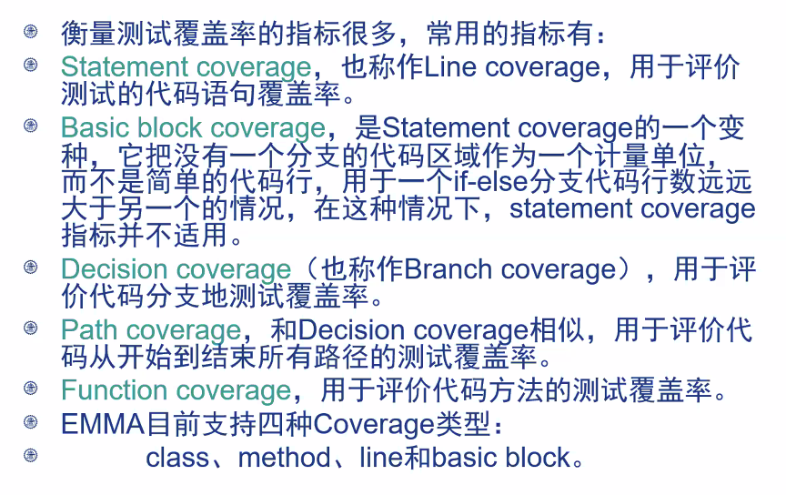
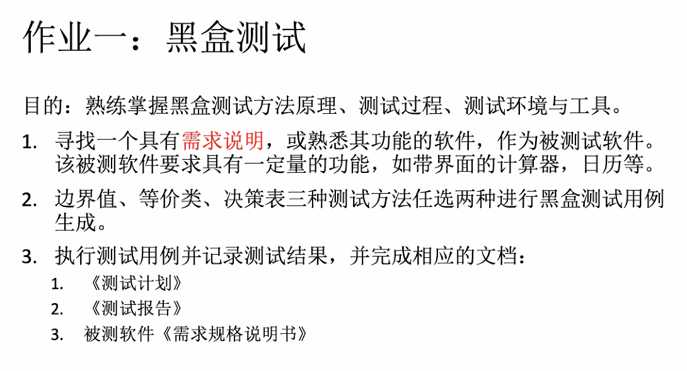
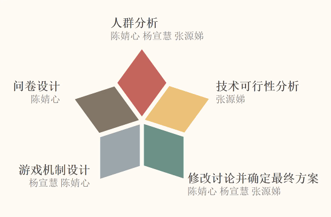
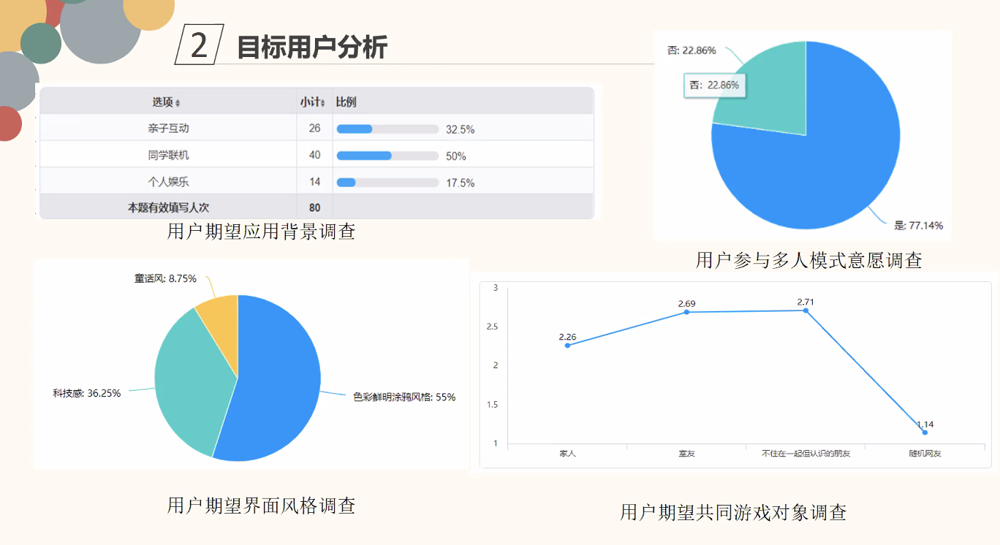

# March 30, 2020

## SE-213

> Software Testing

### Lab Environment

#### Outline

* Unit Test Environment & Tools
* Junit
* EMMA

#### Tools

* Java
* Eclipse
* JUnit
* EMMA

#### Java

要想使用，得先安装 JDK（Java Development Kit）。

JDK 有三个版本：

* SE（Standard Edition），标准版
* EE（Enterprise Edition），企业版
* ME（Micro Edition），阉割版

这里推荐下载 Java SE Development Kit `8u201`。

> 然而最新版本已经刷到 14 了…

#### Eclipse

一个很经典的 IDE。

> 当然也可以用超强的 IntelliJ IDEA 代替

#### JUnit

由 Erich 和 Kent 开发的 Java 测试插件。

几乎没必要独立安装——任何像样的 Java IDE 都会内置。

最新版本是 5（但其实版本区别并不大

#### Code Coverage

所谓「覆盖率」…

这是白盒测试下、能看到代码的情况下才能用的。

#### EMMA

EMMA 就是用来衡量 Java 软件覆盖率的软件。

支持衡量下面这些覆盖率：

EclEmma 是 Eclipse 的一个包。

#### Alternative: IntelliJ IDEA

相比于 Eclipse，更加 User-friendly 的 IDE。

内置 JUnit、测试覆盖率工具。

> 非常方便，和广告里说的一样

#### Mock

打桩——模拟对其他模块的调用，避免测试代码对外部代码干扰。

* Mockito
* PowerMock
* ……

#### Variation

变异测试——修改代码产生变异体，观察其测试结果，以便确认测试用例的充分性。

如 Pitest。

### Homework

> Software Testing 没有个人作业——全是团队作业。

## SE-340

> 当听众

### Group 1

> Chen Jingxin's

* 「手机版」墙来了

#### Background

疫情期间大家在家运动比较少，所以要用这种新鲜、娱乐的方式提供运动量

* 投屏到电视，适合家庭娱乐
* 前置摄像头捕捉肢体状态
  * 类似 Kinect

#### Interactions

* 支持单人游戏、双人合作、双人对战
  * 因为屏幕显示范围有限，没有更高难度的
* 有难度梯度区分
* 设计关卡的时候，考虑人的关节运动范围，不设计做不出来的动作
  * 防止乐极生悲

#### Techniques

OpenPose + Unity + OpenCV + Caffe

> Demo 什么的都是现成的

### Group 2

> Sun Liangchen's

物资捐赠系统

#### Bad Apps

现在的捐赠系统大多都不透明、门槛高、而且难用。

#### Unsolved Problems

似乎并没有怎么解决现在的问题…以自己的力量很难解决现在的透明化、公开化问题。

且做到信息公开透明需要和受捐人、慈善管理平台做深度融合，恐怕很难做。

### Group 3

N/A

### Group 4

疫情期间外出 App

#### Features

* 导航地图 App 提供的
  * 人口迁入迁出热力图
  * 疫情临时卡点提醒
  * 路线设计

#### His Features

* 实时疫情地图
  * 可视化每个 Map Chunk 的危险程度
* 出行路线推荐
  * 推荐那些人不多、不拥挤的路线

> 要求的特权等级太高。
>
> 危险区块的划分、危险等级评级很难客观反映实际情况。

### Group 5

> 健身私教
>
> Zhou Yifan's

* 面向 18-45 岁妇女
* 现在全民健身
  * 但是很多人没有私教
  * Keep 之类的 App 没有办法指导健身方式
* 用手机扫描人体来判断其是否达到了训练目的
* Tech
  * 还是基于 OpenPose
  * 以及 TTS 是用百度 AI 的 API
    * 这跟 AI 有个锤子关系

> 问题：希望健身的人中，有很大一部分都体重超标。对于那些非典型比例的体形，OpenPose 的效果能否保证？

### Group 6

> Chen Peidong's

> 仰卧起坐纠错 App（aka. Group 5 青春版）

* Target
  * 那些不爱强力运动又想运动的人
  * 轻度健身爱好者
  * ~~中考体育应届考生~~

* Tech
  * 通过摄像头采集肢体数据
  * Python
  * OpenCV
  * OpenPose（又是你）
  * TTS：iFLY SDK
    * 语音播报，比较人性化

* Features
  * 能确认你的仰卧起坐是否标准
  * 还能帮你数数数
  * （要是能帮我按着脚就好了
  * （要是有人帮我按脚
  * （那不就有人帮我数数
  * （帮我看我的姿势标不标准了
  * （也不用把手机放旁边了

