# March 31, 2020

## SE-315

> 进程管理

### Outline

上节课讲完了内存管理及其相关知识。

今天我们开始聊「进程」。

### Process

单任务到多任务转换过程的产物。

#### Traditional

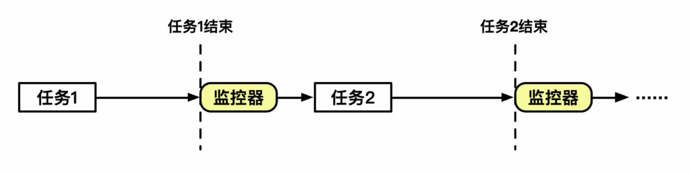

早期计算机都是一次做一件事情的，而且是一整件。

任务排队轮流处理。唯有一个任务完成了，才会转交控制权到下一个任务。

#### Time-Sharing

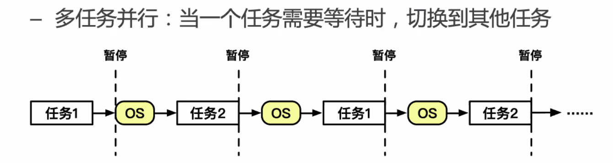

每一个「任务」轮流执行，每次执行的时间片短。

> 看起来很费事，但却可以保证一个耗时任务不会卡死整个任务伫列。

#### Abstraction

把每个任务抽象出来，就把它叫做一个「抽象」。

为了保证每个独立任务在进程切换前后仍然能正常运行，我们需要储存并且恢复哪些东西？

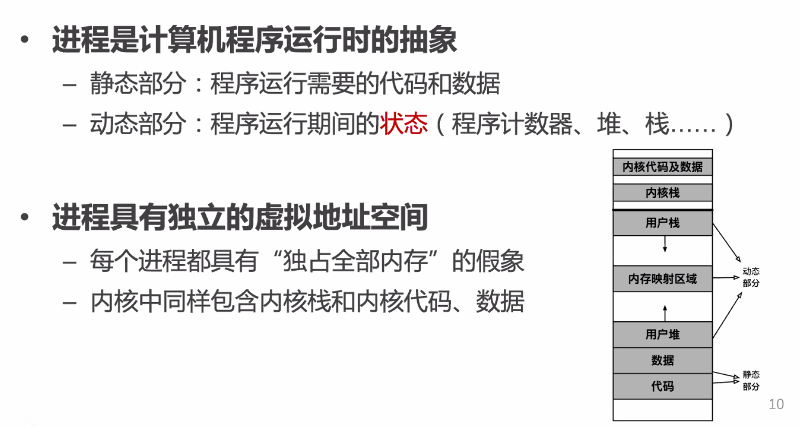

注意到，正是因为有了上节课的「内存隔离」，我们才有可能做到进程隔离——让每个 App 都认为在这台计算机上，自己独占所有的 CPU 时间和用户态内存空间。

### Properties

> 进程的一些属性

#### States

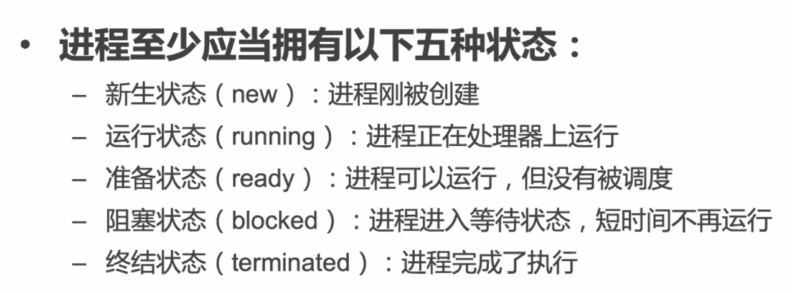

> ICS 里学到还有一个 Zombie 状态——已经结束执行了，但还没有被回收的状态。

状态机是这样的：

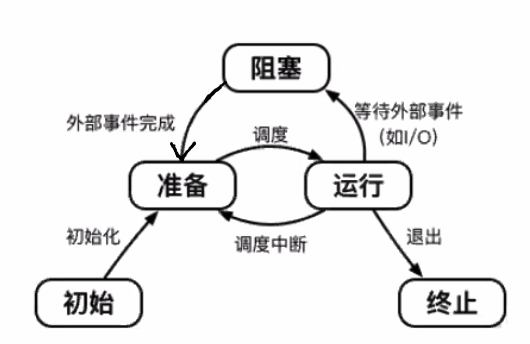

#### PCB

Process Control Block，也就是在切换进程上下文的时候需要保存的进程属性。

> 也可以是「印刷电路板」（不是

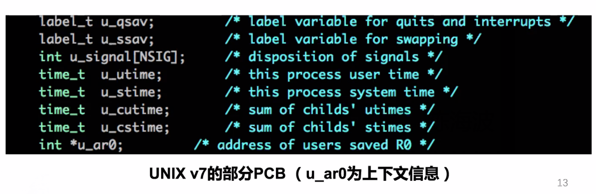

#### Context Switch

要切换上下文，我们需要做哪些事情？

* 进程在连续执行一段时间后，遭到中断，陷入内核
* ……OS 干活……
* OS 主动回到用户态，将控制权交予另一个进程

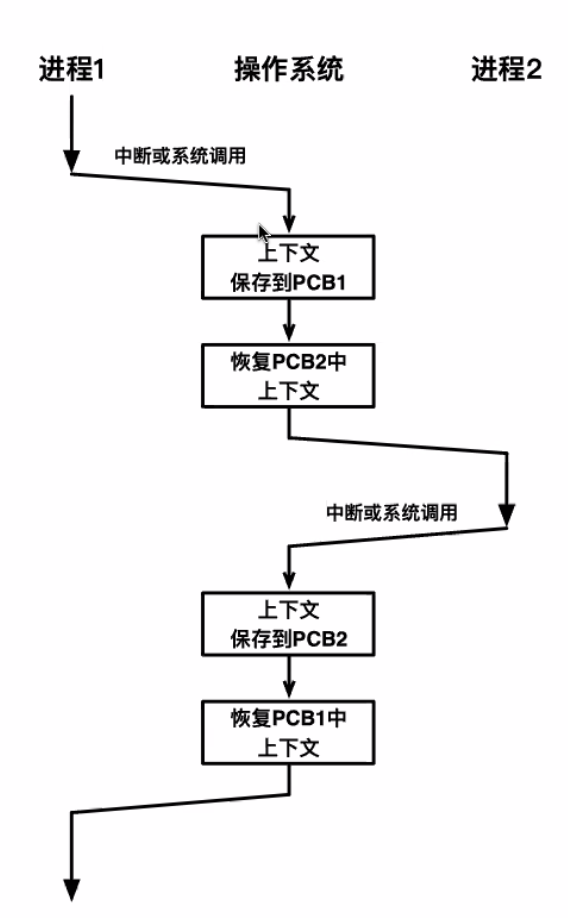

在此期间，OS 做的事情主要是打扫屋子，处理上下文。

#### Interfaces

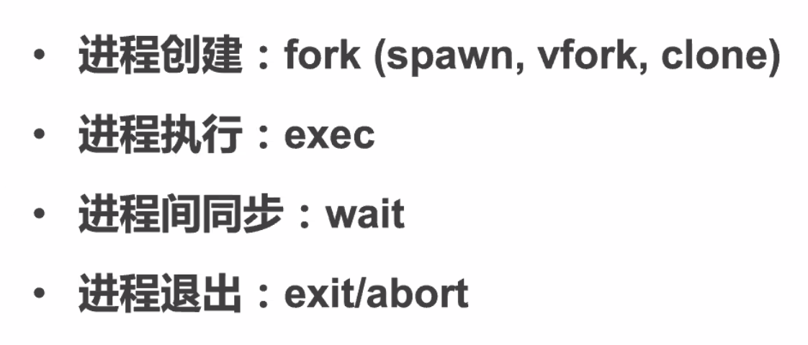

这都是 Linux 提供的、方便的系统接口。

##### `fork`

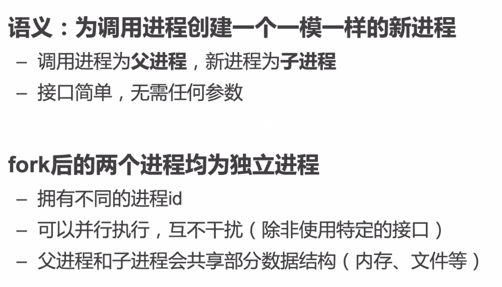

> 假如没有内存隔离，那么这两个「一模一样」的新进程就无法隔离——他们的代码是完全一致的。

> 注意，在 `fork` 之前打开的文件句柄，是被父子进程共享的。而 `fork` 之后的文件句柄是不共享的。
>
> 考虑 `fopen` 被执行了几次。

> `fork` 函数引入了进程组的概念，构成了树结构。

##### `exec`

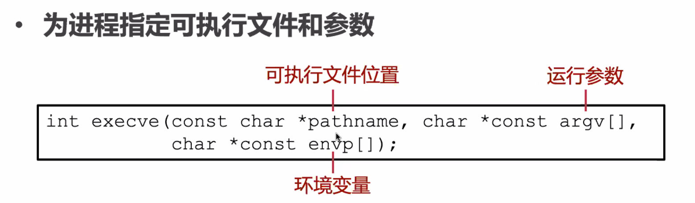

载入指定的可执行文件，并且把它当作自己继续运行。

在执行 `execve` 之前，这个进程的所有栈、信息全部会被清除。

因此 `execve` 如果成功，就绝不会返回。如果返回了，就一定是失败了。

##### `vfork`

好在 `fork` 后来有了「Copy on Write」的实现，使得 Fork 时不需要拷贝整个地址空间。

##### `posix_spawn`

相当于 `fork` + `exec`：先把自己拷贝一份，然后把新产生的那个进程用 `exec` 的结果替换。

从结果论，就是开始了一个新的子进程。

写 Shell 的时候应该有印象吧。

##### `clone`

类似于 Fork，但是可以选择性地拷贝内存。

比较复杂就是了。

### Thread

线程——更加轻量级地运行时抽象。

#### Shared

只有「寄存器」和「栈」是不共享的。除此之外，同一个进程内的所有线程，都是不隔离的。

所以多线程才能做到并行计算。

#### Stack Only?

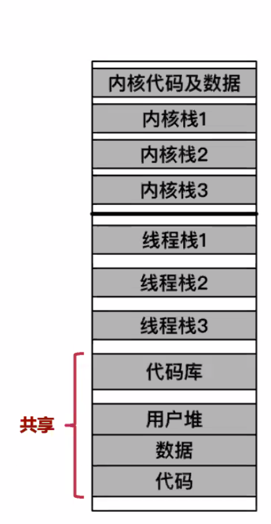

注意，整个内存空间还是共享的。

只不过，寄存器不共享意味着每个线程都可以有自己的 `%rbp` 和 `%rsp`，所以就可以对应到不同的线程栈上。

#### Thread Model

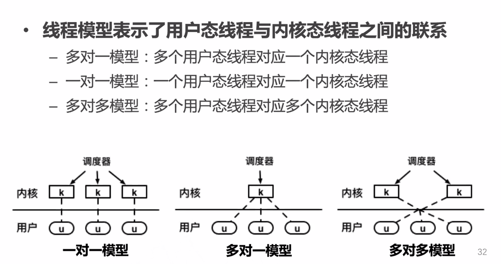

#### Interfaces

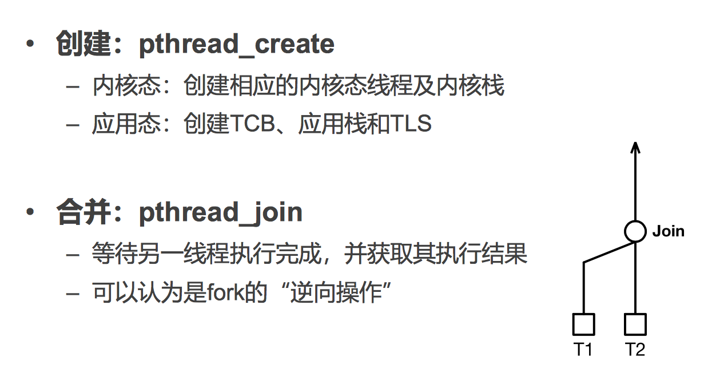

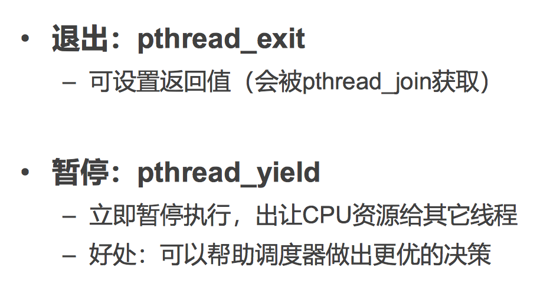

### TLS

> Thread Local Storage

#### Problems

* 不同线程可能执行相同的代码
	* 因为线程地址空间是共享的，多线程共享代码段
* 但是对于全局变量，不同的线程可能需要不同的拷贝
	* 比如系统调用错误的标识变量 `errno`

#### Implementation

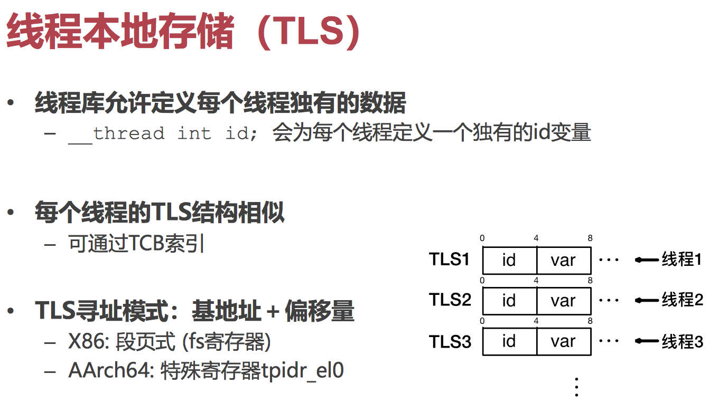

### ChCore's

#### Context Switching

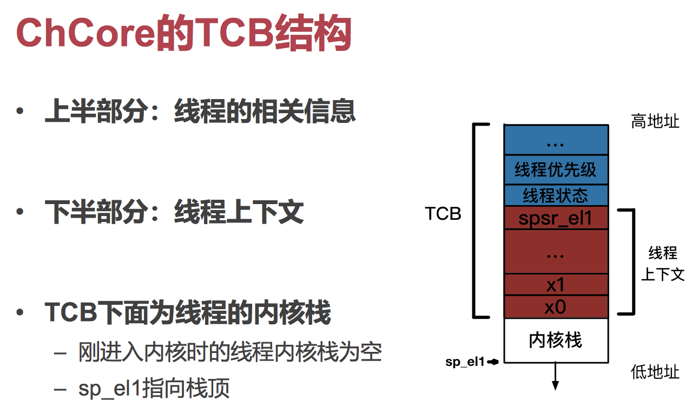

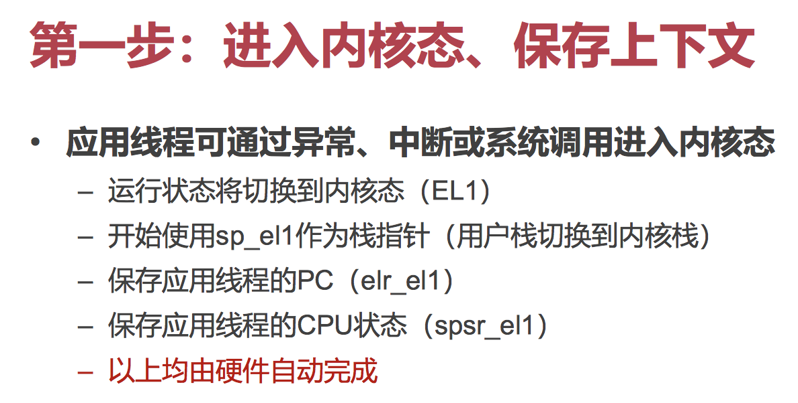

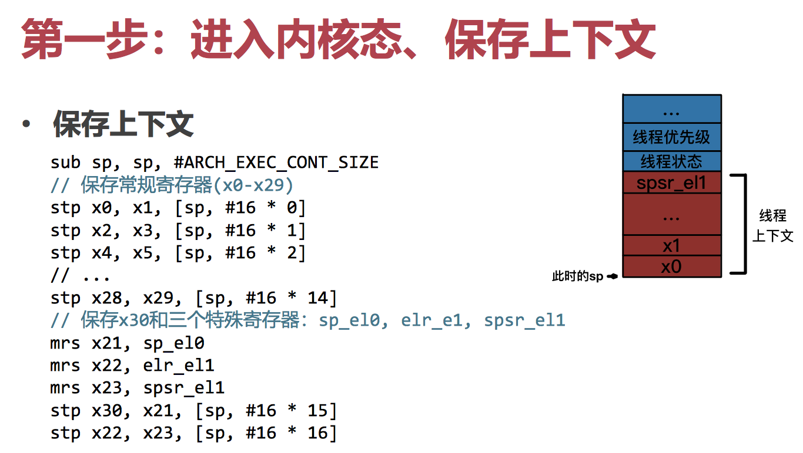

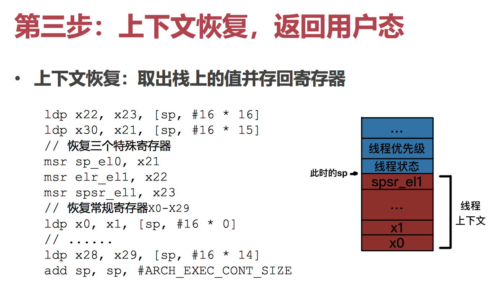

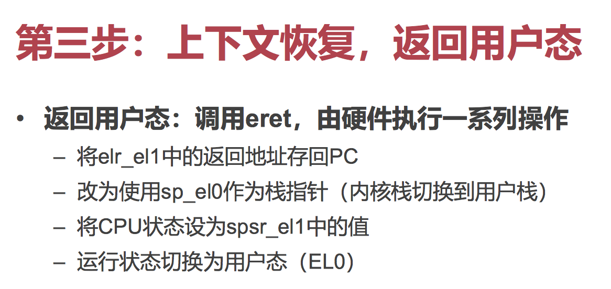

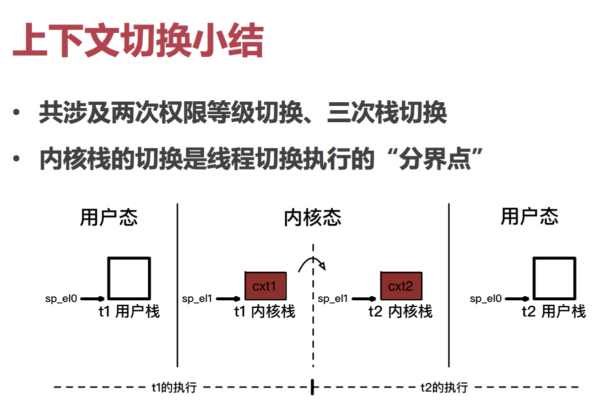

### CoRoutines

高级编程语言所提供的抽象。可以翻译成「协程」。

