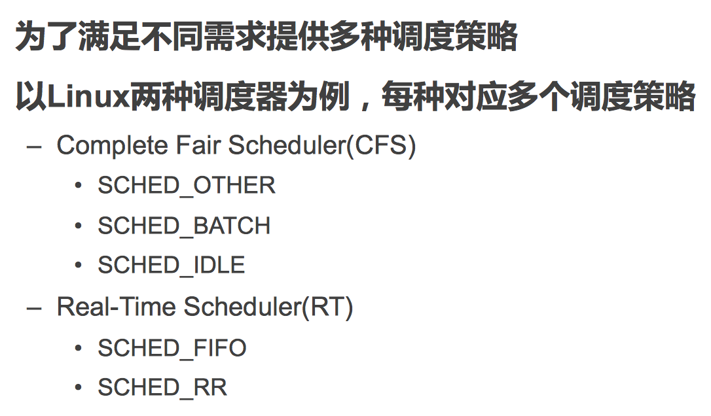
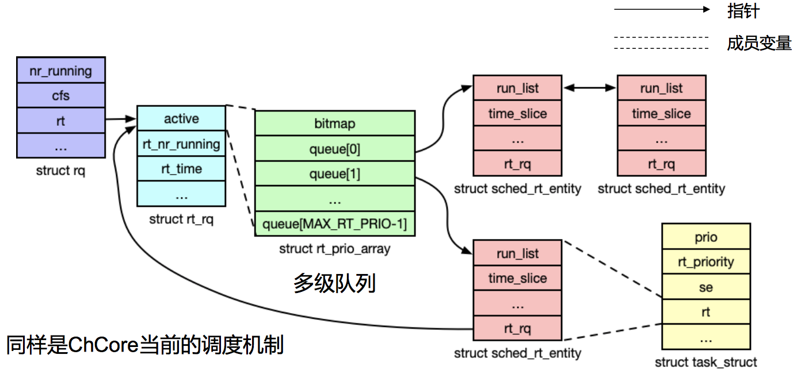

# April 2, 2020

## SE-315

`oh-my-os`

### Review

* 进程（除了句柄以外都不共享）
* 线程（除了寄存器和栈以外都共享）
* 纤程（都在用户态跑，切换不进入内核）

### Scheduling

> 系统中运行的任务数量要比物理核心的数量多得多。
>
> 处理器该怎么做？只能分时——在不同的时间分别处理不同的任务。

需要一个调度器，给 CPU 安排工作。

时间轴上的表现是这样的：

#### Definition

调度：协调请求对于资源的使用。

每一时刻下都有许多的任务请求 CPU 时间资源——而调度器的任务就是把这些任务放入 CPU 中执行，也就是分配 CPU 时间资源。

#### Goal

不同场景下的调度器有不同的目标。

在 CPU 时间调度场景下，我们的目标是：

#### Challenges

* 不能预知未来的情况
	* 比如，在 CPU 调度场景中，我们不能预知每个程序会在多久内结束。
	* 在 Cache Line 策略中，我们不能预知每个值被访问的频率和顺序。
* 线程／任务之间有交互，可能影响彼此的执行流
* 取舍。调度开销／调度效果？优先级／公平性？能耗／性能？

### Linux Scheduling

#### General

#### CFS Run Queue

基于红黑树的一个调度策略。

#### RT Run Queue

基于优先级队列的。

> ChCore 用的就是这种策略喔。

### Strategies

> 这里提一些经典的调度策略。

#### FCFS

First Come, First Served。谁先到，谁能先得到服务。

最最直接的先到先得调度法。

#### SJF

Shortest Job First。所需时间越短的任务越先被调度。

#### Preemptive

每次任务执行一定时间后都被打断、切换到下一个任务，而不是一直执行直到完成。

通过一个定时触发的时钟来实现。

最常用的抢占式策略就是 Round Robin（时间片轮转）策略。

* Key Point：要决定一个适合的调度时间片长度。
* 时间片太长的话，可能导致 Starving，退化到 FCFS。
* 时间片太短的话，上下文切换浪费太多。

#### Prioritized

考虑到在实际的任务调度过程中，不同的任务具有不同的优先级。

上面的 RR 策略是完全公平的，无法体现优先级的差异。

这里有个典型的考虑优先级差异的调度策略 Multi-level Queue。

把所有的任务按照优先级分离成几个优先级队列，在集合内采用公平的 RR 策略调度；但优先在高优先级集合中进行调度，以此彰显高优先级。

### Realistic

#### Consider External Devices

考虑到在实际的情况中，任务不仅需要抢占 CPU 时间，还需要抢占外部的 I/O 设备。

相比于 CPU 时间这种资源，I/O 设备资源的特点是粗粒度，每次请求之间不能打断，且响应时间也比较长。

作为 OS Scheduler，怎么才能合理分配这两种资源呢？

#### Priority Evaluation

* 和 I/O 绑定的任务应该具有更高的优先级
	* 以免 I/O 老是闲置
* 用户手动设定的重要任务
	* 用户是上帝！
* 时延要求高的应用
* 等了好久运气不好没被调度的任务
	* 也是为了保证公平性

### Fairly Fair

公平共享调度。

#### Cloud Computing

在什么时候「公平」最重要呢？在那些云计算平台分配 CPU 资源的时候，公平相当重要。

如果存在相当程度的不公平，很可能会吃官司。

#### Ticket

这样，不管每个用户创建多少个任务，总体上他们占用的资源量是一样的。

#### Lottery Scheduling

> 碰运气调度法（不

> 看起来相当公平呢
>
> 不过，需要假定这里生成的是「真·随机数」，满足统计学规律上的均匀分布。

#### Stride Scheduling

> 步幅调度法

上面的 Lottery Scheduling 本质上还是碰运气。存在说「最高优先级」的任务一直不被调度的可能性。

不如我们直接把每个任务的权重取倒数，乘上一个常数之后称之为 Stride，让每一次执行的时间都和其权重挂钩。很自然。

#### Complete Fair

Linux 使用的 Complete Fair Scheduler。

用的就是类似 Stride Scheduling 的策略。

## Lab 3

来了来了…

主题：实现「用户进程」。

### Outline

### Scripts

* `make user` 用来生成用户态的程序。
	* 改了 `user` 目录之后需要再编译。
* `make run-x`
	* 运行用户程序。
* `make run-x-gdb`
	* 开启 `gdb` 服务器
* `make gdb`
	* 连接到上面的 `gdb` 服务器，并进行调试

注意！在编译 ChCore 的时候，所有的 Warning 都被当作 Error 了。（`-Werror` 开关）

但是在实现过程中可能 Warning 太多，不好您调试。写代码的时候可以暂时关掉这个开关。但是交作业之前一定要打开！

4 月 29 日截止。

### Target

* 在 ChCore 中运行第一个用户进程
* 熟悉 AArch64 下的异常处理流程
* 为 ChCore 添加异常处理、调度流程

#### Part A

#### Part B

#### Part C

