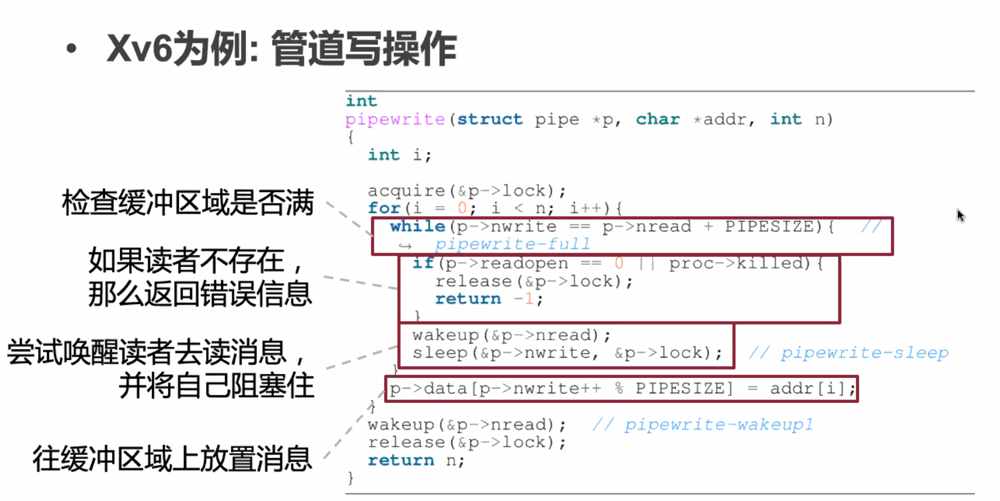

# April 7, 2020

## SE-315

就是，那个，IPC。跨进程的通信。

### IPC

#### Why?

进程之间并不是完全独立的；不同的程序可能需要交换信息、或是依赖功能类似的库。

假如进程之间是完全隔离的，那么就无法进行信息共享。

例如，移动端常用的数据库包 SQLite，几乎在每个 App 里都有一份拷贝。假如系统提供一个公共 SQLite 包，大家都去调用这个共享库，就能节约很多空间。

#### Definition

IPC（Inter-process Communication）。进程要想协作，必先能够通信。

对于用户态的程序来说，他甚至不能确定机器上还运行着那些程序。要想确认这一点，必须依赖全知全能的内核。


#### Implementation

##### Shared Memory

最简单的想法就是，通过操作页表，使得发送者和接收者能够访问同一块物理内存。

问题就是很难保证同步。

Sender 不能把还没被读取的数据覆盖掉；Receiver 也不能去拿还没写入的数据块。

这个加锁就能解决，同时 Sender 和 Receiver 写代码都要小心，否则很容易把对方弄挂。

第二个问题是接收方必须反复查询这块共享内存才能保证实时地接受到消息。

##### Messages


SM 最大的问题还是轮询。假如能有「消息」接口来实现消息传递，就不必让接收方反复检查缓冲区了。

不过，还是可能有阻塞的情况存在：假如缓冲区空了，那么接收方的 `receive()` 会阻塞；同样假如缓冲区满了，那么发送方的 `send()` 也会阻塞。

##### Problems

* 接收方老是不 `receive`，发送方的 `send` 因为缓冲区满了而阻塞 
* 希望同一个消息可以发给多个进程，这在多进程协同处理的情况下很有帮助
	* 提供「信箱」抽象，多个接收者共享信箱

##### Throttle or Not

发送者到底是等消息被确认（Receive）之后再进行进一步工作，还是只管发送，发完就走，不管发到没有呢？

这分别对应「同步通信」和「异步通信」。


还有一种妥协两种策略的 Timeout 方法。首先尽可能等待（保证同步）；而在超过一定时间後，就收回这条消息，等下次再发送。

##### Buffer Lost

为了减少内存开销，系统拒绝提供独立的消息缓冲区了。但如果我们有了「消息信箱」，缓冲区似乎也不是必要的了。


### Unix's Typical IPC

#### Pipe

管道：Unix 重大発明。

例如，非常常见的 `ls | grep <keyword>` 就是把 `ls` 的结果通过「管道」传递给 `grep` 进行正则匹配。

#### Features

* 单项通信，缓冲区满时就阻塞
* 管道（Pipe）有且仅有两个端口——一进一出
* 传输的数据是纯粹的字节流，不带类型
* 基于 Unix 的文件描述符使用


就是只能这么用。

#### Pipe Structure


#### Pipe Manip

* Write to Pipe



缓冲区是有限的。

* Read from Pipe


#### `sleep` & `wakeup`

Pipe 的实现依赖这两个重要接口。

是经典的 Wait & Notify 机制。

```c++
void sleep(void *chan, struct lock *lk) {
    // ...
    curproc->chan = chan;
    curproc->state = SLEEPING;
    release(lk);
    sched();
    // ...
}
```


调整 Channel 指针，并让自己休眠，放掉锁，然后调度到其他进程去。

> 注意 `sleep` 传入参数包括一个锁结构。`sleep` 在调度走之前会将此锁放掉；因为绝对不可以带锁睡觉。

```c++
void wakeup(void *chan) {
    // ...
    for (auto &p : ptable) {
        if (p->chan == chan && p->state == SLEEPING) {
            p->state = RUNNABLE
        }
    }
    // ...
}
```

> 把所有等待在 `chan` 上的进程都叫醒（设定为 RUNNABLE）

#### Pros & Cons

* 优点
	* 设计简单
	* 实现简单
	* 针对简单场景很有效
* 缺点
	* 缺少消息类型，需要由接受者进行解析
	* 缓冲区预先分配且大小不可变
	* 只能支持两个进程之间单向通信

### Message Queue

所谓「消息队列」。

以链表的方式进行组织。任何有权限的进程都可以访问、写入、读取这个公共队列。

更妙的是，每个消息节点都是有类型的！

> 虽然就是个整数…但是也够用啦！


>  由头节点设定队列的访问权限。


