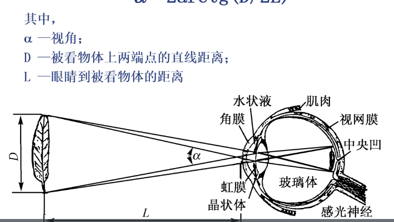
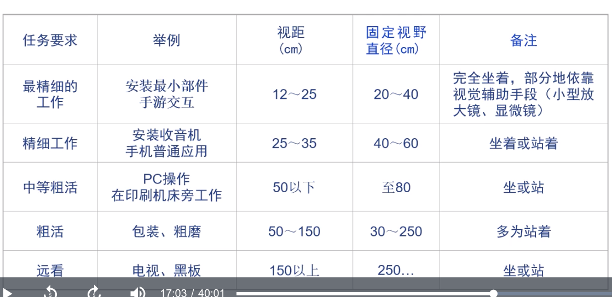
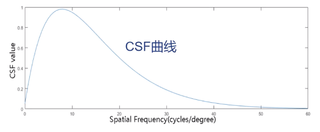

# April 13, 2020

## SE-213

所谓「软件测试」。

> 这节课好像没放课件？

> 还在讲 Chapter 5 - Functional Tests 1…

### Lecture 7: Structure Test

#### White Box

白盒测试。所谓的「百合」，和「黑盒」相对，是指测试人员对于软件内部的代码、详细信息是知情的。

这比「黑盒测试」就多了一些可以发挥的空间。

### DD Path Graph

DD，即 Decision to Decision。

程序流图可能是不唯一的、因人而异的——但是 DD 路径图一定是唯一的。

## SE-340

### Human Feelings

#### Reflex Arc

总的来说，人的「反射」活动是通过完全的电信号和化学信号在特定的反射弧中传递产生的。

「反射」并不总是意味着「Trigger」，即引发一个冲动；也可能是对冲动的抑制、减弱甚至停止。

#### Information Chain

上面各种各样的反射弧集合起来，得到的就是整个人体反应的信息链。

#### Percentage

可以看出，最常用的感觉通道是那些非自觉的感觉通道（听觉、视觉通道）。而那些需要额外动作才能发挥作用的通道（触觉、味觉通道）的使用率都很低。

> 梅拉比安说：人类全部的信息表达是 7% 的语言、38% 的声音和 55% 的肢体。

### Channels

#### Visual

视觉通道——最主要的、信息量最大的通道，应该首选这种通道。

适合的场景包括：

* 传递复杂的、抽象的信息
* 传递较长的、需要延迟的信息
* 传递的信息需要再次引用的
* 和空间方位有关的信息
* 不要求立即快速响应的信息

#### Auditory

听觉通道嘛，信息密度不高，而且记忆性差。

适合：

* 传递比较简单的信息
* 传递比较短的、无需延迟、一次性的信息
* 传递的信息和时间有关
* 传递要求立即快速响应的信息
* 和满载的视觉通道一起工作，作为辅助

#### Sense of Touch

* 传递非常简明的信息
  * 复杂了也传递不了
* 用于经常需要手持的、或和手有接触的装置
  * 因为手的触感相对敏感
* 其他感觉通道都满载了的情况

例如，手机、可穿戴手表的「Vibration」功能就利用了触觉通道。

#### Interchannels

感觉通道是可以交错的！

如果能将多种感知通道交互使用，就能强化信息传递的效果。

### Features

我们来考量一下人的生理、心理特性。

#### Visual

##### Fundamental

实际上，人的可视范围是很狭窄的。

就电磁波来说，我们能看到的是很窄的「可见光」部分。

光线进入人眼，照射到视杆细胞和视锥细胞上，产生神经冲动，传入大脑特定区域产生「视觉」。

信号传入大脑视觉区域之後，会被传递到大脑的特定半球进行处理，产生有意义的信息。

##### Functions

* 视角
  * 瞳孔中心到观察对象两端张开的角度
  * 
  * 根据 $\alpha = 2 \arctan \dfrac D {2L}$ 计算。
* 视力
  * 能清晰看到多远的物体？
  * 精确一点的定义，人眼能分辨的被观测物体的最近两点的视角。
  * 如果不能分辨这两点，那么就说这两点之间的距离超越了视力范围。
  * $V = \dfrac 1 {\Delta \alpha}$；视力就是临界视角（能分辨的最小视角）的倒数。
  * 他是眼睛分辨物体细微结构能力的生理尺度。
* 视野
  * 能看到多大范围的物体？
  * 视觉中心到视觉边界的空间范围，以角度表示。
  * 注意：人的眼睛的视野在静止时、注视时、运动时的视野是不同的。
  * 
  * 
  * 视野并不是正方形，也不是左右长、上下短的长方形。而是（就每只眼而言）是左右短、上下长的长方形。
  * 
* 视距
  * 能在多远的距离下看清物体？
  * 
  * 实际上，和需要的精度有关。
  * 越精确的工作需要越近的视距。
* 色觉、色视野
  * 能感知到颜色的区别吗？
  * 能感受到颜色的区域有多宽？
  * 实际上，人对于「颜色」的定义不仅由光线的波长决定；还和光线的强度有关。
  * 更奇怪的是，人眼的色彩识别和视野角度也有关系。称之为「色视野」。
  * 
  * 
* 对比敏感度
  * 目标和背景的亮度差有多大时，能够分辨出来这种不同？
  * 人眼刚刚能够辨别出前景背景差异时，这种最小亮度差称为「临界亮度差」。
  * 把「临界亮度差：此时的背景亮度」称为临界对比度。
  * 「临界对比度的倒数」称为对比敏感度。
  * $C_p = \dfrac {\Delta L_p} {L_p} = \dfrac {L_p - L_o} {L_p}$。
  * $S_c = \dfrac 1 {C_p}$。
  * 
  * 太亮或太暗的背景都会导致对比敏感度降低。
  * 此类敏感度也跟光照强度、物体尺寸、视觉距离、眼睛的适应情况、视觉疲劳、情绪等因素有关。
  * 理想情况下，视力好的人能够达到 $100$ 的对比敏感度。
* 视觉适应
  * 人眼会根据环境的亮度、对比度、色彩进行自我负反馈调节，使得信号刺激不至于太强。
  * 当然，这一过程会有延迟，在此之间人会感觉到不舒服。
  * 在进行人机界面设计的时候，一定要注意不要频繁地进行明暗调节。
  * 
* 中央视觉和周围视觉
  * 通常来说，人的视觉并不是完全均匀的。
  * 视觉中央的分辨率、敏感度很高；这部分视锥细胞分布密集。
  * 而视觉周围的敏感度就很低；这部分主要是视杆细胞。
* 立体视觉
  * 根据两只眼产生的视差效果重建出整个立体空间。
  * 双眼视物可以扩展水平视野（上面说到，单眼的水平视野很窄的）。
  * 可以不很精确地估计空间距离、
  * 准确地判断物体的远近关系、
  * 并感知物体相对位置关系。

##### Rules

视觉需要遵循生理规律。

* 动视觉疲劳程度
  * 水平运动相比垂直运动，更不容易疲倦。
* 视线变化习惯
  * 左到右、上到下、顺时针。
    * 我看这跟书写习惯有关系…
* 水平尺寸和比例的估计更准确。
* 直线轮廓估计优于曲线轮廓。
* 通常习惯于双眼视野。
* 颜色的敏感顺序
  * 红 > 绿 > 黄 > 白
* 颜色搭配敏感顺序
  * 黄底黑字 > 黑底白字 > 蓝底白字 > 白底黑字 > 白底红字
  * 
  * 
  * 
  * 
  * 

好像…都挺敏感的…

* 环境照度、最小可变角度、分辨颜色的关系

### Filtering

信息筛选是很重要的。

上面这么多感觉通道，而且其中视觉听觉是无法自己选择的——一旦睁开眼睛、张开耳朵，信息就会源源不断地传入大脑。

如果这些信息都不经过滤地进入大脑，那大脑也太累了。

其实，超过 $99\%$ 的信息都被丘脑过滤了，根本不会传入大脑。

大脑感兴趣的只有「陌生的信息」、「刺激性强的信息」。

所谓「久居蘭室，不聞其香；久居鮑室，不聞其臭」，就是这个道理。

