# April 14, 2020

## SE-315

> Would you like to build an OS kernel?

### 同步原语

#### Cores!

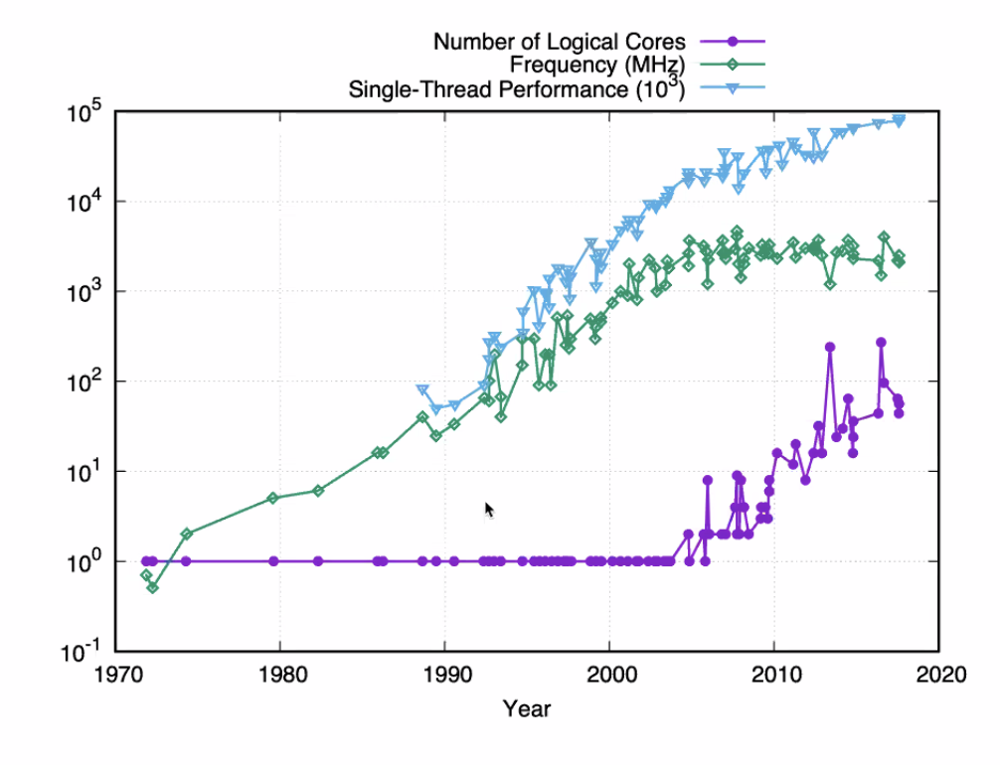

目前，既然单核心的性能已经达到了瓶颈，我们就只好多加核心来提升性能了。

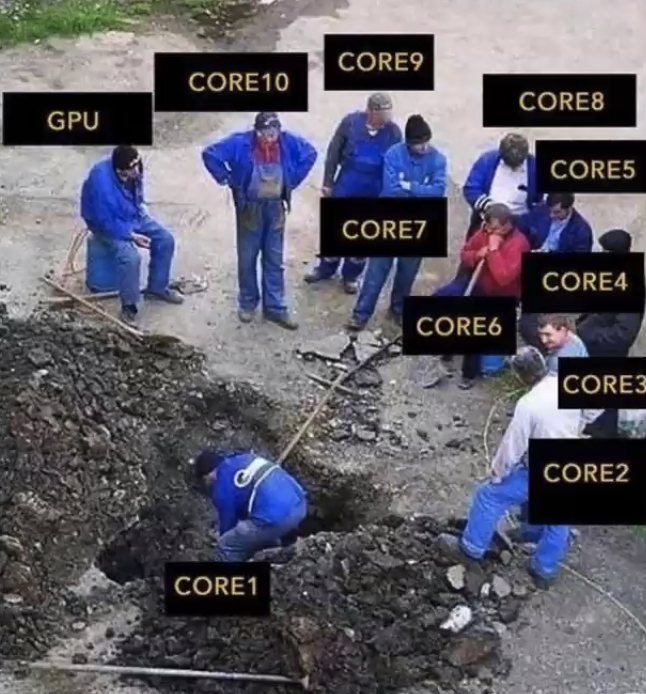

#### As much as possible?

但是，并不是所有的核都能一起工作啦。

主要是人多手杂，难以保证正确性；甚至在人太多的时候，调度这件事带来的性能损耗甚至超过了好处。

今天我们主要保证「正确性」。

#### Correctness

错误主要是由「共享资源的竞争」带来的。

为了避免这种竞争带来的错误，OS 提供了同步原语。

但是这会不可避免地降低性能。

### 消费者/生产者问题

#### Simple Version

在只有一个生产者和一个消费者的时候，只要双方都保证「先操作数据，再更新 ID」，就不会遇到竞争问题（前提是 ID 的自增自减是原子的）。

#### Multiple

但是，有由多个生产者或多个消费者时，问题就来了。如果她们的生产或消费过程产生了交错，就势必会带来不正确的结果——试图拿走同一个物体，或者是试着在同一个区域生产。

#### Solution

我们的解决方案应该保证下面三件事：


### 消费者/生产者解决方案

#### Peterson's Solution

```c++
// thread 1

while (true) {
    flag[0] = true;
    turn = 1;
    while (flag[1] && turn == 1) {
        // do stuff
    }
    flag[0] = false;
    // clean up
}
```

```c++
// thread 2

while (true) {
    flag[1] = true;
    turn = 0;
    while (flag[0] && turn == 0) {
        // do stuff
    }
    flag[1] = false;
    // clean up
}
```


这么做是否能保证三个条件？

* 互斥访问：并不能保证。
  * 
* 有限等待：
* 空闲让进：可以保证。
  * 这里没有「双方都退一步」的策略；
  * 所有的进程都很 Aggressive；
  * 不会出现 Live Lock 的情况。

#### Interrupt Disabling

更简单的办法——关掉中断，保证自己在执行的过程中不会遭遇进程切换。这是一个好主意吗？

No。单核 CPU 勉强可以用，但是多核 CPU 下还是可能有多个进程同时进入临界区。除非直接把多核 CPU 压扁成单核。

况且，开启/关闭中断要到 Kernel 态下。很不安全。

所以别想了。

#### Hardware Implementation

从硬件上支持原子操作，则何如？

* 不可被打断的操作集合；
* 就像执行单条 CPU Instruction 一样；
* 其中间状态对其他任何人都不可见。

实际上，有很多种方式可以实现相同的原子操作。

##### Intel's

Intel 实现的是 CAS（Compare and Swap）。

```c++
int CAS(int *addr, int expected, int new_value) {
    int tmp = *addr;
        if (*addr == expected) {
        *addr = new_value;
        return tmp;
    }
}
```

注意这些 C 代码，最後反映到指令上只是一条。

##### ARM

ARM 使用 LL/SC 实现。

Load-Linked & Store Conditional。

在读到写的过程中，检查原值有没有被修改过。如果没修改就直接成功，被修改了就得返回再检查。

### 锁的实现

已经够了！有了上面的硬件支持之後，已经足够写出锁了。

#### 自旋锁

Spin Lock。

##### Implementation

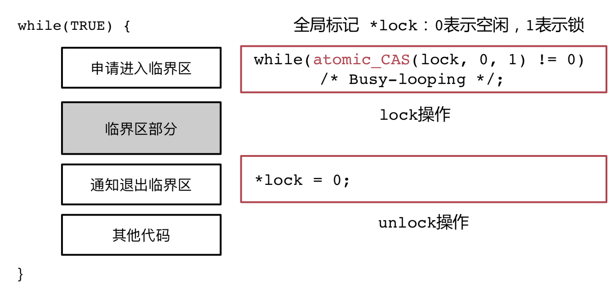

##### Validation

所有的锁都是满足互斥访问的，这没有疑问。不然还能叫锁吗？

但是留意到，有限等待是无法保证的。有些运气不好的进程有可能永远也无法 CAS。被饿死。

空闲让进？不一定。多核同时对同一个地址执行原子操作时，是否至少有一个能成功，还是说全都失败？这取决于硬件实现。

综上，自旋锁不是一个很好的解决方案。

#### 排号锁

Ticket Lock。

##### Implementation

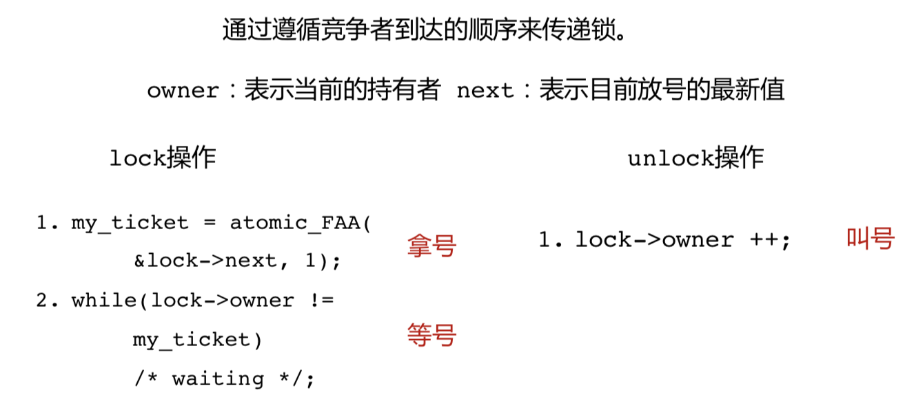

（程序）拿号、等号。（系统）发号、叫号。

这是完全保证公平的。

##### Validation

互斥访问，当然也没问题。

有限等待吗？按照顺序来说，只要所有的程序都在有限时间内结束，就能保证拿到号的人早晚拿得到锁。

空闲让进吗？当然。号没满的时候你拿到号就拿到锁了。

#### 读写锁

R/W Lock。

##### Thoughts

专门针对多读一写的情景实现的锁。


显然，多个读者同时读，是不互斥的；但是一旦有人在读公告栏，写者就被阻塞——你不能明目张胆地改写内容。

简单说，区分读者和写者；读者之间可以并行，读者与写者之间互斥。当然写者之间肯定互斥。

跟上面的「全员互斥」比较，读者之间不互斥，提高了读取数据的效率。

##### APIs

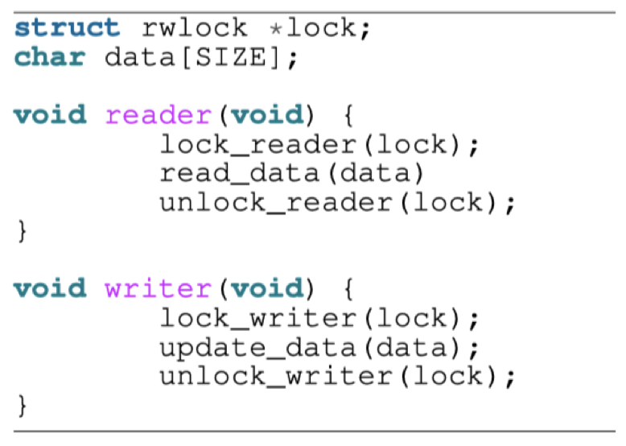

##### Question

目前有读者在读，有一个写者在等待。

那么现在，一个新的读者能否进来读？

* 可以：偏向读者的读写锁
  * 後序读者可以直接进入临界区。
  * 写者可能一直等，等到饿死。
* 不行：偏向写者的读写锁
  * 更加公平。
  * 后序读者必须等待写者进入之後才进入。

##### Implementation

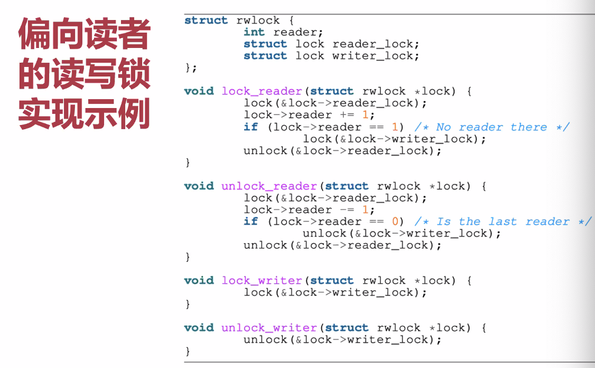

Reader 要拿 Writer 锁。Writer 也要拿 Reader 锁。

这样他们之间才能建立关联。

##### Optimization

给读者价格锁不是很好。浪费时间。

能不能让读者开始读之前，不要有这么多复杂的操作？

> 读者读到旧值是合法的，只要不是读到中间值就好了。

整理一下需求：

* 让读者要么看到旧值，要么看到新值，而不是任何中间结果。

> 但是硬件的原子操作有瓶颈：能保证的最大原子操作是 128 个 Bit。超过这个数据量的就会产生「缝隙」。

* 不要锁掉整个总线，尽量降低性能损耗。

#####  RCU

非常麻烦的机制…

既然只能保证 128 bit 的原子性，那么我们就借助「链表」的概念，通过原子地修改少于 128 bit 指针的方式来改变内存指向，从而间接地原子修改大内存。

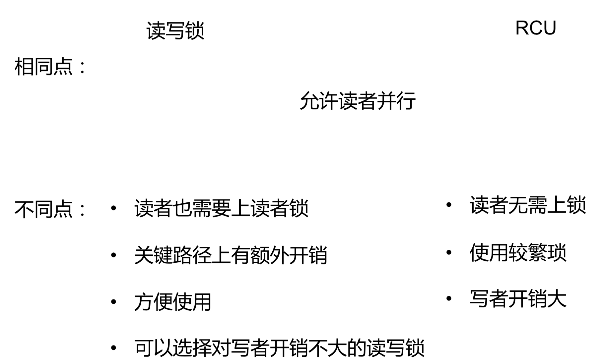

### 死锁问题

#### 产生原因

* 互斥访问
* 持有并等待
* 资源不可抢占
  * 不能强行拿走他人的锁
* 循环等待
  * 你等我，我等他，他等你


#### 解决方案

* 乐观式
  * 出现死锁再处理
  * 涉及到死锁的检测和死锁的恢复问题
* 悲观式
  * 设计时避免死锁
  * 运行时避免死锁

#### 死锁检测

检查大家拿锁和等锁的资源分配图，看看有没有成环。

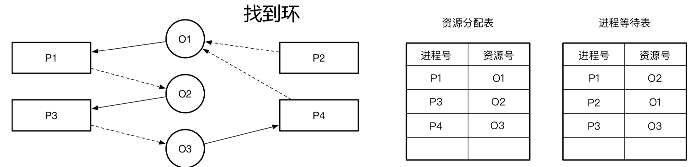

#### 死锁恢复

打破这种循环等待的方式。

* 把所有的成环进程都 Kill 掉
* 逐个 Kill 掉成环进程，直到其不再死锁
* 回滚到某一非死锁状态

#### 设计时避免死锁

* 避免互斥访问

  * 用代理执行等方式，彻底去除「锁」

* 不允许持有并等待

  * 一次性申请所有资源
  * 如果失败，把所有资源都释放

  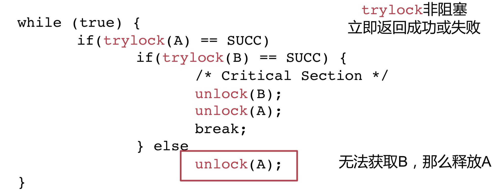

#### 运行时避免死锁

老大哥算法。

所有进程获取资源都需要管理者同意，管理者自己预演一遍看看是否会出现死锁。

如果会出现，就阻塞进程，下次再分配资源。

如果不会出现，就给进程分配资源。

#### 变种

##### 活锁问题

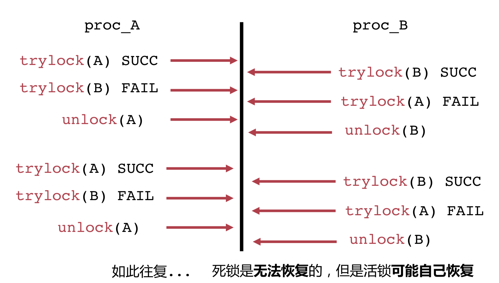

实际上只要每个 `trylock` 里有一点微小扰动，活锁就可能自己恢复了。虽然这一过程浪费了很多时间。

### 同步问题

使用同步原语来防止竞争之后，又产生了一些新问题。

最常见的就是「优先级反转」问题。

#### 优先级反转

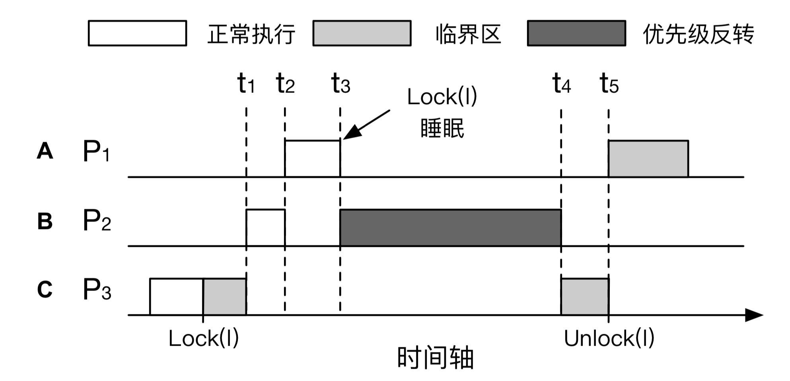

本来在 $t_3$ 时刻应该把资源交给持有锁的 $P_3$，而不是正在等待，毫无意义的 $P_1$。主要原因是锁的调度和进程的调度是两个分离的概念。

这里的操作系统并不知道「锁」策略，无法根据这一点进行优化的进程调度。

#### 解决方案

* NCP：进入临界区之后，不允许操作系统给我调度。
* OPCP：在拿到锁之後，把自己变成最高优先级进程，尽可能多调度到她头上。

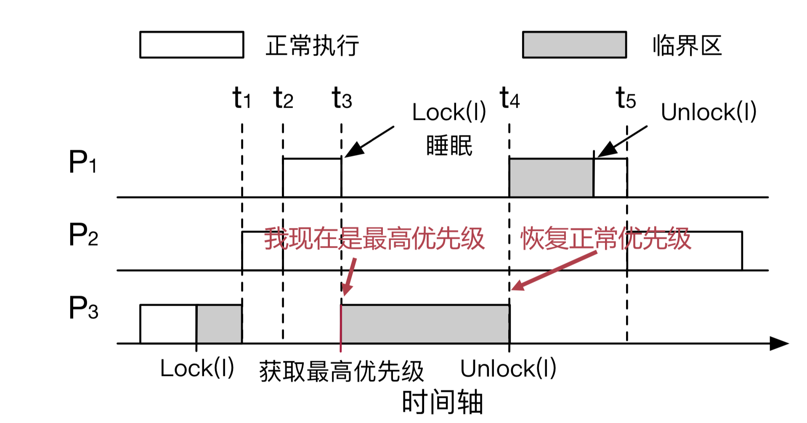

这样就能减少奇怪的情况了。