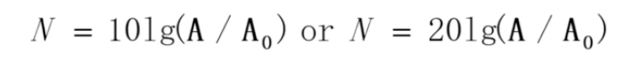

# April 15, 2020

## SE-340

### Sense of Hearing

听觉啊，听觉。

#### Source

听觉的刺激由「声音」产生，即以一定频率震动的空气刺激耳膜，产生听觉。

和视觉一样，人类的听觉范围也是有极限的，而且会随着年龄增长而退化。

一般人类的听感范围在 $20$ 到 $20000$ 赫兹。在此范围以外的次声波和超声波会对人类健康产生影响。

然而，人最为敏感的声音频率范围是在 $1000$ 到 $4000$ 赫兹之间。我们在设计听觉交互时，最好保持在这个范围内。

#### Grand Biologist

起作用的关键部分是内耳·耳蜗部分。

耳蜗的具体结构是这样的：

#### Great Physicist

* 功率

	* 单位时间内，声波通过传播方向法向某面积的声能量，单位为瓦特。

* 声强

	* 单位时间内，声波通过传播方向法向单位面积的声能量，单位为瓦特每平方米。

* 声压

	* 由于声波的存在而产生的压力增值。单位是帕斯卡。

* 声压级

	* 两个相同的物理量求比例後，以 $10$ 为底取对数再乘某个常数。
	* 显然这个数是无量纲的。

* 响度、响度级

	* 很麻烦的是不光由声音强度决定，还跟声音的波形、频率有关系。
	* 响度级别用 $L_N$ 表示，单位是「方」。
	* 

#### Human

##### Features

人对声音的感觉很奇怪…在某些奇奇怪怪的方面很敏感。

* 音调（频率）
* 声强
* 方向
* 非常敏感
* 音色
* 记忆
* 不光是对听到内容的记忆
* 还对类似音色、频率、方向的声音有反应
* 听觉掩蔽
* Auditory masking phenomena。
* 当声音产生于一个回响的环境时，会向不同方向传播，并且随后从附近的表面反射回来，第一个声音和反射回来的声音之间会相互影响，从而产生掩蔽效应。

##### Limitations

耳能够感知的频率比 $\dfrac {f_\max} {f_\min} = 1: 1000$。

频率感受的上限会随着时间老化。

设计听觉交互时，注意老人的听力并没有那么敏锐。

##### Thresholds

听觉阈值是一个动态范围；声强、频率共同影响。

听阈以上的声音才能被一般人听见；在此以下的都听不见。

痛阈以上的声音会让人感觉难受、疼痛、不舒适。

合适的听觉范围用阴影部分表示。

标准声强是 $f = 1000$ Hz，$I_\min = 10^{-12}$ W/m²。
	
#### Direction

> 人是如何辨认声音方向的？Well，主要是通过两只耳朵的听音时间差 $\Delta t$ 来判断的。

所以，耳机也能轻松实现「立体声」。

顺带，人的听觉方向并不是均一的。不同方向上的敏感度是不同的。

	
### Others

#### Sense of Touching

触觉相当直观，虽然信息量非常低（

另外，要注意不同身体部位的触觉敏感度是不同的。

通常的一个经验规律：离心脏距离越远，触觉敏感度越高。

另外，惯用手一侧身体的敏感度一般也会更高。

#### Sense of Temperature

相比热感，人对冷感更敏感。

因为对于远古人类而言，被冻死的概率比起被热死的概率高多了。

#### Sense of Balancing

### Summary

总之，要记住人类是有极限的。

无论是视觉的波长范围、听觉的频率范围、触觉的阈值、温度觉的感受，全部都是有限制的。

只有了解这种极限，在进行交互设计时把所有交互信道都放置在合适范围，才能尽可能优化交互信息。

### Question

#### 1

3.3 声学常识中，每个小标题後面的括号，是该物理量的简称，还是单位的简称？

如，功率（$W$），意思是功率可以用 $W$ 表示（这显然不可能），还是说功率的单位是 $W$（瓦特）？

下面的声强（$I$）呢？理解成 $I$（Intensity）代表声强，还是其单位 W/m² 的简称？

列举的物理量格式是否保持了一致性？

#### 2

定义广义的「分贝」时，取完对数之后 × 10 还是 × 20，这个是没讲清楚的。

主要是因为用于衡量声音时，可以用声强（$I$）也可以用功率进行测算。因为功率和声强构成二次函数关系，即 $P = kI^2$。

所以，用功率计算的结果 $\log_{10}{\dfrac P {P_0}}$ 和 $\log_{10}{\dfrac I {I_0}}$ 之间的关系可以表示为
$$
\log_{10}{\dfrac P {P_0}} = \log_{10}{\dfrac {kI^2} {k{I_0}^2}} = \log_{10}{({\dfrac I {I_0}}) ^ 2} = 2 \log_{10}{\dfrac I {I_0}}
$$
所以可以看出，采用 $P$ 和 $I$ 来运算分贝数会产生两倍的差值。为了保证他们的一致性，才人为规定了在运算声压级时，又是 × 10 又是 × 20 的。真无趣。

> Ref: 在声压级的计算公式中，为什么要乘以一个常数20？ - 王赟 Maigo的回答 - 知乎 https://www.zhihu.com/question/36702699/answer/68777019

