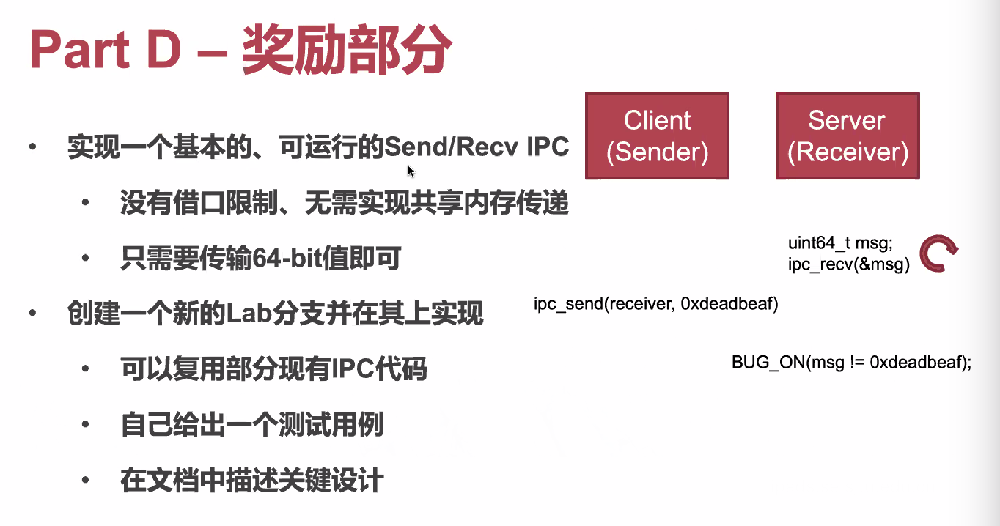

# April 16, 2020

## SE-315

> 今日说法：多核心多处理器与性能的可扩展性

### Parallel Computing

#### Theoretically Speaking


假如所有代码都可以并行执行（$p = 1$），那么核心数增加时，加速比例也线性增加。但如果所有代码都不可以并行执行（$p = 0$），那么增加核心数的理论加速比例会是 $1$，即没有加速效果。

这是理想情况。但在实际的情况之中，假如程序的并行性能真的很差的话，甚至会反过来降低性能的。因为，处理并行事宜本身也有开销。


#### Practically Speaking


真实情况介于上述两者之间：在核心数量相对较少时，性能接近线性提高；在达到一定数目後，遭遇「可扩展性断崖」。

#### Why?

可扩展性断崖是怎么来的？

##### Cache Synchronization

在目前核心的实现中，每个核心都将具有自己的 Cache Line，以保证单颗核心的访存速度。

但是，为了保证这些缓存行的全局一致性，时间的花费会随着 Cores 数量指数级地增大，最终导致可怕的性能跳崖。

##### Spinlock Implementation

除此之外，经典的自旋锁的实现也导致了这种问题的放大。

```c++
void lock(int *lock) {
    while (atomic_CAS(lock, 0, 1) != 0) {
        /* Busy looping */
    }
}

void unlock(int *lock) {
    *lock = 0;
}
```

对单一缓存行的竞争会导致极其严重的性能开销。


#### Solution

##### Simple Fix

既然上面出现性能下降的原因是「对于单一缓存行」的高密度竞争，我们就试试降低竞争密度吧。

```c++
void lock(int *lock) {
    while (atomic_CAS(lock, 0, 1) != 0) {
        /* Back off */
        back_off(DEFAULT_TIME);
        
        /* Busy looping */
    }
}

void unlock(int *lock) {
    *lock = 0;
}
```

`back_off` 会在拿锁失败时，稍微等一段时间再继续。

##### Simple Fix: 2

上面的办法很可能导致 Live Lock：所有人都在相同的时刻碰在一起，然后同时退回（Backoff）。

我们可以选择「随机时间 Backoff」或者「指数递增 Backoff」。

> 但是上面这两种办法都还是治标不治本的办法。

##### MCS Lock

思想：在关键路径上避免单一缓存行的高度竞争。


也就是说，拿锁过程不是不停地检查 Lock 状态，而是把自己加入等待伫列中；拿着锁的人会在放锁的时候告诉伫列靠后元素，锁空了，它可以拿了。


实践证明，MCS 确实能大大提升多核心性能。

##### Linux Implementation

Linux Kernel 中，使用的是可扩展锁 `QSpinlock`。


会根据当前的竞争程度选择不同的设计。

#### NUMA

到头来，在核心数量过多时，就算是 MCS 锁的视线也会产生性能下降。

原因还是：核心太多了。核心数量增加，保证协同工作的开销指数增加。

解决方案：在一段时间内把访存限制在一定范围内。


但是这和软件的设计有很大关系：要尽量保证内存访问的局部性，否则性能还是会爆炸。

> 考虑了这种多核局部性的程序称为 NUMA-aware Applications。

结果很不错：


### Welcome to Real World

#### LoadOne

##### Codes


##### Execution

实际上，在实际的多核 CPU 执行中，允许部分访存操作的乱序执行，方可提供更好的并行性。

所以，在实际的代码执行过程中，可能会发生这种情况：


`proc_a` 和 `proc_b` 都读到对方的 `flag` 为 `0`，同时进入临界区，爆炸了。

##### Hardwares


几乎所有的现代 CPU 都有这一「特性」。

#### Consistency


##### Strict Consistency


##### Sequential Consistency


##### Total Store Ordering Consistency


这种一致性相当弱，但是正因此，可以让 CPU 实现高效的乱序执行、并行计算。

Intel 和 AMD 的硬件都采用了这种权衡。

##### Weak Ordering Consistency


ARM 就采用了这种权衡。

> 梦回 CSE


## Lab 4

> oh...

多核心 Lab

### Instructions

指令和之前完全一致。


### Instructions


#### Go Multi-Core


启动的时候需要区分不同的 Processor。


> 



> 

