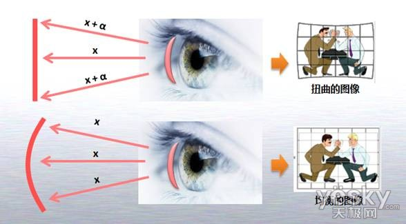

# April 20, 2020

## SE-213

### Homework

### a White Box

相比黑盒测试，我们能得到关于程序代码、流程的更多信息。这些信息能够让我们

比如，C~mcc~ 就要求将所有条件的组合都穷尽。

实际上呢，只需要 4 枚测试用例就可以覆盖这 8 种情况。

* 条件覆盖：每种条件分支都被执行到。
* 分支覆盖：每个判断分支的 YES 和 NO 分支都被执行到。
* 多条件覆盖：每种条件分支的组合都被执行到。

### Circulation

一般的程序都会包括「循环」。

怎么对他们进行测试？

首先，循环就分为很多种：

* 单循环（一个简单的循环）
* 嵌套循环（循环里面套循环）
* 级联循环
* 不规则循环（老实交代，你是不是用 `goto` 了？）

### McCabe

#### 基路径

类比「基向量」之于「向量空间」，「基路径」之于「程序路径」就是程序图中相互独立的一组路径，使得整个程序中的任意路径都可以由基路径组合得到。

#### McCabe 计算

$V(G) = e - n + 2p$。

$e$ 是边数；$n$ 是节点数；$p$ 是连通区域数。

比如这个图，$V(G) = 10 - 7 + 2p = 5$。

> 有的书也认定 $V(G) = e - n + p$。也没问题。只不过，这个公式要求图是**强连通图**（任意两个节点之间都存在路径）才能用。

#### 基本路径

怎么确定基本路径啊？

是一个搜索法。

从起点到终点去找。

以这张图为例：

* ABCG
* ABCBCG
* ABEFG
* ADEFG
* ADFG

所有的其他路径都可以用这五条路径组合（并清除循环）之后得到。

* 路径加：一条路径後面接一条路径
* 路径乘：路径重复
* 路径减：数学上除去对应的边（没有实际意义）

找起来很容易：因为已经知道数量了（就是整个空间的维数，用 McCabe 度计算公式），然後就用 DFS 或者 BFS 等图遍历的方法就能找出来了。

> 一般来说，一个单元模块的最大复杂度 $V(G)$ 不能超过 10。否则太复杂就没法测了。

### Data Flow Testing

从关注程序中的数据及其使用的角度，设计测试用例。

跟路径测试覆盖很像，但是关心的是「数据变量」而非「程序结构」。

> 梦回 Compilers

一个变量的活跃范围是其第一次被 `DEF` 到其下一次被 `DEF` 之内最后一次 `USE` 的这个程序区间。

要整理出数据流，先把所有的变量写出来，然後把所有的 `DEF` 和 `USE` 都写出来。

注意，有些语句会同时进行 `DEF` 和 `USE`（但一般是先 `USE` 再 `DEF`），例如自增语句。所以要注意些好。

## SE-340

今天讲的是「视觉注意的原理」。

### 大纲

* 视觉注意的心理学、生理学机制
* 视觉注意的预测模型
* 眼动跟踪技术实现

### 知觉注意

#### Reasons

* 人的能力有限，无法瞬间注意所有信息
  * 主要由丘脑负责过滤掉不重要的信息（超过 98%）
  * 心理上，人的主观意识会选择注意目标
  * 人只有通过知觉注意才能高精度地获取外界信息
* 人眼的视野范围中，最佳的视区非常窄
  * 只有 1 到 3 度的视觉范围才能落入最敏锐的重要视区内
  * 唯有通过眼动，持续调整最佳视区的位置才能观察到整体信息。

> 人眼就是这样的

#### Buggy Eyes

人眼实际性能很差的。

#####球面像差效应

> （图借 Nikon）

人眼晶状体边缘部分会产生稜镜效应。

##### 色差

不同颜色的光线具有不同的折射率。而且通常，波长越短，折射率越高。

这就带来了色差和物体彩边。

##### 曲率场

把一个平面的物体看成弯曲的。

大概就是这样：人眼在球心在看球体的时候才能看到均匀的图像。

> 所以大家都会买曲屏显示器吧

#### Dirty Patch

为了减小球面相差，人眼干脆用虹膜把边缘光线阻挡住（这就导致视野变窄了）；

为了克服色差，人眼一般会聚焦到中等波长的图像上，这样可以避免一个方向的折射偏向；

为了调和曲率场带来的影像，视网膜也有一定的弧度（但当然不能对每一距离的平面都适用）。

### 视网膜

#### Structure

注意到，视网膜上视觉神经聚集的出口处是没有感光细胞的。就是说，人眼的视觉会有一个恒定的盲区。

但是，人眼持续颤动，加上本身边缘处人的视力就不行，加上脑补就把这个缺给补上了。

通过特殊的方式观察特殊的图案可以确认这个盲区的存在性。

#### Cells

视网膜上分布着两种细胞：Rod（视杆细胞）和 Cone（视锥细胞）。

横轴是视觉角度；纵轴是细胞分布的密度。

#### Pixels

不，不能把细胞的分布类比成「像素」的平面排布结构；神经节细胞和双极细胞在视网膜上形成了复杂的网状结构。这种网状结构对光线敏感，会产生对应的神经冲动。

#### Bugs

人眼存在 Bug；在视线移动的时候和注视的时候，看到的交叉点的颜色不一致。

主要原因：注视一个中心点，会导致其周围的视觉被抑制。

神经节细胞这种特殊结构决定了这种特殊的「感受野机制」。

#### Summary

* 眼球结构决定了人的视野有限
* 边缘区域的视力很差，相差色差都大，敏感度也低
* 在注视中心点时，周围的视觉会遭到抑制

### 眼动

#### Why

上面说到了，眼球结构这么糟糕，如果眼球还不能动，那还怎么看东西？

眼睛的运动可以补偿身体的运动，减少晕眩感。

大部分人的双眼是始终绑定同步运动的。

#### How

人的每只眼睛上都有一堆对称肌肉联动，通过这些肌肉运动就能转动眼珠。

#### What

HCI 中一般只关心三种视觉方式：

* 扫视（跳视）
  * 移动中央凹（最敏感的视觉区）到某个位置
  * 扫视的轨迹和形式固定
  * 速度相当快
* 平滑尾随
  * 跟踪一个移动目标
  * 自动匹配移动目标的速度
* 注视
  * 在一个固定的兴趣点上稳定视觉
  * 但此时仍然有微小的眼动，视角噪声一般不超过 5 度

> 人眼通常偏好水平方向的运动，而非竖直方向的。（翻白眼？）

### 心理学知觉

#### Definition

心理学家 James 说，注意力是由意识决定的，使心理以清晰和鲜明的形式从「几个同时呈现的可能目标」或「一系列思想」中选择一个用于感知。

#### Features

* 使人摆脱某些事物，更有效地处理其他事物
  * 滤出某些目前可能不重要的信息，便于处理关键
  * 有些「过滤」是在无意识的情况下完成的

#### Attention!

##### Von Helmholtz's

Von Helmholtz 的「哪里」假设，视觉注意力是视觉感知的主要激励。

这话什么意思呢？

* 哪里有视觉激励，视觉就会注意到哪里。
* 但同时，注意力也可以被意识和自主活动控制。

也就是，Von Helmholtz 偏向于认为，注意力主要由环境激发，同时辅以人的自主活动。

以此，後人提出了「自底向上」、「数据驱动」的视觉注意预测模型。这种模型只需要分析视觉的内容，就能模拟出人可能的注意区域。

---

##### James'

James 提出的「什么」假设，认为人的注意力偏向主动的、自愿的，而辅以外界环境被动刺激、反向、非自愿的注意情形。（跟 Von Helmholtz 对着干）

以此，他提出了「自顶向下」，即「任务驱动」的视觉注意预测模型。

---

##### Gibson's

Gibson 提出了「怎么」假设；也就是，以人的意图为中心来研究视觉注意。

研究观察者发现，不同的预知感和观念会影响人对于视觉刺激的反应。

即，跟实际的上下文，或者说情景有关系。

据此，他提出了基于模式识别的注意模型。

---

##### Broadbent's

Broadbent 提出了「选择性滤波」理论。

感知通道是有限的，而信息可以认为是近乎无限的。我们必须对传入信息进行过滤，对其降维之后再进行分析利用。

---

##### The Deutsch's

Deutsch J. A. 和 Deutsch D. 反对 Broadbent 的理论，而是自己提出了一套「权重」理论。

不同信息拥有不同的权重；所有的感知信息会根据权重被选择；这种期望决定了注意力的方向，最终决定了注意的结果。

---

##### Treisman's

Treisman 的统一视觉处理理论。

他认为，Broadbent 的理论和 Von Helmholtz 的理论基本一致。

> 两个人强调的都是 Raw 信息对于注意力的影响。

而 Deutsch 的理论又和 James 的理论基本一致。

> 两个人都强调主观思路对于注意力的影响。

据此，他提出了统一的视觉注意理论：

词典单元的後续结构的衰减滤波。

首先，衰减滤波能够衰减一部分不重要的信息，而非完全阻断；後续的主观词典单元处理会处理这些信息，并决定最终的注意力。

#### Bug

Treisman 似乎已经把所有问题都解决了，通过一个杂糅的模型。

但是，有一个关键问题：场景融合问题。

在我们看到一幅宏大的风景画面时，他是如何作为一个连贯的场景在大脑中合并在一起的？

例如，如果我们的大脑真的只是通过观察关键点 + 合并的方式来分析信息，那么我们怎么能得到一个关于场景的信息，或是产生一个不存在的三角形的错觉？

#### Patch

Treisman 认为，大脑具有拼合心理图像的功能。虽然选择滤波把信息给拆散了丢给大脑，但是大脑随後会试着重建整个场景的信息。

### Thoughts & Questions

有一种比较老派的观点否认人类自主意识的存在。也就是说，他们认为人类不存在自主意识，而是在经受大量随机刺激之後，产生了独一无二的神经结构，并能够对外界作出反应。也就是，如果能够记录大脑受过的所有刺激，就能决定其全部的神经物理结构，也就能预知其对任何外界刺激的反应，即意识机械论。

但我们抛开意识的存在性与否，而提出这一个观点：大脑是在接受刺激的过程中，产生了自身的独特意识。也就是，「人的主观意识」和「外界刺激」并不一定是对立的，而「主观意识」正是自产生以来的所有「外界刺激」的产物，而每一次「外界刺激」都在改变着人的「主观意识」。

可以这么理解吗？