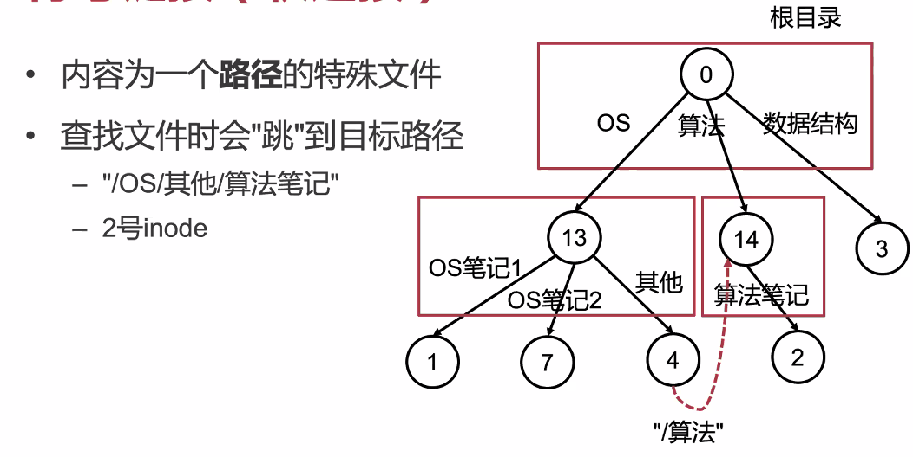
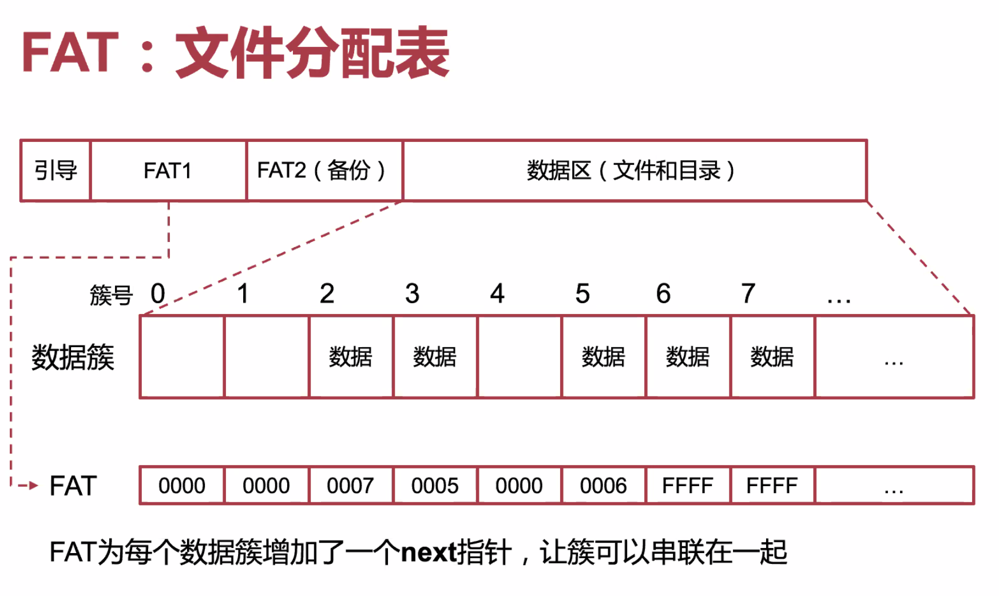

# April 21, 2020

## SE-315

> oh-my-os

好嘛，要开始讲 FS（文件系统）了。

> 梦回 CSE

本质上，「文件系统」就是一层文件的组织形式。

### `inode` based

#### Data Structure


基本上就是以「块」作为基本粒。

超级块保存 META-INF，inode 区分每个文件。


但是对大文件来说，inode number 一个块儿放不下。那么就只好用「多级映射」的方法了。


#### Features

##### Soft Link

也就是俗称的「Symbol Link」。



##### Hard Link


只是在上层目录里加了一行 Entry，两个不同的 Entry 指向一个 inode。

##### Special Types


#### Problems

考虑一下：我们要保存一个 1 GiB 的视频文件，文件会被拆成多少数据块呢？维护这些数据块又需要多少元数据呢？

按照上面的估计，大概会占有千分之二（$0.2\%$）的组织冗余。

有什么办法解决吗？

### Ext4

#### Main Idea

Extent（区段）的概念可以大大减小大文件的组织冗余。

区段是由**物理上连续的多个数据块**组成。既然一个区段内的数据可以连续访问，无需按 4KiB 数据块访问，就可以减少元数据的数量了。

#### Extent Tree


#### ChCore's

纯内存文件系统（我丢…

> 转瞬即逝

##### Data Structure

```c
struct inode {
    int nlinks;		// 链接数
    u64 type;		// 文件 or 目录？
    size_t size;	// 文件大小
    union {
        struct htable dentries;	// 目录文件的哈希表
        struct radix data;		// 常规文件的基数数
    }
}
```

##### Normal Files


##### Directories


### Table Based

基于 TABLE 的文件系统，最有名的就是 FAT 和 NTFS 啦。

#### FAT

##### File Allocation Table



基本单位是「簇」。

##### Directories

目录是怎么实现的呢？跟 inode 差不多，文件名、属性、再加簇号。


##### Questions


1. 百度发现放文件大小的字段只有 4 字节。最大只能表示 $2^{4\times8} - 1 = 4294967295$。

2. 把放文件大小的字段改成了 8 字节，现在可以表示的最大值是 $2^{8\times8} -1 = 18446744073709551615$，大概相当于 16 EiB。
3. 因为 FAT 的组织结构相当简单，方便实现。
4. 设计的时候就没做，但其实 TABLE 式也是可以实现 Link 的，比如 NTFS…
5. 因为簇是顺序存储的，要找到簇 ID 得遍历一遍，太糟糕了。

#### NTFS

人希 M$ 提出的 New Technology File System。


