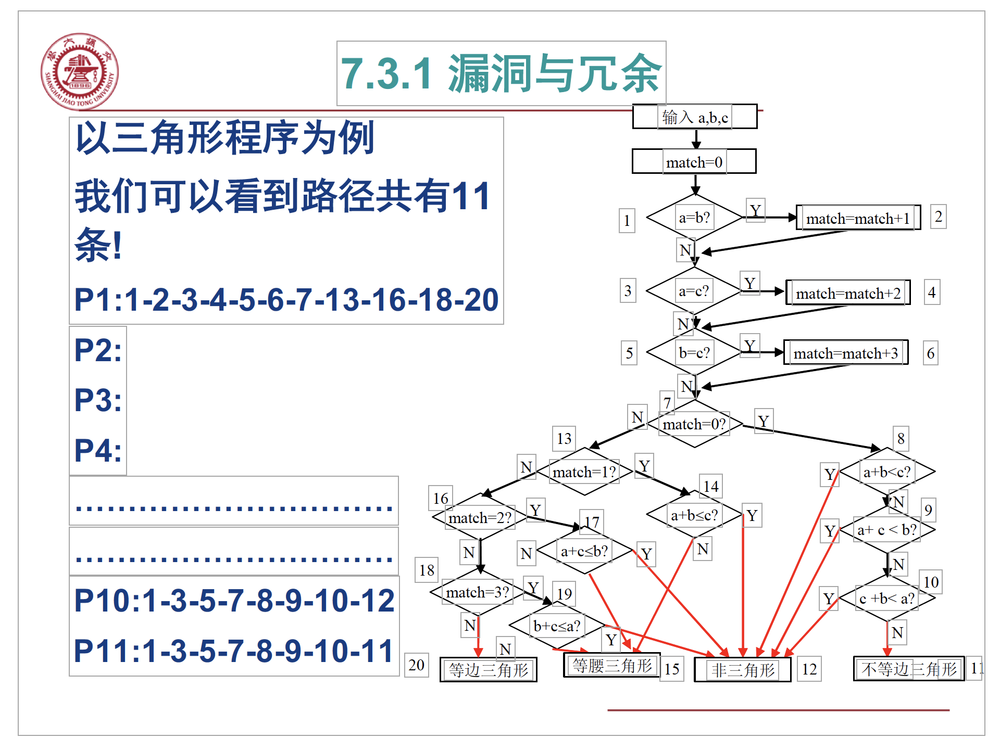
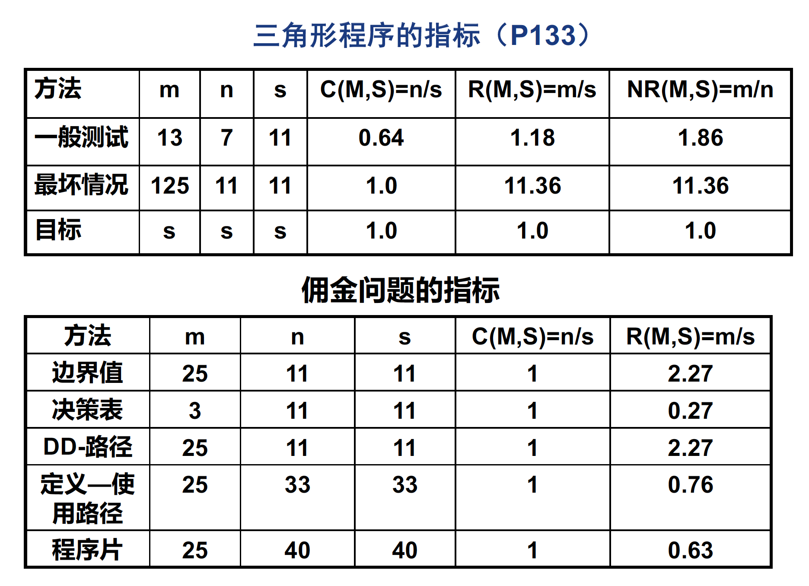
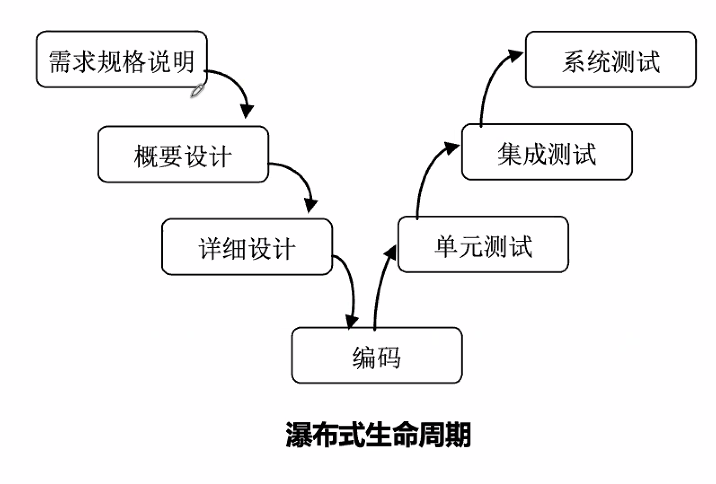

# April 26, 2020

## SE-213

### Review

* 路径测试
* 数据流测试
* 基于不同路径的概念构建覆盖
* 学习心得？

### Testing based on Program Fragments

基于程序片的测试。

#### Definition

给定一个程序 $P$ 及其中的变量集合 $V$。

$V$ 在语句 $n$ 上的一个片，记作 $S(V, n)$，是 $P$ 中对 $V$ 的变量值作出**贡献**的所有语句（编号）的集合。

> 直接或间接地改变 $V$ 的值的语句，都算在程序片之中。

#### USE & DEF

#### Example: 佣金问题

以 `Locks` 变量为例、她在 14、16 节点被 USE 了；而且在 13、19 节点被 DEF 了。

所以，$S(Locks, 13) = {13}$。即，在语句 13 中的变量 `Lock` 值，只和语句 13 产生了关系。

注意，因为程序流有溯及性，所以在求程序片的时候必须指明说的是哪个节点的变量。

---

而 $S(Locks, 14)$ 或是 $S(Locks, 16)$，留意到他们被包含在循环中，所以其程序片是 13、14、19、20。

---

间接贡献也算哦！比如，用 `Lock` 变量改变了 `totalLocks` 变量（语句 16），那么 `totalLocks` 的程序片就应该包含 $S(Locks, 16)$ 才对；因为之前对语句 16 中的 `Locks` 变量产生过影响的，也间接地影响了 `totalLocks`。

#### Usage

有什么用？在我们计算了程序片之後，有什么用呢？

可以直接地将一个变量的依赖形成一条链，依次检查其中哪一步出了错，从而针对性地解决问题。

#### Performances

测试的效率是很重要的。

不需要也不能做得十全十美。

##### When to stop?

##### Bugs & Glitches

拓扑可达性：88 种（不考虑实际情况时的路径种类）。

但是，就可行路径来看，绝对没有那么多。要去掉很多不可达的情形。比如，不可能在经过了语句 2、4、6 之后还不落到语句 20。

##### Evaluation

* 方法 $M$ 关于指标 $S$ 的覆盖是 $\dfrac n s$，记作 $C(M, S)$。

* 方法 $M$ 关于指标 $S$ 的冗余是 $\dfrac m s$，记作 $R(M, S)$。

* 方法 $M$ 关于指标 $S$ 的净冗余是  $\dfrac m n$，记作 $N_R(M, S)$。

### Testing based on Liveness

基于生命周期的测试…

#### Liveness

##### Traditional

传统的瀑布式生命周期。

也经常被批判其缺乏灵活性。