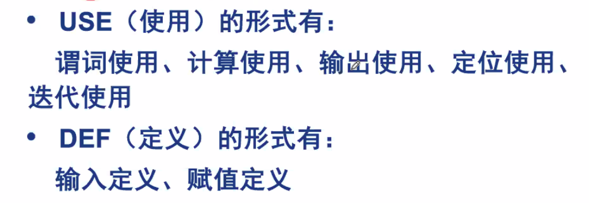

# April 26, 2020

## SE-213

### Review

* 路径测试
* 数据流测试
* 基于不同路径的概念构建覆盖
* 学习心得？

### Testing based on Program Fragments

基于程序片的测试。

#### Definition

给定一个程序 $P$ 及其中的变量集合 $V$。

$V$ 在语句 $n$ 上的一个片，记作 $S(V, n)$，是 $P$ 中对 $V$ 的变量值作出**贡献**的所有语句（编号）的集合。

> 直接或间接地改变 $V$ 的值的语句，都算在程序片之中。

#### USE & DEF

#### Example: 佣金问题

##### Example

以 `Locks` 变量为例、她在 14、16 节点被 USE 了；而且在 13、19 节点被 DEF 了。

所以，$S(Locks, 13) = {13}$。即，在语句 13 中的变量 `Lock` 值，只和语句 13 产生了关系。

注意，因为程序流有溯及性，所以在求程序片的时候必须指明说的是哪个节点的变量。