# April 27, 2020

## SE-340

> 眼动跟踪技术，真是魔幻。

### Eyes' Motion

#### Hardware

很显然地，得需要特定的眼动跟踪设备。

可以按照简单的标准对其进行分类：

* 穿戴式（接触式）
	* 类似于眼镜、头盔等设备
	* 舒适度较低
	* 精度高
* 非接触式
	* 采用特殊的高精度摄像头实现
	* 人体感受较舒适
	* 精度不高（大概在 0.1 度到 2 度之间）

#### Software

眼动跟踪软件应该给出哪些信息？

* 视线方向
* 注视区域
* 注视数据统计、分析

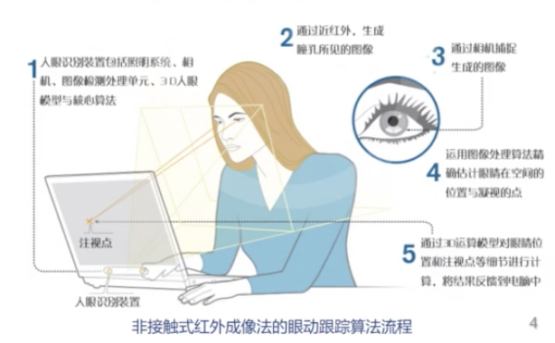

更详细一点，眼动跟踪数据的参数包括：

* 注视位置
	* 屏幕上的一个二维坐标
	* Fixation Position
* 总注视次数
	* 每个元素被留意的次数
	* Fixation Count
* 首次注视持续时间
	* First Fixation Duration
* 首次注视开始时刻
	* Time to First Fixation
* 注视持续时间
	* Fixation Length
* 区域注视次数
	* Area Fixation Count
* 注视点序列
	* Sequences of Fixation Points

> 课件中的「时间」和「时刻」可能需要被更审慎地使用。

#### Visualization

按照被视觉关注的次数，可以画出「次数」热力图：

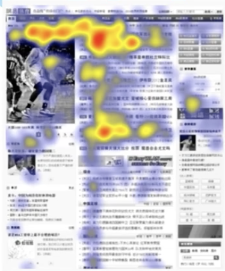

按照总计关注时间，可以画出「注视时间」热力图：

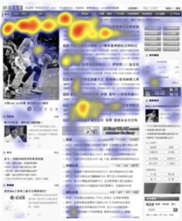

> 其实没有特别大的差别，基本都满足左、上的注意力高于右、下，对高对比度、边缘位置、大字号字体具有较高的留意度。

按照视线的转移路径，可以画出路径图：

> 视线习惯于进行左上到右下的移动。

#### Appliances

##### Medical

孤独症患者的注视分布与正常人有别。

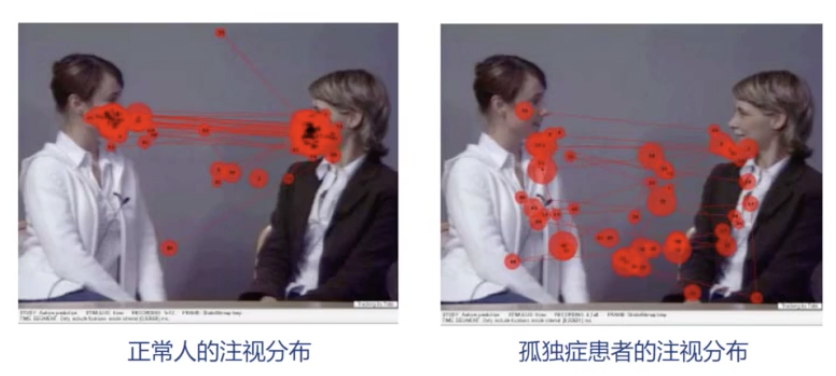

可以用于辅助诊断。

##### Gaming

在设计游戏 UI 时，我们可以根据视线的位置来动态调整大量元素的详略，使得我们总能自然地展示用户最关心的信息。

例如，电商平台上需要展示大量商品的时候，这种技术就相当实用。

##### VR/AR

目前的 VR（虚拟现实）、AR（增强现实）、MR（混合现实）设备的交互都还是基于外接的手柄、体感、语音等。

但这些交互方式并没有「观察」那么自然。通过眼睛来动态调整界面元素，完全符合人的直觉。

除此之外，VR/AR 中，如果不引入视线的概念，就无法实现类似于「变焦」等高级效果，沉浸度能够大大提高。

同时，「注视点渲染」被证明是节约资源的一个好办法。因为人眼对偏离视觉中心的物体的视觉很差很差，所以我们可以采用「高精度地渲染注视点的内容」，「草草渲染不在注视点的内容」来提高性能。

同时，VR/AR 实践中，缺乏眼球移动的虚拟视野可能是导致眩晕的原因之一。如果我们加入视线修正，就能减少眩晕感。

##### Designing Assistant

当我们进行平面设计时，可以找一些受试者给他们带上眼动跟踪设备，观察他们对界面元素的注意力。

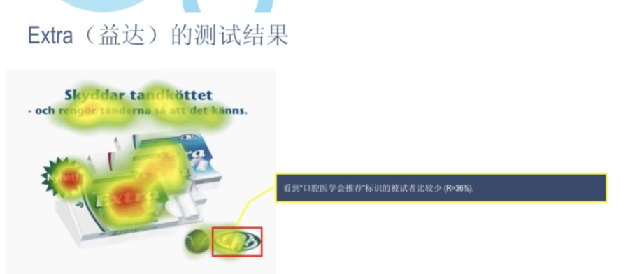

根据得到的热力图结果，修订修改我们的设计稿，使得注意力分布符合我们的要求。

#### Measurements

怎么测量眼动呢？自古以来人们就有很大的兴趣。

* 观察法

	* 直接观察眼球的方位，反推出视线方向

* 机械记录法

	* 把杠杆连接到眼球上记录

		> 暴力…

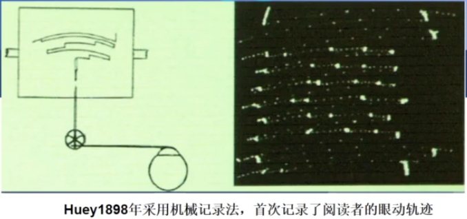

* 反光记录法

	* 眼球是反光的。所以，引入一束设计好的光，并测量其被眼球反光的角度，就能测出眼球的角度。

		> 听起来没那么疼了

		

* 电磁感应法

	* 这真是个电磁的世界啊

上面这些都是老古董法了。在电子化时代到来之後，现在有了更无感的测量方法：

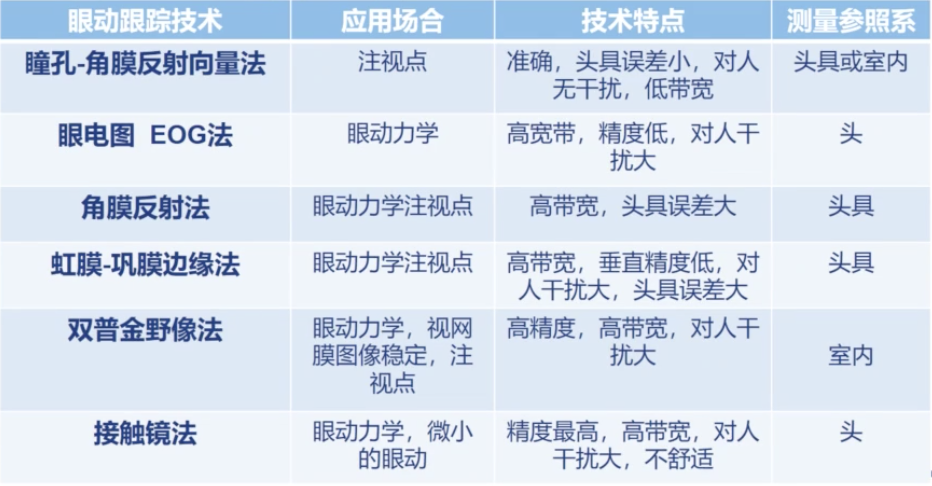

特别地说一下这个「双**普金**野像法」。

所谓的「双普金野像」，是人眼球的构造带来的光学现象。

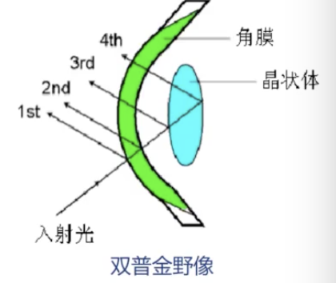

人眼有多重复杂的反光结构，每一层都可能会反光。

其中比较明显的反光，有 4 束。只需要分析这四层光的反射方向，就能极高精度地进行眼动跟踪。

> 只不过因为要求有一束较强的光射向眼球，比较影响人的正常视觉……

* 瞳孔 − 角膜反射向量法

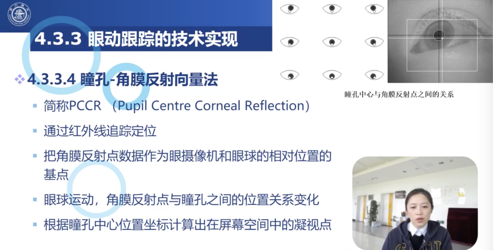

准确、头具误差小、对人无干扰。因为用的是人眼不可见的红外线，对人的视觉干扰很小。

* 电流记录法

这就比较黑魔法了…

因为眼球转动靠的是包裹眼球的肌肉收缩。通过测量这些肌肉的生物电来推测眼动情况。

#### Mathematics

##### Projection

注意到，只是测量出视觉二维注意点和视觉倾角，这还不够。

更实用地说，我们希望通过 `P(x, y, z)` 和欧拉角（旋转角 + 倾角 + 偏角），重建出「人眼」这一摄影机在虚拟游戏空间内的位置，从而渲染出对应的内容。这需要比较复杂的矩阵变换数学。

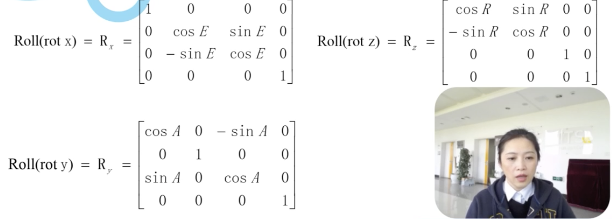

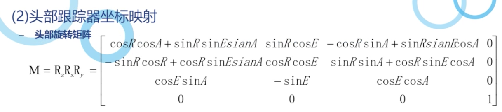

##### 3D

特别要注意的是，人有左右眼——要考虑到两眼产生的视差效应；不考虑 3D，就完全没有立体效果；精度不够的 3D，则会带来严重的眩晕问题。

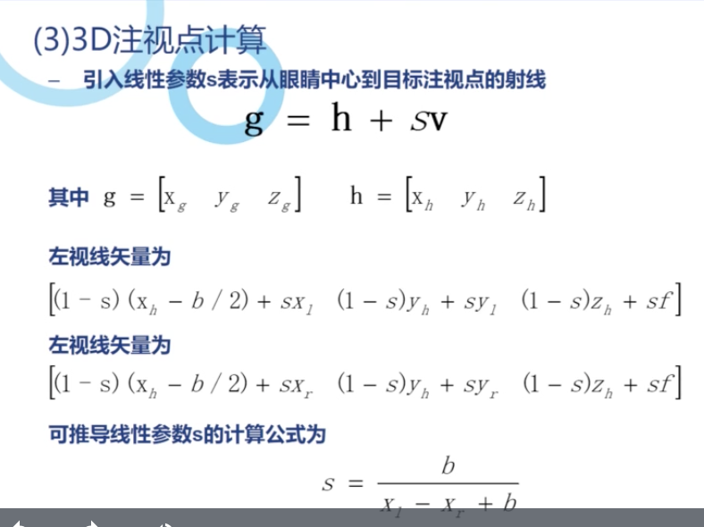

### Q

在刚听说到「眼球控制」的概念之後，就一直有一种困惑，导致了对这种控制方法的不信任：

怎么区分「有意的注视」和「疲惫、无心的呆滞视线」？

其他输入方式（包括鼠标、触摸板、键盘等等）都是主动的：即，如果我不做出动作（敲击、点按），就不会发生动作。但是，眼球常常会有不自觉的移动和静止，包括眨眼也不总是自觉的。显然如果不对其进行过滤，会带来很严重的误操作问题。

目前商用的眼动操作识别（如 Windows 10 已经支持了红外眼球输入操作）是如何解决这一问题的？

能否识别出眼球的动作是「大脑发出的命令」，还是「无意识的小动作」？