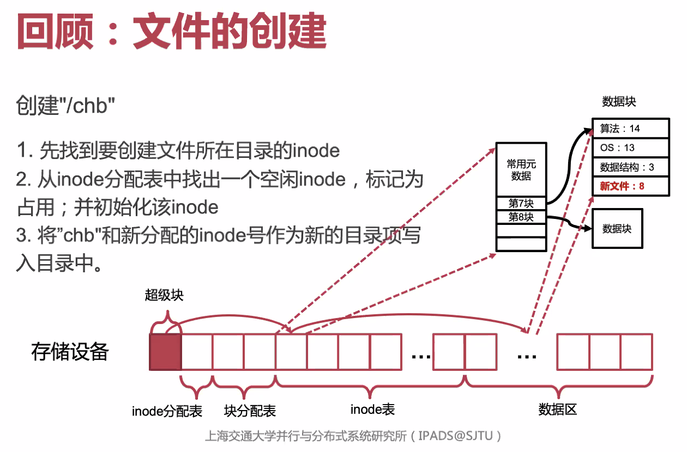
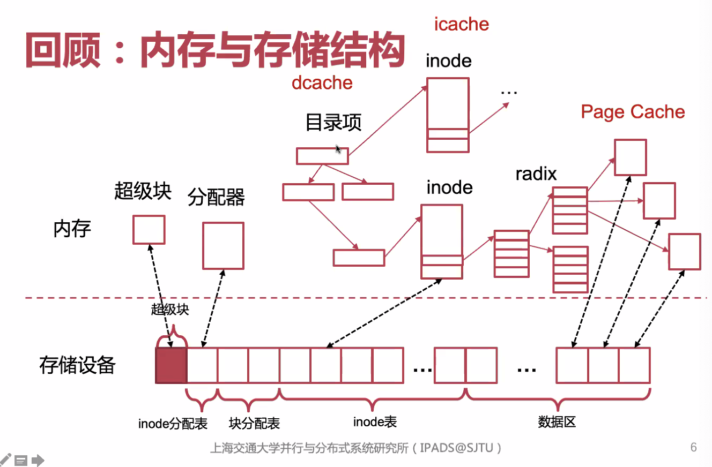

# April 28, 2020

## SE-315

> oh-my-os

今天主要讲文件系统的崩溃一致性。

### Crash Consistency

#### Why?

#### Review: Create a File

当我们要创建一个名为 `/chb` 的文件的时候，我们要做什么？

* 找到上层目录的 inode
* 从 inode 分配表中找出一个空闲 inode，占用并初始化她
* 将 `chb`（这三个字母）和新分配的 inode 号写入目录中

现在我们考虑，在其中任何一个操作进行时发生崩溃，该怎么办？

#### Crash! Crash!

要注意到，几乎每一项数据结构都是有 Cache 的。`dcache`，`icache`，甚至还有 `pcache`…

那么，创建 `/chb` 的三步走中的

1. 标记 inode 为占用
2. 初始化 inode
3. 将 entry 写入上层目录

我们要严格规避的情况是：

* 看起来创建了一个文件，但其实这个文件不完整，没有对应的 inode。
* 或者，写入了 inode 却没有标记占用，导致 inode 中的内容被其他文件读取。（非常危险！）

而「分配了 inode 却没有创建 entry」这件事情的危害就没那么大；可以通过 `chkdsk` 或 `fsck` 找出并回收他们。

#### Possibilities

上面的三步走里面，看起来可能出现的 Crash 可能只有三种。

然而，在考虑 Cache 的情况下，操作持久化的时刻可能混杂：一共会存在 $2^3 = 8$ 种不同的结果。

假如考虑其他更多操作，那么出现的可能性会指数爆炸，几乎不可能找出所有的情况。

#### Solution

##### Optimistic

乐观地说：不管了！反正是小概率事件。

对于手机和笔记本这种有电池的设备，是否还需要保证其崩溃一致性？

有 UPS 的数据中心是否也需要保证其崩溃一致性？

> 当然也需要了。断电不是唯一的崩溃原因。

#### Expectation

我们需要做到怎样的崩溃一致性？

也不一定要做到绝对的一致性；一般用户的期望是：

##### Presumption

我们先给下层硬件做一些假设。

`fail-stop`，即保证不会发生「拜占庭错误」：即一旦出错就停下来，不会写飞，弄坏其它块。

#### Why... so hard?

保证崩溃一致性是很难的。CPU 的操作那么复杂，且包含很多异步过程，要保证在每一条指令执行的过程中，每一种情况下都能完美恢复，显然是不现实的。

#### Implementation

主要的实现崩溃一致性的方法包括：

* 日志
* 写时复制
* Soft Update

##### Journaling

* 在进行任何修改之前，都把修改记录写到日志里
* 记录完毕之後，再提交日志（写入一个 Bit）
* 再进行修改
* 确认修改完了，删除日志

这样，一旦崩溃，我们只要查找日志，就能知道进行了哪些步骤，没进行哪些步骤，还有那些步骤是 Pending 的。

注意，写日志的时候也可能崩溃（…）

可以看到，Commit Point 是相当关键的一个点：他决定了日志是否有效。

问题也很明显：每个操作都写磁盘，那你这 Cache 就没用了。

另外，每个修改都要 Copy 新数据。太麻烦了。

##### Journaling (Optimized)

因为我们关心的只不过是 Commit Point，只要能把这个点的前後分清楚，其实没必要在其中再保证严格的先後。

那么，多久提交一次日志比较合适呢？

假如提交太密集，那就浪费空间；但如果太稀疏，就可能在崩溃时丢失太多信息。

#### Linux: JBD2

> Journal Block Device 2

##### States

Writeback Mode：可能导致记录下了元数据，但是丢掉了 Data，那原数据也没用了。优点是记录元数据比较频繁，也不太消耗资源。

Ordered Mode：导致元数据的 commit 受到写入数据块的限制（必须在 Chunks 之后才能写入），比较慢；而且假如写了 Chunks 没写 METADATA，那就白写了。

但是可以保证写入的 METADATA 是有效的。

Journal Mode：更浪费了…把数据写到日志里，那太费力了。

从上到下，Overhead 越来越大，但一致性也越来越高。

#### Copy on Write

写时复制。

#### Soft Update

软更新…啥意思？

