# May 9^th^, 2020

## SE-315

> uh huh.

今天的主题是 Devices（外设）管理。

### Intro

#### Definition

啥是外设啊？

* 根据不同需求和场景，发明的大量专用设备
* 每种设备都有着自己的协议、规范
* 他们有时也会出错

#### Case Study

 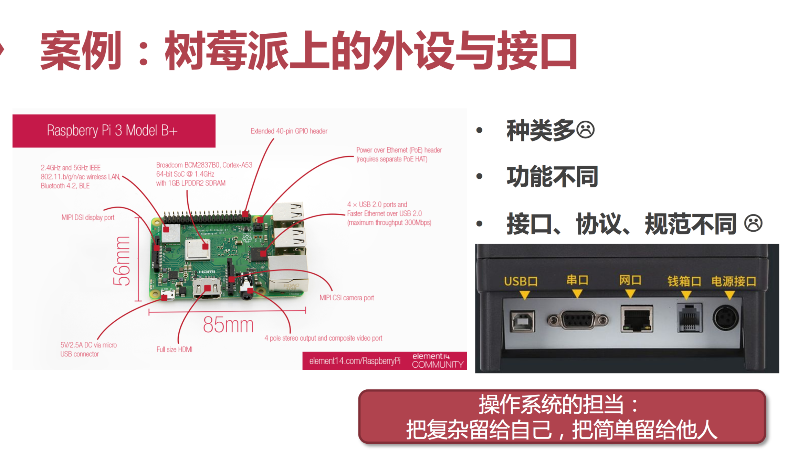

即使是最简单的电脑，也需要接入外设才能正常工作。

#### Phrase

*What I cannot create, I do not understand.*

如果我不能去创造某事物，那我也就不能理解它。

### Learning Devices

#### Device

首先需要厘清：

* 设备的基本用途
* 设备的分类
* 如何驱动他们工作（可编程接口长啥样）

#### GPIO LED

就是一个灯…根据电位高低决定灯的亮灭。

#### Keyboard

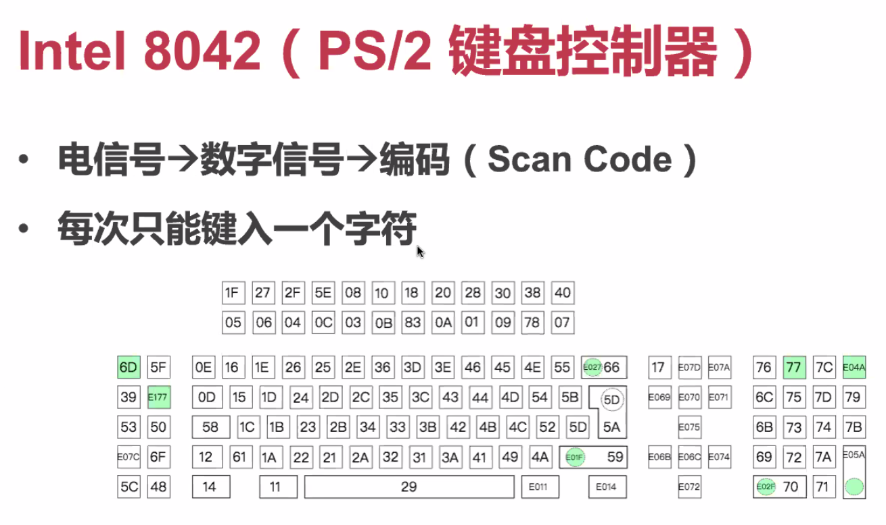

最典型的 Intel PS/2 键盘，

> 不是 PlayStation 2 啊）

#### UART

* aka. Universal Asynchronous Receiver/Transmitter

* 半双工：发送端和接收端不能同时工作

* 每次只能传输一个字符

#### Flash 闪存

* 按照 Page/Block 的粒度进行读写／擦除

* 而且支持 Page/Block 的随机访问

* 具有空间随机性

#### Ethernet 网卡

* 每次传输一个数据块（以太网帧）

* 特点：时间上串行，空间上随机

#### Others

* 传感器
* 陀螺仪
* 磁力计
* 协处理器（Co-Processor，如 GPU、TPU…）

### Abstraction

抽象有多重要？

#### Example

```c
char buffer[256];
int read_num = -1;
int fd = open("/dev/something", O_RDWR);
write(fd, "something to device", 19);
while (read_num == -1) {
    read(fd, buffer, 256);
}
close(fd);
```

Unix 下，任何设备都被抽象成文件（File）。

因此，不论这个 `/dev/something` 是个闪存盘上的文件，是个 UART 设备，还是一个其他的什么外部设备，都可以通过这种方式进行 R/W 通信，而无须采用设备特异的方式。

#### Categories

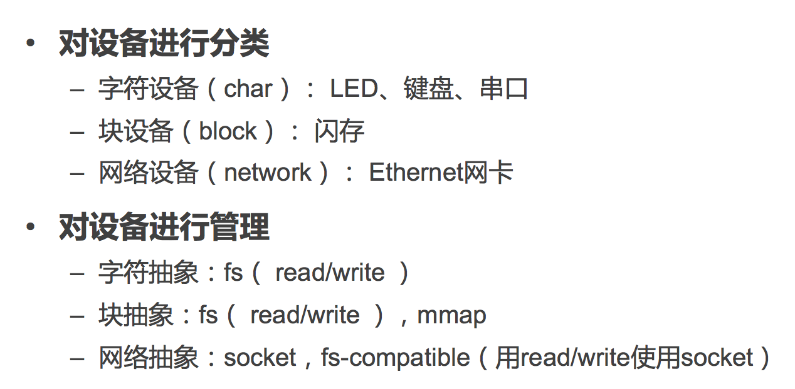

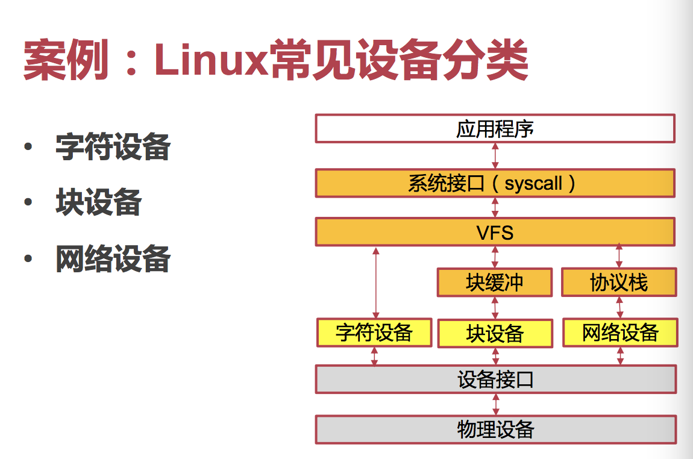

##### Character Devices

基于字符的设备，基本采用 `open()`、`read()`、`write()`、`close()` 就足够了。

访问模式基本是串行访问、每次操作一个字符（`char`）。

例如键盘、鼠标、串口、某些打印机都是这类设备。

##### Block Devices

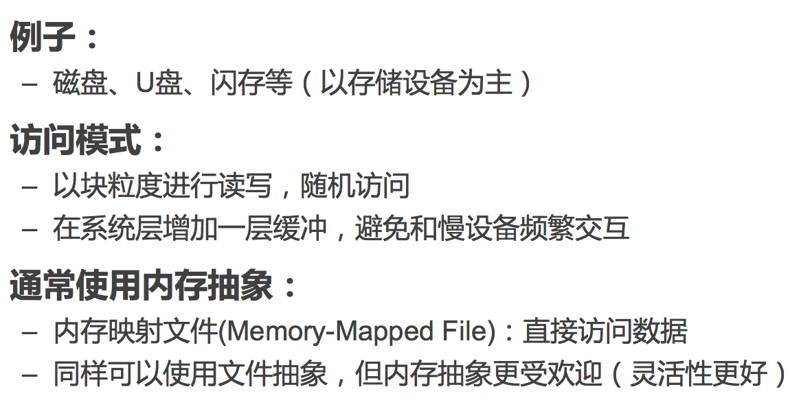

因为考虑到其空间随机读取性（或者，理解成**任意**性，即可以随意读取空间中任意位置的内容），所以得用「内存映射」的方式进行任意访问啦。

##### Network Devices

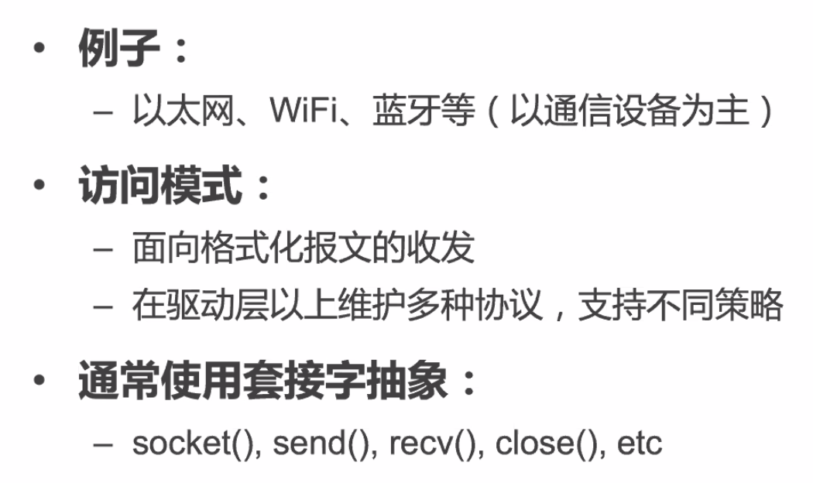

网络同时具有两种特点：每次收到的 Block 很大，可以在其中进行空间任意读取；然而 Block 到来的时间是串行的，不可随机读取的。

因此采用了特殊的 Socket API 进行交互。

#### Data Interaction

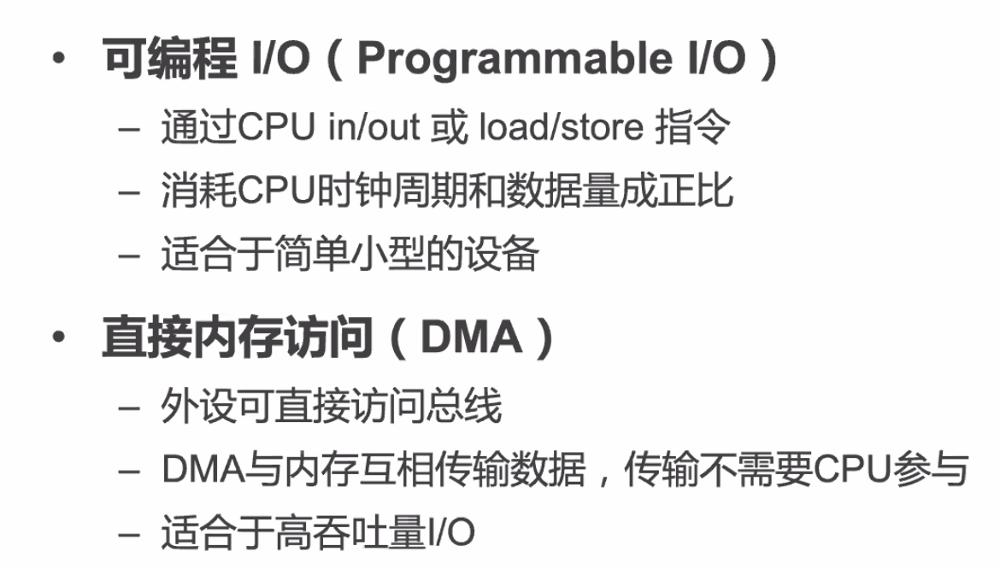

交互数据的两种方式：／

### Interrupt

外部设备的执行和 CPU 是相对独立的，因此要他们之间产生交互，必然需要产生一个「中断」，或者说，一个「异步异常」。

#### SOP

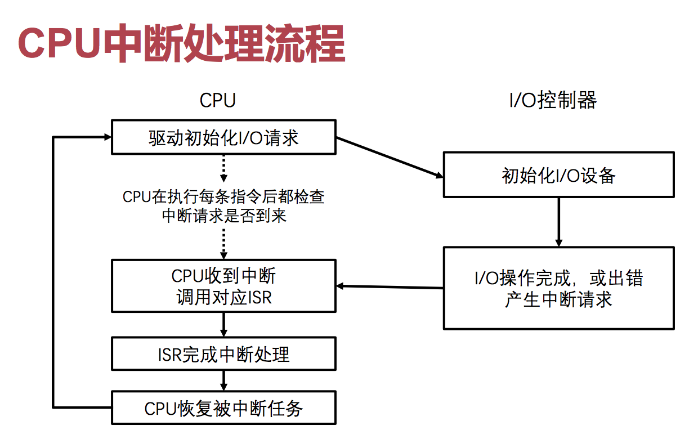

#### Interrupts

使用 `$ cat /proc/interrupts` 就能看到当前的所有中断。

#### AArch64

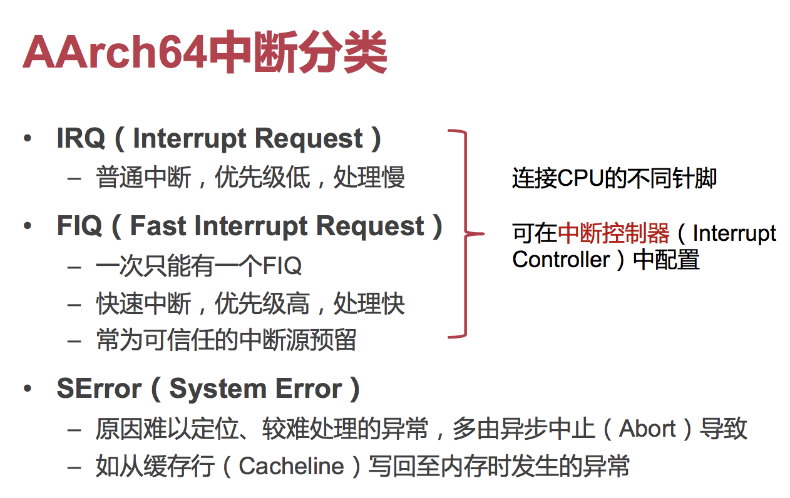

那么，在多核系统下，一个设备产生的中断就给一个 CPU 核心处理就行了，没必要把所有的 CPU 核心都打断。那么，如何决定哪个 CPU 来处理这个中断呢？

##### GIC

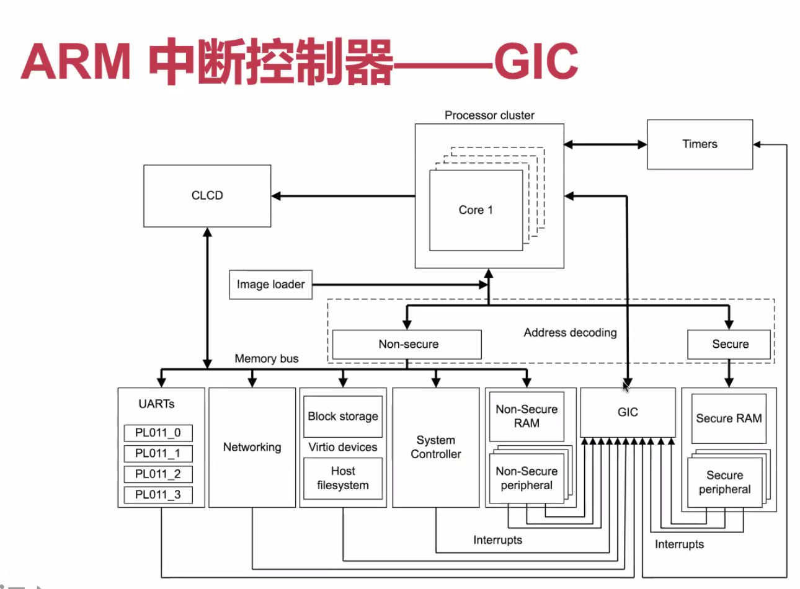

所有的终端都先交给 GIC 来处理。

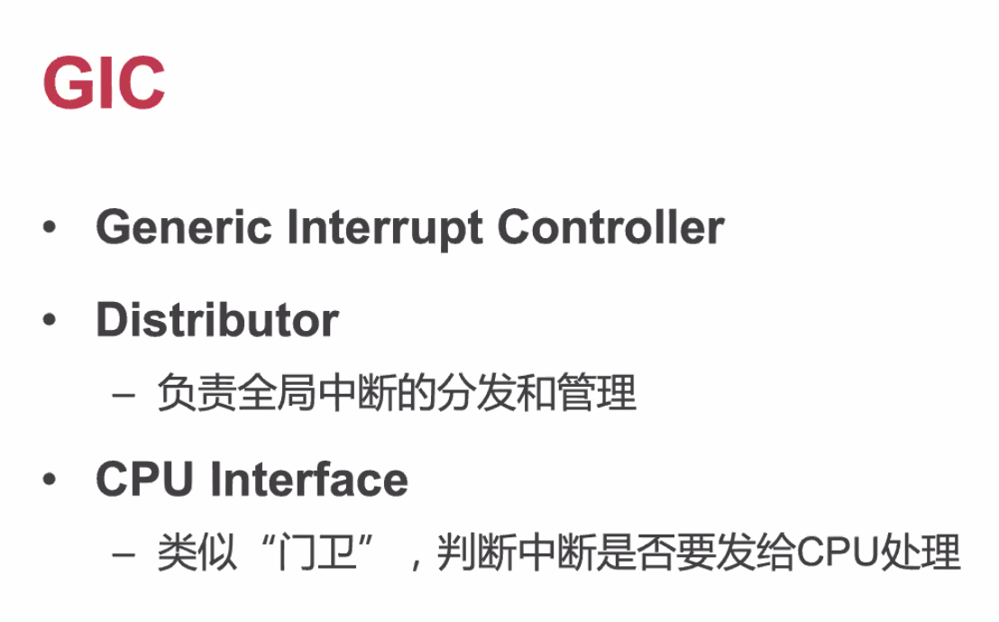

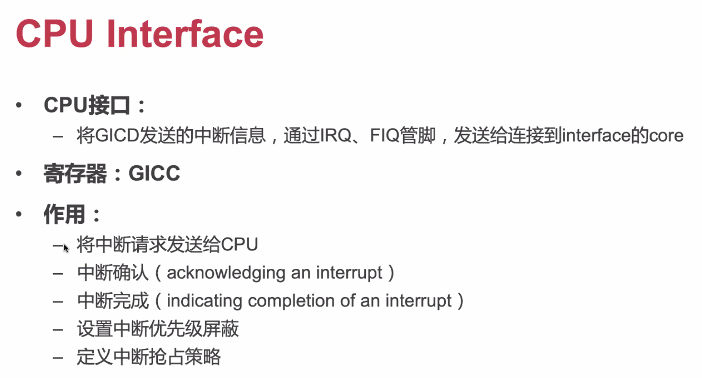

GICC 寄存器里面就保存着中断信息。

> GIC 的 counterpart 啊，x86 里面叫 APIC。

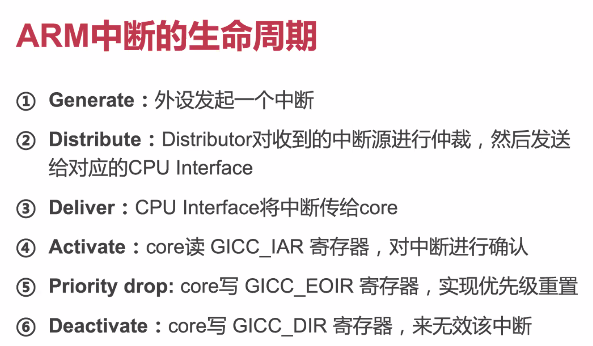

#### Recursively

中断也是可以被嵌套的。但只有更高级的中断可以掺一脚。因为中断等级有限，因此不可能无限嵌套

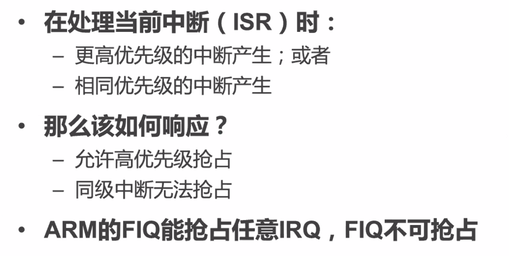

