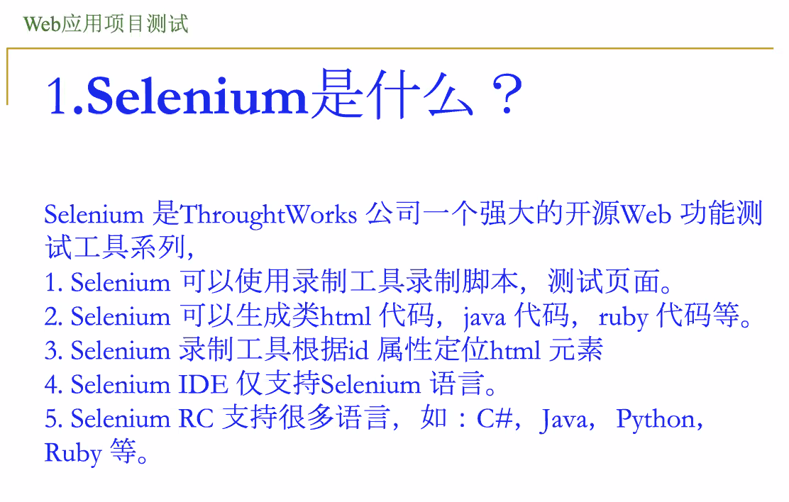

May 18^th^, 2020

## Software Testing

### Test Minimization

#### Intro

最小化测试：从上一次测试用例中，挑选出一些作为下一次回归测试的用例。

如何选择本次采用的测试用例？

> 也是一个效率和有效性的平衡。以最小代价（最少的测试用例）实现尽可能完备的测试（覆盖）。

#### Example

拿一个很简单的例子来说事。

在只修改一部分程序的情况下，我们可以减少调用一些测试用例，同时不减少覆盖率。

这里的「覆盖率」可以是任何一类被测实体：类、函数、分支、语句都可以。

#### Procedure

* 首先，我们要确认一种实体：就是那个「不降低其覆盖率」保证中对应的实体类型。

* 然后，确认每个测试用例经过的实体，列成一张表。

* 最後，检查修改了哪些实体，并把那些经过这些实体的测试用例提取出来，作为最小化的测试用例集。

例如，以 Basic Block（基本块）作为被测实体，就可以这么做 Test Minimization：

### Test Prioritization

#### Intro

最小化测试过程中会丢失很多测试用例的。这还是让人内心不安。

能不能不要丢弃掉这些测试用例，而是把他们放在比较靠後的位置（低优先级的位置）呢？

这样做的好处是：把优先级比较高（更可能查出来错误）的测试用例放在前面，可能可以做到 Fail Fast。

没有碰到被修改实体的测试用例优先级当然低；另外，那些 Cover 更多实体的测试用例的优先级应该高于那些 Cover 更少的。

#### Procedure

> 可以把 Minimization 和 Prioritization 合并起来，只选择那些优先级前 50% 的测试用例来跑。

### GUI Testing

#### Selenium

## Human-Computer Interfaces & Interactions

终于到了（有点用的）软件 GUI 开发课（

### 软件 GUI

#### 前因后果

* 交互设计：前提
  * 用户界面的外观和行为
  * 此时不考虑软件实现的约束，大胆自由地进行设计
  * 建立用户模型（User Mode），从用户的角度进行设计
* 界面软件：结果
  * 由代码开发人员制作
  * 需要考虑软件实现的约束
  * 有时很难实现

#### 前世今生

一个 GUI 设计不是一次性的。至少分为下面三个生命阶段：

* 定义
* 构造
* 维护

##### 可行性分析

* 调查用户的界面要求
* 了解人机界面设计的软硬件环境
* 做市场调研

##### 需求分析

* 用户特性分析
* 应用环境分析
* 任务分析

##### 概要设计

* 基于需求分析，形成 UI 概要设计
* 技术方案概要设计

##### 详细设计

* 屏幕显示、布局设计
* 控制模式设计
* 细化、确定用户模型
* 用户匹配度完善
* 引导、提示、报错界面设计
* 软件原型开发
* 综合设计与评估

设计要画图…

##### 实际构造

有一个名叫 QoE（Quality of Experience）的模型可以用来评估用户的体验质量。

设计的目标就是尽量使得诱导的行为和判断的行为尽量一致。

##### 维护养老

维护（Maintenance）也分很多种，包括：

* 改正性维护
  * 假如发现了一些 Blocking Bugs
* 完善性维护
  * 假如甲方提了一些新 Features
* 适应性维护
  * 假如我们想扩展到全平台
* 预防性维护
  * 为了防止将来出现问题…

### GUI 开发原则

#### 以用户为中心

* 人机匹配
  * 了解用户意图
  * 软件适应用户
* 适应各种用户的技能和弱点
* 考虑用户的知识背景

#### 一致性

* 概念模式
* 外观布局
* 交互方式
* 信息显示格式
* ……

都需要保持一致性。

目的是为了减少用户的学习、记忆量，降低出错的概率。

#### 信息反馈

以文本、图形、动画、声音等方式提供信息反馈。

* 布局简洁明了
* 行列整齐、间距一致
* 用空白区域突出重要元素
* 空间工具聚类排布

#### 配色

* 静态动态元素组合
* 合理配色，避免瞎眼
* 多用精致美观、易于识别的 Icon

#### 错误处理

* 提供友善的出错处理
  * 检测错误
  * 提供完整、简洁的错误信息
  * 提供应对策略
  * 提供数据保护、恢复功能
  * 不干扰正常工作
* 提供快捷方式
  * 减少输入、控制的复杂程度
* 允许用户返回的 Undo 功能
  * 缓解用户焦虑
  * 鼓励用户探索性学习
* 提供快速的系统响应和低的系统开销

### 尊重 GUI 历史

> 最早的 GUI 是 Xerox 的！Gates 跟 Jobs 都是抄的！！！（大声）

但 Apple 的 Macintosh 和 Microsoft 的 Windows 的确大大推进了 GUI 的发展。

如果您还记得 WINP，即窗口 + 图标 + 菜单 + 指针的基本元素…这就是目前 GUI 比较主流的形式之一。

另外一种常用的 GUI 也包括数据可视化界面：线图、饼图、动态图、高维图等等。明确直观地表达深层语义~~给领导看~~是其重要的用途。

最近，新兴的 VR/AR/MR 设备无法沿用原有的 GUI 设计了；因此新的 GUI 范式也被研发了出来。

总归，只要是信息量大，图形包含语义信息丰富，易于用户理解、记忆、学习、交互便捷、多样、功能强大的界面设计范式，都可以哦。

> 说到游戏引擎 GUI，我就想起那个 Autodesk Scaleform…
>
> 用 Adobe Flash (Animate) 搞设计，继承 SWF 播放器到游戏里的想法很好，就是 Bug 一堆…