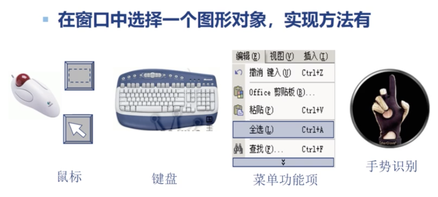
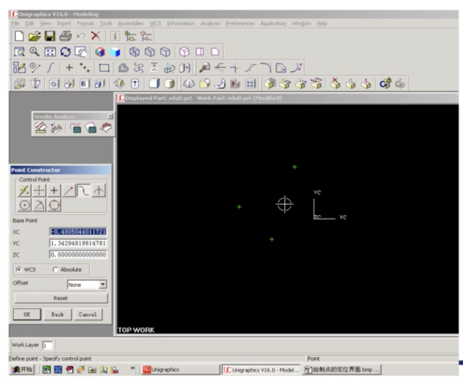
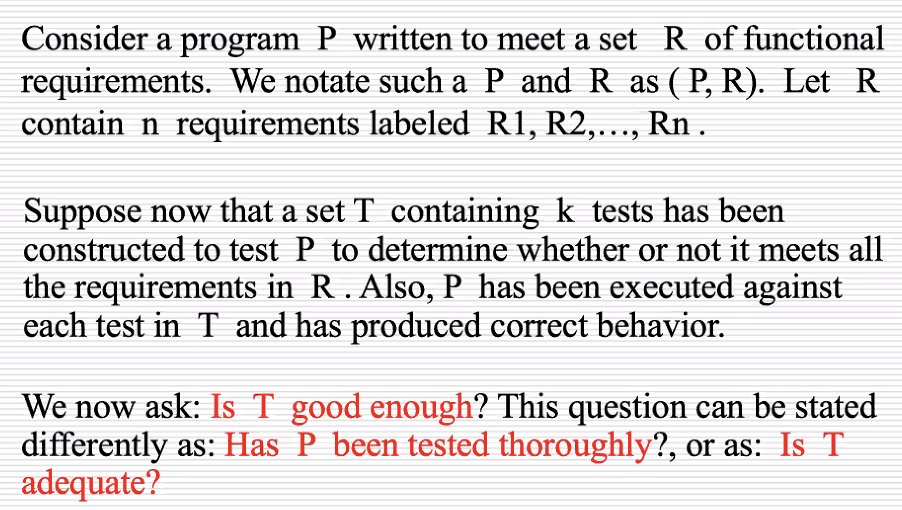

# May 24^th^, 2020

## SE-340::HCI

> 今天的主题：**图形交互技术**

### Outline

* 图形交互
	* 设备
	* 任务
	* 技术

### Graphics Interaction

#### Example

图形交互是什么？

可以简单理解成「和图形打交道」的技术方法。

#### Devices

显然，上面的任何方法都需要特殊的设备。

> 就算是直观的指点江山式交互，都需要专门的设备来采集读取。

输入设备（Input Devices）可以分这么几类：

* 定位、定向设备
	* Mouse、Trackpad、数位板 都属于此类
* 键盘输入设备
	* 包含很多 Keys，通过点按这些 Keys 来交互的设备
* 图形测量设备
	* 例如环境光传感器、距离传感器、数码取色器之类的
* 视频设备
	* Camera、iSight 之类的
* 三维交互设备
	* 印象深刻的有之前针对 CRT 显示器的「光笔」
	* 以及「摄像头 + 距离传感器」引入的浮空操作功能

以及最重要的输出设备（Output Devices）：

* 图形显示设备
	* 如显示器

##### Locating Devices

定位设备通常可以提供一个二维的坐标组。

###### Relative / Absolute

有的是相对一个固定的原点位置而言；有的是相对上次的位置差而言。

例如，鼠标／某些触控板／滚轮／摇杆本质上是相对定位（能得到移动偏移量）；而数位绘图板则是绝对定位。

###### Direct / Indirect

另外，定位还有直接／间接之分；用手指（或者别的方式）直接指向界面元素的定位方法称为直接定位；而基于 Cursor（指针）的定位方式是间接定位。

> 直接定位直观易学，容易交互，但精度不高；间接定位麻烦，不容易交互，但是精度高。

###### Continuous / Discrete

能够将人的连续运动采集成连续的物理量的定位设备称为连续设备。

> 例如，轻轻地移动鼠标和重重地移动鼠标，带来的光标移动幅度是不同的。

而那些只能固定采集、不连续信号的设备称为「离散定位设备」。

> 所以说，玩赛车游戏就该用手柄啊！
>
> 谁会用键盘 WASD 开车啊！

##### Keyboard Devices

键盘也是个比较经典的设备；将大量有特殊功能的按键排布在一起，实现工作效率的提高。

应该注意到，不是所有的键盘输入设备都是用来输入「字符」（Characters）的；也存在功能键盘、控制键盘、快捷键盘等等。

> Q：是否存在如此准确、快速、方便的字符输入方法？
>
> A：参见笔记末尾。

##### Graphics Measuring Devices

根据测量获得的数据，创建空间位置点，实现输入。

激光扫描测量仪、三维坐标测量仪、超声波测距仪、Wi-Fi 测距定位（极其粗略）…

目前这一套用得很少了…

手机的测距仪现在用途仅限于「手机贴近耳朵自动锁屏」之类的。

Mixture Reality（混合显示）可能对这一块比较感兴趣；但实际上已经脱离了这一范畴；重建了三维模型之后，就完全不需要这样的测距设备了。

> 简而言之：没什么用（逃

##### Video Devices

不光是只有一般的摄像头哦！

有能够感知红外光的特殊摄像机；

有能够测量深度的三维相机；

有一整套采集人体的 Kinect 设备。

##### 3D Interaction Devices

三维交互设备…

确定人体在三维空间的方向、位置、速度、用力大小之类的东西。

> 实际上，直接把设备放到人体身上，然后直接通过内置的陀螺仪、加速度计来确认人体的各物理指标，更方便一些。
>
> 通过图形的方式来估计这个，不是很方便…
>
> 但如果用这些设备，这又和本章标题 Graphics Interaction 无关了…
>
> 或许这次 HCI 的 OpenPose 大赛用到这些比较多吧。

##### Graphics Display Devices

普通的显示器都搬不上台面了…

* 双目立体显示头盔
	* 高配版 Google CardBoard
* 裸眼立体显示器
	* 高配版 Nintendo 3DS
* 偏振眼镜
	* 高配版影城 3D 眼镜

### Graphics Task

图形在我们的交互中承担着什么样的作用呢？

X99 曰：八种。

* 定位
* 选择
* 文本
* 定向
* 定量
* 定路径
* 三维交互任务
* 组合交互任务

> 每一个都是语焉不详
>
> 其中後三种（定路径、三维交互、组合交互）基本都是凑数的…

#### Locating

不仅包括平面／空间定位，还包括了语义定位（SEMANTIC LOCATING）。

> 平面／空间的位置定位，在很多软件中都存在。

在定位之前，需要先建立一个坐标系，给出输入设备及精度，以此实现定位交互。

> 那么，语义定位是什么？

> 通过 Google 和 Bing，没有找到这是个什么词。
>
> X99 也没讲清楚。
>
> 留作问题。

#### Selecting

选择？很宽泛的用词。

* 选择一个对象
	* 可以是图标按钮
	* 可以是 2D／3D 对象
	* 可以是 UI 面板
	* 也可以是 GUI 窗口
* 集合选择
	* 同时选择某一类图形对象
	* 允许这种选择的时候，要考虑他们之间有没有共性，即多选他们有没有意义
	* 如果没有，则不应该允许他们被同时选择
* 区域选择
	* 选择某个区域内的所有对象
	* 在密集小对象很多时，能简化操作难度

选择的方式也有很多，包括：

* 位置选择
* 通过点选某个物体来选择之
	* 一般来说这种选择是互斥的
	* 一次只能点选一个对象
	* 且之前选择的对象会被清除，除非按住某个特定键
* 指定一个包围盒，选择其中所有物体
	* 这个包围盒一般通过按住 + 拖动来指定
* 命令选择
	* 通过执行某个指令来选择某些物体
	* 例如，菜单中的「Edit/Select All」和「Edit/Deselect All」
* 属性选择
* 操作数选择

选择的方式嘛…Image Processing 软件的选择方式是最多的。

有「自由套索」式选择（画出一个封闭区域）、「多边形套索」式选择（点出一个封闭多边形区域）、「魔棒」式选择（指定一个在阈值内的邻近相似区域）…太多了。

#### Direction

定方向…这就非常粗略了。

指定方向，本质上是给出一个 $n$ 维归一化的向量。

最常见的定向工具就是手柄摇杆：它可以给出一个二维的方向。

#### Path

定路径

> 这实在是太 Specific 了
>
> 定「路径」怎么也能成为一个独立的图形学任务呢

#### 3D Interaction

三维定位、三位选择、三位旋转、三维定向

> 得了，这不就是上面的那些拖到三维的情形吗
>
> 可是上面那些在讨论的时候就已经提到了 3D 情形啊
>
> 所以这条也是用来凑数的吗

#### Composite Interactions

上面的各种交互方式组合在一起

> 还是凑数的…

### Q & A

#### Question 1

除了键盘以外，是否还有准确、快速、方便的字符输入方法？

#### Answer 1

我猜测以目前的研究阶段没有。

即便是当年开天辟地创新的 iPhone，也仍然保留着「屏幕虚拟键盘」作为输入方法，且持续至今，可见通过「按键」的方式来输入字符已经称为人类共识。

除此之外的其他方法都或多或少有局限性：

语音输入，难以保证隐私和效率；

手写输入，难以权衡识别率和书写效率；

VR 输入，快别说了…现在用 VR 打个字比谁都麻烦（

我猜测未来唯一能够取代字符输入的方式就是脑电波控制了——高效率，保障隐私，前提是识别错误率得低。

#### Question 2

何为语义定位？？？

## SE-213::ST

### Mutation Test

所谓「变异测试」。

### Outline

* 测试充分性
* 增强测试技术
* 何为变异
* 充分假设
* 耦合效应
* 变异操作
* 变异测试工具

### Adequacy

#### Example

充分性的引入基于这一问题：我们引入的测试集，是否完全地覆盖了我们的程序？

即，我们的程序有没有被充分地测试到？

#### Idea

唯测试覆盖率论。

#### Mutation

既然是要找「发现错误」的能力，那么我们干脆人为引入一些错误（Glitch），看看我们的测试用例能不能检测出错误？

假如我们怎么修改源程序，某个测试用例都不失败，那就说明这个测试用例没有覆盖到源程序，是失败测试用例，因为他没有做到该做的事。

也就是说，这个测试用例不 Adequate。

