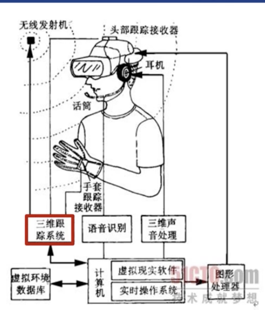
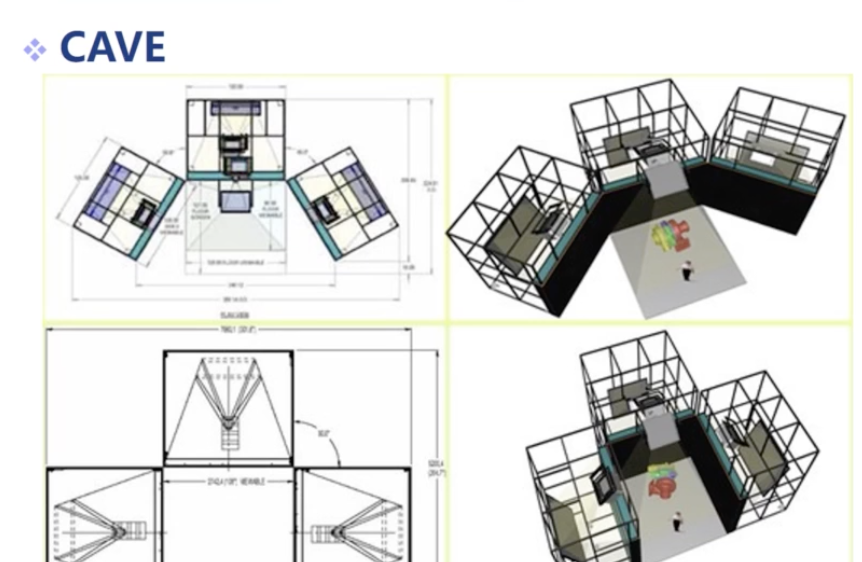
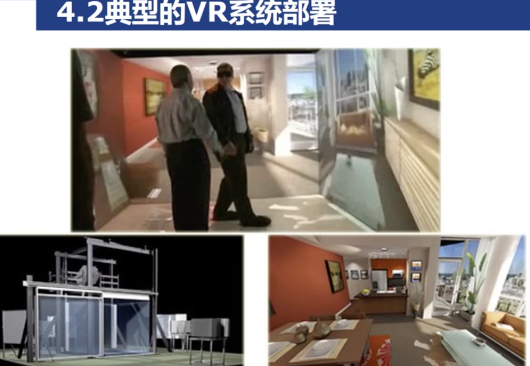
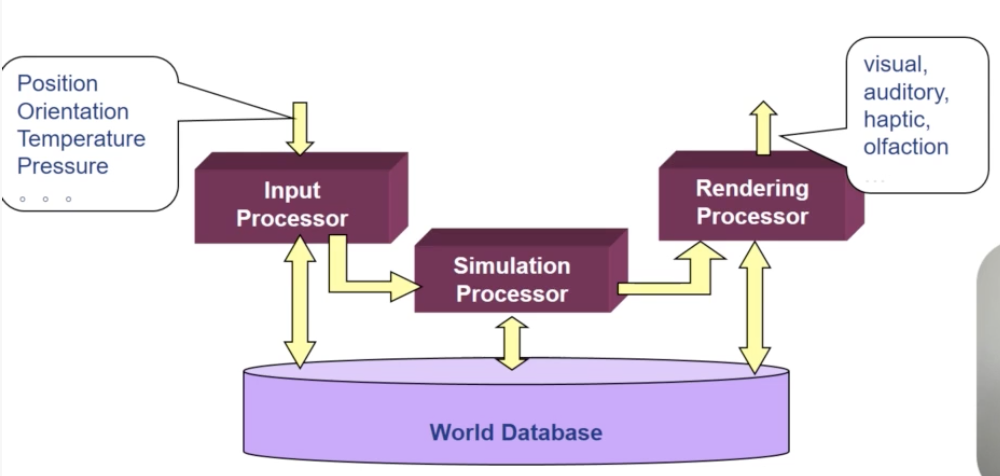
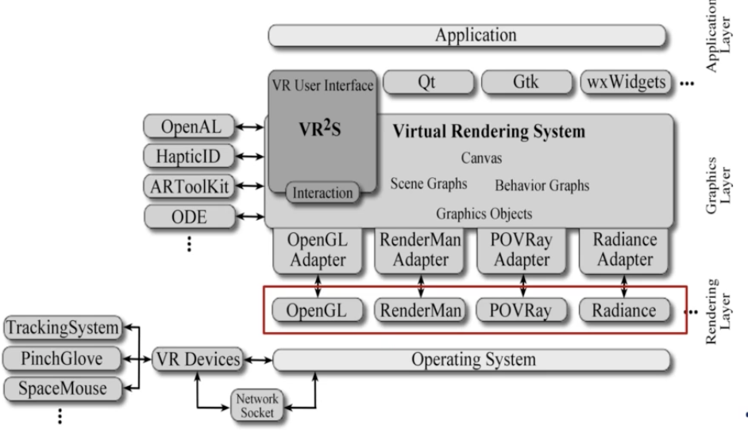

# May 27^th^, 2020

## SE-315

> 九九老师的 VR 课堂

### VR System & Appliance

VR，所谓的 Virtual Reality。

#### Definition

让您体验一个虚拟的世界。

提供一些虚拟的感官体验，以此来使得人类对于世界的判断产生错觉，**误认为**自己正处于一个真实的世界。

可以理解成「劫持」人的正常感官，用程序生成的进行替换。

#### Related Fields

因为真实世界实在太过复杂且丑恶，因此非要多种学科混合方可进行模拟。

* 计算机图形学
	* 用来 Hook 人的「视觉」——第一大觉
* 计算机视觉
	* CV 主要是干「把真实世界抽象成有意义的数字」这种活
	* 主要负责采集真实世界的数据，产生更真实的虚拟世界
* 数字图像、视频处理
	* 这个很显然
* 数字音频处理
	* 音频辨识可用于「语音交互」
	* 同时音频产生也可以用于满足人的「听觉」
* 定位跟踪技术
	* 在 VR 这种输入不便的情况下，体感是很重要的
* 传感技术
	* 这就很多了，凡是采集真实世界数据的技术都可以被纳入
* 人工智能
	* 主要是和「人」打交道的时候，机械计算不太适合
	* 这时候就需要模拟人类认知的神经网络技术来解决一部分问题
* 显示技术
	* 这里的显示不是狭义的 Visual Display
	* 还可以包括音频的播放
	* 气味的弥散（？？）
	* 温度的调整（？？？）
	* 给您真正的**沉浸式**体验

#### Features

##### Immersion

> 沉浸。

通过 Hook 你的部分正常感官，使得你相信自己正处于一个虚拟的世界中，感知不到外部的环境…

当然，假如沉浸没做好，做成个半吊子，结果就是用户反馈表示很痛苦，因为产生了错位感、迷向感。

##### Interaction

> 交互。

用户应该能够积极地操作虚拟现实。

最基本的，用户摇头晃脑的时候，看到的世界内容应该要随之改变。

更高级的交互就更多了。

##### Presence

> 存在感。

用户能感觉到自己「存在」于这个世界吗？

目前 VR 应用最大的问题是缺少存在感。例如，低头一看脚下无一物；伸手踢腿，看不见自己，得不到反馈；仿佛自己只是一个视点，在一个陌生的程序世界中…（打住

#### Deployment

##### Traditional

一个典型的 VR 系统是这个样子的。

> 51CTO.COM：技 术 成 就 梦 想

目前无线发射器、头部跟踪接收器、耳机、图形处理器、数据库、计算机都可以集成到一个可穿戴设备上了。在要求不高的情况下，手机也能担当此任了。数据也不需要用「无线发射机」发到计算机上进行操作了。

##### CAVE

上面这种传统模式已经不新鲜了。

这里还有一种超级烧钱的 CAVE VR 系统。

直接在人四周投影出对应的画面。

> 投影的分辨率……

但是因为跟真实世界有依赖关系（依赖于真实的墙进行投影），所以少了些沉浸感。

同样的，从 Technical 的角度来看…这是一个相当普适的图：

> 几乎所有系统都有一个 Input 一个 Output
>
> 几乎所有系统都有一个中央 Processor 处理信息
>
> 复杂一点的系统会需要 Database 做数据的持久化

这张图基本也就是这节课的主旨：输入（信息采集）、模拟（信息处理）、输出（信息显示）。就差一个数据库没讲了。（`@JBoss`）

> 这张图里的 OpenAL 是 2010 年之前的一个音频框架。
>
> 後来开发公司 Loki 不幸倒闭了…

#### Tracking

要做到沉浸感，光是生成一个真实的世界是不够的。

如果 VR 设备无法随着用户实时更新画面，那么用户只要一扭头、一摇头就穿帮了。

##### Physical Amounts

主要需要采集的物理量包括：

* Position（位置）
* Velocity（速度）
* Acceleration（加速度）

这三个量本质上是二阶微分关系；只要知道了 Position，就能够算出 Velocity 和 Acceleration；同样，知道了 Acceleration 和初始 Position 和初始 Velocity，也可以算出 Position 和 Velocity。

但是由于 VR 世界中采样率不高，这么算的结果一般会有误差。

所以实际上一般都会同时采集这些数据。

##### Aim

* 3D 空间定位
	* 要想把用户给摆在虚拟世界中，势必需要先得出其在真实世界中的信息，然后做变换。
* 动作捕捉 & 控制指令输入
	* 当然，直接移动身体是最本能、最直接、且可以盲操作的交互形式，相当适合 VR 环境下。

##### Special Tracking

目前，还有一些很特别的 Tracking 操作，即 Head／Eye Tracking。

这种 Tracking 关心的事情包括：

* 观察位置
* 观察方向
* 观察角度

主要用于随观察方向渲染虚拟世界。

#### Perception

这里有一些~~歪门邪道的~~感知…

##### Illumination

获取当前环境的光照…可能在某些情况下会有那么一点用吧。

例如，叠加式的 Mixture Reality 设备（例如微软家的 HoloLens）就需要考虑到环境光来调节亮度显示，避免瞎眼。

##### Pressure

识别压力（？）

这里采用的用例是——VR 开车的时候，感知刹车片的情况。

……

#### Simulation

##### Graphics

图形上的仿真应该是历史最悠久的了。

人们为了渲染出一幅看起来像真实的画面，已经费了千辛万苦，提出了多门学科。所谓 CG。

##### Sound Effects

本质上来说，声音的来源就是空气中的纵波，是个物理问题。完全有可能实现纯粹的模拟，而不借助任何预采样的音频素材。

大概主要是因为直接录音然後播放的效果太好，真的去模拟太浪费？

反正目前的游戏里几乎没有纯物理模拟音频的；无论是爆炸的音效、碰撞的音效，都是基于提前录制的音频素材模拟的（虽然在这个过程中，会经过音量调节、空间模拟、噪波混合等等过程，肯定不是直接放录音那么简单）。

##### Motional Physics

动力学仿真。

随着交互式、高自由度游戏的发展，动力学仿真也越来越成熟了。

主要是为了满足玩家胡闹的心理（不），所以希望游戏世界中的物体能够几乎按照真实物理规律运动，让玩家更爽一些。

> 几乎所有的赛车游戏都把 $g$ 缩小了，不然手感非常奇怪

#### Display

既然完成了模拟（Simulation），那么不输出就太浪费了。

注意这里的输出不仅包括普通的视觉输出和听觉输出…还可以有「触觉输出」。

在玩家在虚拟世界中伸手摸到一个物体的时候，真实世界里的「手套」也略微放电来模拟触觉…沉浸感一定能大大提升。

#### Appliances

说了这么多，那么…VR 到底有什么用？

* 影视、动画
* 游戏
* 教育
	* 例如虚拟实境博物馆
	* 莫高窟就用了这种技术来保护文物
* 商业
	* VR 看房
	* VR 逛街
* 设计
	* 云协同设计
	* （虽然还是面对面 battle 比较带感
* 城市规划
	* SimCity VR？？？
	* 有点可怕
	* 这种事情还是老老实实 2D 做吧

#### Q & A

##### Q1

VR 还能被用在哪些方面？

##### A1

和其他的学科（例如 CG）类似，VR 技术也是搭着娱乐业的便车大幅发展的——随着 3D 游戏的普及流行，CG 也不断发展创新，最终被用于其他方面，例如教育、影视、创意设计等等。

VR 技术也很类似：这一次的流行也是基于看似没什么用的 VR 游戏。还没有像 CG 一样成为一门独立科学的原因主要还是局限性太大，效果不好，效果好的成本又太高。在这些局限性消除之後，几乎所有的展示方式都能从 3D 过渡到 VR，建立在这一技术已经十分普及的情况下。

