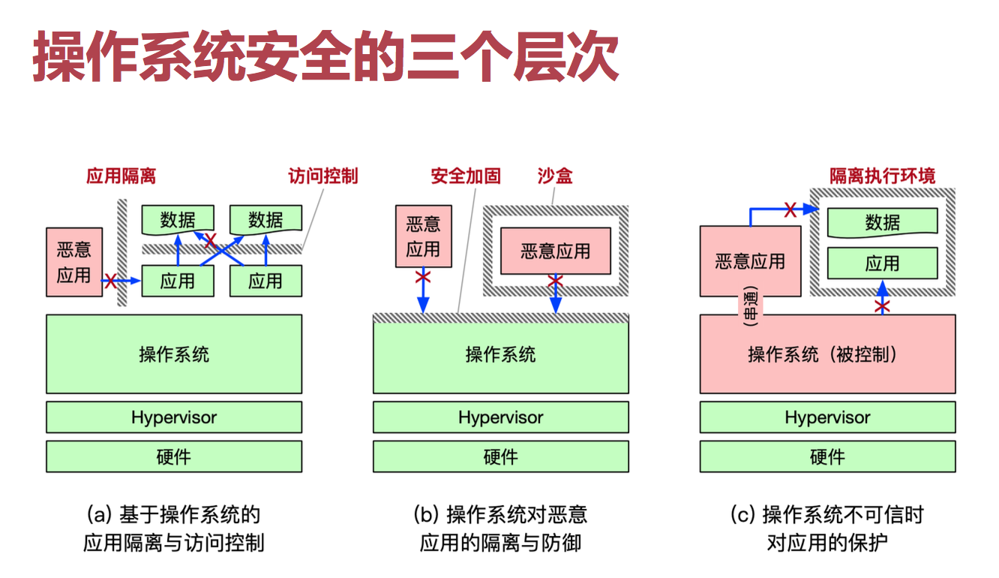
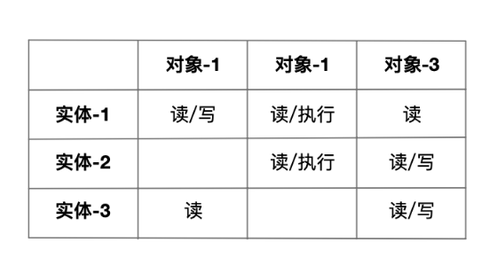

# May 28^th^, 2020

## SE-315::OS

今日说法：Security 。

我们正在使用的 OS，多大程度上是安全的？

### Security Layers

三层安全机制：从 (a) 到 (b) 再到 (c) 层次，安全要求逐渐提高，对于 OS 的要求也越来越高——保卫安全的身份也渐渐从被动到了主动；甚至还要考虑自己是否还安全。

#### Layer I

* 操作系统是可信的，能够正常执行且不受攻击
* 应用程序可能是恶意的，会窃取其他应用数据
* 应用程序可能存在bug，导致访问其他应用数据

这是一些非常强的安全假设；作为 OS 只需要考虑如何让恶意应用无法任意读取其他应用的数据。

#### Layer II

- 操作系统存在 bug 和安全漏洞
- 操作系统的运行过程依然可信
- 恶意应用利用操作系统漏洞攻击，获取更高权限或直接窃取其他应用的数据

这里，OS 可能存在一些 Bug 和漏洞，但其自身运行流程仍然不会被篡改。

#### Layer III

* 操作系统不可信，有可能被攻击者完全控制
* 恶意应用可能与操作系统串通发起攻击

这时，OS 就需要更加审慎小心、主动保卫安全。

### Concepts

一些 OS 安全相关的概念。

#### TCB

Trusted Computing Base：可信计算基

为实现计算机系统安全保护的所有机制的集合。

可以是软件、硬件、也可以是固件。

> TCB 越小，代码越少，计算机就越安全（统计学规律）。

#### AS

Attacking Surface：攻击面。

一个组件可能被其他组件攻击的所有方法的集合。

攻击可不会管什么 Hierarchy；可能被上层、同层、下层攻击。

> AS 越少，计算机就越安全。

#### DiD

Defense in-depth：防御纵深。

增加一些冗余的防线，进一步提升安全性。

### Access Control

#### Definition

按照访问实体的身份来限制其访问对象的一种机制。

#### Steps

1. 认证，Authentication（搞明白访问实体是哪位）
2. 授权，Authorization（给予其对应的权限）

#### Reference Monitor

普通的 OS 中，由 RM（引用监视器）负责认证、授权事宜。

* 任何主体不可越过安全机制直接访问对象。

### A & A

#### Authentication

如何「认证」一个实体？

* 知道什么
	* 知道密码／口令、某个问题的答案等
* 有什么
	* 如插入式 USB-Key，加密狗等
* 是什么
	* 某一类特定的实体天然可识别

#### Authorization

好了，现在我知道你（这个实体）是谁了。

那么，我怎么确认这个实体有什么权限呢？

##### Privileges Matrix

权限矩阵可以保存这个信息。

缺点？每次增加一个实体或对象，都得更新矩阵；而且这个矩阵会特别大，占空间。

##### User Group Technique

把用户分成固定数量的组：每个文件只需要用少量的 Bit 来记录自己给予每个用户组的权限；然后，问题就变成记录用户分组的问题了，这就大大减少了空间消耗。

#### When does this happen?

可以在 `fopen` 的时候检查用户标识位，而在其他操作的时候不进行检查，可以减少性能开销；

> 也就是，默认只要用户拿到了 `fd`，就认为其有权限进行操作。

也可以每次操作（包括打开、读、写）文件时都检查一次，这样比较安全，只是性能开销比较大。