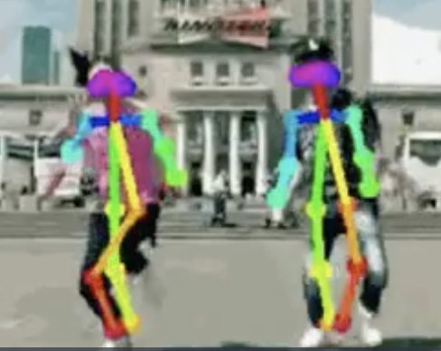
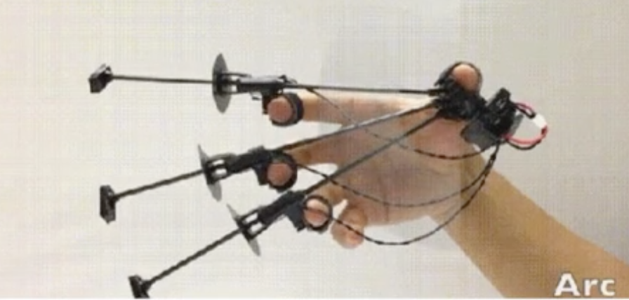
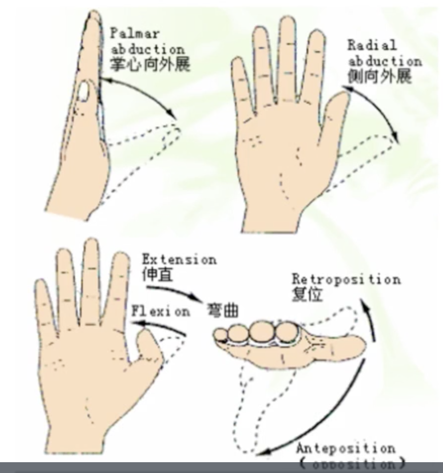
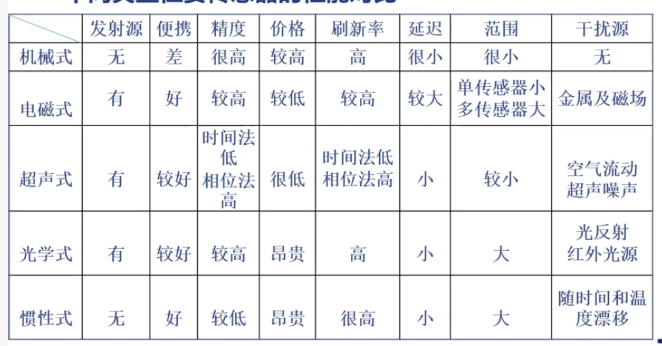

# June 8^th^, 2020

## SE-340::HCI

今日说法：VR 空间位姿传感技术。

### Appliances

* 捕捉人体动作
  * 了解当前人体的肢体动作状况
  * 

* 捕捉头部姿态
  * VR 里面尤其常用
  * 需要根据头部的观察方向来调整渲染画面
* 手势动作捕捉
  * 
  * 比较魔幻的效果
  * 上面的「物理采集」
* 力反馈
  * 光是采集数据可不够啊
  * 如果可以给予模拟真实的「力反馈」
  * 那就能大大提升 VR 的沉浸感和真实感了

### Tech

抽象地说，一个 3D 空间内的刚体（Rigidbody）运动有下面六个参数：

* 沿着 $x$、$y$、$z$ 三个方向的平移参数
* 偏航、俯仰、滚动三个欧拉旋转参数

因此为了实现一般化的位姿传感器，我们需要在各种运动情况下，以足够快的速度、较为准确地计算这 6 个数值。

另外，测量的过程不应该妨碍物体的正常运动，否则就失去了其意义。

> 上面的 3D 刚体是最简单的抽象方式。
>
> 一般的物体各部位之间也存在相对运动。

### Keys

对于 3D 位姿传感器而言，其主要参数包括：

* 采样率
  * 每秒钟采样多少次？
* 执行时间
  * 从「行为动作」到「给出测量结果」之间的延迟时间
* 传感精度
  * 实际物理量和测量物理量之间的误差
* 分辨率
  * 能够检测到的最小位置变化
* 工作空间
  * 超过工作空间的物理量无法被检测
* 障碍
  * 存在遮挡时，测量受影响的程度
* 同时测量对象的数量
  * 当然…这是有限的
* 校准策略
  * 是否可以提供一些校准方法，来矫正系统误差？

### Implementations

#### Digital Gloves

手和手指基本上是人身体可控制的最灵活的身体部分了。

通过手套这一包裹式的信息采集是比较合适的策略；因为人有戴手套的历史传统，因此不会很大地影响人的正常运动。

需要采集的手部动作包括：

基于手指的运动：

* 弯曲 / 伸直
* 外展 / 内敛
* 前位 / 复位

除此之外，还有基于手腕的运动：

* 摆手
* 招手
  * 好像就是旋转了一下的、幅度大一些的「摆手」吧…
* 平切
  * 玩「Fruit Ninja」

#### Mechanical

最早期的位姿传感器——

> 在那个原始的时期，很多传感器都始于暴力的机械实现

准确、精度高、刷新率高。

只不过要想用，必须连接到机械设备，不便携。

而且部分机械还会妨碍人的正常运动。

遮挡也是很致命的；机械传动装置无法穿越障碍物。

况且，有一些多方向的关节运动（例如，肘关节）难以用机械设备采集运动。

#### Electric & Magnetic

电磁吗…就可以实现无线了。

可以采用上节课提到的，不同方向的磁场的电磁感应强弱来实现每个节点的位置、角度信息的采集。

这样的策略允许障碍物的遮挡。

然而，由于复杂的电磁环境带来的干扰以及自然耗散，精度相对比较低。

#### Supersonic

还是把之前「VR 定位」的策略搬过来。只不过这里要在每个关节上都摆放一个定位点，方可确认整个手掌的姿势。

#### Ultraviolet & Ultrared

同上…

#### Inertial-based

这是一个比较有趣的策略：鉴于我们需要知道的「位置」信息在没有第三参照系的情况下不容易取得，但是我们可以在无需参照物的情况下简单地获取「加速度」这一信息。

由于位置实际上是加速度的二次积分结果，我们只需要了解精度足够高的加速度值，就能得到任意时刻的位置信息了。

当然，加速度测量存在偏差。而且，进行积分计算也存在偏差。这种误差可能逐渐累积，最终在某一时刻出现极为明显的错误。

> 事实上，这一策略也被应用到隧道车载导航里：在 GPS 信号不覆盖的区域内，实际上可以根据目前车辆的运动情况反推出某一时刻的位置信息，只不过有点误差。
>
> 但用来导航应该是足够了。

#### Summary

