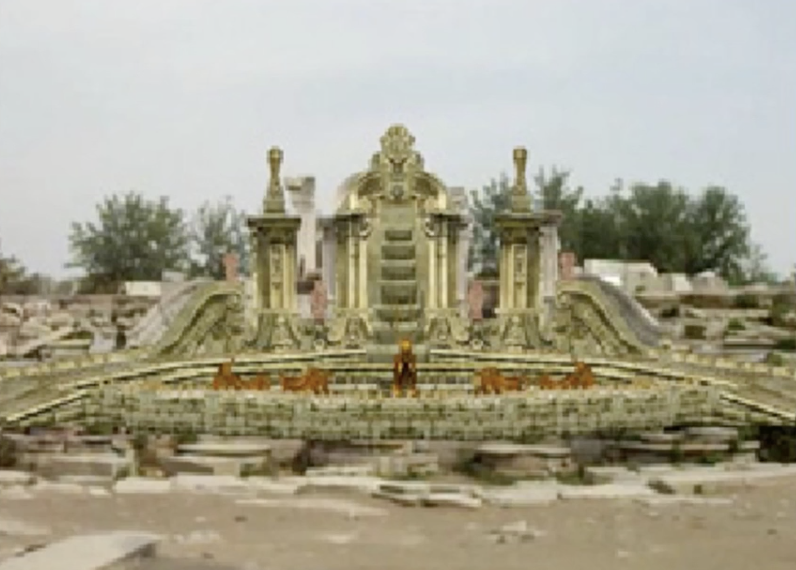
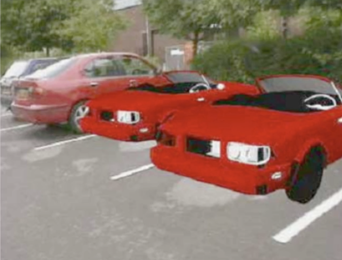
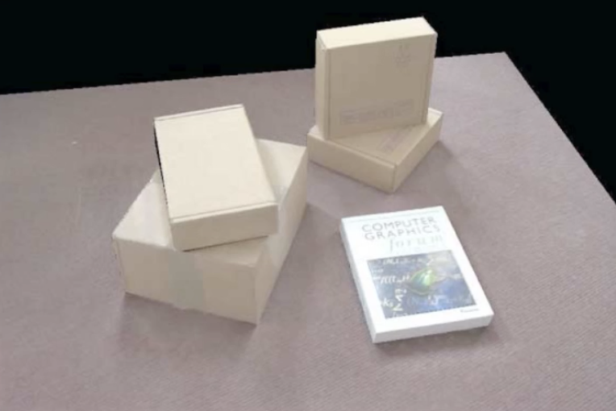
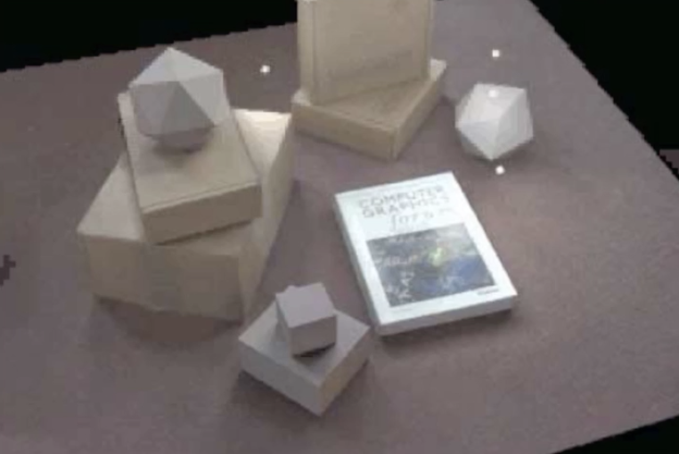
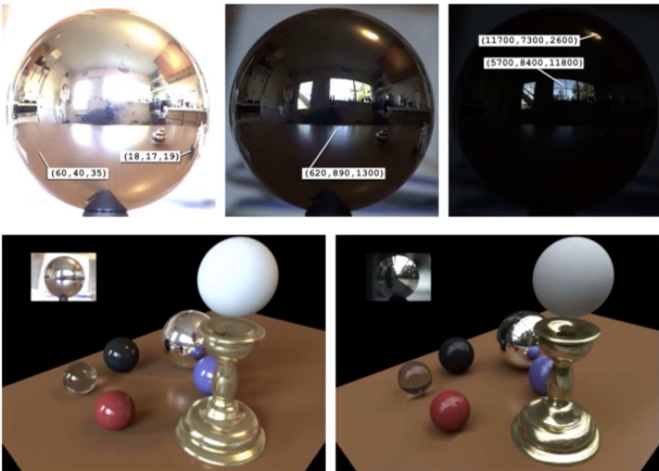
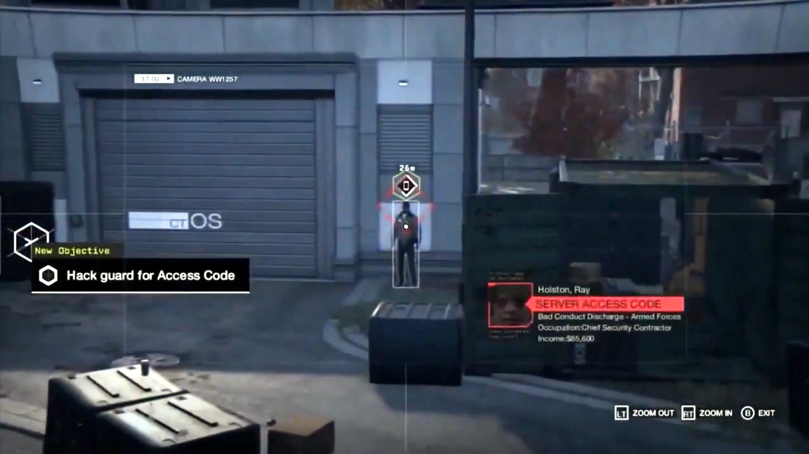
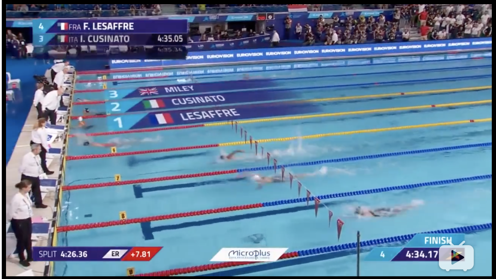
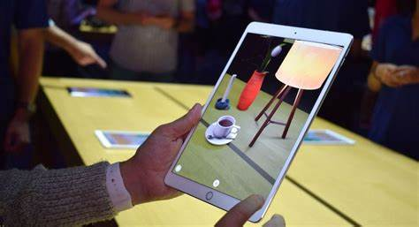

# June 15^th^, 2020

## SE-315

今日话题：MR，即 Mixed Reality（混合现实）。

或者说，比较常见的一种 MR，称作 AR，即 Augmented Reality（增强现实）。

### Definition

假如说，VR（Virtual Reality）是彻底构造一个虚拟的世界给你看，那么 MR（或者说 AR）就是把真实世界和虚拟世界融为一体。

AR 和 VR 一样，也需要实时采集观察者数据并渲染画面，但是不一样的是需要实时地加入一些「虚拟的内容」，并将混合的结果给用户展示出来；好像是给真实的世界中添加了一些内容，却又完全符合真实世界的观察规律，让人难辨真假。

这就是 AR 的究极目标。

### Problems

问题在于，AR 的机理，要求其必然会引入「虚拟」和「现实」的融合。而在融合的过程中，很容易产生差异感，从而使用户失去真实感和沉浸感。

> 目前的 AR / MR 效果，除了那些本来就不要求沉浸感、纯粹工具性的应用之外，基本都逃不开这种感觉。

### Techs

#### Different

对于 VR 来说，最大的问题是「要在用户移动视角的时候，尽量实时地渲染绘制画面」。

而对于 MR / AR 来说，问题不仅仅是需要实时绘制画面；为了把虚拟物体真实地放进空间中，我们还需要实时重建空间、并高精度地配准物体，这才是 AR 的难点。

#### Hardware

VR 所要求的显示硬件很高：因为需要完全屏蔽外界的视觉信号，传递给用户完全虚假的信息。

但 MR / AR 本质上是「叠加在现实」上的一层「虚拟」，因此不需要很高的显示硬件技术。甚至有些 MR / AR 实现（如 HoloLens、Google Glass）直接把虚拟画面投影到半透明屏幕上，自动实现叠加显示。

另外，VR 的跟踪、传感技术要求其实很低；只需要高精度地采集六个自由度的视点信息即可；而对于真实世界中的其他信息，则完全不必担心。

但 AR / MR 对跟踪、传感的要求很高；进行快速、实时的空间重建是相当复杂的。

### Appliances

* 展览展示
* 教育培训
* 旅游交通
* 文化传承
* 游戏娱乐
* 设计建造
* 辅助作战

还听说有医生用 HoloLens 辅助手术的（

### Categories

#### Optical AR

光学 AR：比较酷的一种。用半透明、半反射的镜片把真实世界（通过半透明性透射过来），而虚拟的画面则是通过反射进入人眼的。

#### Digital AR

直接通过摄影机采集真实世界的画面，叠加虚拟画面之後显示到屏幕上。

> 这就没那么酷了…

### Challenges

当然，最大的目标、也是最大的问题是：消除虚拟和现实的差别。

这里有很多潜在的因素可能阻碍了融合。有些元素是很不起眼的，但是人对于这些因素就是很敏感。例如：

* 光照效果
* 聚焦与对比度
* 遮挡与深度感知
* 减少延迟（不超过 7ms）

> 例如，这张图就踩了两个坑：完全没考虑光照效果，而且对比度高得吓人，完全无法带给人沉浸感。

另外，以上的所有算法都必须在合适的时间里完成。

### Scene Re:Build

#### Consistent Lighting

重建真实世界，不仅仅是把其中的物体和深度信息采集出来就行了。更重要的，需要采集「光照条件」。

> 上图是真实场景。

不光是要考虑真实世界中的物体在虚拟物体上的投影；还需要考虑虚拟世界中的物体在真实物体上的投影…

所以，我们选择在渲染所有物体之後，重新计算一次光照（重光照）。

> 这样的效果看起来比较美好。

#### Environment Reflecting

上面仅仅考虑了阴影效果。那么，环境光到底该如何决定呢？

* 通过采集真实物体，确定环境光的模式
* 代入虚拟物体的渲染计算，得到结果

#### Depth Cognition

就算是虚拟物体，也要遵循「近的挡住远的」这一规则。

然而本质上，虚拟物体是后续叠加在真实物体上的（无论是采用哪种 AR 的实现方式），因此在运算时就应该计算遮挡、并去除被遮挡的部分。

### Question

为什么那些纯工具性的 MR 应用就不容易让人产生「出戏」的感觉，而那些真的试图模拟真实世界物体的 MR 应用就让人看起来很虚假？

举例：这是游戏「看门狗」的画面截图；作为一个骇客主题的游戏，这种 MR 风格被应用到了很多方面：例如人物周围的线框、互动元素的显示都是这种融入真实世界的虚假的风格。

又例如在体育赛事转播的过程中插入的虚拟包装，也不让人觉得违和，反而很有沉浸感。

> 上图中的「名次、国家、运动员」字幕条是实时叠加在运动员所在的泳道上的，且贴合着镜头的转动。

反过来看一下那些真实物件渲染的 AR，几乎可以一眼看出「虚拟」的物体：例如，下图中的「咖啡杯」就是一个不真实的物体。

为什么在上面两种场景中的 AR 没有下面这种这么扎眼？

### Answer

* 上面两种的 AR 元素基本上是「扁、平、高对比度」的，而且携带有效信息
  * 由于扁、平，因此没有阴影也符合人的预期
  * 由于高对比度，因此没有计算外界光照影响也显得不虚假
  * 又因为携带有效信息，人的注意力被集中在了信息上，不会倾向于观察物体本身
* 另外，赛事直播中的字幕设备都相当高级、具有极强的算力，因此计算可以非常实时，也不容易给人带来出戏感

