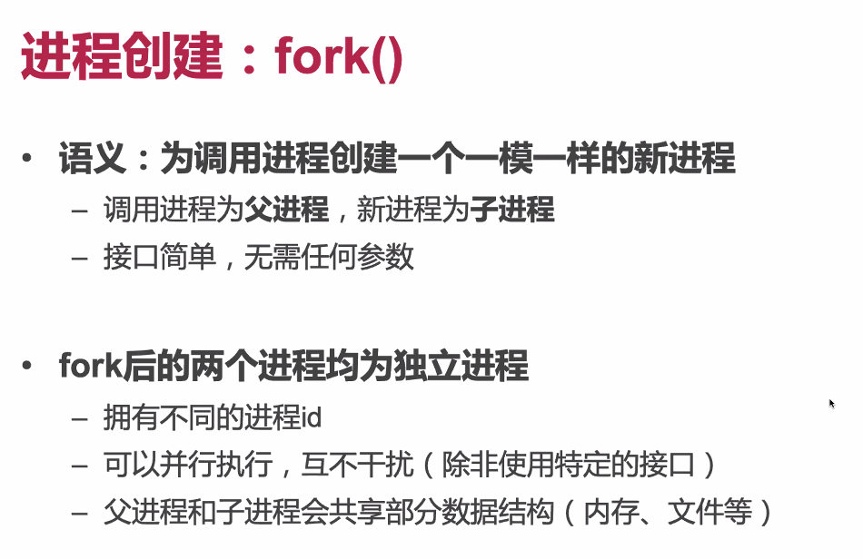
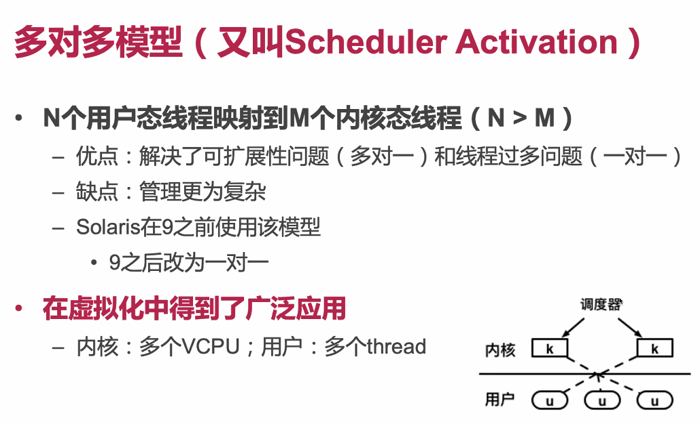

# June 16^th^, 2020

## SE-315::OS

今日，Full Review

### OS Definition

狭义地 OS，指的是包含了线程、内存、I/O 等模块的「内核」。

### Example

本次课改，把主要的平台从 x86 转移到了 ARM。

### Modules

* Everything is a file

### Page Table

主要的问题就是「Bit 位是怎么分的」。

另一个重要问题是：TLB。TLB 本身是硬件的东西，但是却需要 OS 来决定何时 Flush 之。

主要原因：硬件并不能知道某一个内存地址到底是不是页表。

### Thrashing Problem

内存不足时，设计不好的 Scheduler 会带来非常糟糕的性能下降。

### Scheduling

#### `fork()`

本身 `fork()` 的设计就比较反直觉…为什么会设计一个 `fork()` 而不是类似于 `create_process()`之类的？

#### Process => Thread

更少的上下文，更轻量级的切换

#### Fibre

纤程（或者说，用户态线程）。

都不用陷入内核态来管理。

类似于 Python 的那 `thread` 包吧…

#### Scheduler Activation

虚拟化里头用得多。（真实 OS 倒没什么人用

### Lock

* Spin Lock
* Ticket Lock
* ...

### Multicore

可扩展性断崖：多半是锁实现不好。

### Farewell

