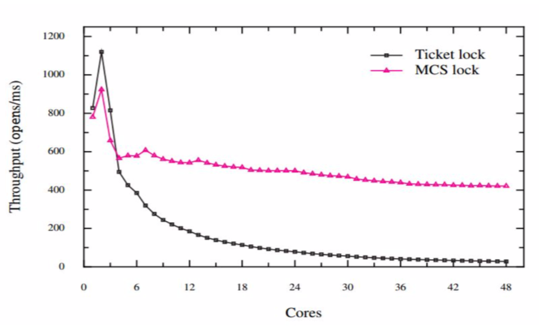

# Assignment 4

## Question 1

### Q

Explain why spinlock is not suitable for single-processor system but used in many multiprocessor systems? Is there any solution?

### A

For a single processor, two racing process can't work altogether. That means when one process is spinning and trying to obtain a lock, it is actually inachievable until next scheduling, which is a total waste.

However in multiprocessor systems, a lock-requestor and lock-obtainer might work at the same time. Only in this circumstances, lock-requestor's spinning is meaningful.

In order to adapt that to single-processor systems, we can use `yield` instruction. Once the lock-requestor notices the lock isn't obtainable, it should use `yield` to forcefully schedule immediately.

## Question 2

### Q

In the course, we have learned the case of reader-friendly read-write locking. This kind of locking can cause writer to starve, why? Can you give a design of read-write locking which favors writer (avoids writer starvation)?

### A

Because a reader-friendly strategy will always allow readers to come if there's no active writer. That means writers must wait until all readers leave.

So, if readers keeps coming consecutively, writers will never get a chance to obtain the lock. Starvation!

## Question 3

### Q

Assume there is a system with four processors and five identical resources. Each processor needs at most two resources within a limited time duration. Please show why this system is deadlock-free (all processors will eventually make progress).

### A

There are 4 necessary conditions for a deadlock situation to occur.

However, condition 4) isn't satisfied here.

Condition 1) declares one resource can only be allocated to one process. It's obviously true.

Condition 2) declares that a process should request more resources when obtaining some resources. It's true, since a process might request one more resource when obtaining one.

Condition 3) Non-deprivable. It's obviously true.

Condition 4) Loop waiting. That doesn't work, since the waiting condition can only occur when a process requires 1 resource when obtaining 1 resource. However there are 5 resources in total, so at least one process could acquire the next resource and start working.

If there are only 4 resources, deadlock might occur.

## Question 4

### Q

Ticket spinlocks can cause performance collapse under high contention. The figure below describes the performance of open system call using ticket locks and MCS locks. Please specify which code makes ticket lock’s throughput drop. How does MCS lock achieve scalability? (The left figure is the code of ticket lock.)

```c++
struct lock {
    volatile unsigned owner;
    volatile unsigned next;
}

void lock_init(struct lock* lock) {
    /* Initialize ticket lock */
    lock->owner = 0;
    lock->next = 0;
}

void lock(struct lock* lock) {
    volatile unsigned my_ticket = atomic_FAA(&lock->next, 1);
    while (lock->owner != my_ticket) {
        /* Busy looping */
    }
    barrier();
}
```



### A

The main problem of this ticket implementation is each lock obtainer keeps looping until its ticket gets priority. In order to keep this info synchronized among all cores, the cost will exponently inflate, causing the throughput drop.

However, MCS doesn't require such synchronization. By using linked node, it could greatly reduces high-frequency memory accessing. That won't greatly affects the throughput.

## Question 5

### Q

In the course, we have learned the NUMA-aware cohort lock. Although it can improve the performance in NUMA architecture, it introduces the problem of fairness, why? Can you give a method to solve this problem? (Recall what you learned from scheduling)

### A

The main problem is there are time elapsing difference for a process to access nearer memory addresses and farther memory addresses. That means if a variable is placed near one particular process, this process is more likely to obtain the lock. That introduces unfairness issues.

I assume that we can randomize the memory address of the lock variable. That might solve this problem to some extent.

## Question 6

### Q

You are implementing a spinlock on the ARM CPU and you find that the critical section is not well protected by your locking. After you learn about the Weak-ordering Consistency, you know you should add barrier to your code. Please add `barrier()` in the proper place.

### A

```c++
void lock(struct spinlock* lock) {
    /* locking */
    while (atomic_CAS(lock, 0, 1) != 0) {
        barrier();
    }
}

void unlock(struct spinlock* lock) {
    /* unlocking */
    *lock = 0;
    barrier();
}
```

