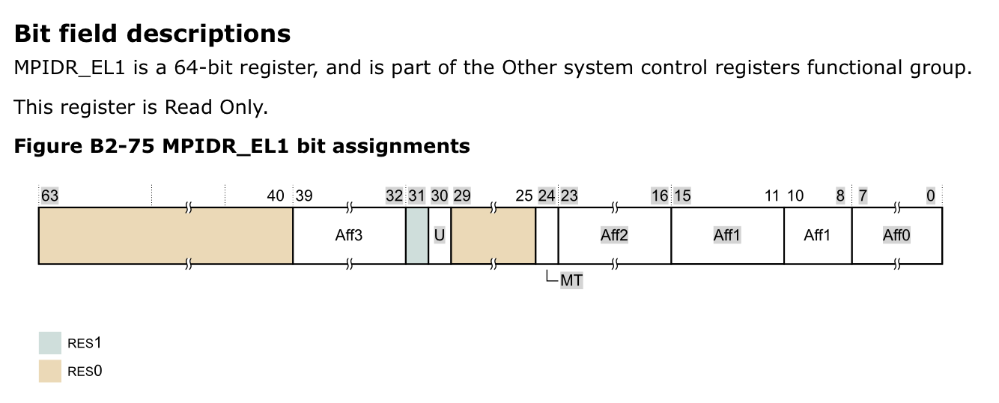

# SE-315

## Lab 1 Docs

### Environment

Provided VMware virtual machine was used, based on VMware Fusion Pro (`v11`).

Files were tracked under `git` version control system.

> Script Issues:
>
> `./scripts/docker_build.sh` didn't handle the situation that `$(pwd)` may contain space or other special characters.
>
> I used `VMware Tools` to mount virtual volumes to `os-labs-vm`, and happened to stuck in that minor issue.
>
> The solution is simple: using quotation marks to wrap the `$(pwd)` should fix that.
>
> `docker run -it <...> -v "$(pwd)":/chos <...>`

### Exercises

#### Exercise 1

Differences between x86-64...

##### Registers

* More Registers.
	* `ARMv8`, as a *CISC* ISA, has more than 30 general purpose registers, while `x86-64` has only 16 visible registers (and only 8 of them can be used for general purposes).
* Isolated Registers for Exception Levels.
	* There are 4 different privilege levels in `ARMv8` Architecture. Hardware registers are provided separately to ensure the isolation.
	* However, `x86-64` has no such hardware isolation design.
* Saved Program Status Registers Manipulating Methods.
	* Some critical runtime states are saved as grouped bits in a special register called SPSR. Using `LDR` or `STR` can directly manipulate that register.
	* `x86-64` has a counterpart called `EFLAGS`, however it can't be simply read or written by general instructions, but with special instructions like `LAHF` and `SAHF`.

##### Privilege Levels

* The Greater, the Higher.
	* In `ARMv8`, there are 4 exception levels. The greater the level number is, the higher privilege it could obtain.
		* Generally, the OS kernel **doesn't** run in the highest privilege level `EL3`, but in `EL1`, just one level higher than user-modal applications.
		* `EL2` and `EL3` is reserved by hardware monitor codes which is strictly verified flawlessly.
	* However, the *Protection Ring* System as the counterpart in `x86-64` works differently.  The lesser the level number is, the higher privilege it could obtain.
		* Generally, the OS kernel runs in the highest privilege level *Ring 0*.
		* There's no higher-privileged system working beyond the OS kernel. So any bugs lies in OS kernel could be fatal.

##### Instructions

* Instruction Lengths: Static or Dynamic.
	* `ARMv8`'s instructions have all the same length, which is 32 bits, or 4 Bytes.
		* That means *PC* (Program Counter)'s will always increase itself by 4 (Bytes) after each instruction fetching.
	* However, `x86-64` 's instruction length isn't static. That could reduce the binary code size but complicate the integrated-circuit implementation.
* Different Parallel Computing Implementation.
	* In `ARMv8`, spacial parallel computation is implemented via *aSIMD* technique.
	* However in `x86-64`, it was implemented by *SSE* technique.

* Conditional Instructions.
	* In `ARMv8`, there are very few conditional instructions left.
		* The only one is the `B.cond` instruction, which judges the `cond` condition and decide if it should perform a branch jump.
	* However in `x86-64`, there are much more conditional instructions like `cmov` (conditional moving).
* Updating Condition Bits.
	* In `x86-64`, all arithmetic instructions will automatically update the condition bits.
	* However in `ARMv8`, those normal arithmetic instructions won't update those bits.
		* Only those with `S` prefix will set the condition bits.

#### Exercise 2

The very first function running in the kernel is `_start`, which was defined in `./boot/start.S`, in line 12...

```
(gdb) where
#0  0x0000000000080000 in _start ()
```

...and its address appears to be `0x0000000000080000`.

By analyzing the kernel image `./build/kernel.img`, here's what i've got:

```
Symbol table '.symtab' contains 119 entries:
   Num:    Value          Size Type    Bind   Vis      Ndx Name
     0: 0000000000000000     0 NOTYPE  LOCAL  DEFAULT  UND 
     1: 0000000000080000     0 SECTION LOCAL  DEFAULT    1 
     2: ffffff00000cc000     0 SECTION LOCAL  DEFAULT    2 
	... ...
    91: 0000000000080000    48 FUNC    GLOBAL DEFAULT    1 _start
	... ...
   117: 0000000000086000  4096 OBJECT  GLOBAL DEFAULT    1 _boot_pgd_down
   118: 0000000000087210   160 FUNC    GLOBAL DEFAULT    1 el1_mmu_activate

```

Symbol #91 is the first function mentioned above.

> Document Typo:
>
> Option `-S` (capital) or `--sections` actually prints the section headers rather than the symbol table.
>
> Option `-s` (non-capital) or `--symbols` should print the symbol table well.

#### Exercise 3

Critical codes here:

```assembly
BEGIN_FUNC(_start)
  /* get the processor id, and store it in register x8 */
	mrs	x8, mpidr_el1
	mov	x9, #0xc1000000
	bic	x8, x8, x9
	cbz	x8, primary

  /* hang all secondary processors before we introduce multi-processors */
secondary_hang:
	bl secondary_hang
```

##### Dead-loop

Obviously, the `secondary_hang` branch is a dead-loop. Any control-flow goes there will stall forever.

So, in order to block all secondary processors, we just need to guide their control flow into label `secondary_hang`.

##### Distinguish Processors

How can we distinguish the main processor from other secondary processors?

A special register called `mpidr_el1` differs among Raspberry Pi 3's processors.

According to ARM's [documentation](http://infocenter.arm.com/help/index.jsp?topic=/com.arm.doc.101111_0101_04_en/lau1443447573920.html), the register `mpidr_el1` contains many useful informations, as shown below:



`MPIDR_EL1[30]`, also named `U`, indicates if current core is part of a multiprocessor system. If so, `U` should be `0`. Or else, it should be `1`.

`MPIDR_EL1[24]`, also named `MT`, indicates whether the lowest level of affinity consists of logical cores that are implemented using a multithreading type approach. If so, `MT` should be `1`. Or else, it should be `0`.

Let's think. If our system has only one processor core, we should never stall the current (only!) processor. Or, if our system is a multiprocessor one, we should stall all those secondary cores and only keep the first core running.

So in a word, if a core's `U` and `MT` are all `0`, we should stall this core because **a)** it is not the only core in the system and **b)** it's not the primary core. So the mask code should be `0100 0001 0000 0000 0000 0000 0000 0000`, or `0x41000000` in hex.

> In `./boot/start.S` it uses `0xc1000000`, which includes the bit `MPIDR_EL1[31]`, which is a reserved bit. Can't figure out why.

If it goes through the mask (by `bic x8, x8, x9`) and turns out to be zero, that means the current core shouldn't be stall. So, we jump to a normal branch `primary` to continue the initialization.