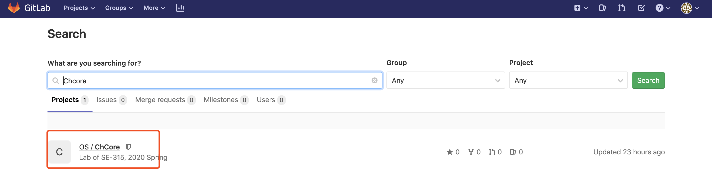

# Tutorial on How to Get ChCore from Gitlab

The ChCore Lab is maintained on a gitlab managed by OS TAs. You need to get familiar with the basic operation of Git to download the newly published lab and submit your own lab. 

There are several advantages for using Git to manage the lab: 

- Your code will not lose even when your computer is crashed, stolen, or you mistakenly delete the only copy of your code.
- You only need to type several commands to submit your lab instead of uploading it on FTP.
- You can use helpful commands like "git diff" to compare the difference between your buggy code and previously runnable code.
- ...
- The last and the most important thing is: TAs can easily keep track on your lab progress and **do duplicate checking**. :)

This tutorial aims to guide you to create your own lab repository and get the published original lab code in the gitlab.

## Step 1: Creating your own ChCore repository

First, you need to create your own Git repository.

### Step 1.1: Find the original ChCore repository

You need to log in to https://ipads.se.sjtu.edu.cn:2020/ and then type "ChCore" in the search bar.


### Step 1.2: Get into the web page of original ChCore

Just Click the link of `OS/ChCore` and you will enter the web page for original ChCore



### Step 1.3: Fork your own ChCore

Now you are going to `Fork` your own ChCore repository from the original ChCore repository. `Fork` means you will make a copy of the origin ChCore repository. Your further modification to your own ChCore will not impact the original ChCore.


## Step 1.4: Select the namespace

Just select the only choice. The content of `Student` should be replaced by your own **full name**. After this step, you will successfully create you own ChCore repository.


### Step 1.5: Set the visibility of your code

The Visibility indicates whether other members in the gitlab can view or update your code. As ChCore lab is a solo task for you, your code should not be dispatched to others. Therefore, the visibility must be set to `Private`. Do not worry about the visibility of TAs because they are the administrator :)

**Attention: TAs will periodically check the visibility and members of your repository. If your project visibility is not private and the number of your project member is more than one, you will be punished!**


## Step 2: Download the code and fetch the code from original ChCore

After your repository is created, you need to download it and start your lab implementation.

### Step 2.1: Get the unique link of your repository

Go into your own repository's web page. Please check the repository structure is `"Your fullname" > ChCore > Details`. Click `clone` and then `Copy URL` for `Clone with HTTPS`. The link of your repository is stored in your clipboard.


### Step2.2: Clone your own repository

Now you need to switch to the terminal and type Git's shell command. `cd` the directory you want to put your lab code. Type `git clone` and then paste the link in your clipboard to the terminal. 

If you get the following output, you have download your repository successfully.

```
~$ git clone https://ipads.se.sjtu.edu.cn:2020/[username]/chcore.git
Cloning into 'chcore'...
Username for 'https://ipads.se.sjtu.edu.cn:2020': [username]
Password for 'https://os@ipads.se.sjtu.edu.cn:2020': [password]
remote: Enumerating objects: 3, done.
remote: Counting objects: 100% (3/3), done.
remote: Total 3 (delta 0), reused 0 (delta 0), pack-reused 0
Unpacking objects: 100% (3/3), done.
```

### Step 2.3: Fetching original ChCore's code

Since the TAs publish labs by updating the original ChCore's code, your repository should keep track of the updates. This step is used to establish the basic information for you repository to pull the updates. 

```
~$ cd chcore
chcore$ git remote add upstream https://ipads.se.sjtu.edu.cn:2020/os2020/chcore.git
chcore$ git fetch upstream                                                         
From https://ipads.se.sjtu.edu.cn:2020/os2020/chcore
 * [new branch]      master     -> upstream/master
```

After that, when you wants to pull the updates you need to type`git fetch upstream`. 

`git fetch` only download the updates to a different code branch of your current code, which means this command will not modify the code you are working on. Therefore, feel free to type it.

`git merge` will apply the updates to your current code. Therefore, type this command only when your code is ready.

```
chcore$ git merge upstream/master
Already up to date.
```

### Step 2.4: Code branch and switching to the new lab

In the previous step, the "master" is the name of a repository's default code branch. A code branch can be treated as a duplication of the code. When you want to both maintain a stable version of the code and continue to modify it, you can type `git checkout -b xxx` to create a new branch. You will atomically switch to the new branch `xxx` and the stable version of code will be resided in your old branch. Meanwhile, you can still modify the code in the new branch.

When TAs release the `lab1`, `lab2`, and `labx`, they create a new branch in the original ChCore's repository. `git fetch` will fetch all the code including the branches from the original ChCore's repository. 

If you want to switch to a new lab. You can type the following commands, where `x` means the number of corresponding lab.

```
# fetch the remote updates, you are in branch labx-1
chcore$ git fetch upstream 

# you switch to the branch labx, whose code is based on the empty code provided by the TAs
chcore$ git checkout -b labx upstream/labx 
Branch 'labx' set up to track remote branch 'labx' from 'upstream'.
Switched to a new branch 'labx'

# update the remote tracking branch to your origin repo instead of the upstream repo
chcore$ git push -u origin    
To https://ipads.se.sjtu.edu.cn:2020/[username]/chcore.git
 * [new branch]      lab1 -> lab1
Branch 'lab1' set up to track remote branch 'lab1' from 'origin'.

# you will merge your code of previous labs to the new branch labx 
chcore$ git merge lab(x-1) 
```

If merge conflicts happen during `git merge`, please check if you modify files or functions you should not modify and recover it. If not, just ignore it.

## Step 3: Enjoy your lab

Contact to the TAs if your have any problems :)

 