# OS Review

## ARM

### 大纲

* Intro：操作系统的概念
* 为什么选择 ARM
* ARM 的硬件体系结构
* 操作系统启动过程
* 硬件模拟
* 中断、异常、系统调用

> 对应的课件：02、03

### 操作系统

#### 功能

* 服务应用、管理应用
	* 既要给应用提供足够的抽象功能
	* 又要管理应用不要玩脱
* 把复杂留给自己、把简单留给用户
	* 一个输出 Hello, World 的用户程序只需要进行 `putc` 系统调用即可
	* 而操作系统内核却要做许多努力

#### 架构

在我们这个教学 OS Kernel——ChCore 中，其微内核架构是这样的：

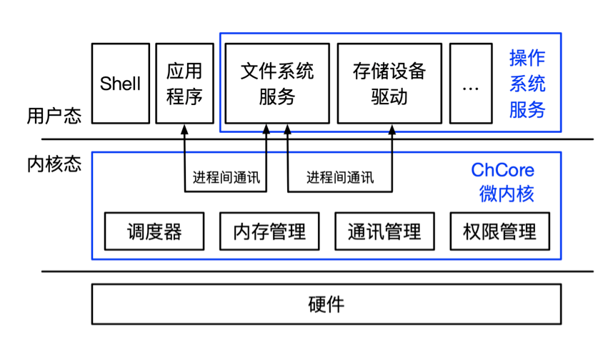

而她所依赖的计算机本身又是「冯诺伊曼」架构：

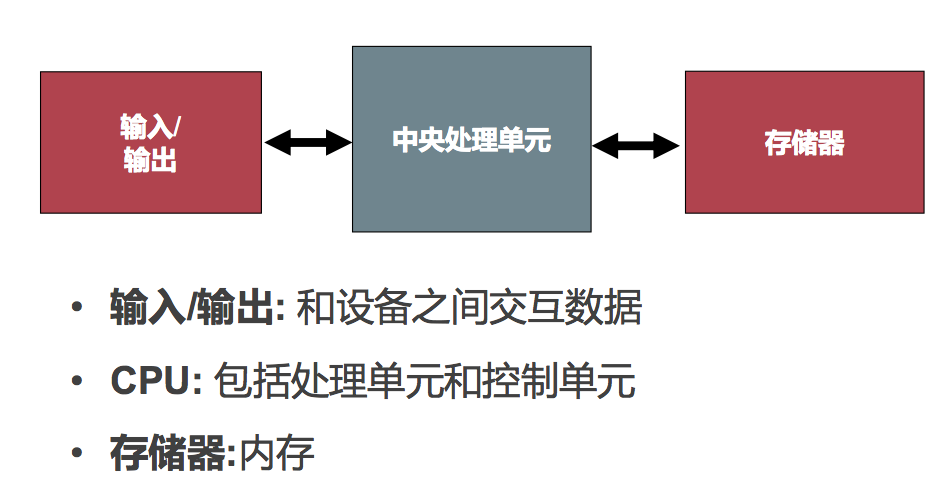

更简化一些，也就是分成两部分：

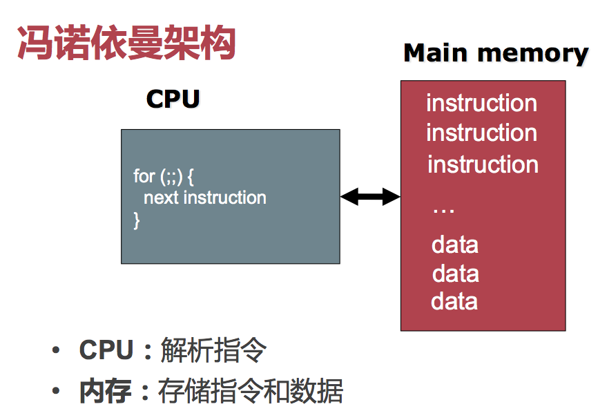

局限性很明显：

* CPU 和内存之间的信息交流太过频繁，以至于总线带宽成了瓶颈

* 数据、指令不区分，产生很多安全问题
* 严格串行顺序处理，并行能力比较差

### ARM

#### 特征

* 以手机处理器发家
* CISC，简化的指令集
* 更少的历史包袱
* 更高级的抽象

目前最新的版本是 ARMv8。下面都绕着这个讲。

#### 寄存器

CISC 的特点就是，寄存器超级多。

* 31 个 64 位通用寄存器 
	* `X0` 至 `X30` 
* 1 个 PC 寄存器
* 4 个栈寄存器（切换异常等级时时保存 SP）
	* `SP_EL0`
	* `SP_EL1`
	* `SP_EL2`
	* `SP_EL3` 
* 3 个异常链接寄存器（保存异常的返回地址）
	* `ELR_EL1`
	* `ELR_EL2`
	* `ELR_EL3` 

> 为什么不存在 `ELR_EL0` 呢？因为不存在运行在异常等级 0 下面的异常处理程序。

* 3 个程序状态寄存器（切换异常等级时保存 `PSTATE`
	* `SPSR_EL1`
	* `SPSR_EL2`
	* `SPSR_EL3`

相比之下，x86_64 的通用寄存器仅有 16 个；PC 寄存器（`%rip`）一样，是一个；栈寄存器（`%rsp`）不分异常等级，只有一个；返回地址直接压栈，没有专用寄存器。

#### 特权等级

x86_64 的特权等级是四个 Ring。Ring 数字越小，等级越高。

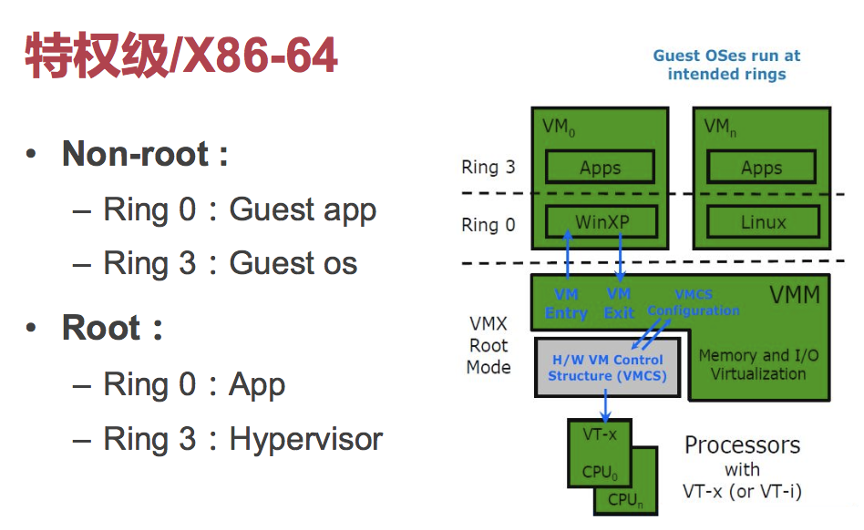

反过来，在 ARMv8 里头，Exception Level 数字越大，等级越高。

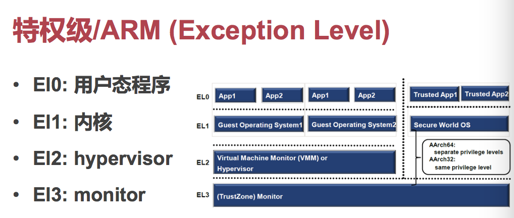

#### I/O

ARM 的设备输入输出采用的是 MMIO（Memory-mapped I/O）策略：即把外设映射到特殊的内存区段中，并且复用内存操作的指令来实现输入／输出。

相对的是 x86_64 中的 PIO（Port I/O）策略；即给 I/O 设备以独立的地址空间，并使用特殊的指令（`in`、`out`）来进行读写。

#### RISC vs. CISC

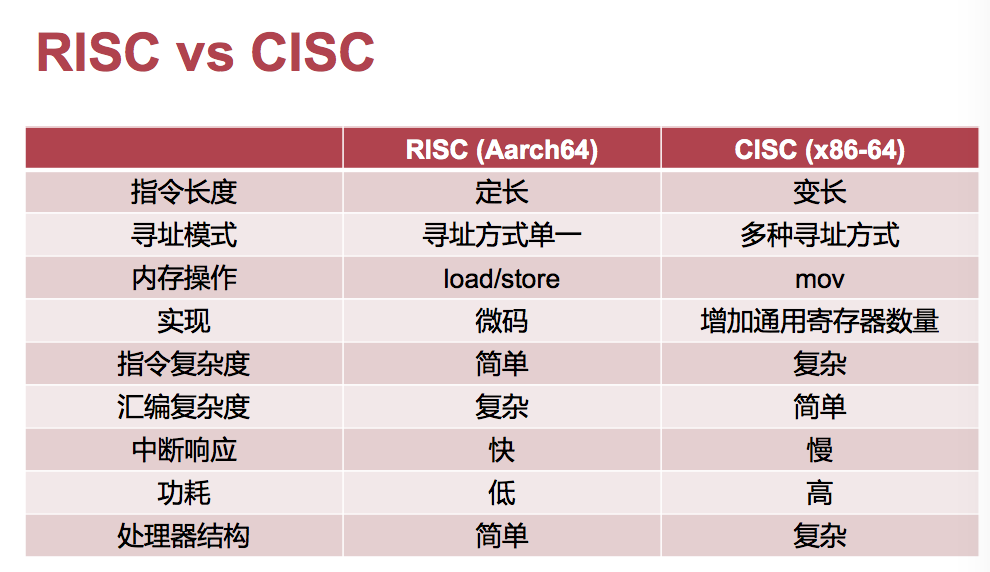

老生常谈的那张图。

> 昨晚 Apple 宣布要推出 ARM 版的 Mac…
>
> 心情复杂.webp

### 操作系统如何启动

以运行在 Raspberry Pi 3 上的 ChCore 为例。

CPU 初始化之後，自动从 SD 卡上加载代码并执行。此时的 CPU 运行在最高异常等级（EL3）上。Bootloader 负责降低异常等级，并启动 OS Kernel。

在成功跑起 OS 之後，OS 负责进行次要硬件的初始化工作，并开启页表。

#### Bootloader

在 OS 都尚未启动之前，执行的引导代码被称为 Bootloader。实际上 Bootloader 和 Kernel 位于同一个 ELF 文件；只不过因为 Bootloader 比 Kernel 更早发挥作用，因此实际上 Bootloader 被放置在 `.init` 区段，而 Kernel 则位于 `.text` 区段。

ChCore 的 Bootloader 做的事情基本不能再少了：

* 通过特殊的 ARM 指令，启动主 Core，并 Hang 次要 Cores

	* ```assembly
		BEGIN_FUNC(_start)
			mrs x8, mpidr_el1
			mov x9, #0xc1000000
			bic x8, x8, x9
			cbz x8, primary
		```

	* 这里，只有 Primary Core 才能跳转到 `primary` 处，而其余的 Cores 会陷入稍後的一个无限循环中。

* 自降身格，切换到 EL1 异常等级

	* ```assembly
		primary:
			bl arm64_elX_to_el1
		```

* 准备函数栈、异常向量

	* ```assembly
			adr x0, boot_cpu_stack
			add x0, x0, #0x1000
			mov sp, x0
		```

	* 这里，把 `boot_cpu_stack` 栈顶指针放到了 `sp` 中。

	* `boot_cpu_stack` 本身指向的是一个大小固定为 `0x1000` 字节的栈底部，因此需要做一次 `add`。

	* 这样，这个栈就可以用了。

* 初始化 UART

	* 为了实现最简单的 I/O；根据其协议映射内存空间即可。
	* 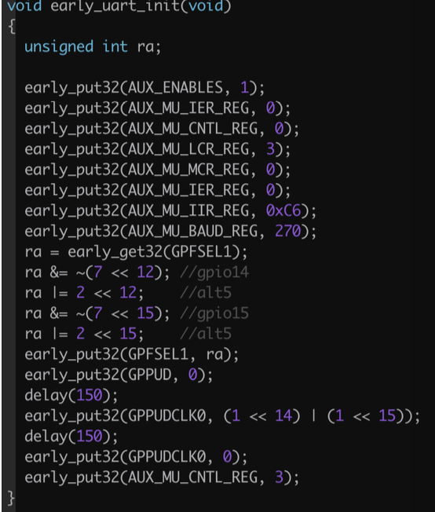

* 初始化页表、开启 MMU

	* 将 Kernel 代码映射到低地址段（和物理地址完全一致的位置）和高地址段两份
	* 目的是为了使 Kernel 内可以直接通过写物理地址访问自己的内存
	* 这是一个临时使用的页表，只是映射了 Kernel 代码段而已
	* 然後，开启 MMU（即告诉 CPU 已经可以用页表翻译机制了）

* 跳转到 Kernel 的 `main` 函数
	* 正式进入 ChCore

### 硬件模拟

显然，我们不会真的用一台树莓派来跑我们 ChCore，那也太难 Debug 了。

所以，我们使用 `qemu` 来模拟一台树莓派设备，帮助我们 Debug ChCore。

#### CPU 模拟

这个大家都写过 `y64-simulator`，应该都很熟悉吧。

类似于 CPU 去读指令，只不过用软件的方式来 Parse 指令，变成高级的函数调用。

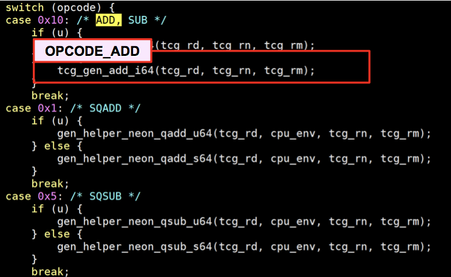

#### 寄存器模拟

这更简单了，直接开一段内存就行了。

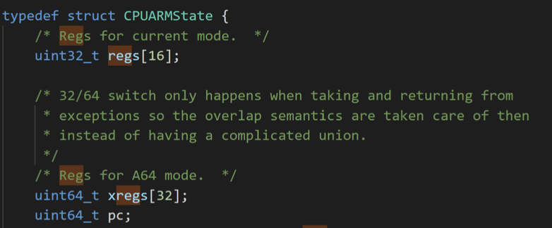

#### 内存模拟

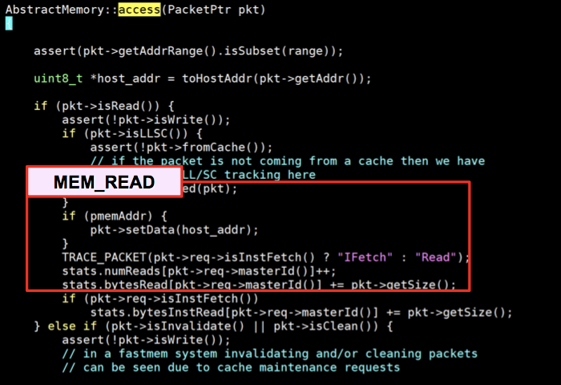

本质上也是映射内存；只不过视 MMU 开启与否，模拟器可能还需要自己受累进行一下基于页表的地址翻译工作。

#### 硬盘模拟

直接映射到 host OS 的一个文件上…

#### VGA 显示模拟

映射到 host OS 的一个显示窗口中…

#### 键盘模拟

通过 host OS 的键盘 API 得到用户输入，然后发中断给虚拟机…

#### 时钟芯片模拟

直接用 host OS 的时间 API…

### 中断和异常

上面我们明明白白地说「键盘模拟」就是「发中断给 Guest OS」…

说到底，用户的输入是怎么得到的？

#### 从键盘说起

键盘等外设一般都包含一个自己的缓冲区；用户每按一次键盘上的键，外设就会将输入存入缓冲区。

那么 OS 又是如何从这个缓冲区中获取数据的呢？两种策略：

* 轮询：OS 不断去读缓冲区中的值
* 中断：控制器收到输入之後，打断 CPU 正常执行，OS 进行处理

相比于 CPU 而言，人敲键盘的速度简直是太慢了。因此完全没有必要采用轮询的办法，那样大多数的轮询都会扑空。但假如调低轮训的频率，那么响应又没那么及时…总归，不适合这个场景。

而这个「外界信息」打断 CPU 正常执行的机制，就被称为「中断」（Interruption）。

#### 定义

* 中断（Interrupt）
	* 外部硬件设备所产生的信号
	* 异步。产生原因和当前执行指令无关
* 异常（Exception）
	* 软件的程序执行而产生的事件
	* 包括系统调用（System Call）
		* 用户程序请求操作系统提供服务 
	* 同步。产生和当前执行或试图执行的指令相关 

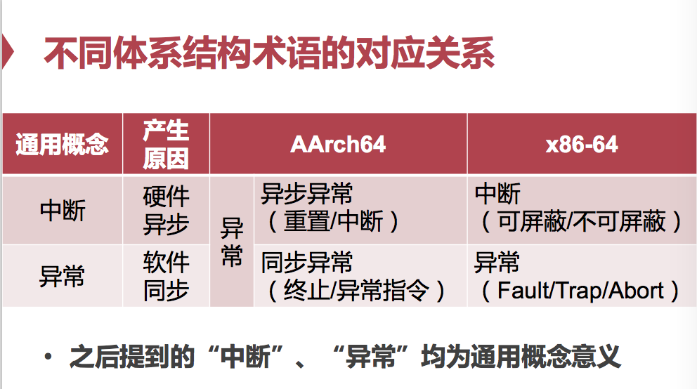

AArch64 的名词使用有一点点区别。多加留意。

#### 异步异常

也就是 AArch64 中的「中断」。

AArch64 的中断又分为两种：

* Reset（重置）
	* 最高级别的异常
	* 只用于初始化 CPU 核心
	* 只有上电控制软件、Watchdog 才有权触发
* Interrupt（中断）
	* 由 CPU 外部的信号触发
	* 打断当前代码的执行
	* 例如计时器中断、键盘中断等

我们关心的主要就是 Interrupt（Reset 也轮不到我们吧）。中断的产生都来自于 ARM 计算机结构中的 GIC，中断控制器。

中断又分为两种（…）。

* IRQ（Interrupt Requester）
	* 普通中断
	* 同时可以有多个
	* 优先级低，处理慢
* FIQ（Fast Interrupt Requester）
	* 快速中断
	* 同时只能有一个
	* 优先级高，处理快

GIC 本身管理所有的中断、决定优先级之後，才去发送给 CPU。

#### 同步异常

也就是 AArch64 中的「异常」。

AArch64 的异常又分为两种：

* Abort（中止）
	* 指令获取失败
	* 数据访问失败（如访问错误的内存地址）
* EGI（异常产生指令）
	* `svc`：用户程序到操作系统
	* `hvc`：Guest 系统到虚拟机管理器
	* `smc`：Normal World 到 Secure World

#### 中断处理

在经过了 GIC 之後，中断被发到了 CPU。OS 在得到了中断後，通过 `c_handle_entry` 函数进行处理。提供一个中断向量，查阅中断向量表，并跳转到对应的 Handler 处。

> 中断处理函数是没有进程上下文的。
>
> 因为中断的来源可能在任何代码处异步触发，不可以依赖于任何正在运行的进程、用户程序。
>
> 中断处理函数也不能睡眠、或者调用可能睡眠的任务、不能交出控制权，除非他已经完成，准备退出了。

ARMv8 的统称「异常」处理形式基本是这样的：

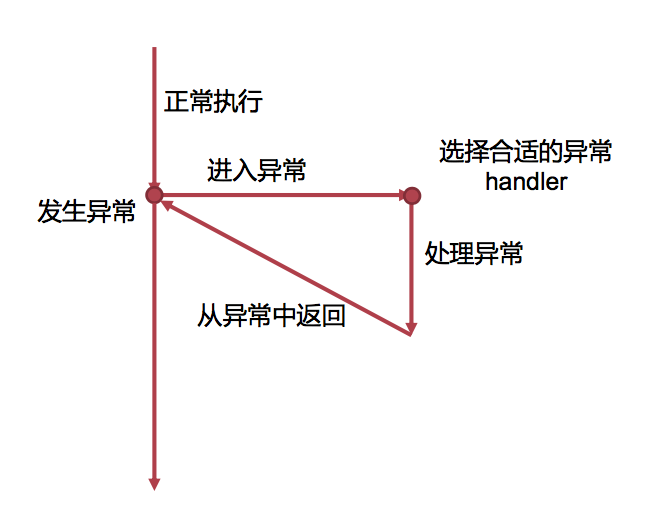

* 寻找 Handler 代码在哪
	* 每个异常级别都有独立的异常向量表
	* 表里面放的都是内存地址，你用索引就能换到一个 Handler 的内存地址
* 找到後，跳过去就行了。

选择表项取决于「当前的异常等级」、「异常的类型」、「异常发生时的处理器状态」。

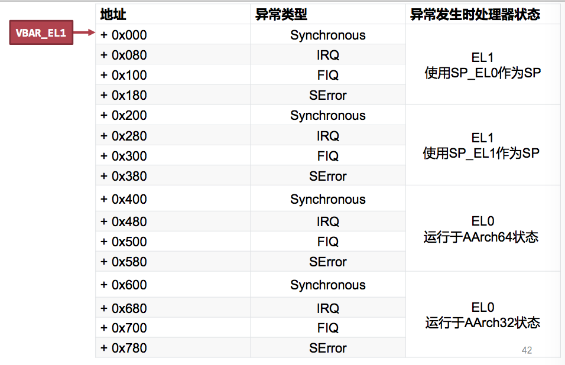

在跳转之前，会先把跳转之前的 PC 保存到 `ELR_ELx` 中；`x` 是目标异常等级。这样，在异常退出，使用 `eret` 指令就会从异常中返回了。

### 系统调用

「运行在用户空间的程序」向「操作系统内核」请求做一些需要更高权限运行的任务。

系统调用就是那个「口信」，用户程序和操作系统之间的接口。

#### 程序员视角

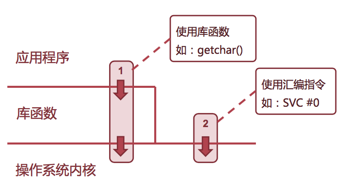

#### 硬件视角

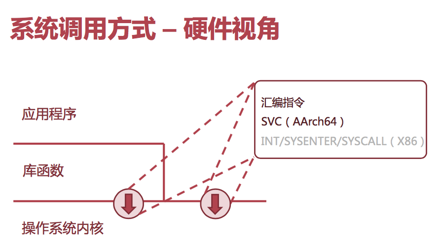

同样地，OS 在拿到系统调用，完成了任务，退出之後，也只需要调用一下 `usys_exit()` 函数返回到用户态即可。

关键代码：`svc #0` 而已。

#### 危险性

把事情交给 Kernel 来做，就安全了吗？未必！

例如，有一些系统调用需要「指针」作为传入参数。而这个参数的安全性…就值得说道说道了。

别忘了，内核是具有特殊权限的，几乎可以访问任何未知的内存。如果 Kernel 不加以检测，就相当于无意识地成为了杀人工具。不好。

Linux 呢，只做了非常简单的边缘检测，因为完整的检测太耗时了。

