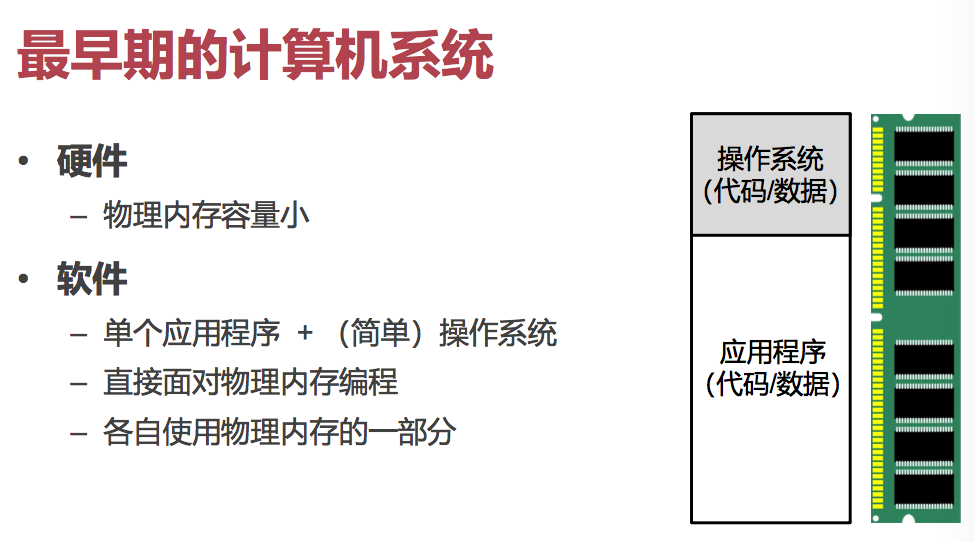
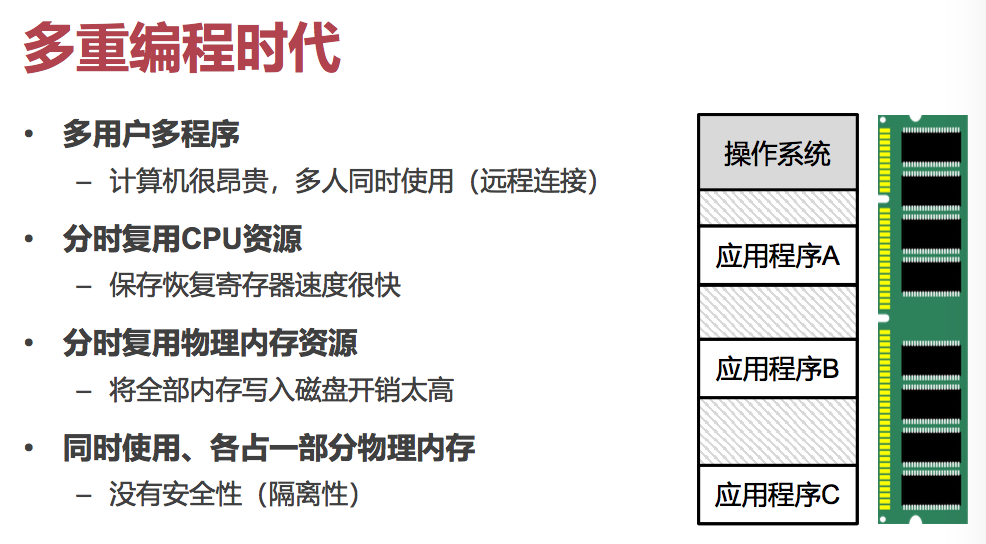
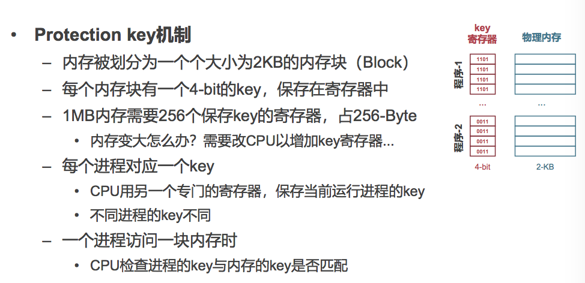
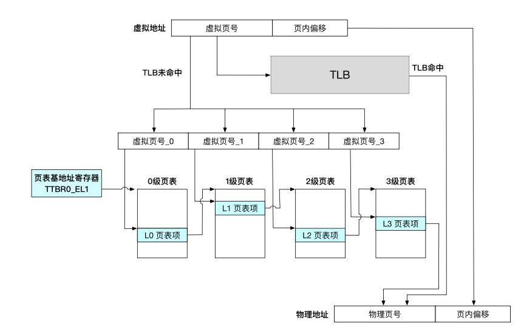
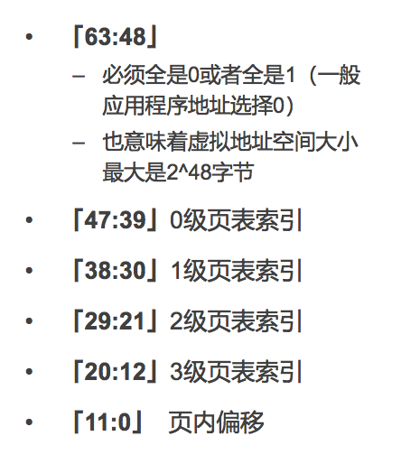
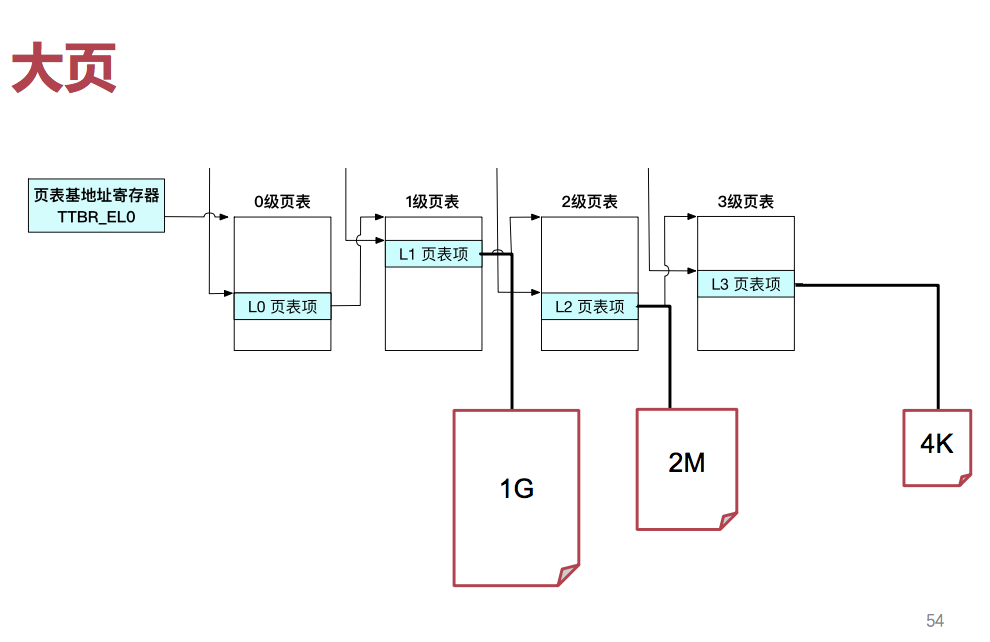
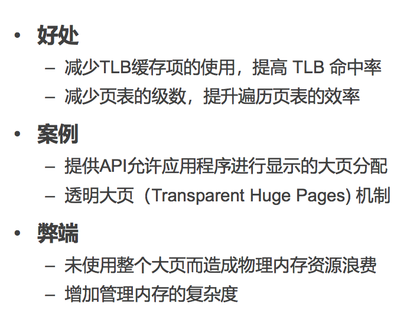
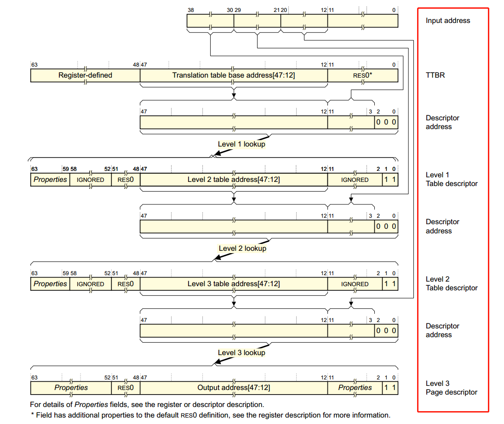

# OS Review

## Memory

### 大纲

* 物理内存
* 虚拟内存机制
* 页表、地址翻译

### 物理内存

俗称的「内存条」。

非常符合我们对于「内存」的预期：类似于一个巨大的车库，通过一个于内存唯一的地址可以对其进行读、写。

这里面放着 OS 的内存和数据、还有 App 的内存和数据。但内存并不在意里面放的是什么。

#### 发展历程

最早的计算机系统内存根本没多大，而且也不支持多任务。所以大家都是裸写物理内存的一部分。

後来，计算机资源越来越多，希望可以分时将资源提供给多个程序、多个用户使用。但这就引出了一个问题：CPU 分时很简单，因为 CPU 本身上下文相关的东西就只有几十个寄存器而已。但是内存只能把物理内存分块使用。但因为所用的是「物理地址」，完全没有安全性（隔离性）可言。

#### Protection Key 机制

IBM 360 提出的内存隔离策略。

但是问题仍然存在：原先的程序代码内的寻址全部都是「绝对地址」，锚定到内存中的固定位置。

这样，实际上二进制文件并不能随意 Relocatable。一个应用很有可能会因为其他应用的加载而受到影响。而要想运行两个程序的实例就不可能——他们的内存空间会重叠。

### 虚拟内存机制

* 如何能让一个程序不用关心其他进程，不受其他进程的影响？
* 如何能让一个程序看不见任何其他进程的信息，提供更强的隔离能力？

> 答案：再提供一层抽象。

既然直接让应用访问物理地址有这么多问题，那么我们就只好覆盖之了。

* 每个应用程序拥有独立的虚拟地址空间
	* 应用程序认为自己独占整个内存 
	* 应用程序不再看到物理地址
	* 应用加载时不用再为地址增加一个偏移量 

#### 地址翻译

CPU 得到了「寻址」的请求之後，不会直接把它拿去交给 Memory，而是会经过 MMU 单元将其转换为物理地址，再交给 Memory。

显然，MMU 需要根据不同的进程，把虚拟地址翻译成物理的。而进程的数量是不确定的，因此最好的办法是把这个信息放在 CPU 进程上下文之中。

最主流的实现方式是「页表」。而每个进程只需要一个64 位「页表基地址」，就可以实现独立的地址翻译了。

最重要的一点是：需要保证虚拟 Page 和物理 Page 都 4K 对齐，即地址的後 12 位都能一一对应。

除此之外，高 16 位被用在决定「是内核地址，还是应用态地址」。最後剩下 36 位，分成四份用在四级页表上。

注意，这里面的当然都是「物理地址」了。

#### AArch64 的不同

在 AArch64 之中，页表的基地址有专门的寄存器放——`TTBR0_EL1` 和 `TTBR1_EL1`。

应用程序放 `TTBR0`，操作系统才有权放 `TTBR1`。

ARM 的实现中，内核和应用程序的页表放在不同的寄存器里，因此在进行系统调用时不需要切换页表。

而 x86_64 是不区分异常等级的，大家都只有一个 `CR3`。

#### 启用 MMU

不论是 AArch64 还是 x86_64，CPU 刚启动的时候都不可能进行地址翻译，默认运行在物理寻址模式（不经翻译）。

AArch64 在给 `SCTLR_EL1` 的第 0 位置 1 後，EL0 和 EL1 两级就会使能页表了。

x86_64 呢，在 `CR4` 的第 31 位置 1 即可。

### TLB 缓存

TLB 是一个位于 CPU 内部的模块。

#### 快速进入

想象一下，假如 CPU 发现此进程刚刚访问过这个虚拟页、得到了其物理页地址、且期间没有进行过映射更新，那么还有必要再去找一次 MMU 吗？可以直接拿上次的缓存吧！

因此，TLB 里放着的就是（虚拟页号）和（物理页号）之间的映射关系。如果能直接查到物理页号，就可以省下一点时间。

#### 刷新 TLB

当然，TLB 并不能一直可用。

显然地，要切换进程时，就必须清理掉上一个进程遗留下来的 TLB 项，否则会发生意外寻址。

如何减少 TLB 刷新的代价呢？

假如所有的 TLB 缓存项都具有自己页表的标签，那就不再需要在切换页表时刷新 TLB 了，因为不会混淆。

#### PCID 计划

x86_64 下的一个技术 PCID（Process Context ID）。

每个进程都有一个自己的 ID，存储在 CR3 的低位中。

为了防御 Meltdown 攻击，CPU 提供了 Kernel Page Table Isolation 技术；即内核与应用不共享页表。

此时，PCID 就很重要了；如果没有这个 ID，那么每次系统调用之後 TLB 都会被刷掉，非常影响效率。

#### ASID 技术

AArch64 下的一个技术 ASID（Address Space ID）。

OS 为不同进程分配 8 或 16 位的 ASID，将 ASID 填写在TTBR0_EL1 的高 8 或 16 位。作用和 PCID 类似。

> ASID 位数由 `TCR_EL1` 的第 36 位决定。 

#### 全局 TLB

在第三级（最后一级）页表项中，有一位 `nG`，即 Not Global。

假如这一位是 0，就是说这一物理页对应的 TLB 缓存条目对所有进程都有效；而假如是 1，则只对特定进程（由 ASID 区分）有效。

这样，对于那些全局的内存映射，就不需要在每次上下文切换时都将其清除掉了。

### 大页

在四级页表的实现中，有些页表项不再指向下一级页表的 Entry，而是直接断掉，指向一个物理「大页」。

根据粒度不同，L1 页表项可以直接指向一个 1G 的物理页，而 L2 页表项则可以指向一个 2M 的物理页（简单的算术）。

L1、L2 级的页表都有一位特殊的 Bit 用于指示是否使用大页机制。

#### AArch64 的粒度

x86_64 中，默认最小的页面大小就是 4K，即拿走虚拟地址的低 12 位。

而在 AArch64 中，支持三种不同的最小页面大小模式：4K（对应截去 12 位低位）、16K（对应截去 14 位低位）、64K（对应截去 16 位低位）。

4K 模式下，对应的可以在 L1、L2 级页表处直接截断，得到 1G／2M 的大页。（也就是把 9 位用于间接寻址的地址全部拿来给这个大页。）

而 16K 模式下，只支持 L2 级页表处的截断，得到 32M 的大页。（因为此模式下，每一级页表拥有 11 位，最大只支持 3 级页表，只用到了 $11 \times 3 + 14 = 47$ 位。）

而 64K 模式下，只支持 L2 级页表处的截断，得到 512M 的大页。（因为此模式下，每一级页表拥有 13 位，最大只支持 2 级页表，只用到了 $13 \times 2 + 16 = 42$ 位。）

> 顺带一提，ARMv8 支持的有效位位数只能是 36、39、42、或者 47。这决定了地址空间的大小。