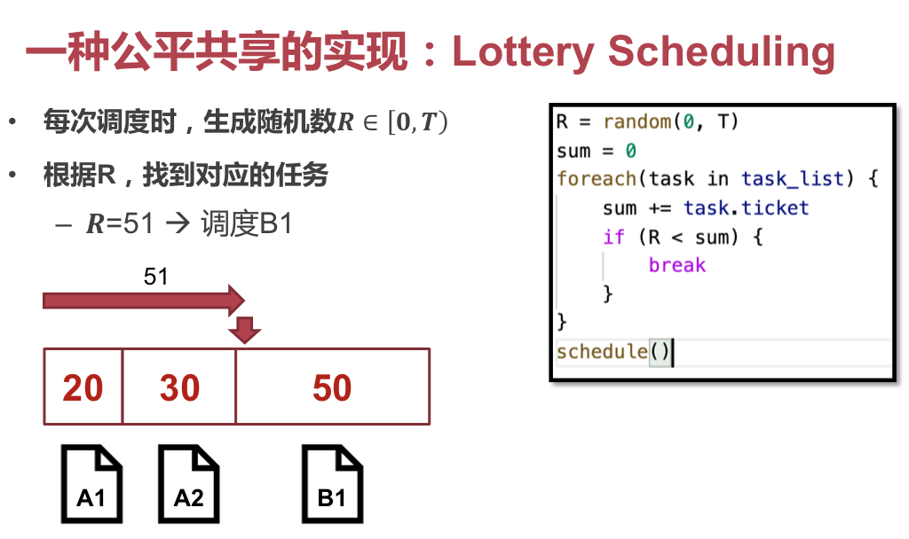
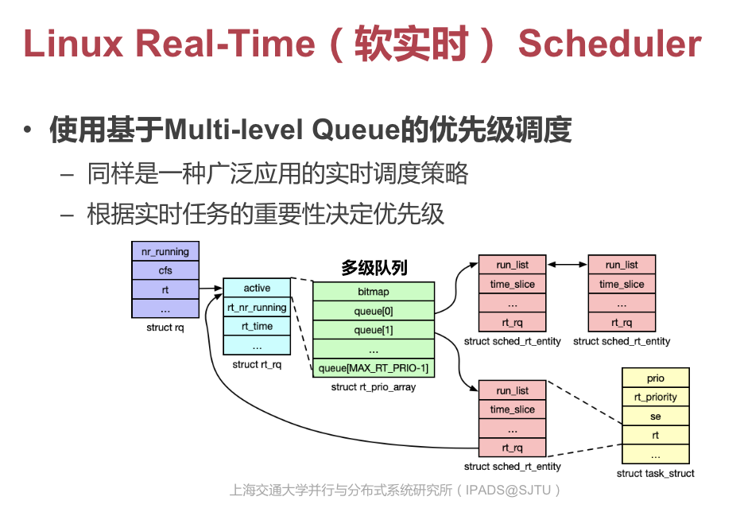

# OS Review

## Process Scheduling

### 大纲

* 进程的概念
* 进程的实现
* 进程的操作
* 进程的调度
* 线程的概念、模型
* 线程的实现
* 线程的操作
* 线程的调度

> 对应的课件：07、08

### 进程

> 是「任务」的抽象；可以把每个进程视作是一个任务。

#### 分时多任务

由于机器的物理并行数量远远没有进程的数量多，因此大部分 OS 都采用「分时」的策略。每隔一段时间切换一下正在执行的任务，以在较长时间跨度上实现「多任务同时运行」的假象。

我们先提供一个简化模型：即每个进程都只有一个线程（执行绪）。

#### 状态

进程至少需要拥有的五种状态。

既然不同的进程会不断被调度入、调度出，那么必须将其上下文保存，否则就无法恢复。

#### PCB

也就是 Process Control Block（进程控制块）。

在进行上下文切换（改变当前执行的进程）时，需要进行的一般步骤如下：

#### Linux 接口

跟进程相关的接口包括：

* `fork` 家族
  * 包括 `fork`、`spawn`、`vfork`、`clone` 等等
  * 用来创建新进程
* `exec`
  * 用来装载可执行文件
* `wait`
  * 用于进程间同步
* `exit` 及 `abort`
  * 用于退出进程

##### `fork`

把调用 `fork` 的进程原样拷贝一份；调用者作为父进程、新进程为子进程。

子进程中，`fork` 会返回 0；父进程中则返回非 0。

他们不共享「进程 ID」、「内存空间」。

但在 `fork` 之前取得的「文件句柄」、「I/O 设备」等仍然会被共享。

##### `exec`

调用 `exec("./test.1", NULL, NULL)` 之後，调用者的内存空间会被重置，转而从 `test.1` 的一开始执行。

##### Copy on Write

留意到，如果一个父进程想要创建一个**不同的**子进程，一般的操作是「先 `fork` 出一个自己，然后在子进程中 `exec`」。

这里就出现了一个问题：那么头一次 `fork` 的时候，拷贝的父进程空间不是白费了，马上又被 `exec` 覆盖了吗？这么低效率还能用？

因此，Copy on Write 的策略是：只把内存映射拷贝一份。如果拿着这个映射去读内存，那么就直接读到共享的内存；假如要去写入这块内存（不论是父进程还是子进程去写），就得拷贝一份再写。

这样，就减少了 `fork + exec` 的无用内存拷贝数，鉴于「内存映射」的量还是少得多的。

##### `vfork`

只创建新进程，但是父子进程共享同一内存空间。

基本上只能被用于 `vfork + exec` 的场景下；同时，还会存在很大的安全问题。

相比于有 CoW 的 `fork`，这个函数也没节约多少。不推荐使用。

##### `posix_spawn`

相当于直接调用 `fork + exec`，不过性能更好。

##### `clone`

选择性地把一些内存拷贝给子进程。

接口太复杂…

### 线程

> 我宁愿叫他「执行绪」…

#### 概念

相比于「进程」，更少隔离，更多共享的「任务」抽象。

只包括运行时的状态（主要是寄存器和栈）。静态代码均从进程中读取。

一个进程可以包含多个线程，由于他们共享内存空间，因此可以方便地数据共享和交互。

#### 实现

可以看到，所有进程执行的指令、保存的堆数据都是共享的。

而为了保证指令执行的正确性和栈模型的合理性，每个进程必须拥有自己的栈。

由于栈完全由 `%rsp`（`SP_EL0`）来寻址，因此每个进程都可以拥有不同的 `%rsp`（`SP_EL0`）指向不同的线程栈。

#### 调度

线程在一般实现之中，还是由内核管理调度的。

本质上，内核不能直接细化到管理每个用户态进程的执行上；内核只负责调度内核线程，然后由内核线程 `eret` 到用户线程，实现调度效果。

在 ChCore 的实现里，每次创建一个用户态线程，都会在内核中新起一个线程来管理它。因此属于「一对一模型」。

还记得 Lab 3 里写的代码吗？那里的数据结构就保存着寄存器的内容。

> 没有必要真的把栈的内容塞到 PCB 里去。
>
> 不同的进程之间的栈位于不同的内存地址。
>
> 只要他们有不同的 `%rsp` 就可以读到不同的栈。
>
> 本质上，可以认为整块的栈空间也是共享的，只不过大家约定用不同的 `%rsp` 去读不同的部分。

### 纤程

上面的线程，每次调度都还要陷入内核态，由内核决定调度到谁，然后再 `eret` 回用户态。

当然，跨进程的执行绪调度是必须进入内核的（用户态没有这个信息），但是有没有可能直接在用户态实现进程内执行绪的调度，不走内核？

#### 优点

* 纤程不需要创建内核线程
* 纤程调度不需要进入内核
* 纤程调度由用户态决定，做出更优决策

#### 实现

`ucontext` 是 Linux 提供的「用户态线程」抽象。

`Fiber` 库是 Windows 提供的「纤程」抽象。

很多高级编程语言也自己提供了「纤程」抽象，例如 Lua、Python 的 `thread` 库…

### 调度

这件事可以不区分「进程」、「线程」来说。

#### 现代调度策略

##### CFS Run Queue 调度

##### RT Run Queue 调度

#### 经典调度策略

##### FCFS 调度

> First Come, First Served

先到先得，简单直观。

问题：平均周转时间、响应时间过长。

##### SJF 调度

> Shortest Job First

短任务优先，每次调度总是取当前待执行的、耗时最短的任务。

问题：不公平，任务可能饿死；平均响应时间过长。

#### 抢占式调度策略

##### Round Robin 调度

每隔一定的时间片就调度一次，轮转地调度待执行的任务。公平、平均响应时间短。

问题：调度浪费一些时间，牺牲了周转时间。

#### 优先级调度策略

基本类似于 Round Robin，只不过给不同优先级的进程以不同的时间片长度、以及不同的调度频率。

#### 公平共享调度策略

极为注重公平，甚至可以牺牲一些整体效率。

> 主要用在云服务器的多用户租赁场景中…

要求：

* 每个用户占用的资源是成比例的
  * 视你交了多少钱而定
* 每个用户占用的资源是可以量化的
  * 如占用的 CPU、GPU 时间，存储容量等

##### 彩票调度

随机数生成，计算落点决定调度给谁。

##### 步长调度

随机数虽然理论公平，但实际上仍然有「产生不公平状态」的可能性出现。

步长调度直接去除了这个随机因子，更加公平啦。

#### 实时调度策略

每个任务还有截止时间（Deadline）。

对于软实时系统，一个超过截止时间的任务就没有意义了，例如超时渲染的画面帧只能被丢弃。

对于硬实时系统，超过截止时间的任务可能带来严重后果，例如刹车失灵，电池爆炸，等等（

##### 最早 DDL 调度

总是先做 DDL 最靠前的任务。此调度算法不需要考虑执行时间、任务周期。

但是需要考虑多米诺效应。假如一个 DDL 很靠前的任务已经不可能被完成了（例如，剩余时间已经不够了），强行调度之只会造成剩下所有的任务都 overdue。

所以调度的时候，我们也应该考量任务「是否可完成」，并略过那些「非关键性的、已经不可能完成了的」任务，以免雪崩。

##### Linux Real-Time Scheduler

3.14 才引入的新功能噢。