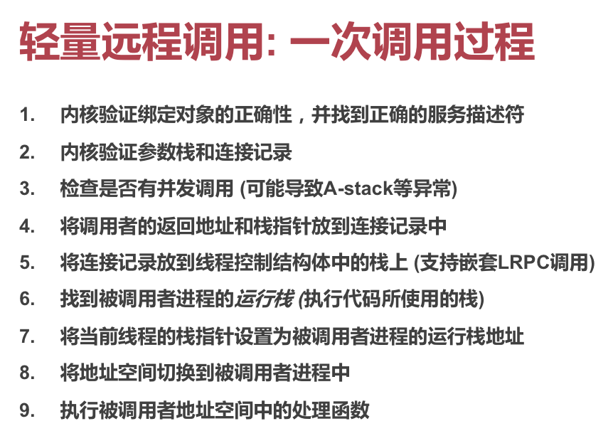

# OS Review

## IPC

### 大纲

	* 进程间通信
	* 内存共享
	* Unix 经典实现

### 进程间通信

#### 意义

* 利用共享库，减少重复实现
* 提供公有知识，减少计算浪费

#### 定义

两个或多个不同的进程通过通过内核或其他共享资源进行通信，借此传递控制信息或数据。

### 共享内存

#### 实现

看起来很简单：直接从内存中划出一块，然后把多个进程的地址空间映射到此处，他们就都能读写这部分内存了。

假定我们要实现一个简单的「生产 + 消费」共享内存模型。考虑会发生的问题。

#### 问题

还是一个同步问题。发送者不能覆盖掉还没被读取的数据，接收者也不能读取还没放入的数据。

所以，在缓冲区满的时候，发送者就会等待；缓冲区空的时候，接收者会等待。

有没有更好的办法可以「告知」发送者/接收者，目前缓冲区有空间/有内容呢？

#### 消息传递

```c
// 向 P 进程发送消息
Send(P, message);


// 从 Q 进程接收消息
Recv(Q, message);
```

这样，就不需要采用轮询的方式来获取信息了。

#### 同步、异步

同步：指消息必须被 Receive 後，Sender 才会停止阻塞。

异步：消息一经 Send 出，Sender 就停止阻塞。

超时同步：尝试同步通信，但在等待超过一定时间之后就放弃发送，等待下一次 Send。

#### 缓冲区

* 零容量（无缓冲区）
  * 只能支持同步消息通信
  * 发送者肯定需要等待，等待接收者接收消息
* 有限容量（N 缓冲区）
  * 可以支持 N 条异步消息
  * 超过此数，则回落为同步式
  * 发送者大部分时候无需等待
* 无限容量
  * 可以缓冲任意条消息
  * 发送者永远无需等待

### Unix 经典 IPC

#### 管道

##### 用法

`ls | grep`，即创建 `ls` 进程及 `grep` 进程，并在他们之间建立通信管道。

只支持单向通信，通信内容无类型。

##### 实现

本质上是一个有限容量的 N 缓冲区实现，大小限定为 `PIPESIZE`。发送者会在缓冲区满时阻塞。接收者会在缓冲区空时阻塞。

#### `sleep` 和 `wakeup`

* 调用 `sleep(chan)` 会导致当前进程阻塞，并立即放弃被调度权
* 调用 `wakeup(chan)` 会使得所有之前调用过 `sleep(chan)` 且当前仍然阻塞着的进程变得「可调度」

要实现简单的单向管道通信，用这两个方法就足够了。

### 消息队列

#### 实现

以链表的方式组织消息。

因为是以链表形式组织数据，所以可以认为是「无穷大」的缓冲区。因此也支持异步通信，发信者几乎不用等待。

只是相比管道来说，实现、利用起来都更复杂。

### LRPC

轻量级的 RPC。

#### 问题

主要问题是，调用者进程发送通知的过程目前太重量级了。必须经由一次内核调度才能发送到达，这期间可能经过了很多次调度了。

#### 解决

不做任何调度，仅仅把地址空间、权限表等内容转移。

#### 共享参数栈

在 LRPC 被创建的时候，就提前分配一个「参数栈」，同时被映射到双方的内存空间。

这样，要发送一条消息，直接把参数放到这个栈上就可以了，免去内核的数据拷贝。

#### 共享寄存器

约定某些寄存器用来传参，在上下文切换时不清除这部分寄存器的内容。



