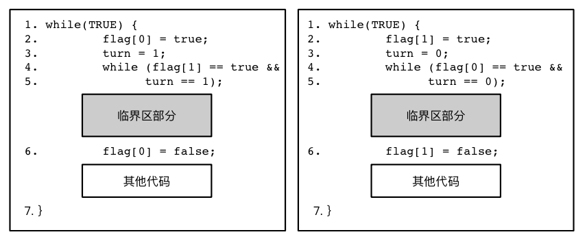
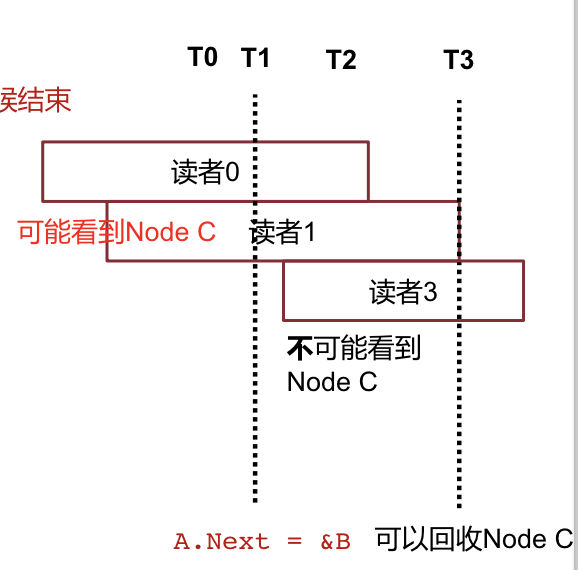

# OS Review

## Sync

### 同步问题

####生产者和消费者

##### 增加了！

在只有一个生产者和一个消费者的情况下，不需要进行任何特殊处理。

只要我们遵循「先放数据再更新索引」这一原则，就一定不会有竞争问题。

但在存在多个生产者/多个消费者的情况下，可能出现「一空多放」、「一物多拿」的问题。

##### 解决

首先，解决这种竞争问题，有三个必要的要求。

* 互斥访问
  * 要避免「一空多放」、「一物多拿」这种情况
  * 不能让两个进程同时进入临界区执行
* 有限等待
  * 一个进程申请进入临界区後，必须在有限时间内获得许可进入，而不能无限等待下去
* 空闲让进
  * 当没有进程在临界区中时，就应该允许一个申请者进入临界区

#### 同步原语

##### 软件实现

###### Peterson

利用一个中间变量 `turn` 来避免互斥。



`flag[i]` 代表进程 `i` 是否有意进入临界区。`turn` 代表允许进入临界区的进程号。

##### 硬件实现

###### CAS: Compare and Swap

`CAS(ptr, expected, new) -> v:`

`if (*ptr = expected) then (*ptr := new, return expected) or return *ptr`

###### FAA: Fetch and Add

`FAA(ptr, add) -> v:`

`tmp = *ptr, *ptr += add, return tmp`

简单来说，只要能把「取值」和「放值」两个操作组合成一个原子操作，就能实现锁了。

##### 硬件 + 软件

###### 排号锁

依赖于原子递增操作。实现非常简单。

```python
lock:
	my_ticket = atomic_increase(lock.next, 1)	# 拿号
	while (lock.owner != my_ticket):			# 等号
		pass
    # lock obtained!
    
unlock:
    lock.owner += 1								# 叫号
    # lock released!
```

#### 读者和写者

同时可以有「一个写者」或「多个读者」进入临界区。

这种场景需要注意的是，有两种不同的偏向。取决于下面这个问题的回答：

* 有一些读者正在临界区中
* 有新的写者在等待读者散去
* 此时，新的读者能否再进入？

##### 偏向写者的读写锁

在有写者等待时，不再允许新的读者进入。防止写者饿死。

##### 偏向读者的读写锁

就算有写者等待，也允许新的读者进入。并行性更好。

##### RCU 解决

如果我们允许读者在任何位置到来，只要任意时刻所读到的只可能是更新前或更新後的值就可以了。

###### 订阅、发布机制

很自然的想法就是，首先在某一处地方更新数值，然后更新某一处指针的内容指向新地址，不就可以了吗？

因为硬件可以提供最多 128 个 Bit 的原子操作，因此这样做是可以接受的。

更加宽泛一点，我们可以把原子操作用在链表的编辑上。

###### 宽限期

注意，上面的策略本质上是认同「让一部分读者读到旧数据」。而这部分数据不可能永远保留在内存中，但也不能立即回收，需要保留一定的宽限期。

回答是，在「链表更新操作」**之前**到来的所有读者都退出之後，就可以回收旧数据了。



### 死锁

#### 出现条件

* 存在互斥访问
* 有「持有并等待」现象
* 资源不可被抢占
* 有循环等待

#### 解决方案

##### 乐观

总是假设不会死锁。在运行时检测死锁并尝试恢复。

###### 打破循环等待

在运行时生成等待图，并查找其中的环。在找到循环後，1）把环中所有进程杀死，或者 2）逐个杀死其中的进程，直到环消失。

##### 悲观

在运行时避免死锁的产生。

1）避免互斥访问、2）不允许持有并等待；一开始就把所有的资源申请完毕，如果其中一个失败就全部放弃。

##### 极悲观

进程获取资源都先经过一遍 OS，由 OS 沙盒判断一下是否会演变成死锁。

#### 活锁

由于大家几乎总是在同一时刻申请资源，导致任何人都申请不了全部资源，如此循环往复。

活锁是有可能自己恢复的。