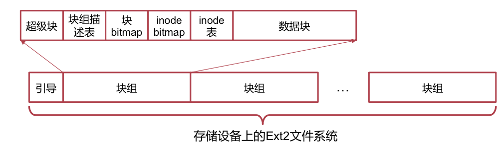
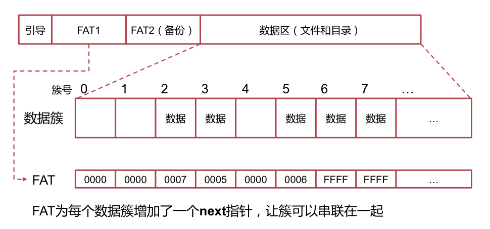

# OS Review

## File System

### inode 文件系统

#### inode 是啥？

一个 `inode` 中包含直接指针（直接指向数据块的）12 个，一级、二级、三级间接指针各一个。

#### 目录

内容是一组目录项（记录 inode、子文件（或目录）名）的特殊文件。文件名/目录名存放在其上层目录中。

> 因此，`/` 是没有名字的。

#### 软链接（符号链接）

这个文件的内容是「一个路径」。查找的时候会「跳」到目标路径去找。

#### 硬链接

并不是一个「文件」。只不过是同一个 inode 出现在多个目录项之中。

#### 「区段」的优化

对于大文件来说，采用 inode 的形式组织就太散了，不方便读取。

如果我们能找到一块连续区段保存文件，并把起始和结束地址存下来，就能减少元数据的数量啦。

### FAT 文件系统

简单粗暴…

### VFS

考虑到 OS 中可能有许多种不同的文件系统，Linux 提出了一套高于文件系统的抽象（Interface），使得不同的文件系统可以协同工作。

#### Root

注意，不同的文件系统都有相同的根结点（对于 Ext4 文件系统而言，是 `/`）。而 VFS 树的根结点只能有一个。

因此实际上系统在构造 VFS 的时候，会选择一个文件系统作为根结点，而其他的文件系统则会被挂载在特殊的子节点处（如，`/dev/`）。遍历文件树时，假如遇到了这个特殊的挂载点，就切换文件系统。

