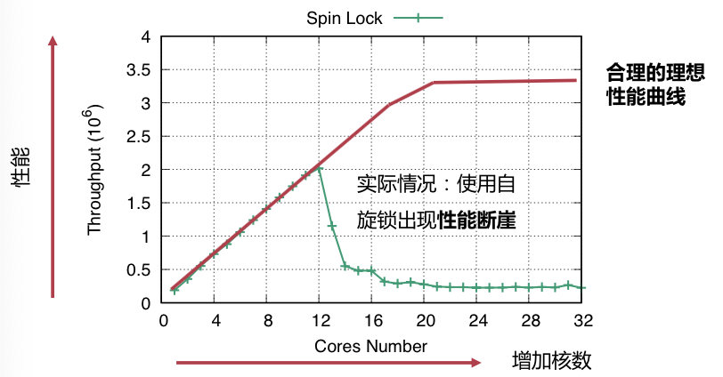
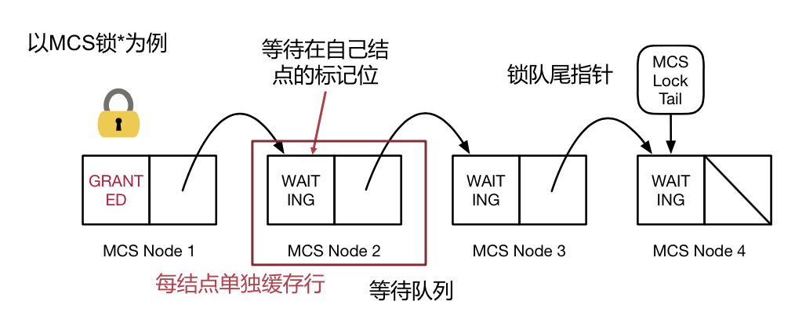

# OS Review

## Multicore

### 并行计算

设同时执行的核心数为 $s$，可以并行的代码占比为 $p$，则能起到的加速倍数为
$$
S = \dfrac 1 {(1 - p) + \dfrac p s}
$$
可以看出在 $s$ 趋近于无穷大时，极限的加速比是 $\dfrac 1 {1 - p}$。

这就是并行计算加速的理论上限（Amdahl's Law）。

### 可扩展性断崖

对于那些设计不好的算法，核心数增加到一定程度时，性能会大幅度跳水。

最常见、最主要的原因还是「写得不好的锁」，造成了不可扩展性。

### 可扩展的锁：MCS

#### 意图

尽量地避免在关键路径上，对单一缓存行的高度竞争；这就是扩展性断崖的根源：保证正确性所带来的开销超过了多核心并行带来的优势。

#### 实现

每个节点都放在不同的缓存行中，减少竞争。

### 一致性

#### 严格一致性

对一个地址的任意的**读操作**都能读到这个地址**最近一次写**的数据；访存操作顺序与**全局时钟**的顺序完全一致。

#### 顺序一致性

**不要求**操作按照真实发生的时间顺序（全局时钟）全局可见；执行结果必须与**一个全局的顺序**执行一致，且这个全局顺序中一个核心的读写操作与其**程序顺序**保持一致。

#### TSO 一致性

针对不同地址的「读 + 读」、「读 + 写」、「写 + 写」顺序都能得到保证；只有「写 + 读」的顺序不能够得到保证。

#### 弱序一致性

不保证任何对不同的地址的读写操作顺序。