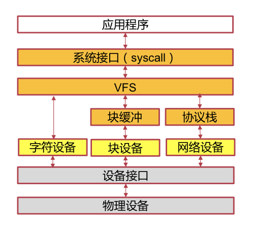
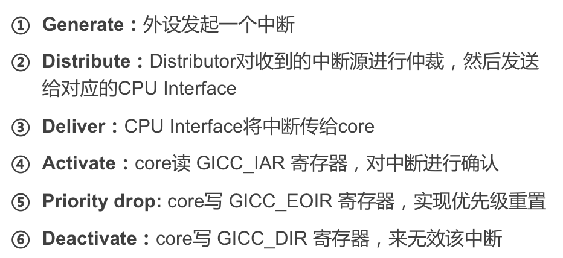

# OS Review

## Device

### Linux 抽象

* 字符设备（Char）
  * LED、键盘、串口
  * 抽象到文件系统中的 Read/Write
* 块设备（Block）
  * 如 Flash 闪存盘
  * 抽象成文件系统中的 Read/Write
  * 或者抽象成 mmap 映射的一块内存
* 网络设备（Network）
  * 如网卡
  * 抽象成套接字（Socket）



### 中断

#### 分类

IRQ（普通中断）、FIQ（高级别中断，一次仅有一个）、System Error（Abort 带来的）。

其中 IRQ、FIQ 是由 GIC 管理的中断，连接到 CPU 的不同针脚。

#### GIC

会将当前最高优先级的中断转发给对应的 CPU。

同时只能有一个 FIQ 和若干个 IRQ 能进入 GIC。IRQ 内分不同的优先级，而 FIQ 的优先级高于任何 IRQ。

GIC 会在合适的时候把最高优先级的异常推给 CPU，有时会打断正在处理的中断，如果新中断的级别**高于**当前处理的等级。

#### 处理周期



为什么要 Invalidate 一个中断，得通过 5、6 两步完成？第五步：不再阻塞较低优先级的中断，使得他们可以传入；而第六步做的事情是卸除这个中断号，使得 GIC 能够再吃入新的中断。

参见下面的「上下半部」，分 5、6 两个步骤就很有用。

#### 不能睡

中断处理函数中不可以试图拿锁，不可以做阻塞性的事情，不可以 Sleep（因为 Sleep 也是靠中断唤醒的）。

因为中断处理函数不会被 `sched()`，这样的行为就会造成内核挂起。

### Linux 的上下半部

把一个中断处理的任务分成两部分。

紧要的事情放在 Top Half 做，也就是仅仅把请求放入队列，然後将其他的事情推迟到 Bottom Half 处理。

因此中断处理的过程可以大概写成这个样子：

```python
def handler():
    save_regs()  # 保存寄存器
    send_request(unique_id)  # 请求入队列
    restore_regs()  # 恢复寄存器
    
    STOP_BLOCKING()
    # 不再阻塞低等级的中断，让他们可以打断自己
    postponed_stuff()
    # 反正现在高等中断已经进入队列了
    # 现在就可以做点无关紧要的事情
    # 这时候就算是低等级的中断来打断也不要紧了
    
    REVOKE_INTERRUPT()
    # 中断彻底处理完毕，归还中断号
```

这就比起一定要「一根筋走到黑」的中断处理要高效多了。