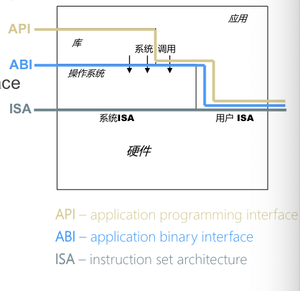
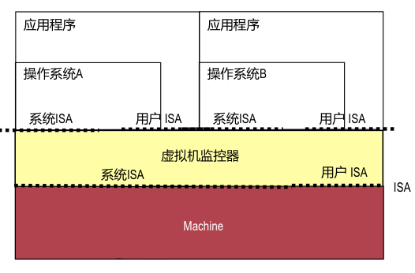
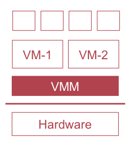
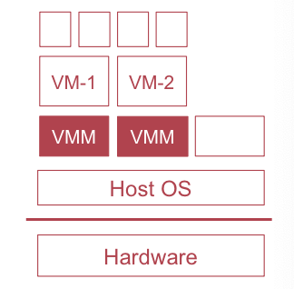
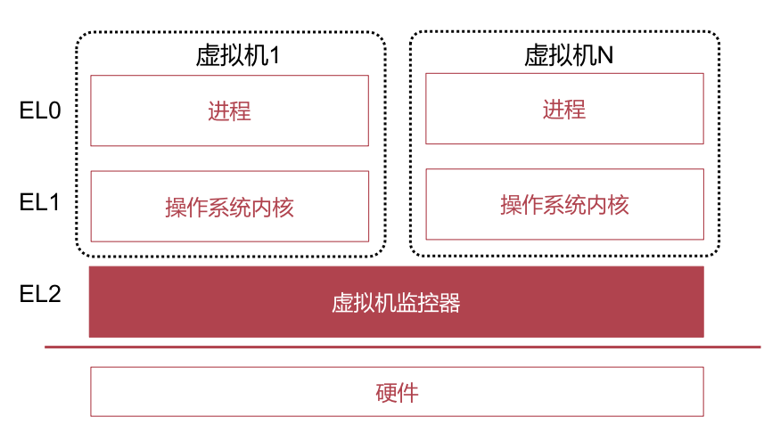
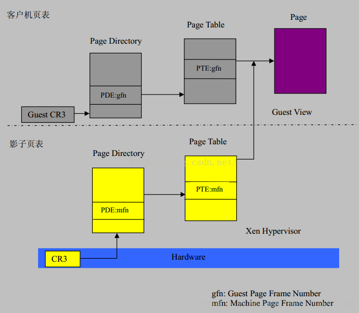
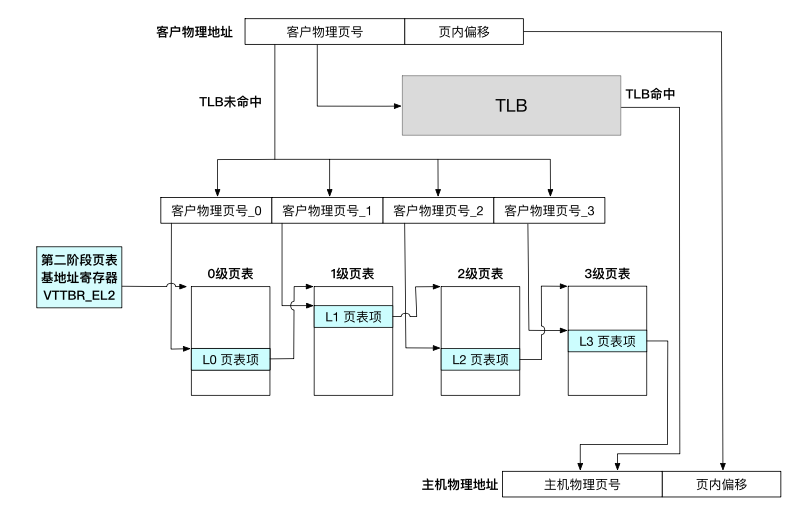
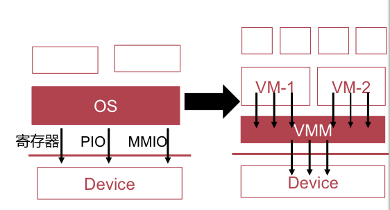

# OS Review

## Virtualization

### OS 架构

#### ISA

ISA，用来控制 CPU 的指令的集合。软件和硬件的交汇处。

ISA 中的一部分只能由系统专用（如 `msr` 指令），用户无法使用。这就把 ISA 分成了两部分。

#### ABI

ABI 将用户态和内核态区分开来，通过系统调用连接。

#### API

最接近应用的一个层级，不涉及操作系统底层调用的库，例如 `clib`。

### 虚拟机

#### 架构

虚拟机监控器直接替代硬件役。去看 `01-arm` 里的模拟器实现。而虚拟机软件本身也运行在物理机上。

#### 虚拟化的追求

* 为虚拟机内程序提供和物理机上完全一样的接口
* 性能仅仅比无虚拟化时略差一点
* 虚拟机监控器控制所有的物理资源

#### 实现种类

##### Type I

直接运行在硬件之上，充当操作系统的角色。仅仅实现调度、内存管理、驱动等功能。其余功能都由 Guest OS 直接跟硬件说。

性能损失少。

##### Type II

把虚拟机当作应用运行，尽量复用主机操作系统的功能。

性能损失多。

#### 指令的执行方式

##### 解释执行

软件一条条模拟虚拟机代码，不区分指令类别。

虚拟机的指令并非真的在物理机上执行。

> 这是模拟器的实现方法…

##### 二进制翻译

先把要执行的指令批量翻译成真实指令并进行缓存。效率比较高。

但本质上执行的仍然不是虚拟机指令。

##### 半虚拟化

VMM 提供接口给虚拟机（Hyper Call），把 Guest OS 的源码修改掉，把系统调用的部分改成 Hyper Call；而普通指令就直接执行就可以了。

##### 硬件虚拟化

直接由硬件提供 VM 的支持。

* VM Manager 加载 VM 的状态（如寄存器）
* VM Manager 使用 `eret` 指令进入 VM 执行
* VM 内执行到敏感指令或收到中断时，控制权回到 VM Manager
* 调用 VM Manager 记录在 `VBAR_EL2` 中的处理函数

VM Manager 运行在高于 EL0 和 EL1 的特权等级 EL2 上。

### 内存虚拟化

这是最难办的一个问题…

单纯的指令因为不包含多少上下文信息（最多几个寄存器），因此可以简单地虚拟化。

但是，内存呢？首先就不可能把物理 OS 跟 Guest OS 的内存混一块，否则大家的 Kernel Address 就乱套了。

#### 目标

* 为虚拟机提供虚拟的物理地址空间
  * 同样从 0 开始增长
* 隔离虚拟机之间的物理地址空间
  * 不让 VM 之间互相访存

#### 三种地址

- 客户虚拟地址（Guest Virtual Address, GVA）
  - 虚拟机内进程使用的虚拟地址
- 客户物理地址（Guest Physical Address, GPA）
  - 虚拟机内使用的「假」物理地址
- 主机虚拟地址（Host Virtual Address, HVA）
- 主机物理地址（Host Physical Address, HPA）
  - 真实寻址的物理地址

VMM 需要考虑的事情就是，GPA 如何翻译成 HPA。

在创建虚拟机的时候，会在 `pmap` 中记录 GPA 到 HVA 的映射关系。因此本质上可以直接采用 GVA => GPA => HVA => HPA 的翻译过程，只不过太麻烦了点。

#### 实现方式

##### 影子页表策略

各个虚拟机中的每个进程都有自己的影子页表。

首先，拿着 GVA 去查阅影子页表。如果没查到，那么就 fallback 到 GVA => GPA => HVA => HPA 的路径，并且把结果填入影子页表中。这样影子页表慢慢就能够作为 GVA => HPA 的 Cache 存在了。

注意，假如 Guest 更改了 GVA => GPA 的映射，毫无疑问 VMM 应该随之更新影子页表。因此 VMM 会将所有的 Guest 页表标记为写保护，在捕获到修改之後更新影子页表以保证不会从影子页表中读出错误的值。

> 简而言之，影子页表可以找不到（总有 fallback），但是不可以找到个错的。

##### 第二阶段页表策略

所谓「第一阶段页表」，指的是 GVA => GPA 的 Guest 页表。

而「第二阶段页表」，指的是 GPA => HPA 的翻译过程。

为了避免和 HVA => HPA 页表混淆，这个页表头被放在 `VTTBR_EL2` 寄存器里。

「第二阶段页表」只需要为每个 Guest OS 创建一个就行了；

总结一下，需要的寻址次数是 24 次。注意，GVA => GPA 的四级页表翻译过程，每一级都需要 5 次访问 Guest Physical Memory（最後一级只需要 4 次）；而每访问一次 GPM，都需要在 Host 上做一次二阶段页表的查询。因此结果就是 24 次。

但实际上，TLB 不仅可以缓存 GVA => GPA，也可以缓存 GPA => HPA。性能极大提升。

不过注意，切换 `VTTBR_EL2` 时，记得刷去前一个 VM 遗留下来的**所有** TLB。

优点是不需要那么多的页表，一个 Guest OS 对应一个页表；而且也不需要去捕获 Guest OS 的页表重映射了。

缺点么…TLB Miss 的时候还是有点慢。

### IO 虚拟化

#### 设备模拟法

VMM 模拟出一个 Proxy 外设，和 Guest OS 打交道。

#### 半虚拟化方式

使用特殊的驱动程序，不调用 Guest OS 的 System Call 而是 VMM 提供的 Hyper Call，用共享内存传递指令和命令。

不过这样的话，Guest OS 就知道自己运行在虚拟机上了。

#### 设备直通

设备相关的事情不经过 VMM，直接跟硬件打交道。

